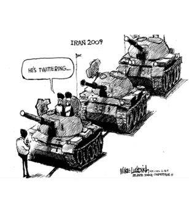

---
Pr-id: MoneyLab
P-id: INC Reader
A-id: 10
Type: article
Book-type: anthology
Anthology item: article
Item-id: unique no.
Article-title: title of the article
Article-status: accepted
Author: name(s) of author(s)
Author-email:   corresponding address
Author-bio:  about the author
Abstract:   short description of the article (100 words)
Keywords:   50 keywords for search and indexing
Rights: CC BY-NC 4.0
...

# 01. ARCHIVING ACTIVISM IN THE DIGITAL AGE: INTRODUCTION

### ANN RIGNEY AND DANIELE SALERNO

## Memory and activism

  

 

At first sight, the phrase ‘So that this is not forgotten’ (in Spanish:
‘Para que esto no se olvide’) seems more appropriate to the hard marble
of a war memorial than to a thin sticky note. But it is precisely that
phrase in all its resonance which is used in the above image with
reference to 15M, the Spanish anti-austerity movement that played out in
the cities of Spain in the spring of 2011. More precisely, it is used
with reference to the archive of 15M, which is presented as a bulwark
against forgetting something that deserves to be remembered.

This amateurish composition of words and images now serves as the cover
of the digital booklet that compiles the minutes of meetings held
between 2011 and 2017 to create an archive documenting what happened in
those eventful days of protests.[^03Chapter1_1] The archive was first named
‘Acampada Sol’, after the occupation of the central square of Puerta del
Sol in Madrid. Later on, the archive was renamed 15M, shorthand for 15
May, the day activists occupied the square setting up the encampment
(also hashtagged and nicknamed as \#*AcampaSol*).

The minutes of the first meeting describe how fourteen activists
gathered on 31 May 2011, in a street located a bit apart from the very
heart of the protests, to discuss how to transmit the legacy and
narratives of the demonstrations to future generations. They argued for
putting the question of memory on the movement's agenda by bringing ‘the
idea of heritage to everyone in the *acampada* \[campsite\]’.[^03Chapter1_2] They
discussed how to collect material during the protest and protect it in
case of police intervention. They started imagining how to digitize the
physical material produced by the movement, debating about the very idea
of ‘digital archive’ and whether to collaborate with existing
institutions for preserving the archive for later generations. In short,
activists were already imagining how the ongoing protests would be
remembered in the future and in the long-term, and taking steps to shape
that memory by creating an archive.

Although the 15M occupation lasted just a few weeks, the minutes of the
archiving group cover six years. Their archival lab outlasted the
visible protest by far, indicating that social movements live beyond and
beneath their spectacular and visible waves of contention.[^03Chapter1_3] The
existence of the 15M archive is a reminder that protest movements do not
just have a history (taking place at one particular moment) but also
have afterlives in the form of stories, images, and other material
traces. Until very recently, however, activist mnemonic and archival
labour has flown under the radar of scholars both of social movements
and collective memory.

Ironically, the phrase that argues for the lasting preservation of the
history of the 15M movement is written on a support made for short-lived
reminders (and indeed the words ‘para que’ are already fading). But the
words do persist: digitized and preserved in the 15M Archive, these
vulnerable materials are now available in digital form as the cover
picture for the minutes of the physical archive commission assemblies.

Together with the minutes of their many meetings, the sticky note with
its memorializing message reflects the labour and ambitions of the 15M
archiving group. It also encapsulates many of the issues that readers
will find in this collection of essays: the interplay between
remembering and forgetting, the analogue and the digital, the past and
the unfolding present and future, as these play out in the archiving of
social movements. Whereas the latter are usually seen as
forward-looking, the efforts put into the 15M’s archive, now housed in
the Tres Peces cultural centre in Madrid,[^03Chapter1_4] serves as a reminder that
memory and activism are more intimately entangled than hitherto
surmised; and that archiving has been a way for activists to constitute
themselves as mnemonic communities as well as political actors.

The question how people articulate past, present and future in making
sense of the world has been studied from different perspectives.[^03Chapter1_5] But
how different temporalities play into struggles for social change has,
until quite recently, been a neglected issue in both memory and social
movement studies. Things are changing in both fields. Within memory
studies, our field of research, there have been calls for more attention
to the role of memory in civic life, specifically in political
contention as being at the heart of democratic societies.[^03Chapter1_6] In that
context, the concept of a memory-activism nexus has been proposed[^03Chapter1_7] as
a heuristic framework, entailing the study of the interplay between
*memory activism* (concerted attempts to change dominant narratives),
the *memory of activism* (how later activism is remembered and
transmitted across a variety of cultural forms) and *memory in activism*
(how memory, specifically of earlier movements, informs later ones).
Within social movement studies,[^03Chapter1_8] the ‘movement-memory nexus’ has been
proposed along similar lines.[^03Chapter1_9] Studying the ways in which social
movements are archived, by themselves and by others, promises to add a
new dimension to these discussions. Not just by highlighting archiving
as a specific future-oriented mnemonic practice but one that may, in
certain hands, be considered a specifically activist one. That activist
mnemonic practice doesn’t answer to current definition of ‘memory
activism’, which emphasizes challenges to dominant narratives; here the
mnemonic activism is directed instead towards providing the condition
for activism to be remembered in the future.

Archives – as concept, as cultural phenomenon, and as resource – have
long figured in humanities scholarship, providing a basis for
discussions of their role in activism to which we will return. In social
movement studies, in contrast, archives have hardly figured at all as
media of transgenerational memory transmission. Instead, the idea of a
‘repertoire’ – consisting of models for interaction transmitted by
embodied performances – has been used to explain, not just shared
practices in the present, but also how knowledge of those practices is
carried across time in social movements.[^03Chapter1_10] Crucially, this ‘strong’
understanding of repertoire[^03Chapter1_11] helps explain continuities and changes
in the form taken by contentious actions across generations without
those involved having access to formal archives or archiving
practices.[^03Chapter1_12] Given this emphasis on embodied transmission, social
movement studies have at best looked to (institutional) archives as
historical sources for reconstructing and comparing repertoires of
protest over time and across different locations. This preponderance of
the concept of repertoire in social movement studies explains the
traditional lack of interest in activist recordmaking during protests
and the setting up of archives, by participants and observers, to ensure
that the legacy of protests and social movements is carried over to
future generations. The emerging interest in the role of memory in
activism provides a new context in which to bring alternatives to
embodied transmission into the understanding of continuities across
movements, especially in the digital era.

## Changing notions of the ‘archive’

Archiving has been the subject of intense reflection in multiple
disciplines within the humanities, not all of whom speak the same
language. Michelle Caswell, in an essay called ‘”The Archive” Is Not an
Archives’[^03Chapter1_13] has noted the gap between experts in information
sciences, like herself, who think of archives in the plural as dynamic
sites of knowledge production, and cultural theorists who have tended to
use the term in the singular and with a capital ‘A’ in line with
influential work by Michel Foucault and Jacques Derrida.[^03Chapter1_14] While our
collection is interested above all of the nuts and bolts of archiving in
the plural, it takes from more philosophical approaches some fundamental
insights into the nature of archives in order to frame our understanding
of archiving as a mnemonic practice.

Taking state archives as paradigmatic of all archival projects, Foucault
sees archives as instruments of control, as constituting the ‘condition
of possibility’ of discursive production (‘the archive is first the law
of what can be said’[^03Chapter1_15]). In line with this reasoning but with
different emphases, Derrida then posited ‘the Archive’ as a virtual site
for imagining alternatives to state-sponsored projects of recording; on
the one hand, by dismissing institutional archives as an ultimately
futile and power-driven attempt to fix knowledge in favour of other
forms of knowledge transferred in an ever-renewed form through the
repertoire of embodied practices; on the other hand, by positing the
existence of the ‘an-archive’ as a repository for marginalized
knowledge: every act of selection produces an un-archived remainder
beyond the reach of official records.[^03Chapter1_16]

The role of archives has been persistently flagged in memory studies as
a key factor in cultural memory-making, but it has rarely been studied
in its own right. The exception to this general rule is Aleida Assmann’s
conceptualization of the relationship between ‘archive’ and
‘memory’.[^03Chapter1_17] Although her terminology has slightly shifted over time,
her approach remains based on a fundamental distinction between passive
and active forms of memory, with ‘working memory’ associated with
narratives that are in circulation and ‘storage memory’ associated with
the archival storage of information. The archive, here too associated
with bureaucracy and state power, is based on selected information that
has been deemed important enough to preserve and, although it has not
yet been interpreted and brought into structures of meaning, it has the
potential to be activated – and hence to become active, working and
narrativized – at a later point in time. ‘The archive, therefore, can be
described as a space that is located on the border between forgetting
and remembering, its materials are preserved in a state of latency, in a
space of intermediary storage (*Zwischenspeiche*r)’.[^03Chapter1_18] Against this
background, Assmann argues further that the more that institutionalized
archives are tailor made to match hegemonic narratives (‘canonical
memory’) the more they took on the character of ‘political archives’. In
more democratic societies, in contrast, the archive is ideally
constituted in a more open way as truly ‘historical archives’ that can
become in the long-term a resource for alternative narratives: ‘Where
political archives function as an important tool for power, historical
archives store information which is no longer of immediate use’ and
constitute ‘a kind of “lost-and-found office” for what is no longer
needed or immediately understood’.[^03Chapter1_19]

Assmann’s key contribution here is her understanding of archives as a
form of latent memory, situated between forgetting and remembering,
between raw data and its interpretation and narrativization. Her
distinction between latent and working memory implies that the dynamics
of memory-making are oriented towards the future as well as past even if
that future is, as yet, undetermined or merely aspirational. In this,
she echoes Derrida: ‘\[T\]he question of the archive is not, I repeat, a
question of the past…but rather a question of the future, the very
question of the future, question of a response, of a promise and of a
responsibility for tomorrow. The archive: if we want to know what this
will have meant, we will only know tomorrow’.[^03Chapter1_20] What both theorists
share is a belief that the boundaries of an archive are porous and that
archives are not fortresses but rather changing in their meaning and
composition as part of a larger ecology. This fundamental principle has
been echoed by recent advocates of the ‘living’ archive.[^03Chapter1_21]

For all the value of this basic insight, theoretical approaches to ‘the
archive’ remain very much tied to one model: institutionalised
collections produced by professionals, funded by the state, and hence
linked to issues of power and governance. In the last decades, however,
changes in the very nature of archiving as a cultural phenomenon have
occurred in tandem with new conceptualisations of archiving on the part
of scholars and practitioners that integrate the idea that archives are
dynamic sites and go well beyond this equation between archives and
state-based repositories of written documents. To echo Caswell, ‘”The
Archive” is not an archives’ and state-organised repositories are no
longer (if they ever were) the only act in town. Several inter-related
developments can be flagged here.

These revolve around democratisation and technological innovation. Since
at least the 1960s the idea of ‘a right to (the) archive’ and in general
to ‘a right to memory’ has become more widespread and paved the way for
new historiographical and archival practices aiming for greater
inclusivity. A milestone in this development was the emergence of oral
history as a method to capture histories that were nowhere preserved in
the form of written record and often linked to the experiences of people
without cultural capital who figured only in criminal and medical
records.[^03Chapter1_22] The ‘right to (the) archive’ has also been taken
literally. Archives have been extending the scope of their collecting
practices to become more representative as well as opening up their
collections to the public in the form of exhibitions on the principle
that accessibility and ‘public participation’ should be more central to
their workings. Archiving and curation, conservation and access, have
thus become more closely entangled as institutions have become more
public facing.

Moreover, archiving occurs increasingly outside the framework of
heritage institutions. The number of new citizen-based community
archives is rapidly increasing and such concepts as ‘living archives’,
‘community archives’ and ‘autonomous archives’[^03Chapter1_23] becoming common
currency in critical archival studies.[^03Chapter1_24] Carried in part by skilled
‘pro-ams’,[^03Chapter1_25] community archives have become one of the pillars in
constituting group identity both to its own members and to the outside
world. Its very existence bears witness to the fact the group has had a
history and aspires to a future, and provides ‘evidence for the creation
and continuation of claims to identities and places’[^03Chapter1_26] which is
particularly important for emergent groups seeking to establish or
‘institute’ themselves.[^03Chapter1_27]

In line with this role of archives in constituting publics, theorists
have also increasingly recognised that archival collections are not only
a source of information but can also be a focus for affective investment
and hence a repository of shareable feelings and emotions.[^03Chapter1_28] Indeed,
the very labour involved in collecting, ordering, making accessible, and
caring for the records in the archive acts has been seen as an agent of
community-building especially when the resources being archived are
material ones, hence requiring the physical presence of their guardians
at a designated place.

The value attached to public participation reflects the democratization
that has been affecting many fields of cultural production and, in the
case of archiving, has fostered new ideas about ownership,
stakeholdership, and accountability, and idea that involved citizens
should have the possibility of making their own records about their own
experiences. The downside of this extension of the ‘right to (the)
archive’ means that the relevant know-how (in terms of archival
architecture, metadata, sustainability of access) is not always present
in such initiatives or the relevant infrastructural support. But the
ensuing dilemmas have also been generating new collaborations between
professionals and amateurs in, for example, the formation of community
archives[^03Chapter1_29] with the help of engaged archivists whose role is
conceived more in terms of mediation, public service and outreach than
in terms of the hieratic control of an archive set up and then
‘protected’ by experts from the public at large. Where traditionally
archiving served administration, law, and the writing of history, it is
now also linked to social justice and community-building[^03Chapter1_30] as well as
to public outreach, often in conjunction with the arts. Seen within this
framework, archives have become open-ended and dynamic sites where the
question ‘what is to be preserved’ is continuously being linked to its
societal value in the here and now; and where ‘meaning’ is produced
rather than fixed.[^03Chapter1_31]

More could be said about current theories of archiving both within the
field of information science and humanities at large, but enough has
been hopefully said (1) to definitively dismiss the idea their being a
monolithic ‘archive’ that represents an exclusive and state-sponsored
form of knowledge; (2) to support the idea that we can better think of
*archiving* (note the verbal form) in the plural as a multi-sited and
multi-actorial phenomenon; and (c), that *archiving* operates through
texts, images, objects that are collected and arranged as part of a
future-oriented and, in the case of emergent groups, aspirational mode
of remembrance that is not yet (and may never become) narrative in form.
It’s memory as emergent, as potentiality and as aspiration,[^03Chapter1_32] rather
than as *fait accompli*.

## Activism and the digital

The flourishing of oral history since the 1960s was possible also
because technological innovation made the recording of aural – and later
visual – information more affordable and manageable. Digital technology
has played a similar role in the democratization of archiving practices
outlined above. Since the 1990s, the right to (the) archive found a
powerful tool in the digital and the internet, with their promise of
unlimited and affordable possibilities for storing, reproducing and
making available not only written texts, but also visual, audio, and
audio-visual information. Digitisation in its various facets has meant
that information can be easily replicated but, more importantly, that
control over the means of archival production is no longer the privilege
of institutions but open to all those who care about certain topics or
causes enough to collect information and preserve it for the future.
This has led to the emergence of archives that are supported and
organised by amateurs or off-duty professionals in their role as
committed citizens.

But more fundamentally for our topic here, digitization has changed the
very nature of activism itself by providing new social media platforms
for expressing dissent and mobilizing opposition be that as part of a
movement or as an individual ‘artivist’ in exile with no direct access
to public space (see Ann-Katrine Schmidt Nielsen’s chapter below). The
term ‘media activism’ captures this new arena, which offers new
opportunities for groups who because of disability or geographical
distance have otherwise no easy access to the usual repertoire of
contention to the extent that this relies on physical presence (see
Pollaert and Van Trigt’s chapter below).

Moreover, digitization has also changed the nature of embodied activism.
As Castells has argued, these have become ‘hybrid’: demonstrations are
prepared online, rely on online interactions even as they are being
carried out on-site and, crucially for our topic here, rely on digital
technologies to record their own actions.[^03Chapter1_33] The ease with which
contemporary campaigns can be recorded – with the possibility of
capturing sound, movement, and visuals greatly enhanced – means that
recent protest organically create enormous quantities of images (and
hence generates one of the most important preconditions for archiving:
the availability of information).

The Global Justice movement, starting in the late 1990s with the
protests in Seattle[^03Chapter1_34] and continuing in Genoa in 2001,[^03Chapter1_35] was
arguably the first ‘born digital’ movement[^03Chapter1_36] to integrate digital
recording into the ‘repertoire of contention’. Accordingly, when the
Italian police raided the Social Forum headquarter and media centre
during the protests against the G8 summit in Genoa in July 2001, their
first target was the servers and materials that media activist
organizations – among them Indymedia, a global network of independent
media outlets – had accumulated as evidence of police repression (which
had caused, among other consequences, the death of 23-year-old
demonstrator Carlo Giuliani). The hard disks were seized, and the
computers illegally destroyed. This shows how at the beginning of the
new century, both activists and police were well aware of the power of
digital tools in accumulating evidence against the police and state
repression, with the potential to be later used, in the media, to
counter distortions of the facts and, in court, to obtain justice.
Moreover, recordings such as the video documenting the killing of the
demonstrator Neda Salehi Agha-Soltan in Tehran in 2009, when brought
into circulation in acts of ‘media activism’, feed back into a protest
movement while also creating, thanks to the internet, transnational
networks of solidarity.[^03Chapter1_37]

Mike Lukovitch’s cartoon on the Wave of Green movement in Iran in 2009
illustrates well how the presence of recording devices increasingly
shaped interactions between protesters and police throughout the 2000s.
Reworking the famous photo of the Tankman in Tiananmen Square in 1989,
Lukovitch highlights the role that smartphones and social media
platforms were believed to be playing in the Iranian protests.

 

Beyond their evidentiary function, recordings made by activists also
have a role in helping the latter to tell their own story and in their
own terms as it is unfolding but also in the future. For that to happen,
however, ephemeral materials need to be preserved and made accessible in
the long-term; in other words, archived. It is no coincidence then that
movements have started to set up their own archives and, indeed, to
integrate archiving along with recording in the repertoire of
contention. Memory work is not something that occurs after the fact, but
is already integrate into movements as they anticipate how their actions
may inspire new forms of protest and give the movement and its message
an afterlife.

## Between archiving activists and activist archivists

As mentioned at the beginning of this introduction, self-archiving has
become a way for activists to constitute themselves as mnemonic
communities as well as political actors – witness the work of archiving
committees within 15M, but also in Occupy in the USA, Nuit Debout in
France, the Egyptian Revolution and – as Özge Çelikaslan shows in her
chapter below – in the Gezi Park Protests.[^03Chapter1_38] These initiatives have
in turn led to the emergence of a metadiscourse about archiving and the
importance of ‘movement-memory’[^03Chapter1_39] exemplified by the US-based
Interference Archive[^03Chapter1_40] that aims to provide a virtual hub for
different social movements by collecting post factum materials as well
as exhibiting material online, offering a counterpart to the physical
space of the MayDay rooms discussed by Rosemary Grennan below. Other
websites offer practical advice to activists on how to set up their own
archive.[^03Chapter1_41] To be sure, archiving is not usually the first priority of
those caught up in a protest cycle both because it takes time and energy
away from the struggle at hand, and imagines a moment when that struggle
will belong to the past. When movements run out of steam or are forced
off the streets, however, cultivating its memory through archiving may
be the only form of survival possible.

Activist archiving has a ‘constitutive’ function, to use Stuart Hall’s
term.[^03Chapter1_42] It provides evidence of the movement’s existence and its
action: to the movement itself and to the outside world. In the process,
it defines its legacy in its own terms rather than those of the
mainstream media which tends to emphasize the issue of law and order
rather than the movement’s experiences and aspirations.[^03Chapter1_43]
Self-archiving, finally, allows for the movement to ‘stay on message’
for its own supporters as they seek to imagine the movement as a whole
from the ground up; but also, most importantly, for later
generations.[^03Chapter1_44] Struggles to control the narrative occur as events are
unfolding but are also prolonged in struggles about how best to remember
it. Having one’s own archive offers a bulwark against absorption into
hegemonic narratives and a bolthole for keeping alive the memory of the
hopes that inspired the movement. Claiming the title 'archive' can give
greater authority and credibility to a group's materials and, by
extension, their knowledge.[^03Chapter1_45]

Rebecka Taves Sheffield recently suggested that archives serve as
abeyance structures for social movements,[^03Chapter1_46] while Phil Cohen[^03Chapter1_47] has
compared them poetically to Noah’s Ark in that they keep a movement’s
energy in place until such time as a later generation will reactivate
it: ‘Under these circumstances the drive to archive, to construct a
little ark of political covenant in the hope that at some future date,
it may be opened under/more hospitable circumstances, is correspondingly
intense’.[^03Chapter1_48] This drive towards archiving activism with an eye to its
future influence brings memory work and activism into a very close
alliance: archiving in such circumstances becomes an integral part of
political action. It creates the conditions for the protest to have an
afterlife in memory, hence giving it the potential to become a source of
inspiration in the future. The images collected in the 15M archive were
mainly taken from the perspective of the precariat involved rather than
from the helicopter perspective of the authorities,[^03Chapter1_49] thus
constituting a sensorium for re-experiencing the event as well as
lasting evidence of its worthiness, unity, numbers and commitment or
what Tilly has called a movement’s WUNC.[^03Chapter1_50]

One way or another, archiving has become such a significant part of
recent social movements that skills in recordmaking and recordkeeping is
now seen as a part of the repertoire of contention itself.[^03Chapter1_51] The term
‘archival activism’ reflects the idea that managing the records of a
movement extends that movement, and constitutes a form of activism by
other means.[^03Chapter1_52] Accepting that archiving is part of the protest
repertoire cuts through the opposition between ‘repertoire’ (as embodied
knowledge) and ‘archive’ (as inscripted knowledge) advanced, for
example, by Diana Taylor in her influential book *The Archive and the
Repertoire* (2003), where the intergenerational transmission of the
embodied knowledge of the oppressed is posited as an alternative to the
oppressive state and colonial archive based on written documents.

Reflecting the more general trend towards participatory archiving,
activists have emphasized the importance of communality in the
constitution of their archive as an extension of the horizontality of
their politics. In the words of a member of the group responsible for
archiving the Occupy Wall Street (OWS) movement: ‘What better way to
make the archive accountable to the people than to make the people
accountable for the archive?’.[^03Chapter1_53] Alongside the idea that an archive
should be a shared ‘commons’, is the commitment that it should be made
by and for the activists themselves. Accordingly, ‘autonomous
archiving’[^03Chapter1_54] has become an important principle, autonomous meaning in
this instance freedom from all interference from outside the movement
itself (something of especial importance in cases, such as the Turkish
one, in which police surveillance is an ongoing concern). Part of that
autonomy, again reflecting a commitment to the commons, is to use open
source platforms. ‘Each of these activist archives does more than
collect; they also enact the politics of their communities’.[^03Chapter1_55]

Nevertheless, autonomy is not necessarily an easy or sustainable option
(see in this volume the chapter by Özge Çelikaslan). The tension between
autonomy and expertise, mentioned earlier in relation to community
archives, plays out in an acute way in the case of social movements. As
Message shows with respect to OWS, suspicion of parasitic cultural
institutions eager to collect memorabilia with a view to exhibiting
them, fear of the consequences of cooperation with existing institutions
for the status of the materials collected fed into the desire for
autonomy.[^03Chapter1_56] As Kera Lovell shows below in relation to the People’s
Park movement, the possibility of making digital copies of vulnerable
materials has greatly assisted efforts to preserve the memory of a
movement despite the indifference of institutions. And yet, without
professional and institutional support – be that an existing heritage
institution or an one set up by activists themselves – it may be hard to
preserve and manage vulnerable materials over a longer period. Since a
large part of activism is embodied and performative, capturing it in the
form of digital records is a challenge in itself and requires
considerable expertise, as is brought out below in Daniel
Villar-Onrubia’s contribution to our collection.

The challenge is not just one of getting access to that expertise, but
also of accessing resources. Material archives require physical storage
space and suitable conditions for the preservation of vulnerable
documents and banners. Digital archives also require significant
investment in virtual storage space: the 858.ma archive of the Egyptian
revolution includes thousands of hours of footage, for example, which,
if it is to be preserved and legible in the long-term, will need
financial as well as technical support. Moreover, the lack of continuity
between one protest wave and another can lead to discontinuous
stakeholdership: the mnemonic community supporting the archive may
dissolve after the mobilization has passed whereas the archive itself
aims to provide a long-term perspective on a particular movement.

The tension between institutions and ‘rogues’, and how to resolve it, is
one of the red threads in our collection. Solutions include cooperation
with institutions that have a track record in providing a home for
archives of activism, be they made from within a movement as it is
unfolding or post-hoc collected by allies. In contrast to the
caricatural linking of ‘the archive’ to oppressive state power, an
exploration of the variety of archives in practice points to the
existence of friendly institutions with a mission to provide the
sustainable infrastructure for preserving the memory of social
movements. Cases in point are the Taminant library at New York
University, where the archives of OWS were deposited after much debate;
the International Institute for Social History in Amsterdam and the
Bishopsgate Library in London, which have a long track record in the
preservation of materials related to oppositional movements; and the
Centro de Documentación e Investigación de la Cultura de Izquierdas
(CeDInCI) in Buenos Aires, which is devoted to the preservation of
materials produced by Latin American Left movements. One should also
note the existence of cultural centres such as the May Day Rooms (see in
this volume Rosemary Grennan’s essay) which, in being devoted to the
archiving of multiple movements, offer a measure of institutional
stability within a changing activist landscape. According to Phil Cohen,
such ‘living archives’ of past protest are important sites for bringing
people together and for the slow gestation of new movements through the
labour of collecting materials and making them available at locations
where people can meet.[^03Chapter1_57]

The existence of the institutions mentioned above raises yet another
question; namely, how far do and should professional archivists go in
assuming the role of activist so as to ensure that the records of
oppositional movements are preserved and interpreted? The answer in part
will lie with the mission of the institution within which the archivist
is operating and the degree to which it is committed to promoting the
memory of particular traditions (as expressed, for example, in the title
of the Center for the Documentation and Research of Left-wing Culture
based in Buenos Aires). As indicated earlier, new forms of collaboration
between archivists and citizens have been emerging in tandem with
critical soul-searching as to whether professionalism in archiving is
compatible with commitment to causes. In their survey of these complex
debates, Flinn and Alexander distinguish between *archiving activism*,
the collection and documentation of political and social movement
material; *activist archiving,* the making of archives as an integral
part of political activism; and *archival activism*, where the archive
itself is the focus of campaigning.[^03Chapter1_58] The latter is illustrated by
activism for access rights to state archives in the transition from
dictatorship to democracy in Latin American countries.[^03Chapter1_59] It is
illustrated here, from a different perspective, in the chapter by Eline
Pollaert and Paul van Trigt which shows, with reference to the
Netherlands, how archiving disability history and disability activism is
itself a crucial step towards greater visibility and empowerment on the
part of a group for whom access to public space is not self-evident.

The debates on the relation between professional archiving activism are
ongoing, as Flore Janssen reminds us in her essay. This collection does
not come down on one side or another. But it hopes to have mapped this
rocky terrain, showing both the complex interactions between activism
and archiving, and the importance of memory to the long-term impact of
social movements.

## Outlines of the book

As demonstrated by the minutes of the 15M activists mentioned earlier,
archiving the cultural memory of protests entails making a series of
decisions regarding what materials should be preserved and how the
information should be organized, and made accessible. These decisions
constitute what we can call the *politics of archiving*. In this
decision-making process, designing the *archive media ecology* and
determining the role of the digital in transforming the cultural
production of social movements into available archival records is
crucial for the very existence of an archive.

In the opening essay, Özge Çelikaslan describes the difficult task of
translating the politics of archiving into its material architecture.
Çelikaslan analyzes the case of Bak.ma, an archive that originated
during the 2013 Gezi Park protests in Turkey. During the protests,
activists occupied and turned Istanbul's park into a protest camp to
resist the urban development plan of the area and police violence.
Protests spread throughout the country, with parks becoming places where
people gathered to discuss and oppose police violence. Çelikaslan
personally took part in the protests and documented events as a member
of the activist media collective Videoccupy. From this frontline
position, Çelikaslan describes how media activists recorded protests and
collected and secured material recorded by demonstrators across the
country. After the protests ended, a group turned their media activism
into archival activism, working together to build an archive where they
could store and share the material collected during the protests.
Çelikaslan describes the archival work that took place after the
dissipation of the protest. She argues that affective bonds and
attachment to the material and events were the primary resources for
sustaining the Bak.ma archive and shaping the Gezi’s afterlife. The
archive gradually also included material from other movements, from
before and after 2013, becoming a point of reference for activism in
Turkey and beyond.

If Çelikaslan describes how activists organize the archiving of material
produced on the ground, Rosemary Grennan, in her chapter on the MayDay
Rooms in the UK, describes how activists conceive archives not just as
by-products of a struggle for a cause, but also as the very cause to
which their activism is directed. The MayDay Rooms is a collective which
emerged in 2014 in response to the austerity and ‘zero tolerance’
policies of the UK government that threatened the capacity of both
institutional and autonomous organizations to preserve and provide
access to radical history and the cultural legacy of past social
movements. The organization collects, describes, arranges, digitizes and
makes material accessible online, providing activists with historical
materials from different social movements. The MayDay Rooms also
organize meetings in which activists can find inspiration in the
archival material and learn to design their own tactics and to archive
their own material. In these meetings and in other initiatives that
Grennan describes in her chapter, activists and archivists can use
archival records as tools for shaping contentious actions in the
present, allowing the transmission, adaptation and cross-fertilization
of knowledge about protests and contentious actions across different
movements and generations. These practices illustrate how activists use
archival records in and for contentious actions in the present,
transforming storage memory into working memory (to recall Assmann’s
distinction). The case of the MayDay Rooms enriches our understanding of
the relationship between activism and archiving as well as of memory
activism, by showing how the feedback mechanism whereby activists
mobilize the legacy of past social movements in seeking inspiration and
models for their own action in the present.

Kera Lovell further explores this feedback mechanism by examining how
different protest waves, decades apart, have sought to revive the legacy
of earlier movements. She does so with reference to the People’s Park
movement, which was active during the late Vietnam War era in the USA
(1960s-70s) and brought activists to occupy vacant lots and transform
them into parks as a means of demonstrating against police brutality,
gentrification, and racism. Protest camps were often short-lived as
police frequently evicted demonstrators after a few days, making the
task of documenting these experiences important but also difficult to
implement. In the 1990s, a new attempt by Berkeley University to build
residential buildings in park areas sparked a new wave of protests,
which found an important symbolic and affective precedent in the
archival material accumulated in the 1970s. In the 2010s, with Occupy,
the legacy of People’s Park movements revived through the digitization
of archival material and its circulation on social media. Archival
records are not merely the material ‘residue’ of past demonstrations and
social movements, Lovell shows, but are active ingredients in later
protests by inspiring and shaping actions in the now. They become tools
for activists willing to take over the baton from earlier movements.

Lovell concludes her analysis by emphasizing how the performative
character of the protest repertoire in the case of the People’s Park
protest made its archiving very difficult. This challenge is not unique
to her case. Tilly compared contentious actions to jazz improvisations
or to ‘the impromptu skits of a troupe of strolling players’[^03Chapter1_60] who
adapt their repertoire to local circumstances.[^03Chapter1_61] So how can archives
capture the performative nature of protests, which resists traditional
recording technologies like writing? Performances are, in fact,
ephemeral by nature and pose a series of epistemological and technical
challenges to the archivist, which the digital may help resolve.
Ann-Katrine Schmidt Nielsen and Daniel Villar-Onrubia reflect in their
essays on these dilemmas but bring them back to their non-metaphorical
domain: the use of the performing arts for the articulation of dissent.

In his analysis, Schmidt Nielsen takes as her point of departure the use
of Instagram by three exiled Afghan artists: Kubra Khademi, Shamsia
Hassani, and Rada Akbar. The author argues that social media platforms
may work as a platform for archiving activism, allowing artists under
the threat of dictatorial regimes to document, reproduce, and distribute
their work; furthermore, she argues, social media are not just a means
of reproduction and distribution, but also shape aesthetic practice by
providing an infrastructure for materializing an archive of feeling (to
recall Ann Cvetkovich). Since the return of the Taliban regime in August
2021, the Instagram profiles of Khademi, Hassani, and Akbar serve as
archives for their artistic work and for defying Taliban repression.
Hassani, a street artist, used Instagram to document the erasure of her
work in Kabul by the Taliban. Khademi works on urban space by replacing
the plaques naming streets after soldiers and past battles with ones
recalling women activists and uses Instagram to record her performances
for a broader audience. Akbar, who fled Afghanistan after the return of
the Taliban, made her Instagram stories available as a thematic
collection in her profile, documenting the daily life of an Afghan woman
before the return of the Taliban regime. These records are defiant acts
of ‘resistant’ memory against the return of the Taliban regime.

In the following chapter, Villar-Onrubia examines the digital archive of
the Spanish activist and artist Miguel Benlloch. Born in 1954, Benlloch
was involved in various groups and movements, such as the Communist
movement, the Revolutionary Youth of Andalusia, the Homosexual
Liberation Front of Andalusia, and the Andalusian pacifist and anti-NATO
movement. Because of his activism, Benlloch's archive serves as a prism
through which to view post-dictatorship Spain as well as the transition
from pre-digital media scarcity to post-digital media abundance. As a
scholar and practitioner personally engaged in archiving Benlloch’s
cultural production, Villar-Onrubia articulates long-debated ontological
issues (for example, is it possible to distinguish between original and
copy in a performance?) with the material circumstances and technical
options that arise in the (digital) archiving process. Benlloch's
political engagement was expressed through his artistic work, which
included both performance and creative slogans as a way of acting out
dissent. Archiving his cultural production poses a challenge,
particularly with regards to preserving and providing access to his
ephemeral performances. Despite these challenges, Benlloch recognized
the importance of organizing and archiving his work for future
generations. Today, Archivomiguelbenlloch.net serves as a central and
permanent node for accessing and connecting the artist's legacy across
various online and on-site locations. Villar-Onrubia details the
practical steps taken to address the challenges of archiving
performances, ultimately providing Benlloch's legacy with a digital
home.

The cases discussed by Schmidt Nielsen and Villar-Onrubia show how the
digital not only connects different publics online and on-site, but also
enables performances to be archived and thus to be made available and
visible despite their being ephemeral, for aesthetic reasons (e.g.
Benlloch’s artistic practices) or because of political constraints (e.g.
Afghanistan under the Taliban). The question of visibility returns also
in the chapter by Eline Pollaert and Paul van Trigt on disability
activism. The authors emphasize that the traditional image of activism
as made of in-person mass gatherings makes other forms of activism
invisible. This is especially the case with disability activism since
disabled activists may not have access to physical protests, and their
online activism is often dismissed as 'armchair activism'. As a result,
disability activism is not recognized as a form of political engagement
that calls for archiving.

After analyzing these pitfalls, Pollaert and van Trigt go on to explore
how digital tools can support the archiving of disability activism and
make it more visible. They discuss how digital tools can facilitate
activists and self-archiving processes, connect archival materials to a
broader audience, and create new archival/archivable material and
activist networks. Nevertheless, the authors note some persistent
problems: the lack of time and resources for use in archiving; the
tendency of disabled activists to prioritize actions in the now over
archiving the records of the movement their cultural production, the
lack of continuity in the maintenance and ownership of the digital
platforms used for preservation and transmission. The authors explore in
this light the challenges and opportunities offered by the digital for
disability activism with reference to three case studies: the disability
justice collective Feminists Against Ableism, the website DisPLACE.nl,
and a community project with the Kreukelcollectief (Crinkle Collective)
on eugenics.

While the digital can be a tool for promoting inclusivity and reshaping
activism, Flore Janssen notes in her chapter that it is also a
double-edged sword. Archival practices are rooted in social hierarchies,
and many principles of archival praxis were set in administrative
manuals, such as the Dutch Manual, written in colonial times, reflecting
assumptions that privilege those in power. The author argues that the
use of the digital may simply perpetuate inequalities and injustice.
Analyzing the concepts of ‘active archiving’ and ‘archival activism’,
Janssen highlights the importance of critically assessing how
collections perpetuate social injustice before implementing digital
tools, and of acknowledging personal positionality in the archival
profession. She then goes on to discuss one of the most significant
innovations, facilitated by the digital, in archives' mission:
postcustodialism. Janssen explains that simply digitizing catalogs and
records to make them findable online is not enough for democratizing
archives and offers examples of good practices in which digitization
serves social justice and democracy, such as the South Asian American
Digital Archive and the Early Caribbean Digital Archive. These
initiatives challenge some of the oppressive and gatekeeping structures
of existing systems and institutions and seek to expand archival record
to include marginalized voices and experiences.

Mention of the South Asian American Digital Archive (SAADA) brings us to
the end of the volume, with an afterword signed by the co-founder of
SAADA and prominent scholar in critical archival studies: Michelle
Caswell. In her reflection, Caswell engages with our topic from an
outspoken position as an activist archivist. How can archives be
constituted and mobilized as resources to combat inequality in the
present? How can they be used in the service of what she calls
‘liberatory memory work’? In a thought-provoking move, she creates a
continuum between the work of the archivist in caring for precarious
records to the politics of care for the precarious in today’s world. In
this way, she reminds us that creating better infrastructures for
recording the past and present will be a key element in the creation of
better futures.

As scholars in the field of memory studies, our approach in this
collection is grounded in the belief that understanding the relation
between archiving and activism in the digital age requires collaboration
and dialogue among researchers, activists, and archivists. Our intention
is to bring together diverse perspectives, experiences, and backgrounds
in order to facilitate a rich and productive exchange of both
theoretical and empirical knowledge. Whether readers approach this
collection with practical concerns, such as how to build a digital
archive for activism, or more theoretical questions about the role of
archiving in protest and activism, our hope is that this book will
provide answers and useful suggestions. Exhaustiveness was not our aim.
What we hope, more importantly, is to inspire new questions and open up
new areas of common interest, exploration and collaboration among
scholars and practitioners interested in cultural memory, archiving and
social movements.

## References

Appadurai*,* Arjun*.* ‘Archive and Aspiration’ in Joke Brouwer and Arjen
Mulder (eds), *Information Is Alive*, Rotterdam: V\_2, 2003, 14–25.

Archivo 15M. *Recopilación de las Actas de la Comisión de archivo físico
de Acampada Sol, luego renombrada como Archivo15M*, Madrid: Archivo 15M,
2022*.*

Artikişler Collective (Özge Çelikaslan, Alper Şen, Pelin Tan) (ed).
*Autonomous Archiving*, Barcelona: DPR, 2016.

Assmann, Aleida. *Erinnerungsräume: Formen und Wandlungen des
kulturellen Gedächtnisses*, München: C.H. Beck Verlag, 1999.

Assmann, Aleida. ‘Canon and Archive’ in Astrid Erll and Ansgar Nünning
(eds), *Cultural Memory Studies: An International and Interdisciplinary
Handbook,* Berlin: de Gruyter, 2008, 97–107.

Assmann, Aleida and Assmann, Corinna. ‘Neda: The Career of a Global
Icon’ in Aleida Assmann and Sebastian Conrad (eds), *Memory in a Global
Age: Discourses, Practices and Trajectories*, Basingstoke: Palgrave
Macmillan, 2010, 225–242.

Berger, Stefan, Scalmer, Sean and Wicke, Christian (eds). *Remembering
Social Movements: Activism and Memory*. London-New York: Routledge,
2021.

Castells, Manuel. *Networks of Outrage and Hope: Social Movements in the
Internet Age*. Cambridge: Polity Press, 2012.

Caswell, Michelle. 'The Archive' is not an Archives: On Acknowledging
the Intellectual Contributions of Archival Studies’, *Reconstruction:
Studies in Contemporary Culture* 16.1 (2016): n.p.

Caswell, Michelle. *Urgent Archives: Enacting Liberatory Memory Work*,
London-New York: Routledge, 2021.

Caswell, Michelle, Migoni, Alda, Allina, Geraci, Noah and Cifor, Marika.
‘“To Be Able to Imagine Otherwise”: Community Archives and the
Importance of Representation’, *Archives and Records* 38.1 (2017): 5–26.

Caswell, Michelle, Punzalan, Ricardo and Sangwand, T-Kay. ‘Critical
Archive Studies: An Introduction’, *Journal of Critical Library and
Information Studies* 1.2 (2017): 1–8.

Chidgey, Red. ‘How to Curate a “Living Archive”: The Restlessness of
Activist Time and Labour’ in Samuel Merrill, Priska Daphi and Emily
Keightley (eds), *Social Movements, Cultural Memory and Digital Media*,
Cham: Palgrave Macmillan, 2020, 225–248.

Cohen, Phil. *Archive That, Comrade: Left Legacies and the Counter
Culture of Remembrance*, Oakland: PM Press, 2018.

Cvetkovich, Ann. *An Archive of Feelings: Trauma, Sexuality, and Lesbian
Public Cultures*, Durham, NC: Duke University Press, 2003.

Daphi, Priska. *Becoming a Movement: Identity, Narrative and Memory in
the European Global Justice Movement*, London: Rowman and Littlefield,
2017.

Daphi, Priska and Zamponi, Lorenzo. ‘Exploring the Movement-Memory
Nexus: Insights and Ways Forward’, *Mobilization: An International
Quarterly* 24.4 (2019): 399–417.

Da Silva Catela, Ludmila and Jelin, Elizabeth (eds). *Los archivos de la
represión: documentos, memoria y verdad*, Buenos Aires: Siglo XXI, 2002.

De Kosnik, Abigail. *Rogue Archives: Digital Cultural Memory and Media
Fandom*. Cambridge, MA: MIT Press, 2016.

Della Porta, Donatella (ed). *The Global Justice Movement.
Cross-National and Transnational Perspectives*, London-New York:
Routledge, 2007.

Della Porta, Donatella. ‘Repertoires of Contention’ in David A. Snow,
Donatella della Porta, Bert Klandermans and Doug McAdam (eds), *The
Wiley-Blackwell Encyclopedia of Social and Political Movements*,
Hoboken: Blackwell Publishing, 2013, 1–3.

Della Ratta, Donatella, Kay, Dickinson and Haugbolle, Sune (eds). *The
Arab Archive: Mediated Memories and Digital Flows*, Amsterdam: Institute
of Network Cultures, 2020.

Derrida, Jacques. *Archive Fever: a Freudian Impression*, Chicago and
London: The University of Chicago Press, 1996 \[1995\].

Egea, Juan F. ‘Square Photography: Picture Taking and Archival Activism
in 15M’, *Journal of Spanish Cultural Studies* 23.2 (2022): 181–196.

Flinn, Andrew and Alexander, Ben. ‘”Humanizing an Inevitability
Political Craft”: Introduction to the Special Issue on Archiving
Activism and Activist Archiving’, *Archival Science* 15 (2015): 329–335.

Flinn, Andrew, Stevens, Mary and Shepherd, Elizabeth. ‘Whose Memories,
Whose Archives? Independent Community Archives, Autonomy and the
Mainstream’, *Archival Science* 9 (2009): 71–86.

Foucault, Michel. *The Archeology of Knowledge*, London-New York:
Routledge, 2002 \[1969\].

Gillan, Kevin. ‘Temporality in Social Movement Theory: Vectors and
Events in the Neoliberal Timescape’, *Social Movement Studies* 19
(2020): 516–536.

Gilliland, Anne J., McKemmish, Sue and Lau, Andrew J. (eds). *Research
in the Archival Multiverse*, Melbourne: Monash University Publishing,
2017.

Gutman, Yifat. *Memory Activism: Reimagining the Past for the Future in
Israel-Palestine*, Nashville, TN: Vanderbilt University Press, 2017.

Gutman, Yifat and Wüstenberg, Jenny (eds). *The* Routledge *Handbook of
Memory Activism,* London-New York: Routledge, 2023.

Hall, Stuart. ‘Constituting an Archive’. *Third Text*, 54 (2001): 89–92.

Koselleck, Reinhart. *Futures Past. On the Semantics of Historical
Times*, New York: Columbia University Press, 2004.

Liebermann, Yvonne. ‘Born Digital: The Black Lives Matter Movement and
Memory After the Digital Turn’, *Memory Studies* 14.4 (2021): 713–732.

MacNeil, Heather and Eastwood, Terry. ‘Introduction: Shifting Currents’
in Heather MacNeil and Terry Eastwood (eds), *Currents of Archival
Thinking*, Santa Barbara, CA and Denver, CO: Libraries Unlimited, 2017,
vii–xiii.

Message, Kylie. *Collecting Activism, Archiving Occupy Wall Street*,
London-New York: Routledge, 2019.

Moore, Shaunna and Pell, Susan. ‘Autonomous Archives’, *International
Journal of Heritage Studies* 16.4 (2010): 255–268.

Pell, Susan. ‘Radicalizing the Politics of the Archive: An Ethnographic
Reading of an Activist Archive’. *Archivaria* 80 (2015): 33–57.

Perks, Robert and Thomson, Alistair (eds). *The Oral History Reader*,
London-New York: Routledge, 2003.

Proglio, Gabriele. *I fatti di Genova. Una storia orale del G8*, Roma:
Donzelli, 2021.

Ramsay, Debra. ‘Tensions in the Interface. The Archive and the Digital’
in Andrew Hoskins (ed), *Digital Memory Studies. Media Pasts in
Transition*, London-New York: Routledge,280–302, 2017.

Rigney, Ann. ‘Memoryscapes in Activism: The Commonweal, 1885-1894’,
unpublished manuscript.

Rigney, Ann. ‘Things and the Archive: Scott's Materialist Legacy’,
*Scottish Literary Review* 7.2 (2015): 13–34.

Rigney, Ann. ‘Remembering Hope: Transnational Activism beyond the
Traumatic’, *Memory Studies* 11.3 (2018): 368–380.

Salerno, Daniele. ‘An Instituting Archive for Memory Activism: The
Archivo de la Memoria Trans de Argentina’, *Memory Studies* (2023):
1–17.

Salerno, Daniele and Lozano, Jorge. ‘Future. A Time of History’,
*Versus* 131 (2020): 189–206.

Sellie, Alycia, Goldstein, Jesse, Fair, Molly and Hoyer, Jennifer.
‘Interference Archive: A Free Space for Social Movement Culture’,
*Archival Science* 15 (2015): 453–472.

Sheffield, Rebecka Taves. *Documenting Rebellions: A Study of Four
Lesbian and Gay Archives in Queer Times*, Sacramento: Litwin Books,
2020.

Taylor, Diana. *The Archive and the Repertoire: Performing Cultural
Memory in the Americas*, Durham, NC: Duke University Press, 2003.

Tilly, Charles. *Contentious Performances*, Cambridge: Cambridge
University Press, 2008.

Tilly, Charles and Tarrow, Sidney. *Contentious Politics*. Oxford:
Oxford University Press, 2015 (2nd ed.).

Tilly, Charles and Wood, Lesley J. *Social Movements, 1768-2012*,
London-New York: Routledge, 2016.

Tilly, Charles. ‘Contentious Repertoires in Great Britain, 1758-1834’ in
Mark Traugott (ed), *Repertoires and Cycles of Collective Action*,
Durham, NC: Duke University Press, 1995: 15–42.

Treré, Emiliano. *Hybrid Media Activism: Ecologies, Imaginaries,
Algorithms*, London-New York: Routledge, 2019.

Weld, Kirsten. *Paper Cadavers. The Archives of Dictatorship in
Guatemala*, Durham and London: Duke University Press, 2014.

Wüstenberg, Jenny. *Civil Society and Memory in Post-War Germany*,
Cambridge: Cambridge University Press, 2017.

Zamponi, Lorenzo. *Social Movements, Memory and Media: Narrative in
Action in the Italian and Spanish Student Movements*. Cham: Palgrave
Macmillan, 2018.

Zamponi, Lorenzo. ‘\#ioricordo, Beyond the Genoa G8: Social Practices of
Memory Work and the Digital Remembrance of Contentious Pasts in Italy’
in Samuel Merrill, Priska Daphi and Emily Keightley (eds), *Social
Movements, Cultural Memory and Digital Media*, Cham: Palgrave Macmillan,
2020, 141–171.

[^03Chapter1_1]: Archivo 15M, *Recopilación de las Actas de la Comisión de archivo
    físico de Acampada Sol, luego renombrada como Archivo15M,* Madrid:
    Archivo 15M, 2022.

[^03Chapter1_2]: Archivo 15M, *Recopilación*, 4.

[^03Chapter1_3]: Kevin Gillan, ‘Temporality in Social Movement Theory: Vectors and
    Events in the Neoliberal Timescape’, *Social Movement Studies* 19
    (2020): 516–536.

[^03Chapter1_4]: Discussed in Juan F. Egea, ‘Square Photography: Picture Taking and
    Archival Activism in 15M’, *Journal of Spanish Cultural Studies*
    23.2 (2022): 181–196.

[^03Chapter1_5]: See the classic Reinhart Koselleck, *Futures Past. On the
    Semantics of Historical Times*, New York: Columbia University Press,
    2004. More recently, a reflection on the articulation between past
    and future temporalities in texts is offered in Daniele Salerno and
    Jorge Lozano, ‘Future. A Time of History’, *Versus* 131 (2020):
    189–206; an analysis of how this articulation plays a fundamental
    role in activism is offered in []{#_Hlk134185790 .anchor}Ann Rigney,
    ‘Memoryscapes in Activism: The Commonweal, 1885-1894’, unpublished
    mss.

[^03Chapter1_6]: Yifat Gutman, *Memory Activism: Reimagining the Past for the
    Future in Israel-Palestine*. Nashville, TN: Vanderbilt University
    Press, 2017; Jenny Wüstenberg, *Civil Society and Memory in Post-War
    Germany*, Cambridge: Cambridge University Press, 2017.

[^03Chapter1_7]: Ann Rigney, ‘Remembering Hope: Transnational Activism Beyond the
    Traumatic’, *Memory Studies* 11.3 (2018): 368–380.

[^03Chapter1_8]: Priska Daphi and Lorenzo Zamponi, ‘Exploring the Movement-Memory
    Nexus: Insights and Ways Forward’, *Mobilization: An International
    Quarterly* 24.4 (2019): 399–417.

[^03Chapter1_9]: More recent publications adding to our knowledge of this nexus
    include Stefan Berger, Sean Scalmer and Christian Wicke (eds),
    *Remembering Social Movements: Activism and Memory*, London-New
    York: Routledge, 2021; Yifat Gutman and Jenny Wüstenberg (eds), *The
    Routledge Handbook of Memory Activism*, London-New York: Routledge,
    2023.

[^03Chapter1_10]: Charles Tilly, *Contentious Performances*, Cambridge: Cambridge
    University Press, 2008.

[^03Chapter1_11]: Charles Tilly, ‘Contentious Repertoires in Great Britain,
    1758-1834’ in Mark Traugott (ed), *Repertoires and Cycles of
    Collective Action,* Durham, NC: Duke University Press, 1995, 27.

[^03Chapter1_12]: According to Tilly a ‘strong’ understanding of repertoire
    implies: ‘(a) social relations, meanings, and actions cluster
    together in known, recurrent patterns and (b) many possible
    contentious actions never occur because the potential participants
    lack the requisite knowledge, memory, and social connections’.
    Tilly, ‘Contentious Repertoires’, 27.

[^03Chapter1_13]: Michelle Caswell, ‘”The Archive” Is Not an Archives: On
    Acknowledging the Intellectual Contributions of Archival Studies’,
    *Reconstruction: Studies in Contemporary Culture* 16.1 (2016): n.p.
    See also Anne J. Gilliland, Sue McKemmish and Andrew J. Lau (eds),
    *Research in the Archival Multiverse*, Melbourne: Monash University
    Publishing, 2017.

[^03Chapter1_14]: Jacques Derrida, *Archive Fever: a Freudian Impression*, Chicago
    and London: The University of Chicago Press, 1996. Michel Foucault,
    *The Archeology of Knowledge*, London-New York: Routledge, 2002
    \[1969\].

[^03Chapter1_15]: Foucault, *The Archeology of Knowledge*, 145.

[^03Chapter1_16]: See Diana Taylor, *The Archive and the Repertoire: Performing
    Cultural Memory in the Americas*, Durham, NC: Duke University Press,
    2003.

[^03Chapter1_17]: Aleida Assmann. *Erinnerungsräume: Formen und Wandlungen des
    kulturellen Gedächtnisses*. München: C.H. Beck Verlag, 1999:
    342–347.

[^03Chapter1_18]: Aleida Assmann, ‘Canon and Archive’ in Astrid Erll and Ansgar
    Nünning (eds), *Cultural Memory Studies: An International and
    Interdisciplinary Handbook,* Berlin: de Gruyter, 2008, 103.

[^03Chapter1_19]: Assmann, ‘Canon and Archive’, 102 and 106.

[^03Chapter1_20]: Derrida, *Archive Fever*, 36

[^03Chapter1_21]: Stuart Hall, ‘Constituting an Archive’. *Third Text*, 54 (2001):
    89–92; Phil Cohen, *Archive That, Comrade: Left Legacies and the
    Counter Culture of Remembrance*, Oakland: PM Press, 2018; Red
    Chidgey, ‘How to Curate a “Living Archive”: The Restlessness of
    Activist Time and Labour’ in Samuel Merrill, Priska Daphi and Emily
    Keightley (eds), *Social Movements, Cultural Memory and Digital
    Media*, Cham: Palgrave Macmillan, 2020, 225–248.

[^03Chapter1_22]: Robert Perks and Alistair Thomson (eds), *The Oral History
    Reader*, London-New York: Routledge, 2003; Debra Ramsay, ‘Tensions
    in the Interface. The Archive and the Digital’ in Andrew Hoskins
    (ed), *Digital Memory Studies. Media Pasts in Transition*,
    London-New York: Routledge, 294.

[^03Chapter1_23]: Hall, ‘Constituting an Archive’; Andrew Flinn and Ben Alexander,
    ‘”Humanizing an Inevitability Political Craft”: Introduction to the
    Special Issue on Archiving Activism and Activist
    Archiving’, *Archival Science* 15 (2015): 329–335[]{#_Hlk134185990
    .anchor}; Andrew Flinn, Mary Stevens and Elizabeth Shepherd, ‘Whose
    Memories, Whose Archives? Independent Community Archives, Autonomy
    and the Mainstream’, *Archival Science* 9 (2009): 71–86; Shaunna
    Moore and Susan Pell, ‘Autonomous Archives’, *International Journal
    of Heritage Studies* 16.4 (2010): 255–268.

[^03Chapter1_24]: Michelle Caswell, Ricardo Punzalan and T-Kay Sangwand, ‘Critical
    Archive Studies: An Introduction’, *Journal of Critical Library and
    Information Studies* 1.2 (2017): 1–8.

[^03Chapter1_25]: Abigail De Kosnik, *Rogue Archives: Digital Cultural Memory and
    Media Fandom*, Cambridge, MA: MIT Press, 2016, 26.

[^03Chapter1_26]: Moore and Pell, ‘Autonomous Archives’: 255, 257.

[^03Chapter1_27]: Daniele Salerno, ‘An Instituting Archive for Memory Activism: The
    Archivo de la Memoria Trans de Argentina’, *Memory Studies* online
    first (2023): 1–17; Michelle Caswell, Alda Allina Migoni, Noah
    Geraci and Marika Cifor, ‘“To Be Able to Imagine Otherwise”:
    Community Archives and the Importance of Representation’, *Archives
    and Records* 38.1 (2017): 5–26.

[^03Chapter1_28]: Ann Cvetkovich, *An Archive of Feelings: Trauma, Sexuality, and
    Lesbian Public Cultures,* Durham, NC: Duke University Press, 2003.

[^03Chapter1_29]: Michelle Caswell, *Urgent Archives: Enacting Liberatory Memory
    Work*, London-New York: Routledge, 2021.

[^03Chapter1_30]: Heather MacNeil and Terry Eastwood, ‘Introduction: Shifting
    Currents’ in Heather MacNeil and Terry Eastwood (eds), *Currents of
    Archival Thinking*, Santa Barbara, CA and Denver, CO: Libraries
    Unlimited, 2017, xii.

[^03Chapter1_31]: Cohen, *Archive That, Comrade*, 56.

[^03Chapter1_32]: Arjun Appadurai, ‘Archive and Aspiration’ in Joke Brouwer and
    Arjen Mulder (eds), *Information Is Alive*, Rotterdam: V\_2, 2003,
    14–25.

[^03Chapter1_33]: Manuel Castells, *Networks of Outrage and Hope: Social Movements
    in the Internet Age*. Cambridge: Polity Press, 2012. See also
    Emiliano Treré, *Hybrid Media Activism: Ecologies, Imaginaries,
    Algorithms*, London-New York: Routledge, 2019.

[^03Chapter1_34]: See Donatella della Porta (ed), *The Global Justice Movement.
    Cross-National and Transnational Perspectives*, London-New York:
    Routledge, 2007.

[^03Chapter1_35]: See Gabriele Proglio, *I fatti di Genova. Una storia orale del
    G8*, Roma: Donzelli, 2021.

[^03Chapter1_36]: Yvonne Liebermann, ‘Born Digital: The Black Lives Matter Movement
    and Memory After the Digital Turn’, *Memory Studies* 14.4 (2021):
    713–732.

[^03Chapter1_37]: Aleida Assmann and Corinna Assmann, ‘Neda: The Career of a Global
    Icon’ in Aleida Assmann and Sebastian Conrad (eds), *Memory in a
    Global Age: Discourses, Practices and Trajectories*, Basingstoke:
    Palgrave Macmillan, 2010, 225–242.

[^03Chapter1_38]: See also Chidgey, ‘How to Curate a “Living Archive”’. Donatella
    Della Ratta, Kay Dickinson and Sune Haugbolle (eds), *The Arab
    Archive: Mediated Memories and Digital Flows*, Amsterdam: Institute
    of Network Cultures, 2020.

[^03Chapter1_39]: Priska Daphi, *Becoming a Movement: Identity, Narrative and
    Memory in the European Global Justice Movement*, London: Rowman and
    Littlefield, 2017; Lorenzo Zamponi, *Social Movements, Memory and
    Media: Narrative in Action in the Italian and Spanish Student
    Movements*, Cham: Palgrave Macmillan, 2018.

[^03Chapter1_40]: Interference Archive, <https://interferencearchive.org/>

[^03Chapter1_41]: See for example: Witness, ‘Archives for Change: Activist
    Archives, Archival Activism’,
    <https://blog.witness.org/2010/09/archives-for-change-activist-archives-archival-activism/>;
    British Library, ‘Archiving Activism Website’,
    <https://blogs.bl.uk/socialscience/2018/05/archiving-activism-website-launch.html>;
    British Library, ‘Archiving Activism’,
    <https://www.bl.uk/projects/archiving-activism>; Archiving Activism,
    <https://archivingactivism.com/>

[^03Chapter1_42]: Hall, ‘Constituting an Archive’. Recently Daniele Salerno has
    proposed the concept of ‘instituting force’ of activist archiving
    see Salerno, ‘An Instituting Archive’.

[^03Chapter1_43]: Egea, ‘Square Photography’.

[^03Chapter1_44]: See for example Lorenzo Zamponi, ‘\#ioricordo, Beyond the Genoa
    G8: Social Practices of Memory Work and the Digital Remembrance of
    Contentious Pasts in Italy’ in Samuel Merrill, Priska Daphi and
    Emily Keightley (eds), *Social Movements, Cultural Memory and
    Digital Media*, Cham: Palgrave Macmillan, 2020, p 141–171.

[^03Chapter1_45]: Susan Pell, ‘Radicalizing the Politics of the Archive: An
    Ethnographic Reading of an Activist Archive’, *Archivaria 80*
    (2015): 45.

[^03Chapter1_46]: Rebecka Taves Sheffield, *Documenting Rebellions: A Study of Four
    Lesbian and Gay Archives in Queer Times*, Sacramento, CA: Litwin
    Books, 2020. Although Sheffield’s analysis is focused on LGBT
    archives, it is possible to imagine her suggestion applicable to
    many types of activist archives.

[^03Chapter1_47]: Cohen, *Archive That, Comrade*, 12.

[^03Chapter1_48]: Cohen, *Archive That, Comrade*, 28–29.

[^03Chapter1_49]: Egea, ‘Square Photography’.

[^03Chapter1_50]: Tilly, *Contentious Performances*.

[^03Chapter1_51]: Pell, ‘Radicalizing the Politics of the Archive’: 34.

[^03Chapter1_52]: Egea, ‘Square Photography’.

[^03Chapter1_53]: Jeremy Bold in Kyle Message, *Collecting Activism, Archiving
    Occupy Wall Street*. London: Routledge, 2019, 175.

[^03Chapter1_54]: Artikişler Collective (Özge []{#_Hlk124357376 .anchor}Çelikaslan,
    Alper Şen, Pelin Tan) (ed), *Autonomous Archiving*, Barcelona: DPR,
    2016; see also Pell, ‘Radicalizing the Politics of the Archive’.

[^03Chapter1_55]: Alycia Sellie, Jesse Goldstein, Molly Fair and Jennifer Hoyer,
    ‘Interference Archive: A Free Space for Social Movement Culture’,
    *Archival Science* 15 (2015): 457.

[^03Chapter1_56]: Kyle Message, *Collecting Activism*.

[^03Chapter1_57]: Phil Cohen, *Archive That, Comrade*.

[^03Chapter1_58]: Andrew Flinn and Ben Alexander, ‘”Humanizing an Inevitability
    Political Craft”’.

[^03Chapter1_59]: Ludmila da Silva Catela and Elizabeth Jelin (eds), *Los archivos
    de la represión: documentos, memoria y verdad*, Buenos Aires: Siglo
    XXI, 2002; Kirsten Weld, *Paper Cadavers. The Archives of
    Dictatorship in Guatemala*, Durham and London: Duke University
    Press, 2014.

[^03Chapter1_60]: Tilly, ‘Contentious Repertoires in Great Britain’, 27.

[^03Chapter1_61]: See also Tilly and Tarrow, *Contentious Politics*: 16; Donatella
    della Porta, ‘Repertoires of Contention’ in David A. Snow, Donatella
    della Porta, Bert Klandermans and Doug McAdam (eds), *The
    Wiley-Blackwell Encyclopaedia of Social and Political Movements*,
    Hoboken: Blackwell Publishing, 2013, p 1–3.
