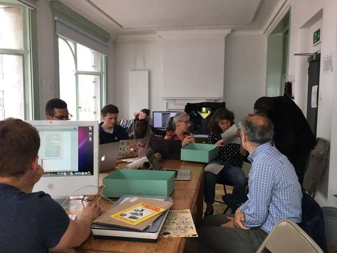
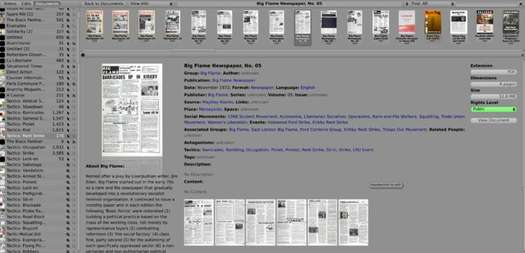
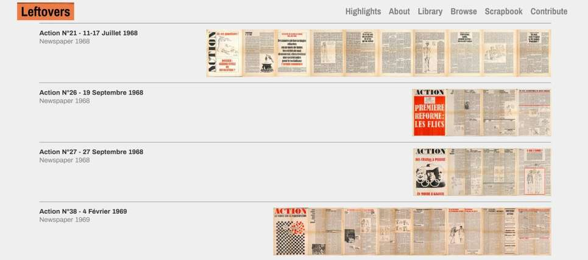
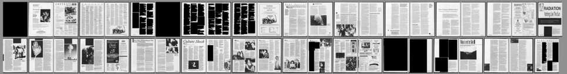
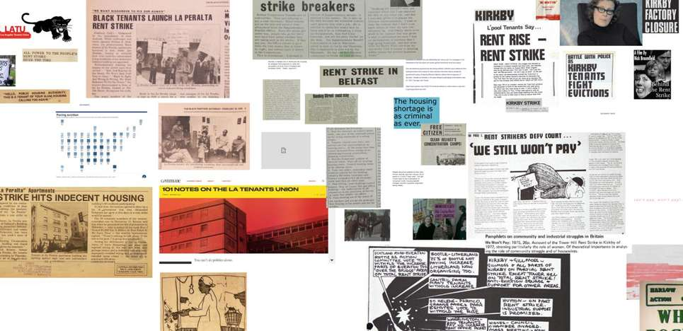
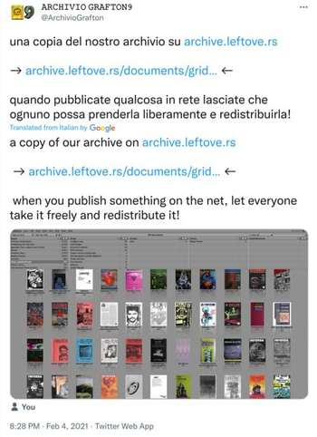

---
Pr-id: MoneyLab
P-id: INC Reader
A-id: 10
Type: article
Book-type: anthology
Anthology item: article
Item-id: unique no.
Article-title: title of the article
Article-status: accepted
Author: name(s) of author(s)
Author-email:   corresponding address
Author-bio:  about the author
Abstract:   short description of the article (100 words)
Keywords:   50 keywords for search and indexing
Rights: CC BY-NC 4.0
...

# 03. MAYDAY ROOMS: BUILDING ARCHIVAL RESOURCES FOR CONTEMPORARY MOVEMENTS

### ROSEMARY GRENNAN

MayDay Rooms (MDR) is an archive, resource space and safe haven for
social movements, experimental and marginal cultures and their
histories. This piece will look closely at a digital archiving project
initiated by MDR, called Leftovers. The project is ongoing and seeks to
create a shared online archive of radical, liberatory, and working class
movements, and the documents they have left behind. This contribution
has been treated as an opportunity to lay out some of the thinking
behind, and practice around building the online collection, and how it
has created new possibilities for creating different forms of archives
and archival engagement.

It will look at how MayDay Rooms practices around our paper archive have
been reflected and developed in a digital environment, asking questions
such as: how can building shared and collaborative digital archives move
away from preoccupations around preservation, which dominates much
archival practices, towards promoting use and reuse of historical
material? How can digital archives be structured and categorized in such
a way that they become a resource for contemporary movements rather than
a static repository? Finally, it will look at how Leftovers has started
to develop networks of sisterly archives who share digitizations and
back-up each other's data. These practices ultimately help to break down
the authority of the archival object, transforming it into something
that can be shared, copied, and reactivated in the present rather than
remaining confined to history. []{#_heading=h.30j0zll .anchor}

## Archiving from below

MayDay Rooms was established in 2013 in the midst of brutal austerity
cuts to public services in Britain, which saw the closure of many public
libraries, community centers, and cultural spaces. Austerity policies,
in combination with the anti-squatting laws passed in 2011, which
criminalized the squatting of residential property, resulting in a real
loss of social and communal spaces, which have often acted as containers
of cultural memory and histories. Within this context of increasing loss
or destruction, MDR was founded as a counter-institution dedicated to
safeguarding histories and documents of struggle and resistance with a
remit connecting them with, and making them freely available to,
contemporary struggle and protest.

The founder members of MDR were able to secure a large building on Fleet
Street right in the middle of the City of London. Fleet Street is famous
for being the historical center of print culture in Britain since the
16th century, from the Chartists to the seditious printing and
distribution of Paine’s Rights of Man. It became later the center of the
British newspaper industry until the Wapping Dispute in 1986, when
Rupert Murdoch broke the Printers Union.[^05Chapter3_1]

The building was bought by the Glass House Trust who funds MDR and the
location was chosen to be a symbol of urgent resistance in an area where
tower blocks of luxury flats blossom out of the old newspaper offices
and which now is dominated by bankers, lawyers and speculative real
estate.

This urgency was reflected in MayDay Rooms' name, which is drawn firstly
from International Workers’ Day, and secondly from the international
distress signal. Both references express the emergency facing the
radical heritage through austerity cuts and the enclosures of space, but
also an anticipation of future festivities in a better world of our own
making symbolized by 1st of May. The ‘Rooms’ part of the name emphasizes
the importance of having a physical space as a meeting point around
radical histories and present struggles. Alongside our archive
collection, the building houses communal spaces, meeting rooms and
offices, which are used by a wide range of cultural, political, and
activist groups.

MDR started with a number of ‘unboxing’ events at the Marx Memorial
Library in London, where our three founding depositors – George
Caffenzis, Silvia Federici and Peter Linebaugh –, each addressed one of
the collections that they deposited: the Marxist-feminist campaign
*Wages for Housework NYC* (1972-81), *Midnight Notes Journal*
(1971-2001) and *New England Prisoner Association News* (1973-75).
Whilst opening up his suitcase to reveal several archive boxes
containing his Zerowork’s[^05Chapter3_2] collection, Linebaugh likened them to
Pandora’s box, where different fragments and past dramas fly out.
However, he went on to say that MayDay Rooms’ commitment to collectively
working on archives took the pressure off these histories being the sole
responsibility of the depositors and orients this endeavor toward future
organizing.

From these three modest collections, the MDR archive has grown over the
last ten years to a paper archive of over 60,000 items, over 2000 films
and videos, and a digital archive of over 19,000 digitizations. The
collection at MDR focuses on social struggles, radical art, and acts of
resistance from the 1960s to the present: it contains everything from
recent feminist poetry to 1990s techno paraphernalia, from situationist
magazines to histories of riots and industrial transformations, from
1970s educational experiments to prison writing. Central to building
these collections has been the cultivation of informal networks and
relationships with those involved in social and labor movements past and
present, formed in and around the MDR building (particularly whilst
having drinks on the roof terrace or cooking together in the kitchen).
Some of our depositors bring us a few pamphlets found under the bed or
in the corner of a cupboard, others bring us great volumes of material
revealing traces of lives lived in struggle. This approach to collecting
material is necessarily fragmented and contingent, and speaks to the
fact that archives of radical politics have seldom been systematically
assembled.

Our work, around the collection, proceeds from the understanding that
social change can happen most effectively when marginalized and
oppressed groups can get to know – and tell – their own histories ‘from
below’: our archival practice and organizational structure reflects
this. Marcus Rediker defines ‘history from below’ as a type of social
history that describes the experience of working-class people as well as
their history-making power, which has long been left out of ‘top-down’
historical narratives. It is a method of approaching the past ‘that
concentrates not on the traditional subjects of history, not the kings
and the presidents and the philosophers, but on ordinary working people,
not simply for what they experienced in the past but for their ability
to shape the way history happens’.[^05Chapter3_3] Peter Linebaugh comments in
*Incomplete, True, Authentic, and Wonderful History of May Day* on the
kind of documents that this approach to history encompasses and their
ability to actualize political programs in the present:

> In our day, the traces of our radical movements are being thrown into
> rubbish pits, as state-sponsored ‘austerity’ demands the
> commodification of every inch of space, and with sinister intent
> destroys the evidence of our past, its joys, its victories. Clear out
> the closets, empty the shelves, toss out the old footage, shred the
> underground press, pulverize the brittle, yellowing documents! Thus
> neoliberalism organises the transition from the old to the new; they
> must silence alternatives. We do not want the voice of George Jackson
> to be silenced. His words still eloquently describe a desirable
> program, a necessary program.[^05Chapter3_4]

Our aim has always been to create a counter archive that resists
dominant historical narratives and rethinks the way we learn from the
past. We tried to do this through developing new free forms of
dissemination, access, research-collaboration, and collective education.
This historical work is a collaborative process, often open-ended,
sometimes messy, and not always successful. But it continues to build a
space of critical opposition to capitalist relations and to inspire
future struggles. Some recent examples of the types of activities we
have done are: collective scanning and cataloging workshops, bringing
archives to picket lines during strike actions, a series of events which
profile historical examples of resistance to the ‘cost of living
crisis’, social events and fundraisers for no border networks, youth
workshops with sisterly archives, writing to people in prison using
material from the archive, travelling and online exhibitions.

 

MDR attempts to learn from the politics that are represented in the
collection and is organized non-hierarchically around two different
collectives and a board of trustees. First, the staff collectively runs
the archive that sits at the heart of the building. There have been a
number of different iterations of this collective, each bringing with
them different political commitments and experiences which in turn has
brought new focuses, networks and collections. The second is the
Building Collective who use the space for their own activities and in
exchange help us run the building and make it accessible to people who
want to use the space for meetings and events. The Building Collective
currently consists of various groups: the two trade unions Cleaners &
Allied Independent Union and Industrial Workers of the World; the
radical research groups MayDay Radio and the workerist-inspired groups
Pagliacci Rossi and Red Therapy; the June Givanni Pan African Cinema
Archive; Statewatch, an organization monitoring state and civil
liberties; and the LGBTQAI\* support group Living Free and Trans Legal
Clinic.[]{#_heading=h.1fob9te .anchor}

## Leftover ephemera

Despite this important emphasis on cultivating a place for people to
meet, learn from history and struggle together, MDR has also been
committed to developing models of digitization, online distribution and
dissemination. The next section will explore some of the thinking behind
and strategies of building Leftovers, our shared online archive. In
contemporary archival practices, there is much emphasis on the
digitization of collections for reasons of both access and preservation.
However, access to material is often still restricted by questions of
rights and remains on internal archival systems. In addition to this,
digitization of material for preservation purposes takes resources (such
as storage and equipment) that smaller independent archives do not have.
When we first started thinking about the form of our digital collection,
we looked at how features of digital objects (reproducibility, mobility
and potential for circulation) could re-imagine an archive that bypasses
traditional concerns of preservation in favor of dissemination,
collaborative contributions and truly open access.

At MDR we were greatly inspired by the work of friends and comrades from
different ‘shadow libraries’, particularly aaaaarg.org, and Memory of
the World.[^05Chapter3_5] Back in 2015, we collaborated with Marcell Mars of Memory
of the World to develop a cataloging system which would enable us to
contribute to their online collection as librarians. The idea was to
host our digitization on memoryoftheworld.org through a hacked version
of the ebook management system Calibre in combination with the plugin
letssharebooks. However, we soon realized that the historical ephemera
(posters, pamphlets, flyers, bulletins, etc) which MDR mainly dealt with
was not quite suited to a library which was structured around books. We
then started collaborating with Jan Gerber from 0x2620 in Berlin,[^05Chapter3_6]
who had already helped us process and host our video archive.[^05Chapter3_7] 0x2620
had previously worked on Pad.ma (Public Access Digital Media Archive) an
online archive of densely text-annotated video material, primarily
footage and not-finished films. Through discussion, we found productive
similarities and alignments between print ephemera, unfinished film and
video footage; this opened up new ways of thinking about the form of our
digital archive.

We came up with the name Leftovers to highlight the centrality of
thinking through the qualities of ephemera when creating an archive. The
book or academic text is in some ways a relatively self-contained
durable object – it has a blurb, a recognizable author – that does not
need additional material to become understandable, and its use in some
ways is predetermined. Whereas political ephemera has a different
temporal scope: it was not meant to endure, and its contemporary use is
different from its first production or original purpose. For example:
leaflets that mobilize people for a protest, bulletins that communicate
actions on a picket line, or newspapers that maintain organizational
forms. All of these materials were meant to organize in haste and
communicate in the moment, but not to last. Both Jess Baines and Nick
Thoburn have written about ‘socialist’ or ‘communist objects’[^05Chapter3_8] to
describe radical print production. Baines proposes that, ‘in contrast to
the enslaved, sedated and “finished” possessions of bourgeois commodity
culture, the socialist object would be a co-worker, an active and equal
comrade that, like its mode of production enriched the bodies of the
socialist project’.[^05Chapter3_9] The material archived on Leftovers was not
intended as a static commodity but represents fragments of historical
moments woven through different tendencies and movements; so it needs a
critical mass of other ‘comradely’ material and different archival
strategies to make it understandable. In addition to this Steve Wright’s
idea of ‘document work’[^05Chapter3_10] which sees political ephemera as active
objects, rather than simple texts, has been very useful in formulating
these ideas. In his long study of the material culture of Italian
workerism of the 1970s, Wright looks at material such as ‘La Classe’ or
‘Potere Operaio’. He analyzes how printed matter like pamphlets are
written and read, made and consumed, and he argues that these activities
create kinds of social relations. These ideas foreground the creation
and use of print material rather than just transmitting information, and
this has been a guiding focus when building Leftovers.

 

The structure of the leftovers archive has tried to reflect these ways
of thinking about the material culture of social movements. Our
collaboration with 0x2620 and working with their software Pan.do/ra, has
presented both technical and conceptual possibilities around the way in
which digital objects can be pulled apart and accessed in full as
opposed to being treated as a single and opaque entity. Much like the
distinction Baines makes between a publication that embodies sedate
commodity relations and one that is an open and active part of political
movements. In the video archives that 0x2620 has been involved in
creating, material can be addressed in many different ways; as a clip, a
frame or a pixel. This has been key to developing different ways of
representing video within the archive, for example as graphical
representation of temporal changes of video timelines.

When the software was adapted for an archive of documents such as
Leftovers, it resulted in something that might be best thought of as a
cut-up inspired, non linear-approach, to historical material. All 19,000
documents are available in full as pdf, but we have added the
possibility to directly look at a page, a clipping, and the OCRed
text.[^05Chapter3_11] This has opened up the material for different forms of
extraction, recombination and analysis. We have been developing a
collaborative tool for working together on the digital collection and
creating new ways of interrogating the material remotely. The tool
enables users to take clippings from the documents in the archive, then
recombine and annotate them to create ‘scrapbooks’ or montages. We have
held a series of workshops to test and further develop these tools, and
through this, have co-created different scrapbooks around the topics of
Health Autonomy, Abolitionist Struggles, Rent Strikes, and Radical
Spaces.

 

Our approach has led us to develop our own metadata system for
Leftovers, rather than relying on hierarchical systems of classification
or inherited metadata conventions. A good example of this is the
category of ‘Tactics’. This field was introduced to re-orient the
collection as something that can be used as resources for current
struggles and developing metadata suited for the collection we hold. The
intention behind this field was that if a group wanted to organize a
rent strike they could filter or search the collection by ‘Tactics’,
choose ‘Rent Strike’ and view every document which mentions the
expression. To help further define this category, we used the full-text
functionality of the platform which allows you to search *within* the
document, not only for data *about* the document. This might sound like
a minor technical point, but it has proved highly significant in opening
up digital archives and using the actual document’s content as the basis
of classification. We made a list of different tactics of left and
social movements and searched all documents in Leftovers for them. Some
of the results are below with their occurrences in the archive to give
an impression of the variety:

Occupation (2858) Rent Strike (164) Riot (1630) Picket (1451)
Strike/Grève (3640) Direct Action (2401) Rent Strike (170) Prefigurative
(18) Sabotage (2053) Protest (3399) Sit-in (905) Blockade (607) Pirate
Radio (76) Collective (4584) Road Block (42) Boss-napping (4 ) Wildcat
Strike (124) Squatting/Squat (614) Slowdown (46) Boycott (1367) Forgery
(1) Barricades (1310) March (3850) General Strike (245)

Some of these terms, such as ‘Occupation’, occurred too many times or
were too broad to be a useful way of filtering an item. But other terms,
such as ‘Rent Strike’, are specific enough to be a useful means of
clustering documents.

Another interesting metadata category which is worth mentioning is the
field of ‘Author’, which in Leftovers is almost completely redundant, as
most material in the archive is produced by a group, a collective, or is
anonymous. The reasons for collective authoring on the left and in
social movements are various; whilst some material is intentionally
authored under a group name, others remain anonymous or produced under a
collective identity, not as a choice but as a societal position in
relation to the state, whereas in some cases other groups are actually a
single person masquerading as a group in order to explore imaginary
formations. With all of these examples, anonymity is not merely dropping
one’s name, but speaks to the complex nature of the production of the
documents, where the writing of newsletters, pamphlets, positioning
papers, and bulletins becomes a form of internally constituting groups,
not individual acclaim, and writing and action combine as a form of
collective political organization.

Angela Davis recently spoke in Berlin on the occasion of the ten year
anniversary of the occupation of Oranienplatz by the refugee resistance
movement in opposition to the *‘Asylverfahrensgesetz’* (Asylum Procedure
Act). Whilst highlighting the work and lives of Black Feminists who have
been at the forefront of struggles for freedom and rights, Davis added,
she is not presumptuous to add her own name to a long list: the ‘reason
that people know my name has more to do with what people did to save my
life all over the world, including in Germany’.[^05Chapter3_12] Davis spoke about
the ‘1 Million Rosen für Angela*’* campaign at state-wide solidarity
campaign in the GDR, where postcards of roses were sent, including many
from school children, to Davis whilst she was in prison between
1971–1972. Davis went on to describe herself as a figure standing in for
collective and mass struggle, this was not to lessen the legacy and
leading-role many Black feminists have taken but an acknowledgment of
the thousands of other people who create mass movements and social
change. Here Davis acknowledges the unknown figures that are integral to
the political movements that the material in Leftover is part of. The
category of author is often bound up with proprietary forms of
ownership, but moving away from this as a dominant metadata category, in
favor of an emphasis on movements, collective and groups, acknowledges
all those who were part of the production of the material. This started
to acknowledge that political movements and campaigns are always a work
of collective action and remain so. 

## Archives of archives

Although MDR initiated the project, Leftovers does not solely consist of
our digital collection; it draws in digitizations from many different
sources: from torrent files of 1970s newspapers to an autonomously-run
online collection of the Ultra-Left in France, to Women’s Liberation
movement material from state archives. Sean Dockrey, in ‘HyperReadings’,
puts forward the idea of a ‘library of libraries’, which does ‘not to
manifest in a single, universal library, but to realize it progressively
and partially with different individuals, groups and institutions’.[^05Chapter3_13]
This idea was influential in imagining Leftovers as a shared archive
which contains many archives and users uploading and maintaining the
material in the collection. We see ourselves as custodians of the
material in the collection rather than having some kind of exclusive
claim. All material in Leftovers has a ‘Source’ field that takes you
back to the original source of the digitization, so aggregating these
materials on one platform not only brings them into proximity with one
another but also highlights the work of many small independent archives
and protects against archival destruction.

 

One of the publications in Leftovers is *Spare Rib*, which was published
between 1972 to 1993 and represents the biggest Women’s Liberation
publication in British history. It was originally digitized by the
British Library; however, in their online collection much of the content
had been redacted due to copyright claims (see above). After Britain and
Northern Ireland left the European Union, the copyright directive that
covered the digitization no longer applied and the digital copies were
taken down. To my knowledge, Leftovers now holds the only digital copies
of this material. We can see here the fragility of digital collections
which can disappear at any time and in turn the imperative to freely
spread material across many archives and platforms. Dušan Barok
advocates the copy, not as something that just ‘mirroring or making
backups, but opening up for possibilities to start new libraries, new
platforms, new databases’.[^05Chapter3_14]

Leftovers is also used by many different archival collections, from
smaller archives that have only just started embarking on creating
digital collections and want to use Leftovers to host their collections
to more established archives contributing to Leftovers in addition to
hosting their own materials. A good example of this was when we ran a
workshop with Glasgow Housing Struggles Archive, a new project from
members of a tenants' union called Living Rent. This project was aimed
at uncovering Glasgow's hidden history of squatting, rent strikes, and
council tenant organization, and at looking at how they can use
Leftovers to build a resource and take the archive into everyday
organizing. Through this pooling and sharing of digitizations and
resources we have built networks with sisterly archives, that is, with
other physical and online collections such as Sparrows’ Nest Archive and
Library (UK), Archivio Grafton (IT), Rebal.info (IT), and Archives
Autonomies (FR).

 

Although it has been very important to network with other archives to
build the collection, not every contributor to Leftovers does so
knowingly. We have searched and scraped pdfs from many different sources
on the internet: from national collections to static pages hosting
material; from single campaigns or publications to torrents of carefully
packaged collections. For example, *The Black Panther,* the newspaper of
the Black Panther Party, was scanned at a university in the USA and then
did the rounds on the internet as a torrent. We downloaded it and OCRed
the scans and uploaded them to the collection. We were not the ones who
scanned it, downloaded it from the university, and distributed it online
and the scans are not only hosted on Leftovers, but we felt it was
important that it become part of the archive and be freely accessible.
All of these online searches for material reveal the breadth of radical
history resources online and, through bringing them together in one
place, we have been able to make connections between documents and
collections that would usually be dispersed. []{#_heading=h.2et92p0
.anchor}

## Dissemination as preservation

Leftovers was founded on the idea that radical archiving should be
outward facing and promote distribution, accessibility and use, rather
than being a static repository. This is an idea that is mirrored by many
radical archives, including Interference Archive in New York, whose
members argue that use itself is a form of preservation.[^05Chapter3_15] Pad.ma
(Public Access Digital Media Archive) in their *Ten Theses on the
Archive*, further advocate for this vision of the archive:

> When Henri Langlois, founder of the Cinémathèque Française, stated
> that ‘the best way to preserve film is to project it’, he hinted at
> the very opposite philosophy of archiving: to actually use and consume
> things, to keep them in, or bring them into, circulation, and to
> literally throw them forth, into a shared and distributed process that
> operates based on diffusion, not consolidation, through imagination,
> not memory, and towards creation, not conservation.[^05Chapter3_16]

During the *Archive Ausser Sich* conference in HKW in Berlin in 2022,
Didi Cheeka, in his talk ‘Reclaiming Nigeria's Audiovisual Archives:
Result & Prospects’*,* spoke about the issue of restitution of cultural
items made about, or made by, formerly colonized people. He argues that
restitution is not just about artifacts but audio-visual material too
that needs to be returned to their country, or countries, of origin so
that people there can have an idea of their own film heritage. Citing
Walter Benjamin, he argues that film and sound recordings are
technically reproducible, so the act of returning could also be the act
of copying. That the restitution of audio-visual heritage from
extractive archives and collections in Europe and North America does not
even need to be the ‘original’ but a reproduction that can be seen by
people whose history it belongs to.[^05Chapter3_17] Cheeka’s simple advocacy of the
copy as a means of restitution highlights how questions of rights are
used as justification by archives to sit passively on their holdings,
rather than making them actively accessible and bringing them into
circulation.

 

This tweet from Archivio Grafton, about their material hosted on
Leftovers, forms a really fitting conclusion to this piece. It states
‘when you publish something on the net, let everyone take it and freely
distribute it’. It points to the fact that the aggregation of all this
radical ephemera into Leftovers also brings them into circulation and
creates a type of common non-proprietary ownership. Through developing
tools, and ways of disseminating, programming, integrating, and re-using
the collection rather than it just being a repository where material is
merely stored, Leftovers hope to continue to re-imagine what it means to
create a digital archive as an active resource shared in common with
social movements today.

## References

Baines, Jess. ‘Radical Print Revolution? Objects Under Capitalism’,
*Strike Magazine* 8 (2014): 20–21.

Cheeka, Didi. ’Reclaiming Nigeria's Audiovisual Archives: Result &
Prospects’, *Haus der Kulturen der Welt (HKW)*,
<https://archiv.hkw.de/en/app/mediathek/audio/91369>, 2022.

Davis, Angela. ‘Angela Davis Speaks at Oranienplatz, Berlin 2022’,
YouTube, <https://www.youtube.com/watch?v=WGJ5LHZkYSg>, 2022.

Dekker, Annet. ‘Copying as a Way to Start Something New: A Conversation
with Dušan Barok about Monoskop’ in Annet Dekker (ed), *Lost and Living
(in) Archives. Collectively Shaping New Memories,* Amsterdam: Valiz,
2017, 175–188.

Dockrey, Sean. ‘README.md’,
<https://samiz-dat.github.io/hyperreadings/>, 2018.

Hoyer, Jen and MacPhee, Josh. *Interference Archive: Building a
Counter-Institution in the United States*, Brooklyn NYC: Interference
Archive, 2022.

Linebaugh, Peter. *The Incomplete, True, Authentic, and Wonderful
History of May Day*, Oakland: PM Press, 2016.

Martin, Carl Grey and Roy, Modhumita. ‘Narrative Resistance: A
Conversation with Historian Marcus Rediker’, *Workplace: A Journal for
Academic Labor* 30 (2018): 54–69.

Pad.ma Public Access Digital Media Archive. ‘10 Theses on the Archive’,
*Pad.ma*, <https://pad.ma/documents/OH>*, 2010*

Thoburn, Nicholas. *Anti-Book: On the Art and Politics of Radical
Publishing,* Minneapolis: Minnesota Press, 2016.

Wright, Steve. ‘”I Came Like the Thunder and I Vanish Like the Wind”:
Exploring Genre Repertoire and Document Work in the *Assemblea operai e
studenti* of 1969’, *Archival Science* 12 (2012): 411–436.

[^05Chapter3_1]: See MayDay Rooms online exhibition called ‘Print Subversion in the
    Wapping Dispute’, <https://exhibitions.maydayrooms.org/wapping/>

[^05Chapter3_2]: The Zerowork publishing group was formed in 1974 and could be said
    to have been informed by an early take up of Italian autonomist
    theory.

[^05Chapter3_3]: Carl Grey Martin and Modhumita Roy, ‘Narrative Resistance: A
    Conversation with Historian Marcus Rediker’, *Workplace: A Journal
    for Academic Labor* 30 (2018): 56.

[^05Chapter3_4]: Peter Linebaugh, *The Incomplete, True, Authentic, and Wonderful
    History of May Day*, Oakland: PM Press, 2016, 106.

[^05Chapter3_5]: Shadow Libraries is a term that refers to mass online libraries
    which operate outside formal institutions as well as outside
    copy-right law. The largest examples of these are Sci-Hub and Libgen
    although smaller collections such as Aaaaarg.org and
    memoryoftheworld.org are also referred to by this term. Aaaaarg.org
    is an online repository with over 50,000 books and texts. It was
    created by Sean Dockray and serves as a library for the Public
    School – an online platform that supports offline autodidactic
    activities. [Memory of the World](https://www.memoryoftheworld.org/)
    is a collaborative online library. It advocates completely bypassing
    the existing distribution system by creating a peer-to-peer library
    system, in which users become librarians of their own digital book
    collections and share them.

[^05Chapter3_6]: 0x2620 are based in Berlin and have initiated and collaborated on
    different software and archiving projects, most notably Pad.ma with
    CAMP in Bombay, bak.ma, an archive of video from the protest
    movements that started around Gezi Park in 2013 (see Çelikaslan in
    this volume) and 858.ma with Mosireen Collective a collection of
    material from the 2011 uprisings in Egypt.

[^05Chapter3_7]: See Activist Media Project, <https://amp.0x2620.org/about>

[^05Chapter3_8]: Nicholas Thoburn, *Anti-Book: On the Art and Politics of Radical
    Publishing,* Minneapolis: Minnesota Press, 2016.

[^05Chapter3_9]: Jess Baines, ‘Radical Print Revolution? Objects Under Capitalism’,
    *Strike Magazine* 8 (2014): 20.

[^05Chapter3_10]: Steve Wright, ‘”I Came Like the Thunder and I Vanish Like the
    Wind”: Exploring Genre Repertoire and Document Work in the
    *Assemblea operai e studenti* of 1969’, *Archival Science* 12
    (2012): 411–436.

[^05Chapter3_11]: Optical Character Recognition (OCR) is the process by which you
    can convert an image of text into a machine-readable text format.
    For example, a digitization of a page from a journal becomes an
    image that also contains text data.

[^05Chapter3_12]: Angela Davis, ‘Angela Davis Speaks at Oranienplatz, Berlin 2022’,
    YouTube, <https://www.youtube.com/watch?v=WGJ5LHZkYSg>, 2022.

[^05Chapter3_13]: Sean Dockrey, ‘README.md’,
    <https://samiz-dat.github.io/hyperreadings/>, 2018.

[^05Chapter3_14]: Annet Dekker, ‘Copying as a Way to Start Something New: A
    Conversation with Dušan Barok about Monoskop’ in Annet Dekker (ed),
    *Lost and Living (in) Archives. Collectively Shaping New Memories,*
    Amsterdam: Valiz, 2017, 188.

[^05Chapter3_15]: Jen Hoyer and Josh MacPhee, *Interference Archive: Building a
    Counter-Institution in the United States*, Brooklyn NYC:
    Interference Archive, 2022.

[^05Chapter3_16]: Pad.ma Public Access Digital Media Archive. ‘10 Theses on the
    Archive’, <https://pad.ma/documents/OH>*, 2010*

[^05Chapter3_17]: Didi Cheeka, ’Reclaiming Nigeria's Audiovisual Archives: Result &
    Prospects’, *Haus der Kulturen der Welt (HKW)*,
    <https://archiv.hkw.de/en/app/mediathek/audio/91369>, 2022.
