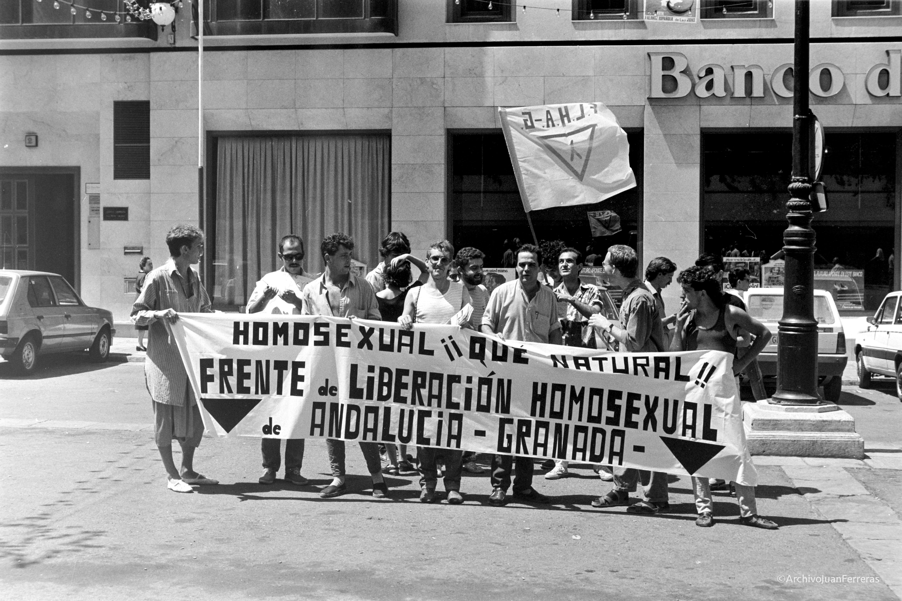
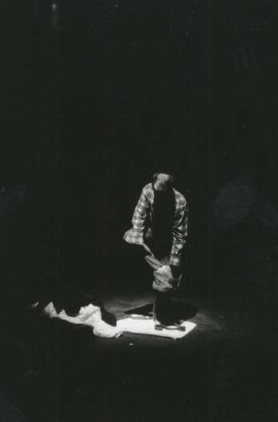
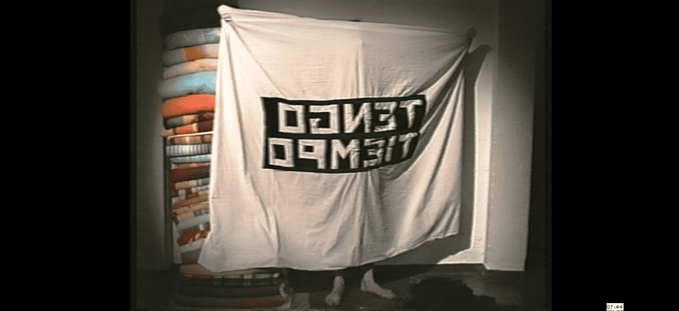
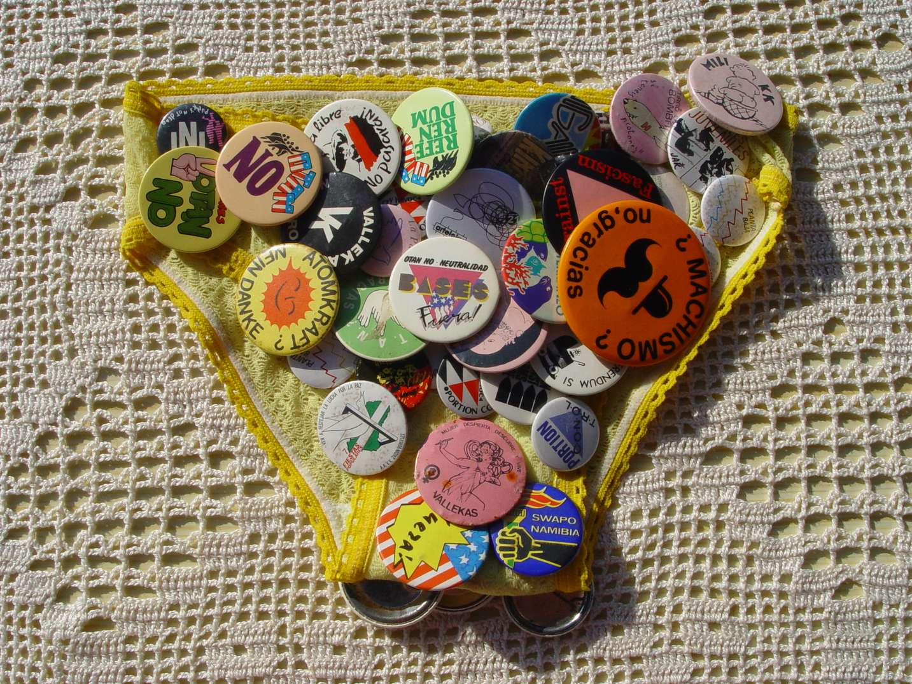
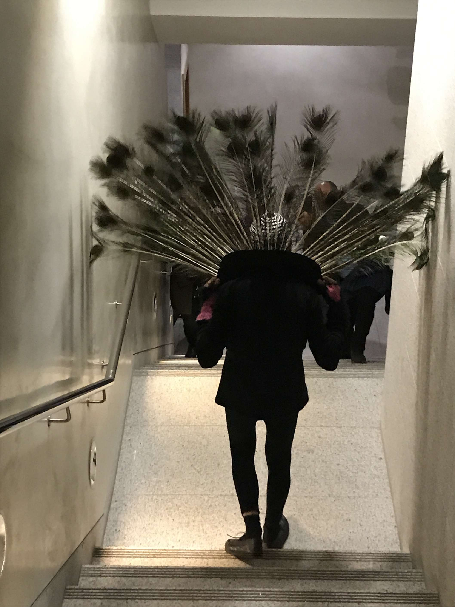
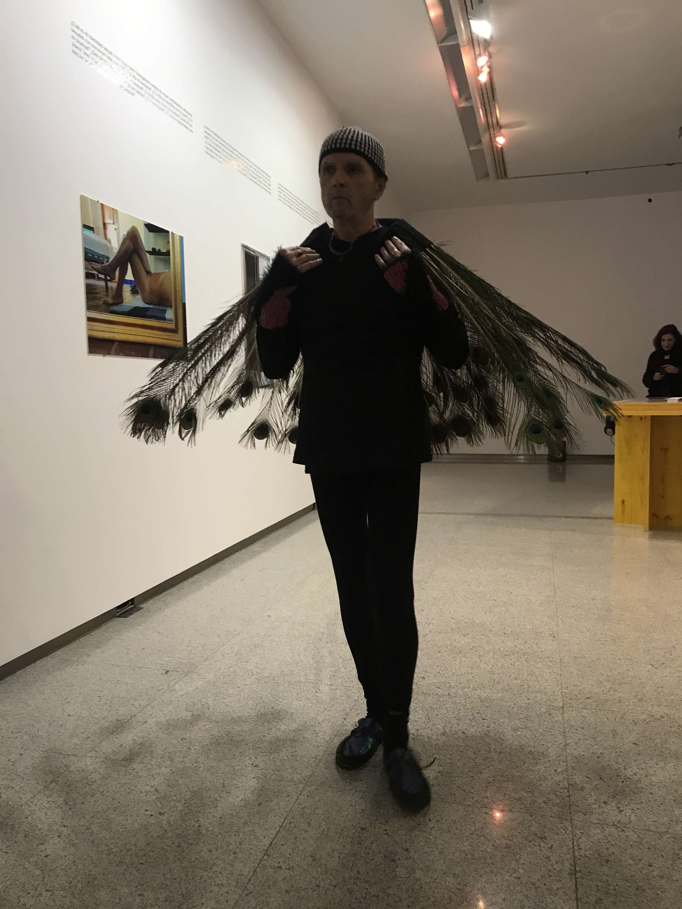
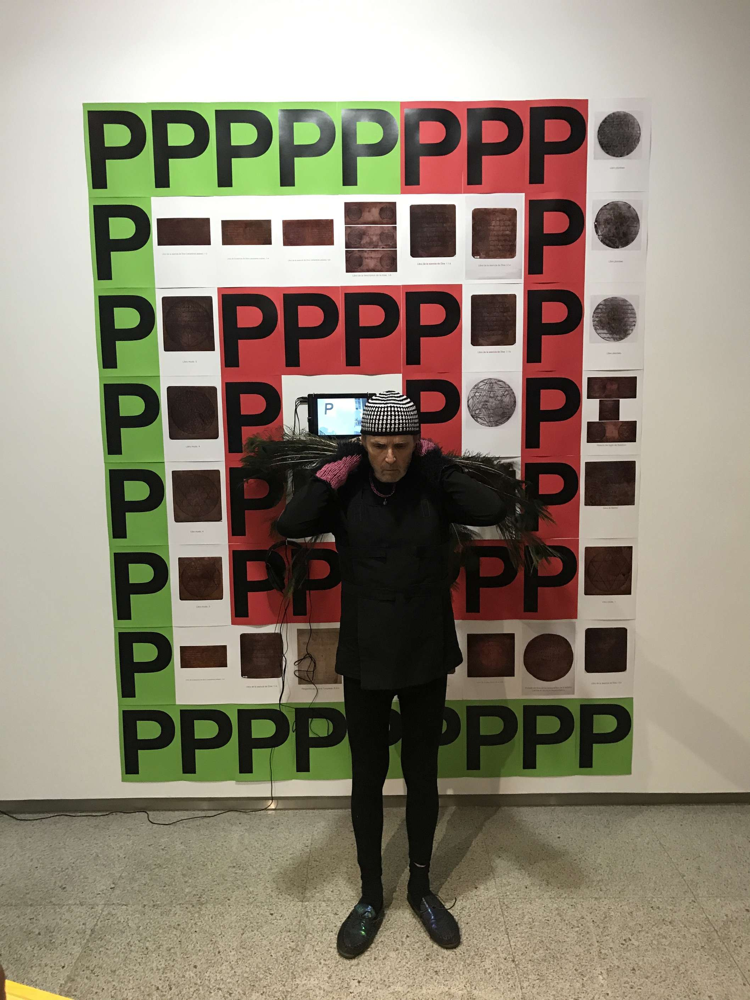
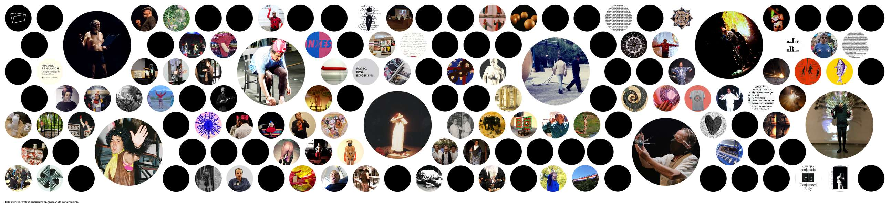
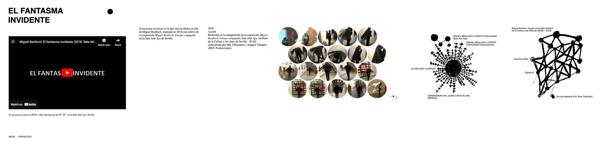

---
Pr-id: MoneyLab
P-id: INC Reader
A-id: 10
Type: article
Book-type: anthology
Anthology item: article
Item-id: unique no.
Article-title: title of the article
Article-status: accepted
Author: name(s) of author(s)
Author-email:   corresponding address
Author-bio:  about the author
Abstract:   short description of the article (100 words)
Keywords:   50 keywords for search and indexing
Rights: CC BY-NC 4.0
...

# 06. ARCHIVING ART-ACTIVISM IN POSTDIGITAL TIMES: THE MIGUEL BENLLOCH ARCHIVE

### DANIEL VILLAR-ONRUBIA

## Introduction

Miguel Benlloch (1954–2018) was an activist, artist, and cultural producer born and based in southern Spain. This chapter describes the conception and development of an archive established after his death to preserve, disseminate and keep alive his legacy. In doing so, it delves into the intricacies of archiving the traces of activism enacted through contemporary art practices and against a backdrop of profound social, political, cultural and technological transformations. Firstly, I focus on the process of turning the work of an activist-artist into archival materials to be stored and accessed online, paying particular attention to the tactical selection of digital infrastructures for that purpose. Secondly, considering that Benlloch's practice manifested most notably in the form of performance art – which is quintessentially ephemeral, situated, and deeply anchored to context – I discuss the challenges of trying to preserve that type of cultural heritage. 

The chapter starts with the story of Benlloch, pausing to reflect upon
the nature of his work as both an activist and an artist, while
examining the intersection between these two fields of action. I then
survey the creation of the Miguel Benlloch Archive (hereafter referred
to by its acronym in Spanish: AMB) and the main milestones in its
development. I continue unpacking the complexities of converting
Benlloch's legacy – and more generally performance art – into archival
matter, illustrated by an account of his very last performance. The
final section identifies key practices and actors at play in the
materialization of the AMB. Likewise, it deals with a number of critical
issues around the political economy of the World Wide Web (WWW) and how
it influenced key architectural choices and the deployment of
infrastructures underpinning the AMB.

The chapter draws on relevant literature and documents, on my own
experience contributing to the creation of the current online
incarnation of the AMB, as well as on numerous conversations and
correspondence with the two coordinators of the AMB and close friends of
Benlloch: Joaquín Vázquez and Mar Villaespesa.

## Benlloch as an activist-artist (and vice versa) 

While Benlloch used the words ‘performer’, ‘poet’ or ‘political and
cultural activist’ to describe himself,[^08Chapter6_1] such terms fail to
encapsulate the full extent of his virtually infinite identities.
Writing in the prologue to a book published on the occasion of a
collective exhibition built around the AMB at the Institut Valencià
d'Art Modern (IVAM), Nuria Enguita attempts to give a more comprehensive
list of labels.

> Miguel Benlloch, maybe everything ‘bad’: communist, pacifist,
> ecologist, poet, carnival artist, disguise artist, queer before queer,
> crip before crip, (singing to the sick body – individual and social),
> master of ceremonies of his village, spokesperson for the popular and
> the modern, cabaret artist constantly embroiled in collective
> struggles, anti-conscription, embodiment of so much utopia,
> transforming spirit, shindig organiser, the dream of revolution or
> rather of rebellion, incarnate and in card – it’s been said before –
> incarnate as the performative body and in cards as a card carrying
> anti-capitalist, homosexual, post-feminist, anti-Francoist and
> anti-NATOist who’d tear up all the cards if it was necessary, when all
> they produced was hermetic, fixed identities that limit and put up
> borders, that classify, codify and sadden every idea and limit every
> life. Miguel, this and that at the same time, and neither this nor
> that completely.[^08Chapter6_2]

All dimensions of Benlloch’s polyhedric existence were deeply
intertwined, making it impossible to disentangle his activism from
either his creative practice or his work as a cultural producer, which
were equally linked to each other. However, Benlloch started his
activism while still a university student in Granada and only later in
his life developed an identity as an artist.

Over the 1970s and 1980s he was part of numerous organizations devoted
to different causes,[^08Chapter6_3] most notably fighting the Spanish dictatorship,
promoting peace, and advocating for LGBTQ+ rights. He played a leading
role in the configuration of the anti-NATO movement around the
referendum that took place in Spain in 1986 (Fig. 6.1) and co-founded the
Andalusian Homosexual Liberation Front (Fig. 6.2). His activism was
already deeply infused with creativity and humor by then, as illustrated
by the ingenious slogans he crafted for some of the causes he supported,
such as ‘Lo nuestro sí que es mundial’ or ‘Reagan lo que Reagan, OTAN
no’.[^08Chapter6_4] During the 1980s his creativity also manifested through the
*Cutre Chou* (‘Seedy’ or ‘Cheap Show’), a set of cabaret-style sarcastic
sketches performed with friends at the Communist Movement’s *caseta* in
the Corpus Christi festivities of Granada; as well as through similar
performances at Planta Baja, a nightclub he co-founded with his friend
and partner Juan Antonio Peinado.[^08Chapter6_5]

 
                                                   

 

In 1988, Benlloch co-founded with Joaquín Vázquez BNV Productions, first
established in Granada and subsequently, just a few years later,
relocated to Seville. Thanks to various collaborations with Mar
Villaespesa, their work became firmly established in the contemporary
art and culture arena of the early 1990s.[^08Chapter6_6] While BNV came to art from
political activism, Villaespesa followed the opposite pathway.[^08Chapter6_7] In
1992 they worked together on *Plus Ultra*, an ambitious contemporary art
program commissioned for the Andalusian Pavilion at the universal
exposition of Seville (Expo´92). Conceived as a series of site-specific
projects by guest artists, both international and Spanish, it was
distributed across the eight provinces of Andalusia and intentionally
taken out of the venue of the exposition; as a way of questioning what
was being celebrated, namely the 500^th^ anniversary of the ‘discovery’
of America.

It is in that context where, exceeding the usual remit of a cultural
producer, Benlloch literally entered the sphere of performance art in
the first person. After hearing from him of the traditional folklore
song *María de la O*, James Lee Byars – the artist invited to work in
Granada for *Plus Ultra –* decided to create a golden three-meter
diameter plaster sphere*.* Built by local artisans, the sphere was
hollow, 10 cm thick, and delicately covered in gold leaf. Following
Byars’ instructions, on the 11th of October 1992, Benlloch was
introduced into the sphere with the help of a crane to recite the phrase
‘María de la O’, time after time, over the course of a few minutes
(Figs. 6.3-4). A few photographs and a brief videoclip documented the
event. The sphere itself was destroyed, as requested by Byars after
local institutions failed to show any interest in it, but Benlloch kept
a fragment that is now part of the AMB. Apart from such visual and
material remains, Benlloch wrote a personal account of that experience
for the book *Acaeció en Granada*.[^08Chapter6_8]

  

 

 

As a creator himself, Benlloch pursued different forms of expression.
However, he is arguably best known for his work as a performance artist
and, indeed, was particularly fond of the term ‘performancero’: a
Spanglish neologism he coined himself to define his identity – at least
one of them – as an artist. In 1994, he staged what is considered to be
his first work as a performance artist:[^08Chapter6_9] *Tengo tiempo*[^08Chapter6_10] (Figs.
6.5-6). It was originally conceived as a birthday present for his friend
Miquel Bargalló and enacted at a bar in Moyá (Barcelona), but shortly
after he was invited by artist Robin Kahn to repeat that performance at
The Kitchen, a prominent venue devoted to experimental art practice in
New York.

  

 
                                                       

 

Over more than two decades, until his death in 2018, Benlloch combined
his ‘day job’ as co-owner and cultural producer at BNV Producciones with
his own practice as an artist. Both facets of his career constantly
overlapped and mutually informed each other, always grounded on an
anti-patriarchal and anti-capitalist stance; which according to Vázquez
is what best explains why he ‘never stopped questioning how to develop a
kind of practice that could be seen as collective, non-fragmented
action, capable of producing a profound transformation in the existent
symbolic, political and economic order’.[^08Chapter6_11]

Benlloch’s work was heavily influenced by queer theory, which he helped
to introduce and further develop in Spain through the coordination of
numerous seminars and events under the Post-identitary Feminisms strand
of the UNIA arteypensamiento program.[^08Chapter6_12] In that capacity, between
2003 and 2014 he was in close collaboration with Paul B. Preciado; who
once stated feeling like the ‘he-, she- they-child of Miguel Benlloch
and Pedro Lemebel’.[^08Chapter6_13]

Rooted in the gay rights campaigning he initiated in the 1970s and
bolstered by his encounter with queer theory in the 2000s, which somehow
helped him to consolidate what he had already been doing as a sort of
proto-queer artist,[^08Chapter6_14] Benlloch’s performative practice became a
powerful activist-aesthetic endeavor articulated around what Villaespesa
and Vázquez define as ‘the vague, varied, playful, unbecoming, migrant,
illegal, non-identified, diluted and conjugated body’.[^08Chapter6_15] By working
at the intersection of art and activism, Benlloch instrumentalizes art
with the aspiration to prompt social and political change (i.e. the
politicization of aesthetics), a position that Boris Groys regards as
still relatively new in historical terms.[^08Chapter6_16] At the same time, his
trajectory can also be understood as a process of intensified
aestheticization of activism.

       

 

                                                                                                                                                                                                                  

## Birth of a postdigital archive

Before his death, Benlloch designated his nephew Manuel Benlloch and
Joaquín Vazquez as joint custodians of his legacy: the remains of a
multifaceted existence, amalgamating objects and documents that he had
either created or gathered throughout decades of collective and
individual practice as an activist, artist and cultural producer. His
legacy consists of physical artifacts of different kinds and provenance,
but also the digital content stored in ‘that bottomless well of \[his\]
hard drives that contain as many memories as terabytes’.[^08Chapter6_17]

Benlloch was clearly concerned with the preservation and dissemination
of his work after his death. Indeed, his will and testament specified
that any potential revenue generated through the display or sale of any
of the elements of his legacy, which includes works by other artists,
must be reinvested in the preservation and diffusion of that legacy.
However, the very idea of establishing an archive as a way of carrying
out his wishes only emerged after he had passed away.

Benlloch initiated his practice at a time of limited access to media
production technologies and before computerization became pervasive in
everyday life. However, at the end of his existence the so-called
postdigital condition had already permeated almost all dimensions of
society. Postdigital is a rather elusive concept whose origin is often
linked in the literature to a brief article published by Nicholas
Negroponte in 1998 under the title of ‘Beyond Digital’.[^08Chapter6_18] Without
using the term, Negroponte signaled the advent of a world in which the
digital would be ubiquitous and, therefore, taken for granted in every
aspect of contemporary living.

Since then, the postdigital has gained ground across disciplines,
proving meaningful in the study of wide range of topics including
art-activism[^08Chapter6_19] and memory institutions.[^08Chapter6_20] As suggested by Petar
Jandrić, the postdigital is a ‘wide-open position or perhaps even
worldview which encompasses various reconfigurations between
technologies and humans’.[^08Chapter6_21] In that sense, it prompts the adoption of
socio-material perspectives and pushes the theoretical envelope well
beyond the mere analog-digital chiasm, to address much broader
posthumanist issues.

While the AMB was born in postdigital times, it also deals with
artifacts and content that predate the so-called digital revolution.
Reflecting upon the social and material building blocks and processes
that articulate this archive can help us to gain insight into the
complexities of preserving and disseminating both art and activism at
this moment in history.

Unlike traditional archives, the AMB does not exist as a collection of
physical items stored within a single place. Indeed, artifacts and
documents are scattered across various locations, only coalescing
occasionally to be exhibited at galleries or museums.[^08Chapter6_22] Embodied into
various online interfaces, the permanent home of the AMB is the
internet. Its own web domain[^08Chapter6_23] works as the main point of access to
Benlloch’s legacy, while it also relies on third-party online
infrastructures. Far from being immaterial, the AMB is a socio-technical
assemblage of servers, wires, hard drives, computers and other elements
of hardware and software that, along with a constellation of people
embedded in their own material conditions, bring the archive into being.

Most of Benlloch’s work could be seen together at the solo exhibition
*Miguel Benlloch. Cuerpo Conjugado*, curated by Vázquez and Villaespesa
at the Sala Atín Aya (Seville City Council), just a few months before he
died.[^08Chapter6_24] And it was in the context of conversations between Vázquez,
Villaespesa and Soledad Gutiérrez about taking the exhibition to
CentroCentro, Madrid,[^08Chapter6_25] that the idea of creating the AMB emerged.
Villaespesa and Vázquez worked closely with Charo Romero Donaire and
Inmaculada Salinas to build the first online incarnation of the
AMB,[^08Chapter6_26] which was launched on the opening at CentroCentro in 2019. It
provided a wealth of content and contextual information on each of the
main artworks created by Benlloch:

> existing records – whether videos, photographs, texts, etc.; a
> description or synopsis of the work; a timeline of the places where it
> has been displayed; other related works by Miguel; and connections to
> the archives of other artists, collectives and institutions with ties
> to his work.[^08Chapter6_27]

Several computers were available at CentroCentro for visitors to browse
the AMB’s website. The same happened at the next and final iteration of
that exhibition, hosted at the University of Granada in 2020
(Fig. 6.9),[^08Chapter6_28] and in *Essays on Seediness*, at the Institut Valencià
d'Art Modern (IVAM) in 2021-22.[^08Chapter6_29] It is worth noting that the
exhibition in Valencia followed an approach considerably different from
the previous ones: ‘It’s no longer a question of simply showing the
Archive on computers as a research resource; now the archive itself is
the original seed of the process of this exhibition’.[^08Chapter6_30] *Essays on
Seediness* presented five artworks in dialogue with Benlloch’s aesthetic
and political universe. For this, the curators invited various artists
to peruse the archive and respond with their own projects.

 

The reconfiguration of the AMB’s web domain, which is still a work in
progress, started in parallel with the preparations for the exhibition
at IVAM and involved establishing a few separate websites: the main
domain name was reserved to host the new online incarnation of the AMB
and a subdomain was established to keep the original version,[^08Chapter6_31] while
another subdomain was allocated to a website specifically devoted to the
*Essays on Seediness* exhibition.[^08Chapter6_32]

Before giving more details on the architecture of the new online
incarnation of the AMB and the range of infrastructures underpinning it,
in the next section I will pause to describe its contents and to unpack
some of the main challenges of archiving performance art and, more
specifically, preserving activism manifested in the form of performance
art.

## On Benlloch’s works of art-activism as archival matter

The AMB consists of a variegated assortment of items, both physical and
digital, either produced or collected by Benlloch. Most notably, it
includes:

-   Documents relating to his political and LGTB activism since the
    1970s: manuscripts, flyers, diverse types of graphic materials,
    press…

-   Documents relating to his activity in Plata Banja during the 1980s:
    fanzines, brochures, flyers, press…

-   Object art pieces: small sculptures (spheres…); everyday life
    objects and symbolic stones that configured his aesthetic space and
    thinking; clothes he used in his performances turned into artworks,
    such as *La braga activista* (‘The Activist Pants’)*;* fragment of
    *the Golden Sphere*, converted into an element of the work *O donde
    habite el olvido* (‘Or Where Oblivion Dwells’);

-   Works in the form of digital photographs;

-   Video-documents of his performances, \[as\] digital files;

-   Digital audio \[files\] of music preparatory to his performances;

-   Garments he wore in his performances. There are many, including the
    emblematic suit of mirrors he used in several of his performances:
    *Ósmosis, Ibn Farum, Mapuch ¡EH!, Acuchillad+s*…[^08Chapter6_33]

Within that mix, drawing a line between art and documentation is often
rather difficult, if not impossible. Furthermore, Benlloch’s activism
and art practice overlap to the extent of being jointly embodied in most
of the artifacts and documents that form his legacy. Even some of the
ephemera and records predating his art practice were subsequently
(re)integrated by Benlloch into his artworks:

> It took a third exhibition for me to find in its pages the origins of
> the little blurry photo, the one with you holding up the placard
> saying ‘OTAN NO!’ \[‘NO NATO!’\]; the one we’d shown for your pacifist
> activism, not as a document but as an artwork, because it had been
> established as such in another of your characteristic operations when
> you included it in *Signos* (Signs).[^08Chapter6_34]

The AMB is one of those archives helping to preserve the memories and
activism of LGBTQ+ people,[^08Chapter6_35] but it also provides invaluable insights
into the articulation of other causes into which he was deeply invested
too. For instance, the pacifist movement against NATO and the cultural
activism of the Plataforma de Reflexión sobre Políticas Culturales
(PRPC),[^08Chapter6_36] which emerged in response to the now defunct Bienal de Arte
Contemporáneo de Sevilla (BIACS). Thus, despite resulting from the
existence of a specific individual, the archive transcends his own
person to offer insights into the collective struggles of various
communities, in Spain and beyond, in recent history. At the same time,
considering the aesthetic nature of Benlloch’s work, the AMB occupies
the liminal space where art and cause-based archival practices
intersect.

The process of transforming individual works into archival records
depended on their materiality. Print documents entered the AMB’s website
as scanned copies, while objectual artifacts became archival materials
after being photographed; whether in preparation for publications or as
items on display at exhibitions. Media content generated by Benlloch and
his collaborators came into the online archive mainly from his hard
drives; as a mix of both born-digital files and analog media that he had
digitized.

As already noted, Benlloch adopted performance art as the cornerstone of
his creative practice. Scholars specializing in that form of expression
have paid considerable attention to the role of documentation, carefully
pondering whether it should be understood either as just an imperfect
representation of aesthetic events or as an intrinsic part of the
creative work. In order to illustrate how the AMB approaches that issue,
I will pause on Benlloch’s final performance, *El fantasma invidente*
(‘The blind ghost’),[^08Chapter6_37] which he enacted on the 16th of February 2018
at the opening of his exhibition *Miguel Benlloch. Cuerpo conjugado* in
Seville (Figs. 6.10-13). Since I was not present, I can only report
vicariously, relying on documentation and accounts, such as the words
written by Santiago Eraso on his blog:

> In a sort of premeditated circulation, in a way his last circulation,
> from the end to the beginning of his life, Benlloch, wearing a sort of
> shroud but also guerrilla outfit, traversed the rooms of the two
> floors, in dramatic pose, in silence, as if words and gestures could
> no longer enunciate or do anything against the inevitable, as if he
> walked from the very belly of his mother to the land where his ashes
> were spread over the thickets of Loja \[...\][^08Chapter6_38]

Artist Isaías Griñolo, a close collaborator of Benlloch, produced the
‘official’ video recording of that performance. Besides documenting his
actions, it also provides a wealth of details which some might regard as
mere contextual information while others consider them a substantial
part of the artwork itself. I recognize some familiar faces in the
audience: from local artists and his colleagues of BNV Producciones to
influential figures in the Spanish contemporary art scene, such as the
director of the Museo Nacional Centro de Arte Reina Sofía at that time.
Likewise, the video recording contains traces of ‘documenting acts’
enacted by other people who were also witnessing the performance:
several flashes bleaching the image as Benlloch walks down the stairs
and his body seen incidentally on the screens of phones capturing the
moment.

During the first half of the performance Benlloch is fully covered in
garments, literally from top to toe; including gloves, a hat, and a
scarf hiding his face. He slowly goes up the stairs and, after reaching
the first floor, keeps treading – all the way backwards – while leaving
behind many of his works. He then gets to the stairs that lead to the
second floor and keeps going onwards, always in reverse and upwards. It
takes about seventeen minutes to get to the point where he finally stops
and unveils his face.

Next, he takes off his overgarment, revealing the extremely thin
silhouette of his sick body and grabs from a wall the vest that he
devised for *DERERUMNATURA Quien canta su mal espanta* (‘DERERUMNATURA.
Laughter is the Best Medicine’). A bunch of striking peacock feathers is
attached to the vest, which makes him look like he is sporting a
colorful cape once wearing it. In his next actions, Benlloch takes off
his shoes and puts on another pair; he also reveals the rings adorning
both of his hands after removing a pair of silky gloves. Right after
that, he picks up from the floor a ceramic whistle in the shape of a jar
and starts to blow, producing a sound that mimics the tweeting of a
bird. It is time to resume the journey, but now he is walking forward.

The journey ends at the same place where it started, on the ground floor
of the gallery, with Benlloch standing in front of a projection of his
first performance: *Tengo tiempo*. As the images of his past and present
selves – and artworks – superimpose on the new video recording, a sort
of palimpsest emerges.

During that journey, Benlloch was surrounded by dozens of people: some
of them merely observing with the naked eye, while others looking
through devices of different kinds as they captured the moment. Apart
from a myriad of ordinary smartphones, ‘proper’ photography cameras and
video recording gear were present in the gallery too. The video by
Griñolo constitutes the main documentation of the performance. Still, it
is not the performance itself but some sort of synthesis that captures
certain moments, gestures and faces; leaving others unrecorded and,
therefore, unable to enter the AMB – at least in that way.

 
 
  

 
 
  

 
 
  
  
 

 

As Matthew Reason notes, recordings are by definition partial and
incomplete, they can never tell the whole story, but at the same time he
claims that it is through the gaps and absences (i.e. what cannot or is
not recorded) that the transient nature of performance art becomes
evident:

> that which is missing (the unrepresented, unrepresentable and liminal)
> re-inscribes the continuing absence of the ephemeral performance. The
> discourse of documentation continually re-inscribes perceptions of
> ephemerality; the act of documentation marks and brings into being the
> fact of disappearance.[^08Chapter6_39]

The complex relationship between performance art and its documentation
has been the subject of heated debate. Art historian Amelia Jones has
passionately defended the legitimacy of studying performance art through
photographic, textual, oral, video or film traces; arguing that such
representations do not have a less privileged relationship to the
‘historical “truth” of the performance’ than witnessing an artist
perform ‘in the flesh’.[^08Chapter6_40] Going somehow further, Auslander concludes
that the value of performance documentation does not come so much from
treating it as ‘an indexical access point to a past event but from
perceiving the document itself as a performance that directly reflects
an artist's aesthetic project or sensibility and for which we are the
present audience’.[^08Chapter6_41] Conversely, challenging the primacy of
documentation, Simon Jones proposes that:

> the distinctiveness and efficacy of performance as an art-form are not
> inaugurated in the instant of its documentation and their subsequent
> interpretations by historians. This misrecognises performance’s
> essential relation as being with the archive, resulting in its present
> being immediately taken up in its future perfect—what it will have
> been to future historians.[^08Chapter6_42]

Like all live artworks, Benlloch’s performances were ephemeral, and one
might argue that his performance art somehow ended with the last step of
*El fantasma invidente.* However, while the media recordings of his
performances cannot be treated as the performances themselves, they
still convey much of the aesthetic power of those events; sometimes even
amplifying it. Indeed, in the absence of the performances themselves,
the value of the video documents generated out of them is being
recognized by traditional arts institutions, as illustrated by recent
acquisitions by the Museo Nacional Centro de Arte Reina Sofía and the
Museu d'Art Contemporani de Barcelona (MACBA).

Likewise, the importance of such archival records for activism should
not be underestimated. They are not just valuable from a historical
perspective, but also as fully functional symbolic devices that remain
useful in contemporary social struggles. By disseminating Benlloch’s
legacy as an artist-activist, or activist-artist, the AMB aspires to do
what, as Michelle Caswell puts it, archives do at their best: to empower
people to ‘see themselves in a new light across space and time \[and\]
then catalyze this new self-reflection into action, motivating users
into activism beyond their personal contexts’.[^08Chapter6_43]

Benlloch lived through an epoch of rapid social, political and
technological transformation; going from the ‘media scarcity’ of
pre-digital times – when access to media devices was very much limited –
to the ‘media abundance’ characteristic of the post-digital living that
he could see unfold during the last decades of his life. In this regard,
the limited records of his first incursion into the realm of performance
art, as a collaborator of Byars, is in stark contrast to the multitude
of recording devices capturing his final performance.

Harnessing the proliferation of media recordings typical of postdigital
times, the AMB is also concerned with the collection and preservation
of, for lack of a better word, ‘unofficial’ traces of Benlloc’s work.
Thus, it remains open to media recordings generated as personal
memorabilia by those who attended some of his performances, in order to
incorporate as many perspectives as possible. This adds to the
notoriously complex task of managing intellectual property in relation
to performance art[^08Chapter6_44] and is in line with the efforts to ensure that
the copyright status of items within the AMB enables preservation and
dissemination as much as possible.

## Archival acts, actors, architecture and infrastructures

The AMB is sustained by a myriad of processes and people that enable the
collection, preservation, and dissemination of Benlloch’s legacy.
Examples of key practices include the selection and sorting out of
relevant items and documents, the digitization and description of
content, managing funds, liaising with galleries and museums, as well
the configuration of a range of digital technologies chosen with the aim
of providing access to content in the long term.

Some of those processes even predate the foundation of the AMB and
started when Benlloch was still alive. In this regard, a key moment in
the systematizing of his oeuvre was a visit he paid to Villaespesa in
Tarifa (Cádiz, Spain) in the summer of 2013, where they spent several
weeks working together on the book *Acaeció en Granada*.[^08Chapter6_45]

> It was then that he/we gave a structure, denominations, etc. to his
> body of work: ‘performances’, ‘signos’, ‘tipotopotropos’, ‘alboroques’
> \[...\] To me it was key for the elaboration of a curatorial proposal
> for the exhibition in Seville \[*Miguel Benlloch. Cuerpo conjugado*\],
> as it allowed me to acquire a more systematic knowledge of his work
> beyond my direct experience, having been very close to him and his
> practice from 1992 to 2018.[^08Chapter6_46]

The nomenclature and categories they established at that time
subsequently underpinned the configuration of future exhibitions and
have also shaped the online incarnations of the AMB, providing a
conceptual scaffold for the organization of archival materials. Thus,
the naming and sorting of things that happened as part of the
preparatory work for that book should be regarded as the first archival
acts that started to articulate the basis of this archive, years before
it was established or even envisioned.

Vázquez and Villaspesa have obviously played a central role in the
process of turning Benlloch’s legacy into archivable materials and
archival matter; in collaboration with other actors who have also
contributed to that process in different ways. For example, as already
mentioned, Griñolo worked closely with Benlloch in the documentation of
some of his performances, while Inmaculada Salinas and Charo Romero
Donaire built the first website of the Archive. In my own case, I
contributed to the process of reimagining the current online incarnation
of the AMB.

When thinking about the various actors involved in establishing and
nurturing the AMB, it is important to highlight that Benlloch’s work was
embedded into a vast network of social relations and collaborators.
Indeed, his practice heavily relied on ‘a truly collective life, the
liveliness of people, the sociopolitical and artistic groups with whom
he interacted’.[^08Chapter6_47] Acknowledging the importance of collaboration in
his work, one of the sections established to organize the new online
incarnation of the AMB is named after the term *otr+syyo*
(‘othersandI’),[^08Chapter6_48] which Benlloch coined himself and highlights the
relational nature of his practice: ‘*OthersandI* is an affirmation that
speaks of both the individual and the multiple, and how the individual
is multiple and the multiple is made of individuals in relationships,
othersandI also forms a unity from which life can be understood as
conflict, support and affect’.[^08Chapter6_49]

Many of those ‘others’, including both weak and strong links, have
breathed some life into the AMB, whether it is by ‘unearthing’ material
that had remained lost so far, contributing records captured by
themselves, helping to describe content and improve metadata, or drawing
the attention of others to Benlloch’s work.

As already noted, AMB’s primary manifestation takes the form of a web
domain. Therefore, it is mainly embodied in digital media available
online, consisting of both born-digital content and digitized materials
as described in the previous section. While its domain name has remained
stable since it was established in 2019, the interfaces and underlying
infrastructures that enable access to content have undergone several
reconfigurations.

The first online incarnation of the AMB (Fig. 6.14) consisted of 90
‘project’ web pages, a page listing all those projects in alphabetical
order, another page with biographical information, and the homepage,
which gave access to each of the projects by means of featured images of
each of them.

 

Each of the project web pages followed a similar structure that required
scrolling horizontally (Fig. 6.15): title, embedded video or still image,
description, key milestones of the project in chronological order (for
example, the date on which Benlloch staged a performance for the first
time and subsequent iterations or public screenings of the respective
video-document), documents (for example, performance scores, leaflets,
scholarly works) and/or still images, internal links to the pages of
related projects, and external links to relevant content in other
websites (for example, those of institutions where he presented his
work).

 

 

The content of the current incarnation of the AMB (Fig. 16) is based on
the original website, but all the entries have been revised; in many
cases expanding information and also adding new archival materials.
Moreover, there are significant differences with regard to the overall
structure. While the original site relied on the term ‘project’ to
describe all entries, the new version organizes content around a number
of categories and subcategories.

All his artworks are gathered under *Obras* (‘Works’), available in both
chronological and alphabetical order. The category *Otr+syyo*
(‘OthersandI’) encompasses collaborations with other creators,
collective initiatives, his political activism (which is also archived
under the section ‘Works’), *in memoriam* events, and other
miscellaneous content, including, for instance, a collection of
photographs of Benlloch with family and friends.[^08Chapter6_50] The category
*Biblioteca* (’Library’) contains the books he published, as well as
other publications (e.g., booklets, leaflets) and texts written by him
and others. Finally, content about his solo and collective exhibitions
is available under a separate category and respective subcategories. In
addition to categories, keywords (tags) offer another layer of metadata
that allow the visitor to browse and filter content in other ways: by
medium, people, entities, places, topics, etc.

 

Understanding the creation and maintenance of an archive in postdigital
times calls for the adoption of an ecological approach that, as Sy
Taffel suggests, is mindful of complex ‘entanglements of technology,
culture and mediation \[...\] that go beyond focusing upon the content
of mediated communications, additionally examining the infrastructures
of software and hardware upon which digital communications are
predicated’.[^08Chapter6_51]

The challenges are not limited to finding efficient ways of preserving
materials and providing access to them, but they are also very much
concerned with the ethical and political implications of such practices
and the underpinning infrastructures. Contemporary activism often
combines the appropriation of corporate social media platforms like
Facebook, Twitter or YouTube with the concomitant adoption of autonomous
infrastructures and alternative digital technologies.[^08Chapter6_52] As
illustrated by the case of Italian hacktivism in the mid 2000s, ‘people
open pages on Facebook, a Twitter feed, blogs on both Noblogs and
Blogspot, mail both on Autistici and Gmail, upload videos of
demonstrations to YouTube and photos to Flickr. With all of the
advantages, problems and contradictions that this implies’.[^08Chapter6_53]

Currently, activism at large arguably relies on digital information and
communication infrastructures by leveraging the affordances of such a
hybrid media ecology. Whereas corporate platforms in that mix may play
an instrumental role in the practicalities of ‘doing activism’, it is
worth stressing that ‘archiving activism’ effectively calls for
minimizing the dependency on infrastructures whose fate is ultimately
dictated by market forces and/or the temperament of their owners.

The first online incarnation of the AMB was developed using the now
discontinued web-builder Adobe Muse and relied on Youtube as a
repository for video content, with other types of documents (i.e., still
images and PDF files) stored within the website itself. The current
incarnation is built on an open-source self-hosted Content Management
System (CMS), namely WordPress, and it is based on the principles of
independently-hosted web publishing.[^08Chapter6_54] Unlike the first website, the
new incarnation is responsive and amenable to consultation from
different kinds of devices (i.e., laptop, tablet, smartphone).

A critical change to the set of infrastructures underpinning the AMB is
that Youtube has been discarded as a repository to host and share video
content, for practical as well as ethical reasons. The political economy
of Youtube and its parent company Alphabet Inc. – the holding in which
Google is also integrated – called for the use of alternative platforms
that are better aligned with Benlloch’s sensibilities. Questionable
aspects include Youtube’s ‘digital labor architecture’[^08Chapter6_55] and very
problematic algorithmic biases,[^08Chapter6_56] as well as other characteristics
typical of most commercial platforms that hinder the archival of
activism and other socio-cultural practices:

> Another important issue is the plethora of born-digital material that
> exists only on commercial services (such as Gmail, Flickr, YouTube, or
> Vimeo). Many people believe that these services will preserve their
> material ‘forever’. Few realize that many of these services quickly
> take something down with even the slightest challenge, and in no way
> should be considered long-term repositories. \[...\] And few realize
> that a number of the services assert ownership over content posted on
> them or require the signing of user agreements that prohibit many
> types of downloads or copying, making it technically illegal for a
> repository to copy material from a service, even with the original
> owner’s permission.[^08Chapter6_57]

Instead, the Internet Archive (IA) works now as the primary repository
in which the archival materials within the AMB are stored (Fig. 6.17),
including both born-digital and digitized contents of different kinds
(i.e., videos, still images, PDF files). The IA’s mission is to ‘provide
Universal Access to All Knowledge’ and, unlike commercial platforms, it
does not rely on the commodification of either content or users’ data.
Originally conceived as an ‘archive of the Internet’, it has evolved to
become also one of the largest archives of cultural artifacts (e.g.,
books, music, videos) on the Internet and it is open to communities
interested in making ‘permanent the digital materials we are all
generating’.[^08Chapter6_58]

 

Likewise, the IA’s Wayback Machine (IAWM) is used to record external
websites linked from the AMB’s domain, to ensure access to them even in
case of the original source being no longer live on the WWW. External
links are an important part of the AMB and they extend its remit well
beyond the preservation of works created by Benlloch himself.
Furthermore, those links do not include just well-established sources
but also more ephemeral ones, covering formal and informal forms of
‘social memory’.[^08Chapter6_59]

Supplementing such a central element, the digital media ecosystem of the
AMB also includes other third-party platforms that aim to improve access
to content and long-term preservation. Zenodo, a European open science
publicly-funded[^08Chapter6_60] repository, is used to host research materials
within the AMB that are relevant to scholars in the diverse Social
Science and Humanities disciplines. Additionally, two commercial
platforms are part of the AMB’ digital ecosystem too: Vimeo and Flickr.
Both platforms offer the possibility to restrict access to content where
needed and combine freemium use with paid subscriptions.

By prioritizing the use of infrastructures operated by non-commercial
entities, both public and private, the AMB aims to protect Benlloch’s
legacy from logics dictated by the dominant political economy of the
web, which has too often led to the disappearance of online services and
platforms.[^08Chapter6_61] However, it should be noted that organizations that do
not rely on commercial revenues are also vulnerable to important
threats, such as litigation from various industries.[^08Chapter6_62]

Putting AMB’s digital eggs into more than one online basket, the hope is
to increase the chances of long-term preservation despite limited
resources and support from cultural heritage institutions. In the
future, the AMB will look forward to harnessing other online systems,
with particular interest in non-profit community projects such as
Conifer,[^08Chapter6_63] decentralized online infrastructures such as
PeerTube,[^08Chapter6_64] and public service internet initiatives[^08Chapter6_65] such as the
Spanish Web Archive.[^08Chapter6_66]

## Conclusion

Throughout his lifetime, Miguel Benlloch not only played a key role in
several fronts of political and cultural activism in southern Spain, but
also developed a fully-fledged identity as an internationally recognized
contemporary artist. Far from operating as two independent dimensions of
his existence, they overlapped to become one and the same thing while
also intersecting with his career as cultural producer and partner in
BNV Productions. As an activist in the 1970s and 1980s, he soon realized
the potential of aesthetics in political struggles and, over the years,
his creative practice became more and more prominent; though never
abandoning the aspiration of instigating social change. On the contrary,
he made such a goal a signature of his artwork.

While the AMB was established to preserve, give access to, and keep
Benlloch’s legacy alive, it goes well beyond his own person and helps to
better understand some of the social movements, struggles, and
sensibilities that defined the last and first decades of the 20th and
21st centuries respectively. Likewise, considering the fact that his
practice unfolded across the transition from predigital to postdigital
times and the particularity that the AMB has been embodied into various
incarnations already, the chapter offers relevant insights into the
(re)configuration of hybrid socio-material arrangements aimed at
archiving art-activism. More specifically, it sheds light on the process
of transforming performance art into archival materials as the line
between works and documentation may blur.

The chapter also offers a detailed overview of the practices, actors,
architecture, and infrastructures that bring the AMB into being. In this
regard, it reflects upon a number of critical choices that anyone
concerned with the archival of activism should carefully consider.
Beyond the practicalities of storing and giving access to records in the
short term, it deals with long term preservation and the ethical
implications of deploying information and communication technologies
within the wider political economy that underpins the current
postdigital media ecology.

## References

Auslander, Philip. ‘The Performativity of Performance Documentation’,
*PAJ: A Journal of Performance and Art* 28 (2006): 1–10.

Australian Copyright Council. *Performance Art & Copyright*, Strawberry
Hills Sidney: Australian Copyright Council, 2019.
<https://web.archive.org/web/20231112210706/https://www.copyright.org.au/browse/book/ACC-Performance-Art-&-Copyright-INFO125/>

Autistici/Inventati *+KAOS. Ten Years of Hacking and Media Activism*,
Amsterdam: Institute of Network Cultures, 2017.

Barlett, Vanessa. ‘Web Archiving and Participation: The Future History
of Performance?’ in Toni Sant (ed), *Documenting Performance: The
Context and Processes of Digital Curation and Archiving*, London:
Bloomsbury Publishing Plc, 2017, 131–148.

Belbel, María José. ‘Forever Beautiful’ in *Essays on Seediness.
Readings of the Miguel Benlloch Archive*, Valencia: Institut Valencià
d’Art Modern, 2021, 77*–*85, <https://doi.org/10.5281/zenodo.7269927>

Benlloch, Miguel. *Acaeció en Granada*, Granada: Ciengramos
TRN-Laboratorio artístico transfronterizo, 2013,
<https://doi.org/10.5281/zenodo.7267673>

Benlloch, Miguel. ‘Acción en el Género’ in Mar Villaespesa and Joaquín
Vázquez (eds), *Mirar de frente*, Madrid: CentroCentro, 2019, 23–36,
<https://doi.org/10.5281/zenodo.7267740>

Besser, Howard. ‘Archiving Aggregates of Individually Created Digital
Content: Lessons from Archiving the Occupy Movement’, *Preservation,
Digital Technology & Culture* 42.1 (2013): 31–38.

Bishop, Sophie. ‘Anxiety, Panic and Self-optimization: Inequalities and
the YouTube Algorithm’, *Convergence* 24.1 (2018): 69*–*84.

Caswell, Michelle. *Urgent Archives: Enacting Liberatory Memory Work*,
London-New York: Routledge, 2021.

Enguita, Nuria. ‘Do, Say, Dissent: Miguel Benlloch’ in *Essays on
Seediness. Readings of the Miguel Benlloch Archive*, Valencia: Institut
Valencià d’Art Modern, 2021, 9–10,
<https://doi.org/10.5281/zenodo.7269927>

‘Ensayos sobre lo Cutre’, *Archivo Miguel Benlloch* (2022):
<https://web.archive.org/web/20231112211230/https://ensayos.archivomiguelbenlloch.net/>

Eraso, Santiago. ‘Miguel Benlloch: “Desidentifícate”’, *Santiago Eraso
Beloki’s blog* , 10 July 2019,
<https://web.archive.org/web/20231112211301/https://santieraso.com/2019/07/10/miguel-benlloch-desidentificate/>

‘Essays on Seediness. Readings of the Archive Miguel Benlloch’,
*Institut Valencià d'Art Modern* (2021):
<https://web.archive.org/web/20231112211331/https://ivam.es/en/exposiciones/essays-on-seediness-readings-of-the-archive-of-miguel-benlloch/>

Frankel, Nicky. ‘Copyright Ownership and Performance Art’, *Center for
Art Law*, 10 April 2023,
<https://web.archive.org/web/20231112211409/https://itsartlaw.org/2023/04/10/copyright-ownership-and-performance-art/>

Fuchs, Christian and Unterberger, Klaus (eds). *The Public Service Media
and Public Service Internet Manifesto*, London: University of
Westminster Press, 2021.

Giannini, Tula and Bowen, Jonathan P. ‘Art and Activism at Museums in a
Post-digital World’ in Jonathan Weinel, Jonathan Bowen, Graham Diprose
and Nick Lambert (eds), *Electronic Visualisation and the Arts*, London:
British Computer Society, 2019, 27–35.

Groys, Boris. ‘On Art Activism’, *e-flux journal* 56 (2014): 1–14.

Jones, Amelia. ‘“Presence” in Absentia’, *Art Journal* 56.4 (1997):
11–18.

Jones, Simon. ‘The Future Perfect of the Archive: Re-thinking
Performance in the Age of Third Nature’ in Paul Clarke, Simon Jones,
Nick Kaye and Johanna Linsley (eds), *Artists in the Archive: Creative
and Curatorial Engagements with Documents of Art and Performance*,
London-New York: Routledge, 2018, 301*–*322.

Kahle, Brewster and Vadillo, Ana Parejo. ‘The Internet Archive: An
Interview with Brewster Kahle’, *Interdisciplinary Studies in the Long
Nineteenth Century* 21 (2015): 1–15.

López García, Fernando, Villaespesa, Mar and Díaz Bringas, Tanya.
‘Alianzas afectivas, efectos de excepción. Mar Villaespesa en
conversación con Tamara Díaz Bringas y Fernando López García’,
*CONCRETA* 6 (2015): 20–37.

McCammon, Muira and Lingel, Jessa. ‘Situating Dead-and-dying Platforms:
Technological Failure, Infrastructural Precarity, and Digital Decline’,
*Internet Histories* 6.1-2 (2022): 1–13.

*Miguel Benlloch. Cuerpo conjugado*, Sevilla: Instituto de la Cultura y
las Artes de Sevilla (ICAS) – Ayuntamiento de Sevilla, 2018,
<https://doi.org/10.5281/zenodo.7264652>

’Miguel Benlloch. Conjugated body’, *CentroCentro*, (2019):
<https://web.archive.org/web/20231112211747/https://www.centrocentro.org/en/exhibition/miguel-benlloch-conjugated-body>

‘Miguel Benlloch. Cuerpo conjugado’, *La Madraza - Centro de Cultura
Contemporánea de la Universidad de Granada* (2020):
<https://web.archive.org/web/20231112211813/https://lamadraza.ugr.es/evento/cuerpo-conjugado/>

Negroponte, Nicholas. ‘Beyond Digital’, *Wired* (December 1998),
<https://web.archive.org/web/20231112211843/https://web.media.mit.edu/~nicholas/Wired/WIRED6-12.html>

Parry, Ross. ‘The End of the Beginning: Normativity in the Postdigital
Museum’, *Museum Worlds* 1.1 (2013): 24–39.

Peters, Michael A., Jandrić, Petar and Hayes, Sarah.
‘Postdigital-Biodigital: An Emerging Configuration’, *Educational
Philosophy and Theory* 55 (2023): 1–14.

*Planta baja: 1983-1993*, Granada: Ciengramos, 2015.

Postigo, Hector. ‘The Socio-technical Architecture of Digital Labor:
Converting Play into YouTube Money’, *New Media & Society* 18.2 (2016):
332*–*349.

Reason, Matthew. *Documentation, Disappearance and the Representation of
Live Performance*, Basingstoke: Palgrave Macmillan, 2006.

Sheffield, Rebecka T. *Documenting Rebellions: A Study of Four Lesbian
and Gay Archives in Queer Times*, Sacramento: Litwin Books, 2019.

Simón, Alejandro. ‘Essays on Seediness’ in *Essays on Seediness.
Readings of the Miguel Benlloch Archive*, Valencia: Institut Valencià
d’Art Modern, 2021, 31–46, <https://doi.org/10.5281/zenodo.7269927>.

Taffel, Sy. *Digital Media Ecologies: Entanglements of Content, Code and
Hardware*, New York: Bloomsbury Academic & Professional, 2019.

Treré, Emiliano. *Hybrid Media Activism: Ecologies, Imaginaries,
Algorithms*, London-New York: Routledge, 2018.

Vázquez, Joaquín. ‘Bodies Alive in Action’ in *Essays on Seediness.
Readings of the Miguel Benlloch Archive*, Valencia: Institut Valencià
d’Art Modern, 2021, 47–55, <https://doi.org/10.5281/zenodo.7269927>

Vázquez, Joaquín. ‘Texto, tejido y confección en la producción
contemporánea’, in *SVQ. El arte contemporáneo desde Sevilla*, Sevilla:
Ayuntamiento de Sevilla, 2002, 27–39.

Vázquez, Joaquín. ‘The Miguel Benlloch Archive’, in Fernanda Carvajal,
Moira Cristiá and Javiera Manz (eds), *Archives of the Commons III.
Non-appropriable Archives?*, Buenos Aires: pasafronteras Editorial,
2022, 244–250, <https://doi.org/10.5281/zenodo.7267574>

Villaespesa, Mar. ‘My Dear Miguel’ in *Essays on Seediness. Readings of
the Miguel Benlloch Archive*, Valencia: Institut Valencià d’Art Modern,
2021, 15–27.

Villaespesa, Mar and Vázquez, Joaquín. *Miguel Benlloch. Cuerpo
conjugado – Conjugated Body*, Madrid: CentroCentro, 2019,
<https://doi.org/10.5281/zenodo.7264780>

Villaespesa, Mar and Vázquez, Joaquín. ‘Presentación’ in Miguel
Benlloch, *Acaeció en Granada*, Granada: Universidad de Granada, 2020,
13–14, <https://doi.org/10.5281/zenodo.7267752>

Villar-Onrubia, Daniel and Marín, Victoria I. ‘Independently-hosted Web
Publishing’, *Internet Policy Review* 11.2 (2022): 1–11.

Zuckerman, Ethan. ‘The Case for Digital Public Infrastructure’, *Knight
First Amendment Institute,* 17 January 2020,
<https://web.archive.org/web/20231112212042/https://knightcolumbia.org/content/the-case-for-digital-public-infrastructure>

[^08Chapter6_1]: *Miguel Benlloch. Cuerpo conjugado*, Sevilla: Instituto de la
    Cultura y las Artes de Sevilla (ICAS), 2018, 18,
    <https://doi.org/10.5281/zenodo.7264652>

[^08Chapter6_2]: Nuria Enguita, ‘Do, Say, Dissent: Miguel Benlloch’ in *Essays on
    Seediness. Readings of the Miguel Benlloch Archive*, Valencia:
    Institut Valencià d’Art Modern, 2021, 9–10.

[^08Chapter6_3]: See the entry ‘Activismo’ in the AMB’s website:
    <https://web.archive.org/web/20231112114641/https://archivomiguelbenlloch.net/obras/activismo/>

[^08Chapter6_4]: Translated as ‘Ours Certainly Is a World Championship’ and
    ‘Whatever Reagan Says, Vote No’ respectively, in Mar Villaespesa and
    Joaquín Vázquez, *Miguel Benlloch. Cuerpo conjugado–Conjugated
    Body*, Madrid: CentroCentro, 2019, 11,
    <https://doi.org/10.5281/zenodo.7264780>

[^08Chapter6_5]: *Planta baja: 1983-1993*, Granada: Ciengramos, 2015.

[^08Chapter6_6]: Joaquín Vázquez, ‘Texto, tejido y confección en la producción
    contemporánea’ in *SVQ. El arte contemporáneo desde Sevilla*,
    Sevilla: Ayuntamiento de Sevilla, 2002, 27–39.

[^08Chapter6_7]: Fernando López García, Mar Villaespesa and Tanya Díaz Bringas,
    ‘Alianzas afectivas, efectos de excepción. Mar Villaespesa en
    conversación con Tamara Díaz Bringas y Fernando López García’,
    *CONCRETA* 6 (2015): 20–37.

[^08Chapter6_8]: Miguel Benlloch, *Acaeció en Granada*, Granada: Ciengramos
    TRN-Laboratorio artístico transfronterizo, 2013.

[^08Chapter6_9]: Alejandro Simón, ‘Essays on Seediness’ in *Essays on Seediness.
    Readings of the Miguel Benlloch Archive*, Valencia: Institut
    Valencià d’Art Modern, 2021, 31–46.

[^08Chapter6_10]: ‘Tengo tiempo’, *Archivo Miguel Benlloch*, 2023,
    <https://archivomiguelbenlloch.net/obras/tengo-tiempo>

[^08Chapter6_11]: Joaquín Vázquez, ‘Bodies Alive in Action’ in *Essays on
    Seediness. Readings of the Miguel Benlloch Archive*, Valencia:
    Institut Valencià d’Art Modern, 2021, 53.

[^08Chapter6_12]: María José Belbel, ‘Forever Beautiful’ in *Essays on Seediness.
    Readings of the Miguel Benlloch Archive*, Valencia: Institut
    Valencià d’Art Modern, 2021, 77–85.

[^08Chapter6_13]: Mar Villaespesa, ‘My Dear Miguel’ in *Essays on Seediness.
    Readings of the Miguel Benlloch Archive*, Valencia: Institut
    Valencià d’Art Modern, 2021, 21.

[^08Chapter6_14]: Vázquez, ‘Bodies Alive in Action’.

[^08Chapter6_15]: Villaespesa and Vázquez, *Miguel Benlloch,* 11.

[^08Chapter6_16]: Boris Groys, ‘On Art Activism’, *e-flux journal* 56 (2014): 3.

[^08Chapter6_17]: Villaespesa, ‘My Dear Miguel’: 19.

[^08Chapter6_18]: Nicholas Negroponte, ‘Beyond Digital’, *Wired* (December 1998),
    <https://web.archive.org/web/20231112214129/https://web.media.mit.edu/~nicholas/Wired/WIRED6-12.html>

[^08Chapter6_19]: Tula Giannini and Jonathan P. Bowen, ‘Art and Activism at Museums
    in a Post-digital World’ in Jonathan Weinel, Jonathan Bowen, Graham
    Diprose and Nick Lambert (eds) *Electronic Visualisation and the
    Arts*, London: British Computer Society, 2019, 27–35.

[^08Chapter6_20]: Ross Parry, ‘The End of the Beginning: Normativity in the
    Postdigital Museum’, *Museum Worlds* 1.1 (2013): 24–39.

[^08Chapter6_21]: Michael A. Peters, Petar Jandrić and Sarah Hayes,
    ‘Postdigital-biodigital: An Emerging Configuration’, *Educational
    Philosophy and Theory* 55 (2023): 1–14.

[^08Chapter6_22]: Such as *Dark Nights, Bright Star* (The Worm Gallery, 4 February
    2022 – 26 March 2022, Aberdeen, UK) or *Rewinding Internationalism.
    Scènes van de jaren 90* (Van Abbe Museum, Eindhoven, Netherlands, 19
    November 2022 – 30 April 2023).

[^08Chapter6_23]: archivomiguelbenlloch.net

[^08Chapter6_24]: *Miguel Benlloch. Cuerpo conjugado*, Sevilla: Instituto de la
    Cultura y las Artes de Sevilla (ICAS) – Ayuntamiento de Sevilla,
    2018. <https://doi.org/10.5281/zenodo.7264652>

[^08Chapter6_25]: ’Miguel Benlloch. Conjugated body’, CentroCentro, 2019,
    <https://web.archive.org/web/20231112123958/https://www.centrocentro.org/en/exhibition/miguel-benlloch-conjugated-body>

[^08Chapter6_26]: Villaespesa and Vázquez, *Miguel Benlloch*.

[^08Chapter6_27]: Joaquín Vázquez, ‘The Miguel Benlloch Archive’ in Fernanda
    Carvajal, Moira Cristiá and Javiera Manz (eds) *Archives of the
    Commons III. Non-appropriable Archives?*, Buenos Aires:
    pasafronteras Editorial, 2022, 248.

[^08Chapter6_28]: ‘Miguel Benlloch. Cuerpo conjugado’, *La Madraza - Centro de
    Cultura Contemporánea de la Universidad de Granada*, 2020,
    <https://web.archive.org/web/20231112125009/https://lamadraza.ugr.es/evento/cuerpo-conjugado>

[^08Chapter6_29]: ‘Essays on Seediness. Readings of the Archive Miguel Benlloch’,
    Institut Valencià d'Art Modern, 2021,
    <https://web.archive.org/web/20231112125152/https://ivam.es/en/exposiciones/essays-on-seediness-readings-of-the-archive-of-miguel-benlloch/>

[^08Chapter6_30]: Villaespesa, ‘My Dear Miguel’, 22.

[^08Chapter6_31]: The old version of the archive is available at
    <https://web.archive.org/web/20231112125535/https://versionantigua.archivomiguelbenlloch.net/>

[^08Chapter6_32]: ‘Ensayos Sobre lo Cutre’, Archivo Miguel Benlloch, 2022,
    <https://web.archive.org/web/20231112125640/https://ensayos.archivomiguelbenlloch.net/>

[^08Chapter6_33]: Personal correspondence with Mar Villaespesa, 2022, translated into English by the author.

[^08Chapter6_34]: Villaespesa, ‘My Dear Miguel’, 21.

[^08Chapter6_35]: Rebecka T. Sheffield, *Documenting Rebellions: A Study of Four
    Lesbian and Gay Archives in Queer Times*, Sacramento: Litwin Books,
    2019.

[^08Chapter6_36]: See the entry ‘PRPC’ in the AMB’s website:
    <https://web.archive.org/web/20231112130051/https://archivomiguelbenlloch.net/otrsyyo/prcp/>

[^08Chapter6_37]: Documentation of this performance can be found at the entry ‘El
    fantasma invidente’ in the AMB‘s website:
    <https://web.archive.org/web/20231112131626/https://archivomiguelbenlloch.net/obras/el-fantasma-invidente/>

[^08Chapter6_38]: Santiago Eraso, ‘Miguel Benlloch: “Desidentifícate”’, *Santiago
    Eraso Beloki’s blog*, 10 July 2019,
    <https://web.archive.org/web/20231112131811/https://santieraso.com/2019/07/10/miguel-benlloch-desidentificate/>.
    Translated into English by the author.

[^08Chapter6_39]: Matthew Reason, *Documentation, Disappearance and the
    Representation of Live Performance*, Basingstoke: Palgrave
    Macmillan, 2006, 27.

[^08Chapter6_40]: Amelia Jones, ‘“Presence” in Absentia’, *Art Journal* 56.4
    (1997): 11–18.

[^08Chapter6_41]: Philip Auslander, ‘The Performativity of Performance
    Documentation’, *PAJ: A Journal of Performance and Art* 28 (2006):
    9.

[^08Chapter6_42]: Simon Jones, ‘The Future Perfect of the Archive: Re-thinking
    Performance in the Age of Third Nature’, in Paul Clarke, Simon
    Jones, Nick Kaye and Johanna Linsley (eds) *Artists in the Archive:
    Creative and Curatorial Engagements with Documents of Art and
    Performance*, London-New York: Routledge, 2018, 303.

[^08Chapter6_43]: Michelle Caswell, *Urgent Archives: Enacting Liberatory Memory
    Work*. London: Routledge, 2021, 6.

[^08Chapter6_44]: Australian Copyright Council, *Performance Art & Copyright*,
    2019.
    <https://web.archive.org/web/20231112173555/https://www.copyright.org.au/browse/book/ACC-Performance-Art-&-Copyright-INFO125/>;
    Nicky Frankel, ’Copyright Ownership and Performance Art’, *Center
    for Art Law*, 10 April 2023,
    <https://web.archive.org/web/20231112173716/https://itsartlaw.org/2023/04/10/copyright-ownership-and-performance-art/>

[^08Chapter6_45]: Benlloch, *Acaeció en Granada*.

[^08Chapter6_46]: Personal correspondence with Mar Villaespesa, October 2022, quote
    translated by the author.

[^08Chapter6_47]: Mar Villaespesa and Joaquín Vázquez, ‘Presentación’ in Benlloch,
    *Acaeció en Granada*, Granada: Universidad de Granada, 2020, 13.
    Translation by the author from the original text in Spanish.

[^08Chapter6_48]: <https://archivomiguelbenlloch.net/category/otrsyyo/>

[^08Chapter6_49]: Miguel Benlloch, ‘Acción en el Género’ in Mar Villaespesa and
    Joaquín Vázquez (eds) *Mirar de frente*, Madrid: CentroCentro, 2019,
    23. Translation by the author from the original text in Spanish.

[^08Chapter6_50]: See ‘Mapa de afectos’, *Archivo Miguel Benlloch*, 2023,
    <https://web.archive.org/web/20231112175357/https://archivomiguelbenlloch.net/otrsyyo/mapa-de-afectos/>

[^08Chapter6_51]: Sy Taffel, *Digital Media Ecologies: Entanglements of Content,
    Code and Hardware*, New York: Bloomsbury Academic & Professional,
    2019, 16.

[^08Chapter6_52]: Emiliano Treré, *Hybrid Media Activism: Ecologies, Imaginaries,
    Algorithms*. London: Routledge, 2018.

[^08Chapter6_53]: Autistici/Inventati. *+KAOS, Ten Years of Hacking and Media
    Activism*, Amsterdam: Institute of Network Cultures, 2017, 107.

[^08Chapter6_54]: Daniel Villar-Onrubia and Victoria I. Marín,
    ‘Independently-hosted Web Publishing’, *Internet Policy Review* 11.2
    (2022): 1–11.

[^08Chapter6_55]: Hector Postigo, ‘The Socio-technical Architecture of Digital
    Labor: Converting Play into YouTube Money’, *New Media & Society*
    18.2 (2016): 332–349.

[^08Chapter6_56]: Sophie Bishop, ‘Anxiety, Panic and Self-optimization:
    Inequalities and the YouTube Algorithm’, *Convergence* 24.1 (2018):
    69–84.

[^08Chapter6_57]: Howard Besser, ‘Archiving Aggregates of Individually Created
    Digital Content: Lessons from Archiving the Occupy Movement’,
    *Preservation, Digital Technology & Culture* 42.1 (2013): 32.

[^08Chapter6_58]: Brewster Kahle and Ana Parejo Vadillo, ‘The Internet Archive: An
    Interview with Brewster Kahle’, *Interdisciplinary Studies in the
    Long Nineteenth Century* 21 (2015): 3.

[^08Chapter6_59]: Vanessa Barlett, ‘Web Archiving and Participation: The Future
    History of Performance?’ in Toni Sant (ed) *Documenting Performance:
    The Context and Processes of Digital Curation and Archiving*,
    London: Bloomsbury Publishing Plc, 2017, 131–148.

[^08Chapter6_60]: By CERN (https://home.cern/), OpenAIRE (https://www.openaire.eu/)
    and the European Commission via its Horizon2020 program.

[^08Chapter6_61]: Muira McCammon and Jessa Lingel, ‘Situating Dead-and-dying
    Platforms: Technological Failure, Infrastructural Precarity, and
    Digital Decline’, *Internet Histories* 6.1-2 (2022): 1–13.

[^08Chapter6_62]: See news on various lawsuits against the Internet Archive at
    <https://blog.archive.org/tag/lawsuit/>

[^08Chapter6_63]: [https://conifer.rhizome.org](https://conifer.rhizome.org/)

[^08Chapter6_64]: <https://joinpeertube.org>

[^08Chapter6_65]: Christian Fuchs and Klaus Unterberger (eds), *The Public Service
    Media and Public Service Internet Manifesto*, London: University of
    Westminster Press, 2021; Ethan Zuckerman, ‘The Case for Digital
    Public Infrastructure’, *Knight First Amendment Institute,* 17
    January 2020,
    <https://web.archive.org/web/20231112222839/https://knightcolumbia.org/content/the-case-for-digital-public-infrastructure>

[^08Chapter6_66]: ‘Spanish Web Archive’, *Biblioteca Nacional de España,*
    <https://web.archive.org/web/20231112210454/https://www.bne.es/en/collections/spanish-website-archive>
