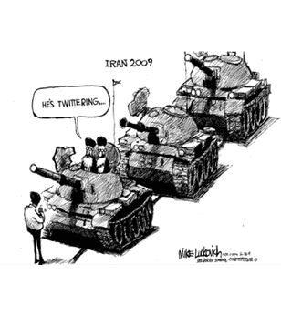
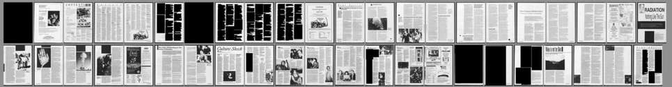
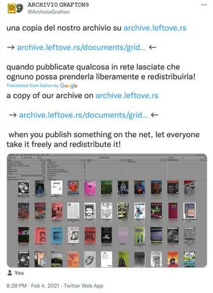
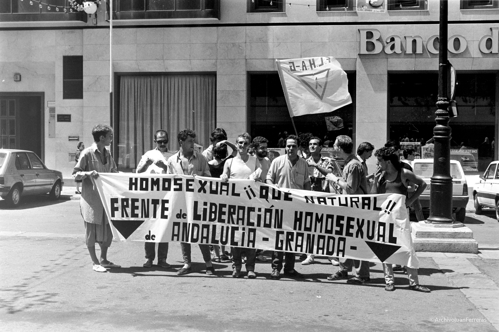
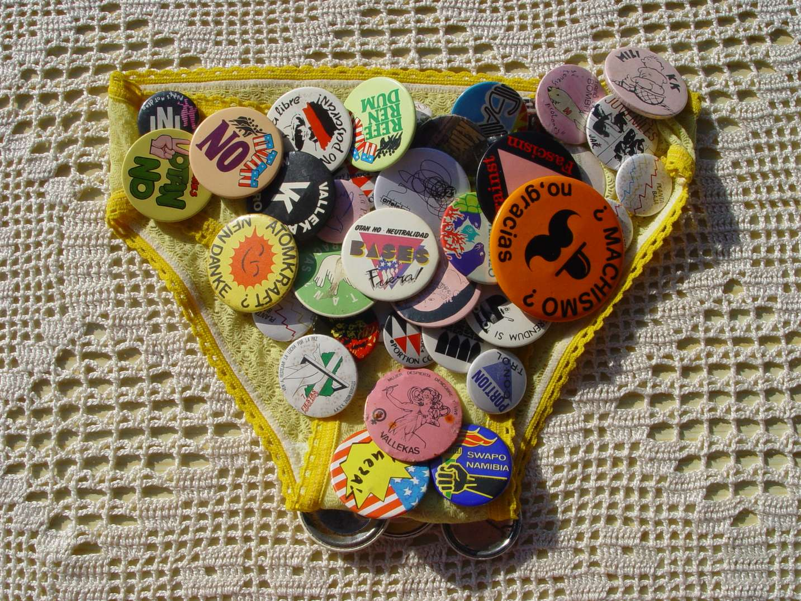
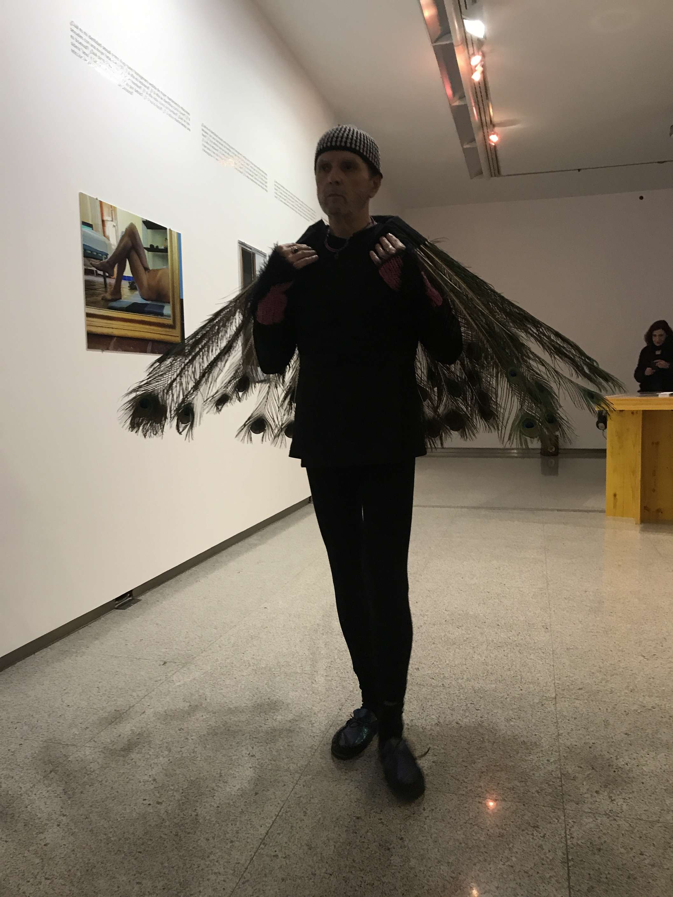

#Archiving Activism in the Digital Age

# Colophon 

INC Theory on Demand #52  
**Archiving Activism in the Digital Age**

**Edited by:** Daniele Salerno and Ann Rigney

**Contributors:** Michelle Caswell, Özge Çelikaslan, Rosemary Grennan, Flore Janssen, Kera Lovell, Eline Pollaert, Ann-Katrine Schmidt Nielsen, Paul van Trigt, Daniel Villar-Onrubia

**Cover design:** Katja van Stiphout  

**Design and EPUB development:** Klara Debeljak, Tommaso Campagna, Erica Gargaglione
 

This project has received funding from the European Research Council
(ERC) under the grant agreement 788572 (Remembering Activism: The
Cultural Memory of Protest in Europe) and from the European Union’s
Horizon 2020 Marie Sklodowska-Curie Actions under grant agreement 840302
(MemoRights – Cultural Memory in LGBT Activism for Rights).

 
Published by the Institute of Network Cultures, Amsterdam 2024.

ISBN: 9789083328287

**Contact:** Institute of Network Cultures  
Amsterdam University of Applied Sciences (HvA)

**Email:** info@networkcultures.org  
**Web:** [www.networkcultures.org](www.networkcultures.org)

Order a copy or download this publication for free at: 
 
www.networkcultures.org/publications

Subscribe to the INC newsletters:  
[www.networkcultures.org/newsletter](www.networkcultures.org/newsletter)  
[www.networkcultures.org/viralimageculture](www.networkcultures.org/viralimageculture)

This publication is licensed under the Creative Commons Attribution
NonCommercial ShareAlike 4.0 Unported (CC BY-NC-SA 4.0). To view a copy of this license, visit
[www.creativecommons.org/licences/by-nc-sa/4.0./](www.creativecommons.org/licences/by-nc-sa/4.0./).

# TABLE OF CONTENTS

<a href='ch003.xhtml'> Archiving Activism in the Digital Age: Introduction, *Ann Rigney and Daniele Salerno*</a>

<a href='ch004.xhtml'>Bak.ma: the Making of an Activist Digital Media Archive, *Özge Çelikaslan*</a>

<a href='ch005.xhtml'>Mayday Rooms: Building Archival Resources for Contemporary Movements, *Rosemary Grennan*</a>

<a href='ch006.xhtml'>From People's Parks to the People's Archive: Power, Identity, and the Right to Representation in the Media since the 1960s, *Kera Lovell*</a>

<a href='ch007.xhtml'>Vibrant Archives. Archiving Afghan Exile Art and Activism on Instagram, *Ann-Katrine Schmidt Nielsen*</a>

<a href='ch008.xhtml'>Archiving Art-Activism in Postdigital Times: the Miguel Benlloch Archive, *Daniel Villar-Onrubia*</a>

<a href='ch009.xhtml'>Archiving Dutch Disability Activism: What Can Digital Culture Do?, *Eline Pollaert and Paul van Trigt*</a>

<a href='ch010.xhtml'>Challenging Oppressive Legacies Through Archival Praxis in the Digital Age, *Flore Janssen*</a>

<a href='ch011.xhtml'>Afterword: Corollary Records, Precarity and Care, *Michelle Caswell*</a>

# 01. ARCHIVING ACTIVISM IN THE DIGITAL AGE: INTRODUCTION

### ANN RIGNEY AND DANIELE SALERNO

## Memory and activism

  

 

At first sight, the phrase ‘So that this is not forgotten’ (in Spanish:
‘Para que esto no se olvide’) seems more appropriate to the hard marble
of a war memorial than to a thin sticky note. But it is precisely that
phrase in all its resonance which is used in the above image with
reference to 15M, the Spanish anti-austerity movement that played out in
the cities of Spain in the spring of 2011. More precisely, it is used
with reference to the archive of 15M, which is presented as a bulwark
against forgetting something that deserves to be remembered.

This amateurish composition of words and images now serves as the cover
of the digital booklet that compiles the minutes of meetings held
between 2011 and 2017 to create an archive documenting what happened in
those eventful days of protests.[^03Chapter1_1] The archive was first named
‘Acampada Sol’, after the occupation of the central square of Puerta del
Sol in Madrid. Later on, the archive was renamed 15M, shorthand for 15
May, the day activists occupied the square setting up the encampment
(also hashtagged and nicknamed as \#*AcampaSol*).

The minutes of the first meeting describe how fourteen activists
gathered on 31 May 2011, in a street located a bit apart from the very
heart of the protests, to discuss how to transmit the legacy and
narratives of the demonstrations to future generations. They argued for
putting the question of memory on the movement's agenda by bringing ‘the
idea of heritage to everyone in the *acampada* \[campsite\]’.[^03Chapter1_2] They
discussed how to collect material during the protest and protect it in
case of police intervention. They started imagining how to digitize the
physical material produced by the movement, debating about the very idea
of ‘digital archive’ and whether to collaborate with existing
institutions for preserving the archive for later generations. In short,
activists were already imagining how the ongoing protests would be
remembered in the future and in the long-term, and taking steps to shape
that memory by creating an archive.

Although the 15M occupation lasted just a few weeks, the minutes of the
archiving group cover six years. Their archival lab outlasted the
visible protest by far, indicating that social movements live beyond and
beneath their spectacular and visible waves of contention.[^03Chapter1_3] The
existence of the 15M archive is a reminder that protest movements do not
just have a history (taking place at one particular moment) but also
have afterlives in the form of stories, images, and other material
traces. Until very recently, however, activist mnemonic and archival
labour has flown under the radar of scholars both of social movements
and collective memory.

Ironically, the phrase that argues for the lasting preservation of the
history of the 15M movement is written on a support made for short-lived
reminders (and indeed the words ‘para que’ are already fading). But the
words do persist: digitized and preserved in the 15M Archive, these
vulnerable materials are now available in digital form as the cover
picture for the minutes of the physical archive commission assemblies.

Together with the minutes of their many meetings, the sticky note with
its memorializing message reflects the labour and ambitions of the 15M
archiving group. It also encapsulates many of the issues that readers
will find in this collection of essays: the interplay between
remembering and forgetting, the analogue and the digital, the past and
the unfolding present and future, as these play out in the archiving of
social movements. Whereas the latter are usually seen as
forward-looking, the efforts put into the 15M’s archive, now housed in
the Tres Peces cultural centre in Madrid,[^03Chapter1_4] serves as a reminder that
memory and activism are more intimately entangled than hitherto
surmised; and that archiving has been a way for activists to constitute
themselves as mnemonic communities as well as political actors.

The question how people articulate past, present and future in making
sense of the world has been studied from different perspectives.[^03Chapter1_5] But
how different temporalities play into struggles for social change has,
until quite recently, been a neglected issue in both memory and social
movement studies. Things are changing in both fields. Within memory
studies, our field of research, there have been calls for more attention
to the role of memory in civic life, specifically in political
contention as being at the heart of democratic societies.[^03Chapter1_6] In that
context, the concept of a memory-activism nexus has been proposed[^03Chapter1_7] as
a heuristic framework, entailing the study of the interplay between
*memory activism* (concerted attempts to change dominant narratives),
the *memory of activism* (how later activism is remembered and
transmitted across a variety of cultural forms) and *memory in activism*
(how memory, specifically of earlier movements, informs later ones).
Within social movement studies,[^03Chapter1_8] the ‘movement-memory nexus’ has been
proposed along similar lines.[^03Chapter1_9] Studying the ways in which social
movements are archived, by themselves and by others, promises to add a
new dimension to these discussions. Not just by highlighting archiving
as a specific future-oriented mnemonic practice but one that may, in
certain hands, be considered a specifically activist one. That activist
mnemonic practice doesn’t answer to current definition of ‘memory
activism’, which emphasizes challenges to dominant narratives; here the
mnemonic activism is directed instead towards providing the condition
for activism to be remembered in the future.

Archives – as concept, as cultural phenomenon, and as resource – have
long figured in humanities scholarship, providing a basis for
discussions of their role in activism to which we will return. In social
movement studies, in contrast, archives have hardly figured at all as
media of transgenerational memory transmission. Instead, the idea of a
‘repertoire’ – consisting of models for interaction transmitted by
embodied performances – has been used to explain, not just shared
practices in the present, but also how knowledge of those practices is
carried across time in social movements.[^03Chapter1_10] Crucially, this ‘strong’
understanding of repertoire[^03Chapter1_11] helps explain continuities and changes
in the form taken by contentious actions across generations without
those involved having access to formal archives or archiving
practices.[^03Chapter1_12] Given this emphasis on embodied transmission, social
movement studies have at best looked to (institutional) archives as
historical sources for reconstructing and comparing repertoires of
protest over time and across different locations. This preponderance of
the concept of repertoire in social movement studies explains the
traditional lack of interest in activist recordmaking during protests
and the setting up of archives, by participants and observers, to ensure
that the legacy of protests and social movements is carried over to
future generations. The emerging interest in the role of memory in
activism provides a new context in which to bring alternatives to
embodied transmission into the understanding of continuities across
movements, especially in the digital era.

## Changing notions of the ‘archive’

Archiving has been the subject of intense reflection in multiple
disciplines within the humanities, not all of whom speak the same
language. Michelle Caswell, in an essay called ‘”The Archive” Is Not an
Archives’[^03Chapter1_13] has noted the gap between experts in information
sciences, like herself, who think of archives in the plural as dynamic
sites of knowledge production, and cultural theorists who have tended to
use the term in the singular and with a capital ‘A’ in line with
influential work by Michel Foucault and Jacques Derrida.[^03Chapter1_14] While our
collection is interested above all of the nuts and bolts of archiving in
the plural, it takes from more philosophical approaches some fundamental
insights into the nature of archives in order to frame our understanding
of archiving as a mnemonic practice.

Taking state archives as paradigmatic of all archival projects, Foucault
sees archives as instruments of control, as constituting the ‘condition
of possibility’ of discursive production (‘the archive is first the law
of what can be said’[^03Chapter1_15]). In line with this reasoning but with
different emphases, Derrida then posited ‘the Archive’ as a virtual site
for imagining alternatives to state-sponsored projects of recording; on
the one hand, by dismissing institutional archives as an ultimately
futile and power-driven attempt to fix knowledge in favour of other
forms of knowledge transferred in an ever-renewed form through the
repertoire of embodied practices; on the other hand, by positing the
existence of the ‘an-archive’ as a repository for marginalized
knowledge: every act of selection produces an un-archived remainder
beyond the reach of official records.[^03Chapter1_16]

The role of archives has been persistently flagged in memory studies as
a key factor in cultural memory-making, but it has rarely been studied
in its own right. The exception to this general rule is Aleida Assmann’s
conceptualization of the relationship between ‘archive’ and
‘memory’.[^03Chapter1_17] Although her terminology has slightly shifted over time,
her approach remains based on a fundamental distinction between passive
and active forms of memory, with ‘working memory’ associated with
narratives that are in circulation and ‘storage memory’ associated with
the archival storage of information. The archive, here too associated
with bureaucracy and state power, is based on selected information that
has been deemed important enough to preserve and, although it has not
yet been interpreted and brought into structures of meaning, it has the
potential to be activated – and hence to become active, working and
narrativized – at a later point in time. ‘The archive, therefore, can be
described as a space that is located on the border between forgetting
and remembering, its materials are preserved in a state of latency, in a
space of intermediary storage (*Zwischenspeiche*r)’.[^03Chapter1_18] Against this
background, Assmann argues further that the more that institutionalized
archives are tailor made to match hegemonic narratives (‘canonical
memory’) the more they took on the character of ‘political archives’. In
more democratic societies, in contrast, the archive is ideally
constituted in a more open way as truly ‘historical archives’ that can
become in the long-term a resource for alternative narratives: ‘Where
political archives function as an important tool for power, historical
archives store information which is no longer of immediate use’ and
constitute ‘a kind of “lost-and-found office” for what is no longer
needed or immediately understood’.[^03Chapter1_19]

Assmann’s key contribution here is her understanding of archives as a
form of latent memory, situated between forgetting and remembering,
between raw data and its interpretation and narrativization. Her
distinction between latent and working memory implies that the dynamics
of memory-making are oriented towards the future as well as past even if
that future is, as yet, undetermined or merely aspirational. In this,
she echoes Derrida: ‘\[T\]he question of the archive is not, I repeat, a
question of the past…but rather a question of the future, the very
question of the future, question of a response, of a promise and of a
responsibility for tomorrow. The archive: if we want to know what this
will have meant, we will only know tomorrow’.[^03Chapter1_20] What both theorists
share is a belief that the boundaries of an archive are porous and that
archives are not fortresses but rather changing in their meaning and
composition as part of a larger ecology. This fundamental principle has
been echoed by recent advocates of the ‘living’ archive.[^03Chapter1_21]

For all the value of this basic insight, theoretical approaches to ‘the
archive’ remain very much tied to one model: institutionalised
collections produced by professionals, funded by the state, and hence
linked to issues of power and governance. In the last decades, however,
changes in the very nature of archiving as a cultural phenomenon have
occurred in tandem with new conceptualisations of archiving on the part
of scholars and practitioners that integrate the idea that archives are
dynamic sites and go well beyond this equation between archives and
state-based repositories of written documents. To echo Caswell, ‘”The
Archive” is not an archives’ and state-organised repositories are no
longer (if they ever were) the only act in town. Several inter-related
developments can be flagged here.

These revolve around democratisation and technological innovation. Since
at least the 1960s the idea of ‘a right to (the) archive’ and in general
to ‘a right to memory’ has become more widespread and paved the way for
new historiographical and archival practices aiming for greater
inclusivity. A milestone in this development was the emergence of oral
history as a method to capture histories that were nowhere preserved in
the form of written record and often linked to the experiences of people
without cultural capital who figured only in criminal and medical
records.[^03Chapter1_22] The ‘right to (the) archive’ has also been taken
literally. Archives have been extending the scope of their collecting
practices to become more representative as well as opening up their
collections to the public in the form of exhibitions on the principle
that accessibility and ‘public participation’ should be more central to
their workings. Archiving and curation, conservation and access, have
thus become more closely entangled as institutions have become more
public facing.

Moreover, archiving occurs increasingly outside the framework of
heritage institutions. The number of new citizen-based community
archives is rapidly increasing and such concepts as ‘living archives’,
‘community archives’ and ‘autonomous archives’[^03Chapter1_23] becoming common
currency in critical archival studies.[^03Chapter1_24] Carried in part by skilled
‘pro-ams’,[^03Chapter1_25] community archives have become one of the pillars in
constituting group identity both to its own members and to the outside
world. Its very existence bears witness to the fact the group has had a
history and aspires to a future, and provides ‘evidence for the creation
and continuation of claims to identities and places’[^03Chapter1_26] which is
particularly important for emergent groups seeking to establish or
‘institute’ themselves.[^03Chapter1_27]

In line with this role of archives in constituting publics, theorists
have also increasingly recognised that archival collections are not only
a source of information but can also be a focus for affective investment
and hence a repository of shareable feelings and emotions.[^03Chapter1_28] Indeed,
the very labour involved in collecting, ordering, making accessible, and
caring for the records in the archive acts has been seen as an agent of
community-building especially when the resources being archived are
material ones, hence requiring the physical presence of their guardians
at a designated place.

The value attached to public participation reflects the democratization
that has been affecting many fields of cultural production and, in the
case of archiving, has fostered new ideas about ownership,
stakeholdership, and accountability, and idea that involved citizens
should have the possibility of making their own records about their own
experiences. The downside of this extension of the ‘right to (the)
archive’ means that the relevant know-how (in terms of archival
architecture, metadata, sustainability of access) is not always present
in such initiatives or the relevant infrastructural support. But the
ensuing dilemmas have also been generating new collaborations between
professionals and amateurs in, for example, the formation of community
archives[^03Chapter1_29] with the help of engaged archivists whose role is
conceived more in terms of mediation, public service and outreach than
in terms of the hieratic control of an archive set up and then
‘protected’ by experts from the public at large. Where traditionally
archiving served administration, law, and the writing of history, it is
now also linked to social justice and community-building[^03Chapter1_30] as well as
to public outreach, often in conjunction with the arts. Seen within this
framework, archives have become open-ended and dynamic sites where the
question ‘what is to be preserved’ is continuously being linked to its
societal value in the here and now; and where ‘meaning’ is produced
rather than fixed.[^03Chapter1_31]

More could be said about current theories of archiving both within the
field of information science and humanities at large, but enough has
been hopefully said (1) to definitively dismiss the idea their being a
monolithic ‘archive’ that represents an exclusive and state-sponsored
form of knowledge; (2) to support the idea that we can better think of
*archiving* (note the verbal form) in the plural as a multi-sited and
multi-actorial phenomenon; and (c), that *archiving* operates through
texts, images, objects that are collected and arranged as part of a
future-oriented and, in the case of emergent groups, aspirational mode
of remembrance that is not yet (and may never become) narrative in form.
It’s memory as emergent, as potentiality and as aspiration,[^03Chapter1_32] rather
than as *fait accompli*.

## Activism and the digital

The flourishing of oral history since the 1960s was possible also
because technological innovation made the recording of aural – and later
visual – information more affordable and manageable. Digital technology
has played a similar role in the democratization of archiving practices
outlined above. Since the 1990s, the right to (the) archive found a
powerful tool in the digital and the internet, with their promise of
unlimited and affordable possibilities for storing, reproducing and
making available not only written texts, but also visual, audio, and
audio-visual information. Digitisation in its various facets has meant
that information can be easily replicated but, more importantly, that
control over the means of archival production is no longer the privilege
of institutions but open to all those who care about certain topics or
causes enough to collect information and preserve it for the future.
This has led to the emergence of archives that are supported and
organised by amateurs or off-duty professionals in their role as
committed citizens.

But more fundamentally for our topic here, digitization has changed the
very nature of activism itself by providing new social media platforms
for expressing dissent and mobilizing opposition be that as part of a
movement or as an individual ‘artivist’ in exile with no direct access
to public space (see Ann-Katrine Schmidt Nielsen’s chapter below). The
term ‘media activism’ captures this new arena, which offers new
opportunities for groups who because of disability or geographical
distance have otherwise no easy access to the usual repertoire of
contention to the extent that this relies on physical presence (see
Pollaert and Van Trigt’s chapter below).

Moreover, digitization has also changed the nature of embodied activism.
As Castells has argued, these have become ‘hybrid’: demonstrations are
prepared online, rely on online interactions even as they are being
carried out on-site and, crucially for our topic here, rely on digital
technologies to record their own actions.[^03Chapter1_33] The ease with which
contemporary campaigns can be recorded – with the possibility of
capturing sound, movement, and visuals greatly enhanced – means that
recent protest organically create enormous quantities of images (and
hence generates one of the most important preconditions for archiving:
the availability of information).

The Global Justice movement, starting in the late 1990s with the
protests in Seattle[^03Chapter1_34] and continuing in Genoa in 2001,[^03Chapter1_35] was
arguably the first ‘born digital’ movement[^03Chapter1_36] to integrate digital
recording into the ‘repertoire of contention’. Accordingly, when the
Italian police raided the Social Forum headquarter and media centre
during the protests against the G8 summit in Genoa in July 2001, their
first target was the servers and materials that media activist
organizations – among them Indymedia, a global network of independent
media outlets – had accumulated as evidence of police repression (which
had caused, among other consequences, the death of 23-year-old
demonstrator Carlo Giuliani). The hard disks were seized, and the
computers illegally destroyed. This shows how at the beginning of the
new century, both activists and police were well aware of the power of
digital tools in accumulating evidence against the police and state
repression, with the potential to be later used, in the media, to
counter distortions of the facts and, in court, to obtain justice.
Moreover, recordings such as the video documenting the killing of the
demonstrator Neda Salehi Agha-Soltan in Tehran in 2009, when brought
into circulation in acts of ‘media activism’, feed back into a protest
movement while also creating, thanks to the internet, transnational
networks of solidarity.[^03Chapter1_37]

Mike Lukovitch’s cartoon on the Wave of Green movement in Iran in 2009
illustrates well how the presence of recording devices increasingly
shaped interactions between protesters and police throughout the 2000s.
Reworking the famous photo of the Tankman in Tiananmen Square in 1989,
Lukovitch highlights the role that smartphones and social media
platforms were believed to be playing in the Iranian protests.

 

Beyond their evidentiary function, recordings made by activists also
have a role in helping the latter to tell their own story and in their
own terms as it is unfolding but also in the future. For that to happen,
however, ephemeral materials need to be preserved and made accessible in
the long-term; in other words, archived. It is no coincidence then that
movements have started to set up their own archives and, indeed, to
integrate archiving along with recording in the repertoire of
contention. Memory work is not something that occurs after the fact, but
is already integrate into movements as they anticipate how their actions
may inspire new forms of protest and give the movement and its message
an afterlife.

## Between archiving activists and activist archivists

As mentioned at the beginning of this introduction, self-archiving has
become a way for activists to constitute themselves as mnemonic
communities as well as political actors – witness the work of archiving
committees within 15M, but also in Occupy in the USA, Nuit Debout in
France, the Egyptian Revolution and – as Özge Çelikaslan shows in her
chapter below – in the Gezi Park Protests.[^03Chapter1_38] These initiatives have
in turn led to the emergence of a metadiscourse about archiving and the
importance of ‘movement-memory’[^03Chapter1_39] exemplified by the US-based
Interference Archive[^03Chapter1_40] that aims to provide a virtual hub for
different social movements by collecting post factum materials as well
as exhibiting material online, offering a counterpart to the physical
space of the MayDay rooms discussed by Rosemary Grennan below. Other
websites offer practical advice to activists on how to set up their own
archive.[^03Chapter1_41] To be sure, archiving is not usually the first priority of
those caught up in a protest cycle both because it takes time and energy
away from the struggle at hand, and imagines a moment when that struggle
will belong to the past. When movements run out of steam or are forced
off the streets, however, cultivating its memory through archiving may
be the only form of survival possible.

Activist archiving has a ‘constitutive’ function, to use Stuart Hall’s
term.[^03Chapter1_42] It provides evidence of the movement’s existence and its
action: to the movement itself and to the outside world. In the process,
it defines its legacy in its own terms rather than those of the
mainstream media which tends to emphasize the issue of law and order
rather than the movement’s experiences and aspirations.[^03Chapter1_43]
Self-archiving, finally, allows for the movement to ‘stay on message’
for its own supporters as they seek to imagine the movement as a whole
from the ground up; but also, most importantly, for later
generations.[^03Chapter1_44] Struggles to control the narrative occur as events are
unfolding but are also prolonged in struggles about how best to remember
it. Having one’s own archive offers a bulwark against absorption into
hegemonic narratives and a bolthole for keeping alive the memory of the
hopes that inspired the movement. Claiming the title 'archive' can give
greater authority and credibility to a group's materials and, by
extension, their knowledge.[^03Chapter1_45]

Rebecka Taves Sheffield recently suggested that archives serve as
abeyance structures for social movements,[^03Chapter1_46] while Phil Cohen[^03Chapter1_47] has
compared them poetically to Noah’s Ark in that they keep a movement’s
energy in place until such time as a later generation will reactivate
it: ‘Under these circumstances the drive to archive, to construct a
little ark of political covenant in the hope that at some future date,
it may be opened under/more hospitable circumstances, is correspondingly
intense’.[^03Chapter1_48] This drive towards archiving activism with an eye to its
future influence brings memory work and activism into a very close
alliance: archiving in such circumstances becomes an integral part of
political action. It creates the conditions for the protest to have an
afterlife in memory, hence giving it the potential to become a source of
inspiration in the future. The images collected in the 15M archive were
mainly taken from the perspective of the precariat involved rather than
from the helicopter perspective of the authorities,[^03Chapter1_49] thus
constituting a sensorium for re-experiencing the event as well as
lasting evidence of its worthiness, unity, numbers and commitment or
what Tilly has called a movement’s WUNC.[^03Chapter1_50]

One way or another, archiving has become such a significant part of
recent social movements that skills in recordmaking and recordkeeping is
now seen as a part of the repertoire of contention itself.[^03Chapter1_51] The term
‘archival activism’ reflects the idea that managing the records of a
movement extends that movement, and constitutes a form of activism by
other means.[^03Chapter1_52] Accepting that archiving is part of the protest
repertoire cuts through the opposition between ‘repertoire’ (as embodied
knowledge) and ‘archive’ (as inscripted knowledge) advanced, for
example, by Diana Taylor in her influential book *The Archive and the
Repertoire* (2003), where the intergenerational transmission of the
embodied knowledge of the oppressed is posited as an alternative to the
oppressive state and colonial archive based on written documents.

Reflecting the more general trend towards participatory archiving,
activists have emphasized the importance of communality in the
constitution of their archive as an extension of the horizontality of
their politics. In the words of a member of the group responsible for
archiving the Occupy Wall Street (OWS) movement: ‘What better way to
make the archive accountable to the people than to make the people
accountable for the archive?’.[^03Chapter1_53] Alongside the idea that an archive
should be a shared ‘commons’, is the commitment that it should be made
by and for the activists themselves. Accordingly, ‘autonomous
archiving’[^03Chapter1_54] has become an important principle, autonomous meaning in
this instance freedom from all interference from outside the movement
itself (something of especial importance in cases, such as the Turkish
one, in which police surveillance is an ongoing concern). Part of that
autonomy, again reflecting a commitment to the commons, is to use open
source platforms. ‘Each of these activist archives does more than
collect; they also enact the politics of their communities’.[^03Chapter1_55]

Nevertheless, autonomy is not necessarily an easy or sustainable option
(see in this volume the chapter by Özge Çelikaslan). The tension between
autonomy and expertise, mentioned earlier in relation to community
archives, plays out in an acute way in the case of social movements. As
Message shows with respect to OWS, suspicion of parasitic cultural
institutions eager to collect memorabilia with a view to exhibiting
them, fear of the consequences of cooperation with existing institutions
for the status of the materials collected fed into the desire for
autonomy.[^03Chapter1_56] As Kera Lovell shows below in relation to the People’s
Park movement, the possibility of making digital copies of vulnerable
materials has greatly assisted efforts to preserve the memory of a
movement despite the indifference of institutions. And yet, without
professional and institutional support – be that an existing heritage
institution or an one set up by activists themselves – it may be hard to
preserve and manage vulnerable materials over a longer period. Since a
large part of activism is embodied and performative, capturing it in the
form of digital records is a challenge in itself and requires
considerable expertise, as is brought out below in Daniel
Villar-Onrubia’s contribution to our collection.

The challenge is not just one of getting access to that expertise, but
also of accessing resources. Material archives require physical storage
space and suitable conditions for the preservation of vulnerable
documents and banners. Digital archives also require significant
investment in virtual storage space: the 858.ma archive of the Egyptian
revolution includes thousands of hours of footage, for example, which,
if it is to be preserved and legible in the long-term, will need
financial as well as technical support. Moreover, the lack of continuity
between one protest wave and another can lead to discontinuous
stakeholdership: the mnemonic community supporting the archive may
dissolve after the mobilization has passed whereas the archive itself
aims to provide a long-term perspective on a particular movement.

The tension between institutions and ‘rogues’, and how to resolve it, is
one of the red threads in our collection. Solutions include cooperation
with institutions that have a track record in providing a home for
archives of activism, be they made from within a movement as it is
unfolding or post-hoc collected by allies. In contrast to the
caricatural linking of ‘the archive’ to oppressive state power, an
exploration of the variety of archives in practice points to the
existence of friendly institutions with a mission to provide the
sustainable infrastructure for preserving the memory of social
movements. Cases in point are the Taminant library at New York
University, where the archives of OWS were deposited after much debate;
the International Institute for Social History in Amsterdam and the
Bishopsgate Library in London, which have a long track record in the
preservation of materials related to oppositional movements; and the
Centro de Documentación e Investigación de la Cultura de Izquierdas
(CeDInCI) in Buenos Aires, which is devoted to the preservation of
materials produced by Latin American Left movements. One should also
note the existence of cultural centres such as the May Day Rooms (see in
this volume Rosemary Grennan’s essay) which, in being devoted to the
archiving of multiple movements, offer a measure of institutional
stability within a changing activist landscape. According to Phil Cohen,
such ‘living archives’ of past protest are important sites for bringing
people together and for the slow gestation of new movements through the
labour of collecting materials and making them available at locations
where people can meet.[^03Chapter1_57]

The existence of the institutions mentioned above raises yet another
question; namely, how far do and should professional archivists go in
assuming the role of activist so as to ensure that the records of
oppositional movements are preserved and interpreted? The answer in part
will lie with the mission of the institution within which the archivist
is operating and the degree to which it is committed to promoting the
memory of particular traditions (as expressed, for example, in the title
of the Center for the Documentation and Research of Left-wing Culture
based in Buenos Aires). As indicated earlier, new forms of collaboration
between archivists and citizens have been emerging in tandem with
critical soul-searching as to whether professionalism in archiving is
compatible with commitment to causes. In their survey of these complex
debates, Flinn and Alexander distinguish between *archiving activism*,
the collection and documentation of political and social movement
material; *activist archiving,* the making of archives as an integral
part of political activism; and *archival activism*, where the archive
itself is the focus of campaigning.[^03Chapter1_58] The latter is illustrated by
activism for access rights to state archives in the transition from
dictatorship to democracy in Latin American countries.[^03Chapter1_59] It is
illustrated here, from a different perspective, in the chapter by Eline
Pollaert and Paul van Trigt which shows, with reference to the
Netherlands, how archiving disability history and disability activism is
itself a crucial step towards greater visibility and empowerment on the
part of a group for whom access to public space is not self-evident.

The debates on the relation between professional archiving activism are
ongoing, as Flore Janssen reminds us in her essay. This collection does
not come down on one side or another. But it hopes to have mapped this
rocky terrain, showing both the complex interactions between activism
and archiving, and the importance of memory to the long-term impact of
social movements.

## Outlines of the book

As demonstrated by the minutes of the 15M activists mentioned earlier,
archiving the cultural memory of protests entails making a series of
decisions regarding what materials should be preserved and how the
information should be organized, and made accessible. These decisions
constitute what we can call the *politics of archiving*. In this
decision-making process, designing the *archive media ecology* and
determining the role of the digital in transforming the cultural
production of social movements into available archival records is
crucial for the very existence of an archive.

In the opening essay, Özge Çelikaslan describes the difficult task of
translating the politics of archiving into its material architecture.
Çelikaslan analyzes the case of Bak.ma, an archive that originated
during the 2013 Gezi Park protests in Turkey. During the protests,
activists occupied and turned Istanbul's park into a protest camp to
resist the urban development plan of the area and police violence.
Protests spread throughout the country, with parks becoming places where
people gathered to discuss and oppose police violence. Çelikaslan
personally took part in the protests and documented events as a member
of the activist media collective Videoccupy. From this frontline
position, Çelikaslan describes how media activists recorded protests and
collected and secured material recorded by demonstrators across the
country. After the protests ended, a group turned their media activism
into archival activism, working together to build an archive where they
could store and share the material collected during the protests.
Çelikaslan describes the archival work that took place after the
dissipation of the protest. She argues that affective bonds and
attachment to the material and events were the primary resources for
sustaining the Bak.ma archive and shaping the Gezi’s afterlife. The
archive gradually also included material from other movements, from
before and after 2013, becoming a point of reference for activism in
Turkey and beyond.

If Çelikaslan describes how activists organize the archiving of material
produced on the ground, Rosemary Grennan, in her chapter on the MayDay
Rooms in the UK, describes how activists conceive archives not just as
by-products of a struggle for a cause, but also as the very cause to
which their activism is directed. The MayDay Rooms is a collective which
emerged in 2014 in response to the austerity and ‘zero tolerance’
policies of the UK government that threatened the capacity of both
institutional and autonomous organizations to preserve and provide
access to radical history and the cultural legacy of past social
movements. The organization collects, describes, arranges, digitizes and
makes material accessible online, providing activists with historical
materials from different social movements. The MayDay Rooms also
organize meetings in which activists can find inspiration in the
archival material and learn to design their own tactics and to archive
their own material. In these meetings and in other initiatives that
Grennan describes in her chapter, activists and archivists can use
archival records as tools for shaping contentious actions in the
present, allowing the transmission, adaptation and cross-fertilization
of knowledge about protests and contentious actions across different
movements and generations. These practices illustrate how activists use
archival records in and for contentious actions in the present,
transforming storage memory into working memory (to recall Assmann’s
distinction). The case of the MayDay Rooms enriches our understanding of
the relationship between activism and archiving as well as of memory
activism, by showing how the feedback mechanism whereby activists
mobilize the legacy of past social movements in seeking inspiration and
models for their own action in the present.

Kera Lovell further explores this feedback mechanism by examining how
different protest waves, decades apart, have sought to revive the legacy
of earlier movements. She does so with reference to the People’s Park
movement, which was active during the late Vietnam War era in the USA
(1960s-70s) and brought activists to occupy vacant lots and transform
them into parks as a means of demonstrating against police brutality,
gentrification, and racism. Protest camps were often short-lived as
police frequently evicted demonstrators after a few days, making the
task of documenting these experiences important but also difficult to
implement. In the 1990s, a new attempt by Berkeley University to build
residential buildings in park areas sparked a new wave of protests,
which found an important symbolic and affective precedent in the
archival material accumulated in the 1970s. In the 2010s, with Occupy,
the legacy of People’s Park movements revived through the digitization
of archival material and its circulation on social media. Archival
records are not merely the material ‘residue’ of past demonstrations and
social movements, Lovell shows, but are active ingredients in later
protests by inspiring and shaping actions in the now. They become tools
for activists willing to take over the baton from earlier movements.

Lovell concludes her analysis by emphasizing how the performative
character of the protest repertoire in the case of the People’s Park
protest made its archiving very difficult. This challenge is not unique
to her case. Tilly compared contentious actions to jazz improvisations
or to ‘the impromptu skits of a troupe of strolling players’[^03Chapter1_60] who
adapt their repertoire to local circumstances.[^03Chapter1_61] So how can archives
capture the performative nature of protests, which resists traditional
recording technologies like writing? Performances are, in fact,
ephemeral by nature and pose a series of epistemological and technical
challenges to the archivist, which the digital may help resolve.
Ann-Katrine Schmidt Nielsen and Daniel Villar-Onrubia reflect in their
essays on these dilemmas but bring them back to their non-metaphorical
domain: the use of the performing arts for the articulation of dissent.

In his analysis, Schmidt Nielsen takes as her point of departure the use
of Instagram by three exiled Afghan artists: Kubra Khademi, Shamsia
Hassani, and Rada Akbar. The author argues that social media platforms
may work as a platform for archiving activism, allowing artists under
the threat of dictatorial regimes to document, reproduce, and distribute
their work; furthermore, she argues, social media are not just a means
of reproduction and distribution, but also shape aesthetic practice by
providing an infrastructure for materializing an archive of feeling (to
recall Ann Cvetkovich). Since the return of the Taliban regime in August
2021, the Instagram profiles of Khademi, Hassani, and Akbar serve as
archives for their artistic work and for defying Taliban repression.
Hassani, a street artist, used Instagram to document the erasure of her
work in Kabul by the Taliban. Khademi works on urban space by replacing
the plaques naming streets after soldiers and past battles with ones
recalling women activists and uses Instagram to record her performances
for a broader audience. Akbar, who fled Afghanistan after the return of
the Taliban, made her Instagram stories available as a thematic
collection in her profile, documenting the daily life of an Afghan woman
before the return of the Taliban regime. These records are defiant acts
of ‘resistant’ memory against the return of the Taliban regime.

In the following chapter, Villar-Onrubia examines the digital archive of
the Spanish activist and artist Miguel Benlloch. Born in 1954, Benlloch
was involved in various groups and movements, such as the Communist
movement, the Revolutionary Youth of Andalusia, the Homosexual
Liberation Front of Andalusia, and the Andalusian pacifist and anti-NATO
movement. Because of his activism, Benlloch's archive serves as a prism
through which to view post-dictatorship Spain as well as the transition
from pre-digital media scarcity to post-digital media abundance. As a
scholar and practitioner personally engaged in archiving Benlloch’s
cultural production, Villar-Onrubia articulates long-debated ontological
issues (for example, is it possible to distinguish between original and
copy in a performance?) with the material circumstances and technical
options that arise in the (digital) archiving process. Benlloch's
political engagement was expressed through his artistic work, which
included both performance and creative slogans as a way of acting out
dissent. Archiving his cultural production poses a challenge,
particularly with regards to preserving and providing access to his
ephemeral performances. Despite these challenges, Benlloch recognized
the importance of organizing and archiving his work for future
generations. Today, Archivomiguelbenlloch.net serves as a central and
permanent node for accessing and connecting the artist's legacy across
various online and on-site locations. Villar-Onrubia details the
practical steps taken to address the challenges of archiving
performances, ultimately providing Benlloch's legacy with a digital
home.

The cases discussed by Schmidt Nielsen and Villar-Onrubia show how the
digital not only connects different publics online and on-site, but also
enables performances to be archived and thus to be made available and
visible despite their being ephemeral, for aesthetic reasons (e.g.
Benlloch’s artistic practices) or because of political constraints (e.g.
Afghanistan under the Taliban). The question of visibility returns also
in the chapter by Eline Pollaert and Paul van Trigt on disability
activism. The authors emphasize that the traditional image of activism
as made of in-person mass gatherings makes other forms of activism
invisible. This is especially the case with disability activism since
disabled activists may not have access to physical protests, and their
online activism is often dismissed as 'armchair activism'. As a result,
disability activism is not recognized as a form of political engagement
that calls for archiving.

After analyzing these pitfalls, Pollaert and van Trigt go on to explore
how digital tools can support the archiving of disability activism and
make it more visible. They discuss how digital tools can facilitate
activists and self-archiving processes, connect archival materials to a
broader audience, and create new archival/archivable material and
activist networks. Nevertheless, the authors note some persistent
problems: the lack of time and resources for use in archiving; the
tendency of disabled activists to prioritize actions in the now over
archiving the records of the movement their cultural production, the
lack of continuity in the maintenance and ownership of the digital
platforms used for preservation and transmission. The authors explore in
this light the challenges and opportunities offered by the digital for
disability activism with reference to three case studies: the disability
justice collective Feminists Against Ableism, the website DisPLACE.nl,
and a community project with the Kreukelcollectief (Crinkle Collective)
on eugenics.

While the digital can be a tool for promoting inclusivity and reshaping
activism, Flore Janssen notes in her chapter that it is also a
double-edged sword. Archival practices are rooted in social hierarchies,
and many principles of archival praxis were set in administrative
manuals, such as the Dutch Manual, written in colonial times, reflecting
assumptions that privilege those in power. The author argues that the
use of the digital may simply perpetuate inequalities and injustice.
Analyzing the concepts of ‘active archiving’ and ‘archival activism’,
Janssen highlights the importance of critically assessing how
collections perpetuate social injustice before implementing digital
tools, and of acknowledging personal positionality in the archival
profession. She then goes on to discuss one of the most significant
innovations, facilitated by the digital, in archives' mission:
postcustodialism. Janssen explains that simply digitizing catalogs and
records to make them findable online is not enough for democratizing
archives and offers examples of good practices in which digitization
serves social justice and democracy, such as the South Asian American
Digital Archive and the Early Caribbean Digital Archive. These
initiatives challenge some of the oppressive and gatekeeping structures
of existing systems and institutions and seek to expand archival record
to include marginalized voices and experiences.

Mention of the South Asian American Digital Archive (SAADA) brings us to
the end of the volume, with an afterword signed by the co-founder of
SAADA and prominent scholar in critical archival studies: Michelle
Caswell. In her reflection, Caswell engages with our topic from an
outspoken position as an activist archivist. How can archives be
constituted and mobilized as resources to combat inequality in the
present? How can they be used in the service of what she calls
‘liberatory memory work’? In a thought-provoking move, she creates a
continuum between the work of the archivist in caring for precarious
records to the politics of care for the precarious in today’s world. In
this way, she reminds us that creating better infrastructures for
recording the past and present will be a key element in the creation of
better futures.

As scholars in the field of memory studies, our approach in this
collection is grounded in the belief that understanding the relation
between archiving and activism in the digital age requires collaboration
and dialogue among researchers, activists, and archivists. Our intention
is to bring together diverse perspectives, experiences, and backgrounds
in order to facilitate a rich and productive exchange of both
theoretical and empirical knowledge. Whether readers approach this
collection with practical concerns, such as how to build a digital
archive for activism, or more theoretical questions about the role of
archiving in protest and activism, our hope is that this book will
provide answers and useful suggestions. Exhaustiveness was not our aim.
What we hope, more importantly, is to inspire new questions and open up
new areas of common interest, exploration and collaboration among
scholars and practitioners interested in cultural memory, archiving and
social movements.

## References

Appadurai*,* Arjun*.* ‘Archive and Aspiration’ in Joke Brouwer and Arjen
Mulder (eds), *Information Is Alive*, Rotterdam: V\_2, 2003, 14–25.

Archivo 15M. *Recopilación de las Actas de la Comisión de archivo físico
de Acampada Sol, luego renombrada como Archivo15M*, Madrid: Archivo 15M,
2022*.*

Artikişler Collective (Özge Çelikaslan, Alper Şen, Pelin Tan) (ed).
*Autonomous Archiving*, Barcelona: DPR, 2016.

Assmann, Aleida. *Erinnerungsräume: Formen und Wandlungen des
kulturellen Gedächtnisses*, München: C.H. Beck Verlag, 1999.

Assmann, Aleida. ‘Canon and Archive’ in Astrid Erll and Ansgar Nünning
(eds), *Cultural Memory Studies: An International and Interdisciplinary
Handbook,* Berlin: de Gruyter, 2008, 97–107.

Assmann, Aleida and Assmann, Corinna. ‘Neda: The Career of a Global
Icon’ in Aleida Assmann and Sebastian Conrad (eds), *Memory in a Global
Age: Discourses, Practices and Trajectories*, Basingstoke: Palgrave
Macmillan, 2010, 225–242.

Berger, Stefan, Scalmer, Sean and Wicke, Christian (eds). *Remembering
Social Movements: Activism and Memory*. London-New York: Routledge,
2021.

Castells, Manuel. *Networks of Outrage and Hope: Social Movements in the
Internet Age*. Cambridge: Polity Press, 2012.

Caswell, Michelle. 'The Archive' is not an Archives: On Acknowledging
the Intellectual Contributions of Archival Studies’, *Reconstruction:
Studies in Contemporary Culture* 16.1 (2016): n.p.

Caswell, Michelle. *Urgent Archives: Enacting Liberatory Memory Work*,
London-New York: Routledge, 2021.

Caswell, Michelle, Migoni, Alda, Allina, Geraci, Noah and Cifor, Marika.
‘“To Be Able to Imagine Otherwise”: Community Archives and the
Importance of Representation’, *Archives and Records* 38.1 (2017): 5–26.

Caswell, Michelle, Punzalan, Ricardo and Sangwand, T-Kay. ‘Critical
Archive Studies: An Introduction’, *Journal of Critical Library and
Information Studies* 1.2 (2017): 1–8.

Chidgey, Red. ‘How to Curate a “Living Archive”: The Restlessness of
Activist Time and Labour’ in Samuel Merrill, Priska Daphi and Emily
Keightley (eds), *Social Movements, Cultural Memory and Digital Media*,
Cham: Palgrave Macmillan, 2020, 225–248.

Cohen, Phil. *Archive That, Comrade: Left Legacies and the Counter
Culture of Remembrance*, Oakland: PM Press, 2018.

Cvetkovich, Ann. *An Archive of Feelings: Trauma, Sexuality, and Lesbian
Public Cultures*, Durham, NC: Duke University Press, 2003.

Daphi, Priska. *Becoming a Movement: Identity, Narrative and Memory in
the European Global Justice Movement*, London: Rowman and Littlefield,
2017.

Daphi, Priska and Zamponi, Lorenzo. ‘Exploring the Movement-Memory
Nexus: Insights and Ways Forward’, *Mobilization: An International
Quarterly* 24.4 (2019): 399–417.

Da Silva Catela, Ludmila and Jelin, Elizabeth (eds). *Los archivos de la
represión: documentos, memoria y verdad*, Buenos Aires: Siglo XXI, 2002.

De Kosnik, Abigail. *Rogue Archives: Digital Cultural Memory and Media
Fandom*. Cambridge, MA: MIT Press, 2016.

Della Porta, Donatella (ed). *The Global Justice Movement.
Cross-National and Transnational Perspectives*, London-New York:
Routledge, 2007.

Della Porta, Donatella. ‘Repertoires of Contention’ in David A. Snow,
Donatella della Porta, Bert Klandermans and Doug McAdam (eds), *The
Wiley-Blackwell Encyclopedia of Social and Political Movements*,
Hoboken: Blackwell Publishing, 2013, 1–3.

Della Ratta, Donatella, Kay, Dickinson and Haugbolle, Sune (eds). *The
Arab Archive: Mediated Memories and Digital Flows*, Amsterdam: Institute
of Network Cultures, 2020.

Derrida, Jacques. *Archive Fever: a Freudian Impression*, Chicago and
London: The University of Chicago Press, 1996 \[1995\].

Egea, Juan F. ‘Square Photography: Picture Taking and Archival Activism
in 15M’, *Journal of Spanish Cultural Studies* 23.2 (2022): 181–196.

Flinn, Andrew and Alexander, Ben. ‘”Humanizing an Inevitability
Political Craft”: Introduction to the Special Issue on Archiving
Activism and Activist Archiving’, *Archival Science* 15 (2015): 329–335.

Flinn, Andrew, Stevens, Mary and Shepherd, Elizabeth. ‘Whose Memories,
Whose Archives? Independent Community Archives, Autonomy and the
Mainstream’, *Archival Science* 9 (2009): 71–86.

Foucault, Michel. *The Archeology of Knowledge*, London-New York:
Routledge, 2002 \[1969\].

Gillan, Kevin. ‘Temporality in Social Movement Theory: Vectors and
Events in the Neoliberal Timescape’, *Social Movement Studies* 19
(2020): 516–536.

Gilliland, Anne J., McKemmish, Sue and Lau, Andrew J. (eds). *Research
in the Archival Multiverse*, Melbourne: Monash University Publishing,
2017.

Gutman, Yifat. *Memory Activism: Reimagining the Past for the Future in
Israel-Palestine*, Nashville, TN: Vanderbilt University Press, 2017.

Gutman, Yifat and Wüstenberg, Jenny (eds). *The* Routledge *Handbook of
Memory Activism,* London-New York: Routledge, 2023.

Hall, Stuart. ‘Constituting an Archive’. *Third Text*, 54 (2001): 89–92.

Koselleck, Reinhart. *Futures Past. On the Semantics of Historical
Times*, New York: Columbia University Press, 2004.

Liebermann, Yvonne. ‘Born Digital: The Black Lives Matter Movement and
Memory After the Digital Turn’, *Memory Studies* 14.4 (2021): 713–732.

MacNeil, Heather and Eastwood, Terry. ‘Introduction: Shifting Currents’
in Heather MacNeil and Terry Eastwood (eds), *Currents of Archival
Thinking*, Santa Barbara, CA and Denver, CO: Libraries Unlimited, 2017,
vii–xiii.

Message, Kylie. *Collecting Activism, Archiving Occupy Wall Street*,
London-New York: Routledge, 2019.

Moore, Shaunna and Pell, Susan. ‘Autonomous Archives’, *International
Journal of Heritage Studies* 16.4 (2010): 255–268.

Pell, Susan. ‘Radicalizing the Politics of the Archive: An Ethnographic
Reading of an Activist Archive’. *Archivaria* 80 (2015): 33–57.

Perks, Robert and Thomson, Alistair (eds). *The Oral History Reader*,
London-New York: Routledge, 2003.

Proglio, Gabriele. *I fatti di Genova. Una storia orale del G8*, Roma:
Donzelli, 2021.

Ramsay, Debra. ‘Tensions in the Interface. The Archive and the Digital’
in Andrew Hoskins (ed), *Digital Memory Studies. Media Pasts in
Transition*, London-New York: Routledge,280–302, 2017.

Rigney, Ann. ‘Memoryscapes in Activism: The Commonweal, 1885-1894’,
unpublished manuscript.

Rigney, Ann. ‘Things and the Archive: Scott's Materialist Legacy’,
*Scottish Literary Review* 7.2 (2015): 13–34.

Rigney, Ann. ‘Remembering Hope: Transnational Activism beyond the
Traumatic’, *Memory Studies* 11.3 (2018): 368–380.

Salerno, Daniele. ‘An Instituting Archive for Memory Activism: The
Archivo de la Memoria Trans de Argentina’, *Memory Studies* (2023):
1–17.

Salerno, Daniele and Lozano, Jorge. ‘Future. A Time of History’,
*Versus* 131 (2020): 189–206.

Sellie, Alycia, Goldstein, Jesse, Fair, Molly and Hoyer, Jennifer.
‘Interference Archive: A Free Space for Social Movement Culture’,
*Archival Science* 15 (2015): 453–472.

Sheffield, Rebecka Taves. *Documenting Rebellions: A Study of Four
Lesbian and Gay Archives in Queer Times*, Sacramento: Litwin Books,
2020.

Taylor, Diana. *The Archive and the Repertoire: Performing Cultural
Memory in the Americas*, Durham, NC: Duke University Press, 2003.

Tilly, Charles. *Contentious Performances*, Cambridge: Cambridge
University Press, 2008.

Tilly, Charles and Tarrow, Sidney. *Contentious Politics*. Oxford:
Oxford University Press, 2015 (2nd ed.).

Tilly, Charles and Wood, Lesley J. *Social Movements, 1768-2012*,
London-New York: Routledge, 2016.

Tilly, Charles. ‘Contentious Repertoires in Great Britain, 1758-1834’ in
Mark Traugott (ed), *Repertoires and Cycles of Collective Action*,
Durham, NC: Duke University Press, 1995: 15–42.

Treré, Emiliano. *Hybrid Media Activism: Ecologies, Imaginaries,
Algorithms*, London-New York: Routledge, 2019.

Weld, Kirsten. *Paper Cadavers. The Archives of Dictatorship in
Guatemala*, Durham and London: Duke University Press, 2014.

Wüstenberg, Jenny. *Civil Society and Memory in Post-War Germany*,
Cambridge: Cambridge University Press, 2017.

Zamponi, Lorenzo. *Social Movements, Memory and Media: Narrative in
Action in the Italian and Spanish Student Movements*. Cham: Palgrave
Macmillan, 2018.

Zamponi, Lorenzo. ‘\#ioricordo, Beyond the Genoa G8: Social Practices of
Memory Work and the Digital Remembrance of Contentious Pasts in Italy’
in Samuel Merrill, Priska Daphi and Emily Keightley (eds), *Social
Movements, Cultural Memory and Digital Media*, Cham: Palgrave Macmillan,
2020, 141–171.

[^03Chapter1_1]: Archivo 15M, *Recopilación de las Actas de la Comisión de archivo
    físico de Acampada Sol, luego renombrada como Archivo15M,* Madrid:
    Archivo 15M, 2022.

[^03Chapter1_2]: Archivo 15M, *Recopilación*, 4.

[^03Chapter1_3]: Kevin Gillan, ‘Temporality in Social Movement Theory: Vectors and
    Events in the Neoliberal Timescape’, *Social Movement Studies* 19
    (2020): 516–536.

[^03Chapter1_4]: Discussed in Juan F. Egea, ‘Square Photography: Picture Taking and
    Archival Activism in 15M’, *Journal of Spanish Cultural Studies*
    23.2 (2022): 181–196.

[^03Chapter1_5]: See the classic Reinhart Koselleck, *Futures Past. On the
    Semantics of Historical Times*, New York: Columbia University Press,
    2004. More recently, a reflection on the articulation between past
    and future temporalities in texts is offered in Daniele Salerno and
    Jorge Lozano, ‘Future. A Time of History’, *Versus* 131 (2020):
    189–206; an analysis of how this articulation plays a fundamental
    role in activism is offered in []{#_Hlk134185790 .anchor}Ann Rigney,
    ‘Memoryscapes in Activism: The Commonweal, 1885-1894’, unpublished
    mss.

[^03Chapter1_6]: Yifat Gutman, *Memory Activism: Reimagining the Past for the
    Future in Israel-Palestine*. Nashville, TN: Vanderbilt University
    Press, 2017; Jenny Wüstenberg, *Civil Society and Memory in Post-War
    Germany*, Cambridge: Cambridge University Press, 2017.

[^03Chapter1_7]: Ann Rigney, ‘Remembering Hope: Transnational Activism Beyond the
    Traumatic’, *Memory Studies* 11.3 (2018): 368–380.

[^03Chapter1_8]: Priska Daphi and Lorenzo Zamponi, ‘Exploring the Movement-Memory
    Nexus: Insights and Ways Forward’, *Mobilization: An International
    Quarterly* 24.4 (2019): 399–417.

[^03Chapter1_9]: More recent publications adding to our knowledge of this nexus
    include Stefan Berger, Sean Scalmer and Christian Wicke (eds),
    *Remembering Social Movements: Activism and Memory*, London-New
    York: Routledge, 2021; Yifat Gutman and Jenny Wüstenberg (eds), *The
    Routledge Handbook of Memory Activism*, London-New York: Routledge,
    2023.

[^03Chapter1_10]: Charles Tilly, *Contentious Performances*, Cambridge: Cambridge
    University Press, 2008.

[^03Chapter1_11]: Charles Tilly, ‘Contentious Repertoires in Great Britain,
    1758-1834’ in Mark Traugott (ed), *Repertoires and Cycles of
    Collective Action,* Durham, NC: Duke University Press, 1995, 27.

[^03Chapter1_12]: According to Tilly a ‘strong’ understanding of repertoire
    implies: ‘(a) social relations, meanings, and actions cluster
    together in known, recurrent patterns and (b) many possible
    contentious actions never occur because the potential participants
    lack the requisite knowledge, memory, and social connections’.
    Tilly, ‘Contentious Repertoires’, 27.

[^03Chapter1_13]: Michelle Caswell, ‘”The Archive” Is Not an Archives: On
    Acknowledging the Intellectual Contributions of Archival Studies’,
    *Reconstruction: Studies in Contemporary Culture* 16.1 (2016): n.p.
    See also Anne J. Gilliland, Sue McKemmish and Andrew J. Lau (eds),
    *Research in the Archival Multiverse*, Melbourne: Monash University
    Publishing, 2017.

[^03Chapter1_14]: Jacques Derrida, *Archive Fever: a Freudian Impression*, Chicago
    and London: The University of Chicago Press, 1996. Michel Foucault,
    *The Archeology of Knowledge*, London-New York: Routledge, 2002
    \[1969\].

[^03Chapter1_15]: Foucault, *The Archeology of Knowledge*, 145.

[^03Chapter1_16]: See Diana Taylor, *The Archive and the Repertoire: Performing
    Cultural Memory in the Americas*, Durham, NC: Duke University Press,
    2003.

[^03Chapter1_17]: Aleida Assmann. *Erinnerungsräume: Formen und Wandlungen des
    kulturellen Gedächtnisses*. München: C.H. Beck Verlag, 1999:
    342–347.

[^03Chapter1_18]: Aleida Assmann, ‘Canon and Archive’ in Astrid Erll and Ansgar
    Nünning (eds), *Cultural Memory Studies: An International and
    Interdisciplinary Handbook,* Berlin: de Gruyter, 2008, 103.

[^03Chapter1_19]: Assmann, ‘Canon and Archive’, 102 and 106.

[^03Chapter1_20]: Derrida, *Archive Fever*, 36

[^03Chapter1_21]: Stuart Hall, ‘Constituting an Archive’. *Third Text*, 54 (2001):
    89–92; Phil Cohen, *Archive That, Comrade: Left Legacies and the
    Counter Culture of Remembrance*, Oakland: PM Press, 2018; Red
    Chidgey, ‘How to Curate a “Living Archive”: The Restlessness of
    Activist Time and Labour’ in Samuel Merrill, Priska Daphi and Emily
    Keightley (eds), *Social Movements, Cultural Memory and Digital
    Media*, Cham: Palgrave Macmillan, 2020, 225–248.

[^03Chapter1_22]: Robert Perks and Alistair Thomson (eds), *The Oral History
    Reader*, London-New York: Routledge, 2003; Debra Ramsay, ‘Tensions
    in the Interface. The Archive and the Digital’ in Andrew Hoskins
    (ed), *Digital Memory Studies. Media Pasts in Transition*,
    London-New York: Routledge, 294.

[^03Chapter1_23]: Hall, ‘Constituting an Archive’; Andrew Flinn and Ben Alexander,
    ‘”Humanizing an Inevitability Political Craft”: Introduction to the
    Special Issue on Archiving Activism and Activist
    Archiving’, *Archival Science* 15 (2015): 329–335[]{#_Hlk134185990
    .anchor}; Andrew Flinn, Mary Stevens and Elizabeth Shepherd, ‘Whose
    Memories, Whose Archives? Independent Community Archives, Autonomy
    and the Mainstream’, *Archival Science* 9 (2009): 71–86; Shaunna
    Moore and Susan Pell, ‘Autonomous Archives’, *International Journal
    of Heritage Studies* 16.4 (2010): 255–268.

[^03Chapter1_24]: Michelle Caswell, Ricardo Punzalan and T-Kay Sangwand, ‘Critical
    Archive Studies: An Introduction’, *Journal of Critical Library and
    Information Studies* 1.2 (2017): 1–8.

[^03Chapter1_25]: Abigail De Kosnik, *Rogue Archives: Digital Cultural Memory and
    Media Fandom*, Cambridge, MA: MIT Press, 2016, 26.

[^03Chapter1_26]: Moore and Pell, ‘Autonomous Archives’: 255, 257.

[^03Chapter1_27]: Daniele Salerno, ‘An Instituting Archive for Memory Activism: The
    Archivo de la Memoria Trans de Argentina’, *Memory Studies* online
    first (2023): 1–17; Michelle Caswell, Alda Allina Migoni, Noah
    Geraci and Marika Cifor, ‘“To Be Able to Imagine Otherwise”:
    Community Archives and the Importance of Representation’, *Archives
    and Records* 38.1 (2017): 5–26.

[^03Chapter1_28]: Ann Cvetkovich, *An Archive of Feelings: Trauma, Sexuality, and
    Lesbian Public Cultures,* Durham, NC: Duke University Press, 2003.

[^03Chapter1_29]: Michelle Caswell, *Urgent Archives: Enacting Liberatory Memory
    Work*, London-New York: Routledge, 2021.

[^03Chapter1_30]: Heather MacNeil and Terry Eastwood, ‘Introduction: Shifting
    Currents’ in Heather MacNeil and Terry Eastwood (eds), *Currents of
    Archival Thinking*, Santa Barbara, CA and Denver, CO: Libraries
    Unlimited, 2017, xii.

[^03Chapter1_31]: Cohen, *Archive That, Comrade*, 56.

[^03Chapter1_32]: Arjun Appadurai, ‘Archive and Aspiration’ in Joke Brouwer and
    Arjen Mulder (eds), *Information Is Alive*, Rotterdam: V\_2, 2003,
    14–25.

[^03Chapter1_33]: Manuel Castells, *Networks of Outrage and Hope: Social Movements
    in the Internet Age*. Cambridge: Polity Press, 2012. See also
    Emiliano Treré, *Hybrid Media Activism: Ecologies, Imaginaries,
    Algorithms*, London-New York: Routledge, 2019.

[^03Chapter1_34]: See Donatella della Porta (ed), *The Global Justice Movement.
    Cross-National and Transnational Perspectives*, London-New York:
    Routledge, 2007.

[^03Chapter1_35]: See Gabriele Proglio, *I fatti di Genova. Una storia orale del
    G8*, Roma: Donzelli, 2021.

[^03Chapter1_36]: Yvonne Liebermann, ‘Born Digital: The Black Lives Matter Movement
    and Memory After the Digital Turn’, *Memory Studies* 14.4 (2021):
    713–732.

[^03Chapter1_37]: Aleida Assmann and Corinna Assmann, ‘Neda: The Career of a Global
    Icon’ in Aleida Assmann and Sebastian Conrad (eds), *Memory in a
    Global Age: Discourses, Practices and Trajectories*, Basingstoke:
    Palgrave Macmillan, 2010, 225–242.

[^03Chapter1_38]: See also Chidgey, ‘How to Curate a “Living Archive”’. Donatella
    Della Ratta, Kay Dickinson and Sune Haugbolle (eds), *The Arab
    Archive: Mediated Memories and Digital Flows*, Amsterdam: Institute
    of Network Cultures, 2020.

[^03Chapter1_39]: Priska Daphi, *Becoming a Movement: Identity, Narrative and
    Memory in the European Global Justice Movement*, London: Rowman and
    Littlefield, 2017; Lorenzo Zamponi, *Social Movements, Memory and
    Media: Narrative in Action in the Italian and Spanish Student
    Movements*, Cham: Palgrave Macmillan, 2018.

[^03Chapter1_40]: Interference Archive, <https://interferencearchive.org/>

[^03Chapter1_41]: See for example: Witness, ‘Archives for Change: Activist
    Archives, Archival Activism’,
    <https://blog.witness.org/2010/09/archives-for-change-activist-archives-archival-activism/>;
    British Library, ‘Archiving Activism Website’,
    <https://blogs.bl.uk/socialscience/2018/05/archiving-activism-website-launch.html>;
    British Library, ‘Archiving Activism’,
    <https://www.bl.uk/projects/archiving-activism>; Archiving Activism,
    <https://archivingactivism.com/>

[^03Chapter1_42]: Hall, ‘Constituting an Archive’. Recently Daniele Salerno has
    proposed the concept of ‘instituting force’ of activist archiving
    see Salerno, ‘An Instituting Archive’.

[^03Chapter1_43]: Egea, ‘Square Photography’.

[^03Chapter1_44]: See for example Lorenzo Zamponi, ‘\#ioricordo, Beyond the Genoa
    G8: Social Practices of Memory Work and the Digital Remembrance of
    Contentious Pasts in Italy’ in Samuel Merrill, Priska Daphi and
    Emily Keightley (eds), *Social Movements, Cultural Memory and
    Digital Media*, Cham: Palgrave Macmillan, 2020, p 141–171.

[^03Chapter1_45]: Susan Pell, ‘Radicalizing the Politics of the Archive: An
    Ethnographic Reading of an Activist Archive’, *Archivaria 80*
    (2015): 45.

[^03Chapter1_46]: Rebecka Taves Sheffield, *Documenting Rebellions: A Study of Four
    Lesbian and Gay Archives in Queer Times*, Sacramento, CA: Litwin
    Books, 2020. Although Sheffield’s analysis is focused on LGBT
    archives, it is possible to imagine her suggestion applicable to
    many types of activist archives.

[^03Chapter1_47]: Cohen, *Archive That, Comrade*, 12.

[^03Chapter1_48]: Cohen, *Archive That, Comrade*, 28–29.

[^03Chapter1_49]: Egea, ‘Square Photography’.

[^03Chapter1_50]: Tilly, *Contentious Performances*.

[^03Chapter1_51]: Pell, ‘Radicalizing the Politics of the Archive’: 34.

[^03Chapter1_52]: Egea, ‘Square Photography’.

[^03Chapter1_53]: Jeremy Bold in Kyle Message, *Collecting Activism, Archiving
    Occupy Wall Street*. London: Routledge, 2019, 175.

[^03Chapter1_54]: Artikişler Collective (Özge []{#_Hlk124357376 .anchor}Çelikaslan,
    Alper Şen, Pelin Tan) (ed), *Autonomous Archiving*, Barcelona: DPR,
    2016; see also Pell, ‘Radicalizing the Politics of the Archive’.

[^03Chapter1_55]: Alycia Sellie, Jesse Goldstein, Molly Fair and Jennifer Hoyer,
    ‘Interference Archive: A Free Space for Social Movement Culture’,
    *Archival Science* 15 (2015): 457.

[^03Chapter1_56]: Kyle Message, *Collecting Activism*.

[^03Chapter1_57]: Phil Cohen, *Archive That, Comrade*.

[^03Chapter1_58]: Andrew Flinn and Ben Alexander, ‘”Humanizing an Inevitability
    Political Craft”’.

[^03Chapter1_59]: Ludmila da Silva Catela and Elizabeth Jelin (eds), *Los archivos
    de la represión: documentos, memoria y verdad*, Buenos Aires: Siglo
    XXI, 2002; Kirsten Weld, *Paper Cadavers. The Archives of
    Dictatorship in Guatemala*, Durham and London: Duke University
    Press, 2014.

[^03Chapter1_60]: Tilly, ‘Contentious Repertoires in Great Britain’, 27.

[^03Chapter1_61]: See also Tilly and Tarrow, *Contentious Politics*: 16; Donatella
    della Porta, ‘Repertoires of Contention’ in David A. Snow, Donatella
    della Porta, Bert Klandermans and Doug McAdam (eds), *The
    Wiley-Blackwell Encyclopaedia of Social and Political Movements*,
    Hoboken: Blackwell Publishing, 2013, p 1–3.

# 02. BAK.MA: THE MAKING OF AN ACTIVIST DIGITAL MEDIA ARCHIVE

### ÖZGE ÇELIKASLAN

Independent, non-institutional archiving practice has been both
informally and officially regarded as a criminal act in many conflict
countries, including Turkey. Having a complex relationship with
archiving, some governments forbid and ban any non-sanctioned archival
attempts. For instance, in countries like Turkey that have a history of
military coups/regimes, state-led discrimination and oppression target
dissident communities. The aim is often to annihilate the political
memory of leftist, autonomous, and liberation movements, and these
efforts have, at times, been met with considerable success. However,
despite the oppression, people and collectives have come together around
documenting political movements, truth-seeking, and justice struggles to
generate their own digital archives as part of their activism over the
last decade. These archival infrastructures emerged in response to a
variety of sociopolitical needs, including the preservation and
circulation of archival material, provision of a social space, advocacy
of human rights, and supply of evidence for justice struggles. The level
of political oppression, social and historical factors, the strength of
dissent, and the cultural connotations of recordkeeping in these
countries determine the archiving processes of activists. In this
chapter, I examine these phenomena within the scope of *bak.ma digital
media archive of social movements* that appeared in Turkey during the
Gezi Park protests in 2013.

## The emergence of bak.ma

The story of the emergence of bak.ma can be told in three phases, taking
into account political and social conditions in Turkey over the past
decade, and how they were transformed by the Gezi Park protests and
their aftermath. The first phase was the emergence of bak.ma as an idea
during the protests in 2013; one of the significant features of bak.ma
is its attachment to the movement during its entire life cycle. The
second phase corresponded to the development of the digital archive in
2014. The third phase involved the expansion of its content beyond the
Gezi Park collection from 2015. In this contribution I will elaborate on
the methods and modes of collecting the footage of bak.ma and how
traditional and hegemonic forms of data collecting are regenerated in
this archive practice; and I look at how new meanings and alliances
emerge through the associations of the production processes in the
digital archival work through the division of labor, collective data
processing, transversal relations among people and groups, and affect. I
use my experiences from 2013 until today as a resource for this along
with those of the members of the video activist collectives who created
and developed bak.ma, namely Videoccupy, vidyokolektif, and Artıkişler
(referred to as ‘we’).

I was living in Istanbul when the Gezi Park protest was initiated. In
its first days, before the citizens occupied Gezi Park on June 1, I
recorded clashes between the protesters and the police with my handycam
at different places around Taksim Square. Then, I met two other friends
recording the events with various devices, and on June 2, we decided to
come together to form a video activist collective. In response to the
occupation of the public space, we named our collective Videoccupy,
which also corresponded to the occupation of the video medium. Twelve
people formed the collective, but many other people – friends and
colleagues with different backgrounds, but also video activists,
filmmakers, artists, and designers – joined us to record the mass
protests, police response, and daily life of the commune that sprang up
in Gezi Park, from the day the citizens occupied it until the evening
the police attacked, burned the tents, and brutally removed protestors
two weeks later, on June 15.

Videoccupy had set itself the goal of documenting the peaceful intent of
the resistance movement which was trying to keep open the public space.
As collective members, we created our own media to reveal police
violence toward protestors exercising their democratic rights but being
portrayed in the mainstream Turkish media as offensive, unfair, and
predatory ‘looters’ (*çapulcular*), as designated by Prime Minister
Erdoğan. We shot and edited short videos and shared them on our YouTube
page[^04Chapter2_1] and circulated the links through social media accounts and
email groups.

Videoccupy members thus came together to realize a unique project, one
that also differed from various those of other media groups[^04Chapter2_2] that
emerged to broadcast the news from the protesters’ perspective.[^04Chapter2_3] We
recorded the resistance with video activist tools and tactics. We split
into groups. Some of us recorded daily life at the park[^04Chapter2_4] while others
recorded demonstrations on Istiklal Street, rallies in Taksim Square,
and clashes on streets, boulevards, and squares at different locations
of Istanbul.

Many protestors also recorded the events on their mobile phones,
tablets, and handycams. We decided to collect these recordings when we
realized that the resistance would become a milestone event in the
country’s history, but we had other reasons as well. We could not go to
every protest, event, and meeting, and we could not record the events in
other cities and towns; many people recorded those events and deleted
their videos after sharing them on social media. We anticipated that
protestors’ recordings will be lost sooner or later. Live broadcasting
was another form widely used by the activists, and it was also one of
the effective tools of Gezi Park media. Although effective at the time
of the incident, it does not have an afterlife due to the disappearance
of the link, pages, and the effectiveness of the moment. Thus, almost
all live broadcasting collectives themselves disappeared right after the
resistance. Therefore, we aimed to rescue these recordings by assembling
them on a platform.

We wrote a call and circulated it via our networks. From the earliest
days of the protests to the end of the occupation and its aftermath,
Videoccupy repeatedly announced its project to the public. The first
call was made on June 4.[^04Chapter2_5] Following the call, we received recordings
from the people who attended protests and shot their testimonies with
their devices. At the same time, we collected video recordings in Gezi
Park at the shared booth of activist collectives.

Eventually, we aimed to create an open-access video archive of the Gezi
Park protests comprising all this collected material. Meanwhile, rushing
about from one place to another, we discussed making this collection
available to the public as soon as possible. Indeed, many journalists,
researchers, and filmmakers were trying to reach us to access the
collected material. Access to the collection needed to be immediate, so
we endeavored to find the most efficient form. Our initial idea was to
copy hard drives and leave copies at the buildings of the Taksim
Solidarity Platform and Chamber of Architects.

With a mission similar to that of the Occupy Wall Street Archives
Working Group (OWS), we wanted to own our resistance by keeping its
records and guaranteeing that our history would be accessible to the
public. Kylie Message emphasizes the role of the OWS archive as ‘the
main instrument of resistance and the main vehicle through which they
advocated for the Occupy movement’.[^04Chapter2_6] Message remarks that the
majority of the Occupy Wall Street collection was transferred to the
Tamiment Library and Robert F. Wagner Labor Archives located at New York
University between 2013 and 2017. Similarly, we also believed that
Videoccupy’s archive would be a major resource for the public by
offering a record of the protests. However, we did not want to hand over
the collection to an institutional library or an archive as we preferred
to stay independent and autonomous.

We acknowledged the practice of publicizing the collection as remission,
which means giving the recordings back to the people and returning the
memories of the resistance to the collection’s owners. Accordingly, we
researched different possibilities for public accessibility. A physical
location seemed easy and practical at first. However, since we were
dealing with a digital collection, it required a basic categorization on
the hard drives. The video files on hard drives could only be organized
by date, time, or place or by the content of the events in many
subfolders, which would complicate the process for users and also us.
Since there would only be a limited search engine, users would not be
able to easily find what they were looking for. Therefore, we decided to
look for cloud storage options.

We consulted with IT specialists and software developers and learned
that cloud storage would not be possible for several reasons. AWS
Storage Service was the most easily accessible and widely used cloud
storage. It belongs to Amazon, the American multinational technology
company focusing on e-commerce, cloud computing, digital streaming, and
artificial intelligence. Amazon is one of the biggest IT companies,
alongside Alphabet, Apple, Meta, and Microsoft. These companies
effectively govern the internet: Amazon runs e-commerce, Apple has the
hardware, Meta controls social networking, and Microsoft dominates
business software.[^04Chapter2_7] Cloud storage accessibility, reliability, and
safety seemed unconvincing because of their centralized data collection
system, and we further estimated that cloud storage would become
financially difficult because of its over costing service. Most
importantly, security would be a problem. After long discussions,
therefore, we decided not to use cloud options because of their
connection with the internet monopoly.

Meanwhile, we discovered Pad.ma,[^04Chapter2_8] an online archive of text-annotated
video material, footage, and unfinished films from India. We were
impressed by Pad.ma because its entire collection is searchable,
viewable online, and free to download. The archive is based on
pan.do/ra,[^04Chapter2_9] an open-source media archive software. As the creators of
Pad.ma explain,[^04Chapter2_10] the archival design allows for various possible
types of viewing and contextualization, from an overview of themes and
timelines through much closer readings of transcribed dialogue and
geographical locations to layers of writing on the image material. In
addition, archive users can upload video files and enter descriptions,
keywords, and other annotations to be placed on the timelines. Creating
an organized online public archive would be difficult considering the
dynamism of the period and our conditions as we were at the first stage
of publicizing an activist video collection.

It took a long time to start using pan.do/ra because immediately after
the police evacuated Gezi Park, the collective’s structure also changed.
We left our temporary office near the park, and some members returned to
their jobs. However, those who were still willing to record the
aftermath of Gezi documented various forms of ongoing protests, such as
the park forums, NGO press releases, mass gatherings to stand against
the brutality and human rights violations committed by the police, and
commemorations for the protestors who lost their lives during the
protests.[^04Chapter2_11]

The group split into two subgroups that kept collaborating while working
on different tasks for a few more months. Along with maintaining our
internal communication, filming on site, collecting protester’s footage
via online transfer services: these were our main activities in the
first phase of bak.ma. Before recounting the second phase, the
intertwinement of collective action in Gezi Park and the emergence of
bak.ma should be clarified.

![Fig. 2.1. Still from bak.ma, excerpt from screenshot of the video file
‘2013-06-13 Yazılamalar ve Pankartlar’ (bak.ma 2014). All content on
bak.ma is available under the terms of the Creative Commons
Attribution-ShareAlike 3.0 License.[^04Chapter2_12]](imgs/2.1.jpg)

 

The Gezi commune should be conceived as an amorphous, bigger collective
body that included smaller collectivities and networks. People
spontaneously gathered and formed collectives in the park, mobilizing
and sharing information about the resistance process, maintaining safety
and solidarity, initiating councils and neighborhood assemblies, and
disseminating press releases and news from the inside within
non-hierarchical, autonomous, gender-inclusive, and non-discriminatory
structures. These collectivities created the ‘Gezi spirit’. McGarry et
al. claim that the ‘Gezi spirit denotes the enactment of solidarity
rather than a collective identity so that performing solidarity is
created through different voices being heard’.[^04Chapter2_13] Those different
voices were heard via their resistance and solidarity in action but also
via social media and the protestors’ dedicated Gezi media.[^04Chapter2_14] Gezi
media was an important part of the Gezi commune. Countless alternative
media platforms appeared in various forms during the protests, in
guerrilla television channels as well as live video form, through video
activist groups,[^04Chapter2_15] and via newspapers, journals, radio stations,
social media platforms, blogs, and webpages. News, videos, and
photographs from the park were circulated from the perspective of the
communers.

Video activism aims to unveil sociopolitically disregarded and neglected
incidents, people, and phenomena. Thus, activist media, specifically
video activism, was recognized for the first time in Turkey during the
Gezi Park protests. Ülkü Doğanay and İlkay Kara offer three main reasons
for this: 1) mainstream media was not the only source of information for
citizens 2) video activism made the demands of the protestors more
visible, and 3) it gave crucial encouragement to citizens to
participate.[^04Chapter2_16]

The multiple video activisms that emerged and spread during the Gezi
Park protests portrayed a multitude of oppositional voices. The video
activist documentation also provided images that were legally admissible
as evidence. The evidential value of the footage was acknowledged both
during and after the protests. At the time, it constituted a partial
control mechanism over state brutality, since security forces were aware
that they could easily be filmed and individuals identified in
subsequent investigations. In the case of Ethem Sarısülük’s murder by
the police, the perpetrator was identified using a video stream recorded
by one of the demonstrators.[^04Chapter2_17] The video recordings of Gezi media
were used as evidence by volunteer lawyers and human rights advocates
who formed the *Gezi Law* platform to monitor the detentions, defend the
rights of detainees, and file lawsuits.

Activist collectives are generally nondurable, but their impact can be
more effective than many permanent structures. As Özge Özdüzen
describes, Videoccupy was a temporary ‘single-event focused initiative’
that ‘remained as a symbol of the Gezi protests’.[^04Chapter2_18] Immediately after
Videoccupy’s dissolution, those of us who could devote our time and
labor to the archiving process decided to create another collective.
Motivated by the spirit of the time, forming such an infrastructure was
easy, and we were able to maintain the collective identity.

## Taking the archive out on the streets

The second phase in the emergence of bak.ma involved accordingly the
formation of another video activist collective to generate the archive.
Seven female members of Videoccupy thus created and organized
vidyokolektif. We formed the collective as an extension of the whole
process to understand, digest, and re-produce together, and we went on
to record further protests and commemorations, edit short videos, and
share them on our YouTube channel.[^04Chapter2_19] We worked on organizing the
archival footage and searching for an open-access portal. Slowly,
vidyokolektif emerged as a feminist video activist collective. Not all
the members identified themselves as feminists initially, but we became
convinced over time of the appropriateness of using our medium with a
feminist approach. In short, we had emotional and political reasons for
forming a women’s collective*—*but we also had a mission: we wanted to
set up the archive because we cared about the footage and wanted to
publicize the video collections.

Women are traditionally associated with care. In the case of
vidyokolektif, instead of the traditional connotations of care in
society, I think about care as associated with feminism and with respect
for archival material. Fisher and Tronto’s article reconceptualizing
caring from a feminist perspective steers me to consider our archival
work as carework.[^04Chapter2_20] Fisher and Tronto define care as the activities
people do to maintain, continue, and repair the world that includes
human bodies and the environment and their intertwinement within a
complex and life-sustaining web.[^04Chapter2_21]

According to Alam and Houston, this definition ‘helps expand care ethics
beyond its conceptualization within social science and health research
as an informal, essentialised, gendered-based activity’.[^04Chapter2_22] It
suggests approaching care not as narrowly associated with domestic labor
as identified with women but expansively, associating it with the
environment and maintaining human and non-human relations. Alam and
Houston thus discuss care as an alternate infrastructure. They claim
that the ‘feminist ethics of care shift away from the universal,
abstract, principles of morality and justice’ and advocate for ‘more
attention to ‘a situated response to unjust situations’ by recognizing
the relational, interdependent and unequal capacities of care
actors’.[^04Chapter2_23]

The feminist ethics of care that emerged in our collective experience
was fragile, relational, and an embodied practice. Thus, vidyokolektif
transformed into an infrastructure of care that we created and nurtured
to empower one another as we discussed, shared, produced, and relived
together. We reflected on our relationship with the sensitive archival
material and on how to organize the raw footage and edited material.

In their article on the ethics of feminist care in archival work,
Caswell and Cifor argue that ‘an ethics of care is an inclusive and apt
model for envisioning and enacting justice in archival contexts’.[^04Chapter2_24]
They also emphasize relationality and the responsibilities raised by
connections. Caswell and Cifor propose four interrelated shifts based on
radical empathy in archival relationships: between archives and records
creators, between archivists and records subjects, between archivists
and records users, and between archivists and larger communities
implicated within their records.[^04Chapter2_25] Their conception of ‘archivists as
caregivers bound to records creators, subjects, users, and communities
through a web of mutual affective responsibility’[^04Chapter2_26] reflects
vidyokolektif’s experience.

Daniela Agostinho underlines the ‘affective orientation’ that Caswell
and Cifor associate with the ethical responsibilities of the archivist
who cares about, for, and with subjects, claiming that this ‘represents
a radical shift in the archival encounter, premised as it is on ethical
responsibility rather than liberal modes of access and legal
rights’.[^04Chapter2_27] We developed a mutual responsibility between us and the
video records, events, protestors, commoners, potential users, other
collectives, the Gezi spirit, and the commune. By developing a feminist
ethics of care within vidyokolektif, we carried the work to another
level.

At this point we decided to use pan.do/ra software as it allows users to
manage large, decentralized video collections and collaborative
creations of metadata and time-based annotations online and serves as a
web application. Archive users have a mission in most of the pan.do/ra
archives; such mission differs from a visitor or a researcher in the
archive in its traditional sense. Users are generating the archive
together collaboratively.[^04Chapter2_28] The collaborative ethos and open-source
software vision of pan.do/ra as embodying the knowledge-sharing
philosophy of the copyleft movement corresponded to our practice. Thus,
following the initial online meetings with the software developers, we
organized a workshop in Istanbul to learn the software and launch the
uploading. Finally, in June 2014, during the first anniversary of the
Gezi Park protests, the uploading process started with samples of rough
footage from the collection on the website.

We considered titles for the online archive that would be in tune with
our practice. Referring to our previous discussions, we agreed on
‘bak.ma’, which means ‘do not look’ in Turkish. We used the URL
extension ‘.ma’ for ‘media archive’, which is Morocco’s national URL
extension. Using an URL extension for another country also helped us
with security issues and to establish a kinship with Pad.ma.

The inspiration for naming the archive ‘bak.ma’ had come from our
internal discussions in Videoccupy and vidyokolektif. We shared
quotations from Cypriot thinker Ulus S. Baker on our social media
channels, one of which addressed a police announcement in 1995 that
became part of our internal discussions during the protests as we
witnessed similar police announcements.[^04Chapter2_29] The police announcement
entailed ordering normal citizens passing through the protest area by
chance not to look because police forces were planning to commit
violence, and normal citizens should not witness it. From the beginning
of our video activist and archiving practice, we discussed the
differences between seeing and looking, looking and acting, and how our
video practice disrupted mainstream media’s manipulative and
authoritative gaze. Video activists testified to the police violence and
human rights abuses. For them, the video becomes the eye of citizens.

The name ‘bak.ma’ was chosen for the archive for other reasons, also. We
were there to see, and these were testimonials. Moreover, we thought
that users might be prompted by this name to enter the archive and
browse, and see. But bak.ma is not only about looking and seeing; there
are many significant characteristics that pan.do/ra software provides
and includes in the archive. Not only does pan.do/ra serve the main
default options of viewing, uploading, downloading, categorization, and
annotations, but it also ensures the accessibility of the archive and
admits collective creation, participation, and collaboration. In
general, digital activist archives prioritize archival access, but not
all are open to public participation and collaboration when it comes to
building the archive. They usually provide access to their data via
file-sharing programs, but users and visitors cannot upload files. Some
of those archives are event-based and are not open to data transfer
regarding their restricted context.[^04Chapter2_30]

In June 2014, we created a publicly accessible portal, but the content
was still missing because uploading 4TB of data corresponding to more
than 800 hours of video footage was difficult. The most practical way to
upload that amount of data was ‘mass uploading’, which requires several
desktop computers to run with Linux/Ubuntu. Another member of
Videoccupy, who was familiar with coding and programming, undertook with
me the task of uploading the footage. After long hours of co-working, we
uploaded the entire content before the end of the year. Mass uploading
requires full-capacity computers, so we worked at computer labs.

After uploading the video archive of Gezi generated by the members of
Videoccupy and vidyokolektif, bak.ma was ready for inclusion in more
collections. Between 2013 and 2015, the goal was achieved, and an online
archive was created, comprising the Gezi collection. The fundamental
structure was constituted. However, it required further archival work,
such as categorizing the collection, creating metadata, and entering
annotations, keywords, and necessary information in the archive. There
were already a few people who had joined Videoccupy and vidyokolektif
from my previous video collective, Artıkişler (leftoverworks), and we
decided to do the archival work.[^04Chapter2_31]

## Expanding the archive and its affective potentials 

The third phase of bak.ma began when Artıkişler undertook to do the work
of organizing the archive and producing its metadata with the support of
a few members of Videoccupy and vidyokolektif. Besides working in the
archive, we decided to upload our own collections comprising video
recordings of earlier political events. Then, we collected archival
footage from syndicates, activist collectives, and human rights
organizations in 2015 and 2016. We were invited to present the archive
in Turkey and abroad by various organizations, where we were able to
meet individuals and groups who were interested in collaboration. The
openness, participatory approach, autonomous, and collective structure
of bak.ma drew much attention. Many people and groups were interested in
contributing to using the archive, uploading videos, and participating
in making the archive, and some contributed to the archive with their
own collections and video footage of specific political events.

A guerilla tv network, *Sendika TV* (Syndicate TV),[^04Chapter2_32] gave us tapes,
video CDs, and digital video discs that had been rescued from police
raids in the basement of their office in Ankara. They asked us to
digitalize the videotapes and upload them on bak.ma with the rest of the
other material. While watching the footage, we realized that most of the
footage belongs to the ‘Tekel Workers’ Resistance’.[^04Chapter2_33] The rest
documented various political events, including the May day celebrations
between 1977 and 2015. We rescued nearly 90 percent of the Syndicate TV
videotape collection from decay. Unfortunately, the tapes had been
damaged by the poor preservation conditions, mostly from dust and
humidity.

The Tekel Resistance was linked to the Gezi Park protests in the way it
demonstrated the power of a struggle for rights and built solidarity
networks across the country which paved the way for the Gezi protests.
Only after watching hours of footage did I realize this. In the occupied
area, in a central part of Ankara, the workers created a ‘tent city’
like in Gezi Park. Every day was filled with actions, including marches,
strikes, rallies, gatherings, concerts, film screenings, talks, and
demonstrations. The resistance was a key moment in the history of social
movements in Turkey since it not only expressed a class-conscious
politics and solidarity but also conquered fears around occupying and
commoning in public spaces.

 

I had visited the tent city several times and joined the demonstrations
at the end of 2009 and the beginning of 2010, but only after watching
the video footage could I fully comprehend the resistance in all its
aspects. This experience is in line with the point made by Kate Eichhorn
with respect to feminist archives; namely, that alternative archives are
a site for knowledge production.[^04Chapter2_34] Rather than searching for
preproduced knowledge in places and ways that erase ideas, Eichhorn
invites the reader to engage in the ‘making of archives’ as this is
often ‘where knowledge production begins’.[^04Chapter2_35]

Archives are not only resources for knowledge and information. Thus,
Buchanan and Bastian underline the need to ’shift from seeing archives
as purely informational repositories, to a wider understanding of users’
relationships to records, in particular the affective contours of this
relationship’.[^04Chapter2_36] Activist archives are not just about justice and
rights but also about trauma and grief, victory and defeat, brutality
and intimacy, banality and compassion, and the quotidian routines of
daily life. They are testimonies to the individual spirit, to people in
action, and are laden with affect, overflowing with feeling, and deeply
expressive of human emotion.

Accordingly, Cifor proposes affect as an underlying factor in archival
scholarship and practice.[^04Chapter2_37] Affect, she argues, is a central
component of social justice work: ‘the pain of others that can be found
in archives does not simply belong to others; rather, as inevitable
witnesses to such pain, archivists are deeply implicated in webs of
affective relations’.[^04Chapter2_38] Cifor speaks about ‘emotional justice’ as
something that needs to be expanded in the archival field and its
ethical orientation. For me, the bak.ma collections are about rights and
justice as much as they are about affect.

Collecting and collating footage as well as the archival work of
record-making and -keeping lead to interlacing affective relations with
the content, its creators, and their collaborations. Similarly, in the
‘10 Theses on the Archive’, co-founders of Pad.ma suggest we think of
the ‘affective potential’ of the archive as there is ‘both a political
as well as an aesthetic question in its ability to activate one’s
capacity to act, and it is on the very faculty of imagination and
possibility that this conflict is located’.[^04Chapter2_39] The affective potential
of activist archives comes from relations among people and groups and
the connections between them and political events. They reach deep into
belonging and empowerment, reminiscence about past losses and
achievements, and ongoing hopes for the future.

The affective potential of activist archives is realized in the
formation of a basis for public debate. As Duygu Doğan and Sidar Bayram
argue, the visual records in these archives contribute to creating
public spaces beyond the juridical space, including academic
institutions and human rights initiatives but also wider artistic and
cultural spaces.[^04Chapter2_40] The emergence of accountability and the potential
of judicial remedy depends on human agency and the publicity that comes
together around these records. When this kind of publicity is not
possible and injust conditions persist, these records preserve and bring
their tacit potential to the future, argue Doğan and Bayram.[^04Chapter2_41] Thus,
such archives are powerful mobilizers of knowledge and memory that can
create global accountability with a force that encompasses not just the
past, but also the present and future.

## Connecting movements: present and future

Bak.ma continued to grow in 2016 as we collected further collections
from video activist collectives. A mission developed of rescuing footage
before it was lost to decay or to wastebins, physical or virtual. In
this way, bak.ma created a kind of juxtaposition between social and
political movements in Turkey and the leftover images of other groups
and collectives. This enabled different archival sites of knowledge to
be linked to each other in digital space.

Through this work, parallelisms among the movements, both major and
minor, became increasingly apparent and available, as in the case of
Gezi and Tekel. Digital activist archives enable us to create these
contexts, affinities, and narratives. They play a significant role in
connecting movements, joining and combining what may otherwise seem
separated and distant. They can meet under the same tags and annotations
or by being aligned, side-by-side and one under the other. New,
nonlinear stories, mappings, and timelines are thereby created on the
archive.

Alongside collecting the residual images of others, bak.ma continued to
document current political events and social issues. Starting in 2018,
it crossed geographical limits and embraced transnational
collaborations. People and collectives from other countries uploaded
their video recordings, texts, photographs, and sound recordings onto
the bak.ma archive. Many people, including previous members of
Videoccupy and vidyokolektif as well as anonymous users, were engaged in
this third phase of the archive. As of 2021, bak.ma has not been
administered by a specific group or organization. Instead, software
developers sustain the online accessibility of the archive, and a few
admins are responsible for the stewardship. Users generate the archival
content since they are automatically granted the permission to download
and upload static files and moving images.[^04Chapter2_42] The number of users
varies. At the time of writing, in 2022, there were 252 signed-up users.
Users are composed of 246 members and six admins. They can create
content and access all publicly shared videos and documents. In
addition, they can organize, annotate, and edit videos and other
documents.[^04Chapter2_43]

The bak.ma video collections consist of audiovisual media of different
formats and lengths but mostly digital raw footage of activist
recordings, feature documentaries, and short films. As bak.ma is an
ever-expanding archive, the size of these collections changes over time.
It is also an archive in progress; classification and annotation of the
collections are ongoing operations. Thus far, the greatest effort has
gone into the preservation, accessibility, and maintenance of the video
collections and the website. Admins and users have been focused on the
fundamental constitutional needs of bak.ma rather than on further
expanding and improving the archive. Many efforts have been made to keep
the online archive alive – covering the yearly software expenses and the
costs of renewal of hard drives and domain.

Structural problems experienced at bak.ma, including the coordination of
the workflow among the volunteers and the lack of financial sources,
make the archive’s future uncertain; its admins and editors cannot
constantly fix problems as they arise. In general, if resources are
limited, then the labor, space, time, financing, and knowledge
limitations of activist archives mean they encounter difficulties in
sustaining their work. The lack of a curatorial and organizational order
is a common problem that directly affects maintenance. Deficient
financial sources cause a lack of coordination and loss of labor. The
voluntary basis of the workflow is not very efficient, since sustaining
a systematic archival workflow requires the input guarantee supplied by
paid workers, and most grants and funds do not cover staff costs.
Activist archives have to tackle this problem since it hinders their
sustainability.

However, activists do not have to tackle these problems from within
discrete silos. I have observed a strong sense of isolation among
activists because of a lack of communication between those involved in
different initiatives. More connectedness between different activists
involved in archiving is needed for the structural problems to be
overcome. Since these archives are based on the reproduction of
relations, then solidarity, collaboration, and connection among the
actors of activist, autonomous infrastructures, commons, and collectives
are key principles to maintain them. The solidarity networks will
definitely empower these practices, provide solutions to their problems,
and ensure the maintenance of the archival work. Accordingly, bak.ma
also will maintain itself as long as it stays in relation with others of
like mind, in alliances, and to the extent that it responds to the needs
of its users, visitors who devote themselves to care for archival
material.

## Conclusion

Through its archival footage, bak.ma invites us to discuss power
structures, the disruption of social inequalities, and labor conditions,
both in Turkey and transnationally. Mobilized activist archival footage
enables us to correlate important political events in history and
comprehend today’s authoritarian politics in a broader context. Thus,
bak.ma addresses the need for collaborative archiving practices in
conflict-affected areas as part of the struggle for human rights,
justice, freedom of speech, and the right to access knowledge. By
housing records of activist collectives, bak.ma becomes their collective
memory, and the archive becomes an agent for testimony as material
witness. Via the lens(es) of bak.ma, users and visitors can take a close
look at a political history that transforms the way of seeing. This look
leads to a mutual, affective sense of responsibility between the
subjects and objects of the action. Encountering fragile and sensitive
archival material is an emotional process. My investigation of the
historiography of bak.ma has shown that emotional connectedness and
affective responsibility are grounded in a caring that transforms our
relations with the past and present and shapes future actions.

## References

Agostinho, Daniela. ‘Care’ in Nanna Bonde Thylstrup, Daniela Agostinho,
Annie Ring, Catherine D’Ignazio and Kristin Veel (eds), *Uncertain
Archives: Critical Keywords for Big Data*, Cambridge, Mass.: MIT Press,
2021, 75–87.

Alam, Ashraful and Houston, Donna. ‘Rethinking Care as Alternate
Infrastructure’, *Cities* 100 (2020): 1–10.

Amnesty International (2013). ‘Gezi Park Protests: Brutal Denial of the
Right to Peaceful Assembly in Turkey’. 2 October 2013,
<https://www.amnesty.org/en/documents/eur44/022/2013/en/>

Anand, Shaina. ‘10 Thesis on the Archive’ in Özge Çelikaslan, Alper Şen
and Pelin Tan (eds), *Autonomous Archiving*, Barcelona: dpr-barcelona,
2016, 79–97.

Arnao, Zander. ‘Why Monopolies Rule the Internet and How We Can Stop
Them’, *The Gate*, 2 January 2022,
<http://uchicagogate.com/articles/2022/1/4/why-monopolies-rule-internet-and-how-we-can-stop-them/>

Baker, S. Ulus. ‘Ölüm Orucu – Notlar’, Birikim 88, 1996,
<https://bak.ma/documents/YY>

Buchanan, Alexandrina and Bastian, Michelle. ‘Activating the Archive:
Rethinking the Role of Traditional Archives for Local Activist
Projects’, *Archival Science* 15 (2015): 429–451.

Caswell, Michelle and Cifor, Marika. ‘From Human Rights to Feminist
Ethics: Radical Empathy in the Archives’, *Archivaria* 81 (2016): 23–43.

Cifor, Marika. ‘Affecting Relations: Introducing Affect Theory to
Archival Discourse’, *Archival Science* 15 (2015): 1–25.

Doğan, Duygu and Bayram, Sidar. ‘Görsel Kayıtlar Hesap Sorabilir mi?:
İnsan Hakları Arşivleri ve Geçiş Dönemi Adaleti’. *Türkiye’de Geçiş
Dönemi Adaleti: Dönüşen Özneler, Yöntemler, Araçlar,* Istanbul: Hakikat
Adalet Hafıza Merkezi, 2020, 206–220.

Doğanay, Ülkü and Kara, İlkay. ‘Video Activism in Turkey as a Case of
Alternative Media Practice: Gezi Resistance in Focus’ in Dilek Beybin
Kejanlıoğlu and Salvatore Scifo (eds), *Alternative Media and
Participation: Interviews and Essays*, Istanbul: COST Action IS0906
Transforming Audiences, Transforming Societies, 2014, 10–14.

Eichhorn, Kate. *The Archival Turn in Feminism*, Philadelphia: Temple
University Press, 2014.

Fisher, Berenice and Tronto, Joan. ‘Toward a Feminist Theory of Caring’
in Emily K. Abel and Margaret K. Nelson (eds), *Circles of Care: Work
and Identity in Women’s Lives*, Albany: SUNY Press, 1990, 35–62.

McGarry, Aidan, Erhart, Itir, Eslen-Ziya, Hande, Jenzen, Olu and Korkut,
Umut. ‘Introduction’ in Aidan McGarry, Itir Erhart, Hande Eslen-Ziya,
Olu Jenzen, and Umut Korkut (eds), *The Aesthetics of Global Protest
Visual Culture and Communication*, Amsterdam: Amsterdam University
Press, 2020, 15–38.

Message, Kylie. *Collecting Activism, Archiving Occupy Wall Street*, New
York: Routledge, 2019.

Özdüzen, Özge. ‘Bearing Witness to Authoritarianism and Commoning
through Video Activism and Political Film-making After the Gezi
Protests’ in Aidan McGarry, Itir Erhart, Hande Eslen-Ziya, Olu Jenzen,
and Umut Korkut (eds), *The Aesthetics of Global Protest Visual Culture
and Communication*, Amsterdam: Amsterdam University Press, 2020,
191–210.

Pad.ma Public Access Digital Media Archive. ‘About’, *Pad.ma*,
<https://pad.ma/>about

[^04Chapter2_1]: Videoccupy YouTube page,
    <https://www.youtube.com/channel/UCDhtsYy5VC09T0ixjHmhBQQ/videos>

[^04Chapter2_2]: Among the media collectives were Çapul TV (Loot TV), Naber Medya
    (What’s up Media), Kamera Sokak (Camera Street), çekimyapankadınlar
    (womenrecording), Seyri Sokak (Street Watch), İnadına Haber (News
    Out-of-Spite), and Ankara Eylem Vakti (Ankara Time to Act).

[^04Chapter2_3]: When the protest transformed into a mass event attacked by the
    police on the afternoon of May 31, the news channel CNN Türk did not
    change its programming to cover the events and was widely lampooned
    for continuing to broadcast a documentary about penguins. This
    failure became symbolic; the name ‘penguin media’ was soon adopted
    by the protestors and penguins became one of several stock images in
    highly effective and creative collective humor expressed in
    activists’ social media posts, graffiti and other art and shared in
    photographs and videos.

[^04Chapter2_4]: *Gezi Park Günlüğü / Gezi Park Diary,* <https://bak.ma/CRT/player>

[^04Chapter2_5]: Videoccupy’s call, <https://bak.ma/documents/YX>

[^04Chapter2_6]: Kylie Message, *Collecting Activism, Archiving Occupy Wall
    Street*, London-New York: Routledge, 2019, 6.

[^04Chapter2_7]: Zander Arnao, ‘Why Monopolies Rule the Internet and How We Can
    Stop Them’, *The Gate*, 2 January 2022,
    <http://uchicagogate.com/articles/2022/1/4/why-monopolies-rule-internet-and-how-we-can-stop-them/>

[^04Chapter2_8]: Pad.ma (Public Access Digital Media Archive),
    <https://pad.ma/home>.

[^04Chapter2_9]: Pan.do/ra, <http://pan.do/ra>.

[^04Chapter2_10]: Pad.ma, ‘About’, <https://pad.ma/about>.

[^04Chapter2_11]: Thousands of people attended funerals and commemorations for
    Berkin Elvan, a 14-year-old boy shot in the head by a tear gas
    cartridge; having struggled for 269 days, Elvan lost his life in the
    morning hours of March 11, 2014. Ali İsmail Korkmaz, a 19-year-old
    student, joined the protests in Eskişehir province; he escaped to
    the city’s side streets, where he was beaten to death by
    plainclothes police officers, and, after struggling for his life in
    a coma for 38 days, lost his life on July 10, 2013. In addition to
    Berkin Elvan and Ali İsmail Korkmaz, other victims who became heroes
    and symbols of the resistance included Ahmet Atakan, Ethem
    Sarısülük, Abdullah Cömert, Mehmet Ayvalıtaş, Hasan Ferit Gedik and
    Medeni Yıldırım. For further information, see ‘Amnesty
    International’s Gezi Park Report’, 2013,
    <https://www.amnesty.org/en/documents/eur44/022/2013/en/> and Bianet
    Independent Communication Network, <https://m.bianet.org/konu/gezi>.

[^04Chapter2_12]: Poster: ‘Urgent: I haven’t washed for two days, send a TOMA
    \[Police Water Canon Vehicle\] here’.

[^04Chapter2_13]: Aidan McGarry, Itir Erhart, Hande Eslen-Ziya, Olu Jenzen and Umut
    Korkut, ‘Introduction’ in Aidan McGarry, Itir Erhart, Hande
    Eslen-Ziya, Olu Jenzen and Umut Korkut (eds), *The Aesthetics of
    Global Protest Visual Culture and Communication*, Amsterdam:
    Amsterdam University Press, 2020, 15–38.

[^04Chapter2_14]: In the (Turkish language) video, ‘Neden Gezi Parkındayız?’ (Why
    Are We in Gezi Park?), protestors respond to the question,
    https://bak.ma/ASV/player.

[^04Chapter2_15]: Seyri Sokak (Street Watch), Videoccupy, İnadına Haber (News
    Out-of-Spite), Çapul TV (Loot TV), Naber Medya (What’s up Media),
    Kamera Sokak (Camera Street), çekimyapankadınlar (womenrecording),
    and Ankara Eylem Vakti (Ankara Time to Act) were among the video
    activist groups.

[^04Chapter2_16]: Ülkü Doğanay and İlkay Kara, ‘Video Activism in Turkey as a Case
    of Alternative Media Practice: Gezi Resistance in Focus’, in Dilek
    Beybin Kejanlıoğlu and Salvatore Scifo (eds), *Alternative Media and
    Participation: Interviews and Essays.*, Istanbul: COST Action IS0906
    Transforming Audiences, Transforming Societies, 2014, 10–14.

[^04Chapter2_17]: Doğanay and Kara ‘’Video Activism in Turkey’: 10.

[^04Chapter2_18]: Özge Özdüzen, ‘Bearing Witness to Authoritarianism and Commoning
    through Video Activism and Political Film-making after the Gezi
    Protests’, in Aidan McGarry, Itir Erhart, Hande Eslen-Ziya, Olu
    Jenzen and Umut Korkut (eds), *The Aesthetics of Global Protest
    Visual Culture and Communication*, Amsterdam: Amsterdam University
    Press, 2020, 191–210.

[^04Chapter2_19]: vidyokolektif YouTube page,
    <https://www.youtube.com/channel/UC6wxs6-4tb9vYGmj8E4cuXA/videos>

[^04Chapter2_20]: Berenice Fisher and Joan Tronto, ‘Toward a Feminist Theory of
    Caring’ in Emily K. Abel and Margaret K. Nelson (eds), *Circles of
    Care: Work and Identity in Women’s Lives*, Albany: SUNY Press, 1990,
    35–62.

[^04Chapter2_21]: Fisher and Toronto, ‘Toward a Feminist Theory’: 40.

[^04Chapter2_22]: Ashraful Alam and Donna Houston, ‘Rethinking Care as Alternate
    Infrastructure’, *Cities* 100 (2020): 1–10.

[^04Chapter2_23]: Alam and Houston, ‘Rethinking Care’: 2.

[^04Chapter2_24]: Michelle Caswell and Marika Cifor, ‘From Human Rights to Feminist
    Ethics: Radical Empathy in the Archives’, *Archivaria* 81 (2016):
    23–43.

[^04Chapter2_25]: Caswell and Cifor, ‘From Human Rights to Feminist Ethics’: 25.

[^04Chapter2_26]: Caswell and Cifor, ‘From Human Rights to Feminist Ethics’: 24.

[^04Chapter2_27]: Daniela Agostinho, ‘Care’ in Nanna Bonde Thylstrup, Daniela
    Agostinho, Annie Ring, Catherine D’Ignazio and Kristin Veel (eds),
    *Uncertain Archives: Critical Keywords for Big Data*, Cambridge
    (Mass.): MIT Press, 2021, 75–87.

[^04Chapter2_28]: Becoming a user on most of the pan.do/ra archives is very simple.
    On bak.ma, each visitor in the archive can have an account and
    become a member by clicking the sign-up button on the top of the
    main page. Without signing up, each visitor can play the videos and
    download them. In addition, visitors can access the collections,
    groups, collectives, and other files, e.g., photographs and pdf
    files on ‘Documents’. However, signing up on the main page is
    necessary to upload any type of data.

[^04Chapter2_29]: Ulus S. Baker, ‘Normal Citizens Get Lost’, 1996,
    https://bak.ma/documents/YY. The original article (in Turkish),
    ‘Ölüm Orucu – Notlar’, Birikim 88,
    <https://birikimdergisi.com/dergiler/birikim/1/sayi-88-agustos-1996/2285/olum-orucu-notlar/3180>
    .

[^04Chapter2_30]: For example, the other two pan.do/ra archives that have political
    activist content – 858.ma: An Archive of Resistance and leftove.rs
    ^–^ do not allow their users to upload any files; they provide only
    viewing and downloading data. On 858.ma, a tutorial for visitors
    explains how to use the archive to search and play the videos. Users
    have the option to create personal lists by signing up, a feature
    not available on leftlove.rs. Also, users cannot create metadata or
    tag and annotate the data on these archives.

[^04Chapter2_31]: The Artıkişler video collective was formed by a group of
    documentary filmmakers, researchers, and video activists in Ankara
    in 2008 and was most active between 2008 and 2021. The collective
    tried to create collective production and distribution spaces in the
    fields of contemporary visual culture and arts, through collective
    working, exhibition, and screening in collaboration with other
    groups and collectives with similar orientations on controversial
    issues in Turkey’s recent social history (urban transformation,
    gentrification, forced migration, labor in urban space, archiving,
    collective political memory, etc.). Artıkişler’s videos were shown
    in many international biennials, festivals, events, and assemblies,
    received awards from international film festivals and organized solo
    exhibitions. Videos, texts, visual research projects, and
    exhibitions are accessible at http://artikisler.net/,
    https://vimeo.com/artikisler, and <https://bak.ma/>

[^04Chapter2_32]: Sendika TV is a joint project of the news portal,
    <https://sendika.org/>

[^04Chapter2_33]: The resistance started in December 2009 following the
    privatization of Tekel, the state monopoly of tobacco and alcoholic
    beverages and its 43 factories. The Turkish government announced
    that the factories would close, with the 12,000 workers redeployed
    to other public sector jobs on 11-month temporary contracts with pay
    cuts of up to 40% and reduced employment rights. This sparked
    industrial action, which began on 15 December, with the workers
    protesting against the cut of their monthly wage and the rescission
    of their right to severance pay.

[^04Chapter2_34]: Kate Eichhorn, *The Archival Turn in Feminism*, Philadelphia:
    Temple University Press, 2014, 4.

[^04Chapter2_35]: Eichhorn, *The Archival Turn,* 3.

[^04Chapter2_36]: Alexandrina Buchanan and Michelle Bastian, ‘Activating the
    Archive: Rethinking the Role of Traditional Archives for Local
    Activist Projects’, *Archival Science* 15 (2015): 429–451.

[^04Chapter2_37]: Marika Cifor, ‘Affecting Relations: Introducing Affect Theory to
    Archival Discourse’, *Archival Science* 15 (2015): 1–25.

[^04Chapter2_38]: Cifor, ‘Affecting Relations’: 19.

[^04Chapter2_39]: Shaina Anand, ‘10 Thesis on the Archive’ in Özge Çelikaslan,
    Alper Şen and Pelin Tan (eds) *Autonomous Archiving*, Barcelona:
    dpr-barcelona, 2016, 79–97.

[^04Chapter2_40]: Duygu Doğan and Sidar Bayram, ‘Görsel Kayıtlar Hesap Sorabilir
    mi?: İnsan Hakları Arşivleri ve Geçiş Dönemi Adaleti’ in *Türkiye’de
    Geçiş Dönemi Adaleti: Dönüşen Özneler, Yöntemler, Araçlar*,
    Istanbul: Hakikat Adalet Hafıza Merkezi, 2020, 186–220.

[^04Chapter2_41]: Doğan and Bayram ‘Görsel Kayıtlar Hesap Sorabilir mi?’, 214.

[^04Chapter2_42]: Users of bak.ma can create public, private, or group collections
    and lists; and they can edit the data and metadata, add new titles,
    maps, documents, annotations, and tags, and link all the
    information. Once uploaded, each file has its own URL; moreover,
    each frame can receive its own URL through time-based annotations.
    Each video file and each frame can be edited, not only by inserting
    text, subtitles, or keywords but also by selecting various forms of
    visual timelines.

[^04Chapter2_43]: The number of visitors (non-registered users) varies each month
    and year; as of now, it has exceeded 100,000.

# 03. MAYDAY ROOMS: BUILDING ARCHIVAL RESOURCES FOR CONTEMPORARY MOVEMENTS

### ROSEMARY GRENNAN

MayDay Rooms (MDR) is an archive, resource space and safe haven for
social movements, experimental and marginal cultures and their
histories. This piece will look closely at a digital archiving project
initiated by MDR, called Leftovers. The project is ongoing and seeks to
create a shared online archive of radical, liberatory, and working class
movements, and the documents they have left behind. This contribution
has been treated as an opportunity to lay out some of the thinking
behind, and practice around building the online collection, and how it
has created new possibilities for creating different forms of archives
and archival engagement.

It will look at how MayDay Rooms practices around our paper archive have
been reflected and developed in a digital environment, asking questions
such as: how can building shared and collaborative digital archives move
away from preoccupations around preservation, which dominates much
archival practices, towards promoting use and reuse of historical
material? How can digital archives be structured and categorized in such
a way that they become a resource for contemporary movements rather than
a static repository? Finally, it will look at how Leftovers has started
to develop networks of sisterly archives who share digitizations and
back-up each other's data. These practices ultimately help to break down
the authority of the archival object, transforming it into something
that can be shared, copied, and reactivated in the present rather than
remaining confined to history. []{#_heading=h.30j0zll .anchor}

## Archiving from below

MayDay Rooms was established in 2013 in the midst of brutal austerity
cuts to public services in Britain, which saw the closure of many public
libraries, community centers, and cultural spaces. Austerity policies,
in combination with the anti-squatting laws passed in 2011, which
criminalized the squatting of residential property, resulting in a real
loss of social and communal spaces, which have often acted as containers
of cultural memory and histories. Within this context of increasing loss
or destruction, MDR was founded as a counter-institution dedicated to
safeguarding histories and documents of struggle and resistance with a
remit connecting them with, and making them freely available to,
contemporary struggle and protest.

The founder members of MDR were able to secure a large building on Fleet
Street right in the middle of the City of London. Fleet Street is famous
for being the historical center of print culture in Britain since the
16th century, from the Chartists to the seditious printing and
distribution of Paine’s Rights of Man. It became later the center of the
British newspaper industry until the Wapping Dispute in 1986, when
Rupert Murdoch broke the Printers Union.[^05Chapter3_1]

The building was bought by the Glass House Trust who funds MDR and the
location was chosen to be a symbol of urgent resistance in an area where
tower blocks of luxury flats blossom out of the old newspaper offices
and which now is dominated by bankers, lawyers and speculative real
estate.

This urgency was reflected in MayDay Rooms' name, which is drawn firstly
from International Workers’ Day, and secondly from the international
distress signal. Both references express the emergency facing the
radical heritage through austerity cuts and the enclosures of space, but
also an anticipation of future festivities in a better world of our own
making symbolized by 1st of May. The ‘Rooms’ part of the name emphasizes
the importance of having a physical space as a meeting point around
radical histories and present struggles. Alongside our archive
collection, the building houses communal spaces, meeting rooms and
offices, which are used by a wide range of cultural, political, and
activist groups.

MDR started with a number of ‘unboxing’ events at the Marx Memorial
Library in London, where our three founding depositors – George
Caffenzis, Silvia Federici and Peter Linebaugh –, each addressed one of
the collections that they deposited: the Marxist-feminist campaign
*Wages for Housework NYC* (1972-81), *Midnight Notes Journal*
(1971-2001) and *New England Prisoner Association News* (1973-75).
Whilst opening up his suitcase to reveal several archive boxes
containing his Zerowork’s[^05Chapter3_2] collection, Linebaugh likened them to
Pandora’s box, where different fragments and past dramas fly out.
However, he went on to say that MayDay Rooms’ commitment to collectively
working on archives took the pressure off these histories being the sole
responsibility of the depositors and orients this endeavor toward future
organizing.

From these three modest collections, the MDR archive has grown over the
last ten years to a paper archive of over 60,000 items, over 2000 films
and videos, and a digital archive of over 19,000 digitizations. The
collection at MDR focuses on social struggles, radical art, and acts of
resistance from the 1960s to the present: it contains everything from
recent feminist poetry to 1990s techno paraphernalia, from situationist
magazines to histories of riots and industrial transformations, from
1970s educational experiments to prison writing. Central to building
these collections has been the cultivation of informal networks and
relationships with those involved in social and labor movements past and
present, formed in and around the MDR building (particularly whilst
having drinks on the roof terrace or cooking together in the kitchen).
Some of our depositors bring us a few pamphlets found under the bed or
in the corner of a cupboard, others bring us great volumes of material
revealing traces of lives lived in struggle. This approach to collecting
material is necessarily fragmented and contingent, and speaks to the
fact that archives of radical politics have seldom been systematically
assembled.

Our work, around the collection, proceeds from the understanding that
social change can happen most effectively when marginalized and
oppressed groups can get to know – and tell – their own histories ‘from
below’: our archival practice and organizational structure reflects
this. Marcus Rediker defines ‘history from below’ as a type of social
history that describes the experience of working-class people as well as
their history-making power, which has long been left out of ‘top-down’
historical narratives. It is a method of approaching the past ‘that
concentrates not on the traditional subjects of history, not the kings
and the presidents and the philosophers, but on ordinary working people,
not simply for what they experienced in the past but for their ability
to shape the way history happens’.[^05Chapter3_3] Peter Linebaugh comments in
*Incomplete, True, Authentic, and Wonderful History of May Day* on the
kind of documents that this approach to history encompasses and their
ability to actualize political programs in the present:

> In our day, the traces of our radical movements are being thrown into
> rubbish pits, as state-sponsored ‘austerity’ demands the
> commodification of every inch of space, and with sinister intent
> destroys the evidence of our past, its joys, its victories. Clear out
> the closets, empty the shelves, toss out the old footage, shred the
> underground press, pulverize the brittle, yellowing documents! Thus
> neoliberalism organises the transition from the old to the new; they
> must silence alternatives. We do not want the voice of George Jackson
> to be silenced. His words still eloquently describe a desirable
> program, a necessary program.[^05Chapter3_4]

Our aim has always been to create a counter archive that resists
dominant historical narratives and rethinks the way we learn from the
past. We tried to do this through developing new free forms of
dissemination, access, research-collaboration, and collective education.
This historical work is a collaborative process, often open-ended,
sometimes messy, and not always successful. But it continues to build a
space of critical opposition to capitalist relations and to inspire
future struggles. Some recent examples of the types of activities we
have done are: collective scanning and cataloging workshops, bringing
archives to picket lines during strike actions, a series of events which
profile historical examples of resistance to the ‘cost of living
crisis’, social events and fundraisers for no border networks, youth
workshops with sisterly archives, writing to people in prison using
material from the archive, travelling and online exhibitions.

 

MDR attempts to learn from the politics that are represented in the
collection and is organized non-hierarchically around two different
collectives and a board of trustees. First, the staff collectively runs
the archive that sits at the heart of the building. There have been a
number of different iterations of this collective, each bringing with
them different political commitments and experiences which in turn has
brought new focuses, networks and collections. The second is the
Building Collective who use the space for their own activities and in
exchange help us run the building and make it accessible to people who
want to use the space for meetings and events. The Building Collective
currently consists of various groups: the two trade unions Cleaners &
Allied Independent Union and Industrial Workers of the World; the
radical research groups MayDay Radio and the workerist-inspired groups
Pagliacci Rossi and Red Therapy; the June Givanni Pan African Cinema
Archive; Statewatch, an organization monitoring state and civil
liberties; and the LGBTQAI\* support group Living Free and Trans Legal
Clinic.[]{#_heading=h.1fob9te .anchor}

## Leftover ephemera

Despite this important emphasis on cultivating a place for people to
meet, learn from history and struggle together, MDR has also been
committed to developing models of digitization, online distribution and
dissemination. The next section will explore some of the thinking behind
and strategies of building Leftovers, our shared online archive. In
contemporary archival practices, there is much emphasis on the
digitization of collections for reasons of both access and preservation.
However, access to material is often still restricted by questions of
rights and remains on internal archival systems. In addition to this,
digitization of material for preservation purposes takes resources (such
as storage and equipment) that smaller independent archives do not have.
When we first started thinking about the form of our digital collection,
we looked at how features of digital objects (reproducibility, mobility
and potential for circulation) could re-imagine an archive that bypasses
traditional concerns of preservation in favor of dissemination,
collaborative contributions and truly open access.

At MDR we were greatly inspired by the work of friends and comrades from
different ‘shadow libraries’, particularly aaaaarg.org, and Memory of
the World.[^05Chapter3_5] Back in 2015, we collaborated with Marcell Mars of Memory
of the World to develop a cataloging system which would enable us to
contribute to their online collection as librarians. The idea was to
host our digitization on memoryoftheworld.org through a hacked version
of the ebook management system Calibre in combination with the plugin
letssharebooks. However, we soon realized that the historical ephemera
(posters, pamphlets, flyers, bulletins, etc) which MDR mainly dealt with
was not quite suited to a library which was structured around books. We
then started collaborating with Jan Gerber from 0x2620 in Berlin,[^05Chapter3_6]
who had already helped us process and host our video archive.[^05Chapter3_7] 0x2620
had previously worked on Pad.ma (Public Access Digital Media Archive) an
online archive of densely text-annotated video material, primarily
footage and not-finished films. Through discussion, we found productive
similarities and alignments between print ephemera, unfinished film and
video footage; this opened up new ways of thinking about the form of our
digital archive.

We came up with the name Leftovers to highlight the centrality of
thinking through the qualities of ephemera when creating an archive. The
book or academic text is in some ways a relatively self-contained
durable object – it has a blurb, a recognizable author – that does not
need additional material to become understandable, and its use in some
ways is predetermined. Whereas political ephemera has a different
temporal scope: it was not meant to endure, and its contemporary use is
different from its first production or original purpose. For example:
leaflets that mobilize people for a protest, bulletins that communicate
actions on a picket line, or newspapers that maintain organizational
forms. All of these materials were meant to organize in haste and
communicate in the moment, but not to last. Both Jess Baines and Nick
Thoburn have written about ‘socialist’ or ‘communist objects’[^05Chapter3_8] to
describe radical print production. Baines proposes that, ‘in contrast to
the enslaved, sedated and “finished” possessions of bourgeois commodity
culture, the socialist object would be a co-worker, an active and equal
comrade that, like its mode of production enriched the bodies of the
socialist project’.[^05Chapter3_9] The material archived on Leftovers was not
intended as a static commodity but represents fragments of historical
moments woven through different tendencies and movements; so it needs a
critical mass of other ‘comradely’ material and different archival
strategies to make it understandable. In addition to this Steve Wright’s
idea of ‘document work’[^05Chapter3_10] which sees political ephemera as active
objects, rather than simple texts, has been very useful in formulating
these ideas. In his long study of the material culture of Italian
workerism of the 1970s, Wright looks at material such as ‘La Classe’ or
‘Potere Operaio’. He analyzes how printed matter like pamphlets are
written and read, made and consumed, and he argues that these activities
create kinds of social relations. These ideas foreground the creation
and use of print material rather than just transmitting information, and
this has been a guiding focus when building Leftovers.

 

The structure of the leftovers archive has tried to reflect these ways
of thinking about the material culture of social movements. Our
collaboration with 0x2620 and working with their software Pan.do/ra, has
presented both technical and conceptual possibilities around the way in
which digital objects can be pulled apart and accessed in full as
opposed to being treated as a single and opaque entity. Much like the
distinction Baines makes between a publication that embodies sedate
commodity relations and one that is an open and active part of political
movements. In the video archives that 0x2620 has been involved in
creating, material can be addressed in many different ways; as a clip, a
frame or a pixel. This has been key to developing different ways of
representing video within the archive, for example as graphical
representation of temporal changes of video timelines.

When the software was adapted for an archive of documents such as
Leftovers, it resulted in something that might be best thought of as a
cut-up inspired, non linear-approach, to historical material. All 19,000
documents are available in full as pdf, but we have added the
possibility to directly look at a page, a clipping, and the OCRed
text.[^05Chapter3_11] This has opened up the material for different forms of
extraction, recombination and analysis. We have been developing a
collaborative tool for working together on the digital collection and
creating new ways of interrogating the material remotely. The tool
enables users to take clippings from the documents in the archive, then
recombine and annotate them to create ‘scrapbooks’ or montages. We have
held a series of workshops to test and further develop these tools, and
through this, have co-created different scrapbooks around the topics of
Health Autonomy, Abolitionist Struggles, Rent Strikes, and Radical
Spaces.

 

Our approach has led us to develop our own metadata system for
Leftovers, rather than relying on hierarchical systems of classification
or inherited metadata conventions. A good example of this is the
category of ‘Tactics’. This field was introduced to re-orient the
collection as something that can be used as resources for current
struggles and developing metadata suited for the collection we hold. The
intention behind this field was that if a group wanted to organize a
rent strike they could filter or search the collection by ‘Tactics’,
choose ‘Rent Strike’ and view every document which mentions the
expression. To help further define this category, we used the full-text
functionality of the platform which allows you to search *within* the
document, not only for data *about* the document. This might sound like
a minor technical point, but it has proved highly significant in opening
up digital archives and using the actual document’s content as the basis
of classification. We made a list of different tactics of left and
social movements and searched all documents in Leftovers for them. Some
of the results are below with their occurrences in the archive to give
an impression of the variety:

Occupation (2858) Rent Strike (164) Riot (1630) Picket (1451)
Strike/Grève (3640) Direct Action (2401) Rent Strike (170) Prefigurative
(18) Sabotage (2053) Protest (3399) Sit-in (905) Blockade (607) Pirate
Radio (76) Collective (4584) Road Block (42) Boss-napping (4 ) Wildcat
Strike (124) Squatting/Squat (614) Slowdown (46) Boycott (1367) Forgery
(1) Barricades (1310) March (3850) General Strike (245)

Some of these terms, such as ‘Occupation’, occurred too many times or
were too broad to be a useful way of filtering an item. But other terms,
such as ‘Rent Strike’, are specific enough to be a useful means of
clustering documents.

Another interesting metadata category which is worth mentioning is the
field of ‘Author’, which in Leftovers is almost completely redundant, as
most material in the archive is produced by a group, a collective, or is
anonymous. The reasons for collective authoring on the left and in
social movements are various; whilst some material is intentionally
authored under a group name, others remain anonymous or produced under a
collective identity, not as a choice but as a societal position in
relation to the state, whereas in some cases other groups are actually a
single person masquerading as a group in order to explore imaginary
formations. With all of these examples, anonymity is not merely dropping
one’s name, but speaks to the complex nature of the production of the
documents, where the writing of newsletters, pamphlets, positioning
papers, and bulletins becomes a form of internally constituting groups,
not individual acclaim, and writing and action combine as a form of
collective political organization.

Angela Davis recently spoke in Berlin on the occasion of the ten year
anniversary of the occupation of Oranienplatz by the refugee resistance
movement in opposition to the *‘Asylverfahrensgesetz’* (Asylum Procedure
Act). Whilst highlighting the work and lives of Black Feminists who have
been at the forefront of struggles for freedom and rights, Davis added,
she is not presumptuous to add her own name to a long list: the ‘reason
that people know my name has more to do with what people did to save my
life all over the world, including in Germany’.[^05Chapter3_12] Davis spoke about
the ‘1 Million Rosen für Angela*’* campaign at state-wide solidarity
campaign in the GDR, where postcards of roses were sent, including many
from school children, to Davis whilst she was in prison between
1971–1972. Davis went on to describe herself as a figure standing in for
collective and mass struggle, this was not to lessen the legacy and
leading-role many Black feminists have taken but an acknowledgment of
the thousands of other people who create mass movements and social
change. Here Davis acknowledges the unknown figures that are integral to
the political movements that the material in Leftover is part of. The
category of author is often bound up with proprietary forms of
ownership, but moving away from this as a dominant metadata category, in
favor of an emphasis on movements, collective and groups, acknowledges
all those who were part of the production of the material. This started
to acknowledge that political movements and campaigns are always a work
of collective action and remain so. 

## Archives of archives

Although MDR initiated the project, Leftovers does not solely consist of
our digital collection; it draws in digitizations from many different
sources: from torrent files of 1970s newspapers to an autonomously-run
online collection of the Ultra-Left in France, to Women’s Liberation
movement material from state archives. Sean Dockrey, in ‘HyperReadings’,
puts forward the idea of a ‘library of libraries’, which does ‘not to
manifest in a single, universal library, but to realize it progressively
and partially with different individuals, groups and institutions’.[^05Chapter3_13]
This idea was influential in imagining Leftovers as a shared archive
which contains many archives and users uploading and maintaining the
material in the collection. We see ourselves as custodians of the
material in the collection rather than having some kind of exclusive
claim. All material in Leftovers has a ‘Source’ field that takes you
back to the original source of the digitization, so aggregating these
materials on one platform not only brings them into proximity with one
another but also highlights the work of many small independent archives
and protects against archival destruction.

 

One of the publications in Leftovers is *Spare Rib*, which was published
between 1972 to 1993 and represents the biggest Women’s Liberation
publication in British history. It was originally digitized by the
British Library; however, in their online collection much of the content
had been redacted due to copyright claims (see above). After Britain and
Northern Ireland left the European Union, the copyright directive that
covered the digitization no longer applied and the digital copies were
taken down. To my knowledge, Leftovers now holds the only digital copies
of this material. We can see here the fragility of digital collections
which can disappear at any time and in turn the imperative to freely
spread material across many archives and platforms. Dušan Barok
advocates the copy, not as something that just ‘mirroring or making
backups, but opening up for possibilities to start new libraries, new
platforms, new databases’.[^05Chapter3_14]

Leftovers is also used by many different archival collections, from
smaller archives that have only just started embarking on creating
digital collections and want to use Leftovers to host their collections
to more established archives contributing to Leftovers in addition to
hosting their own materials. A good example of this was when we ran a
workshop with Glasgow Housing Struggles Archive, a new project from
members of a tenants' union called Living Rent. This project was aimed
at uncovering Glasgow's hidden history of squatting, rent strikes, and
council tenant organization, and at looking at how they can use
Leftovers to build a resource and take the archive into everyday
organizing. Through this pooling and sharing of digitizations and
resources we have built networks with sisterly archives, that is, with
other physical and online collections such as Sparrows’ Nest Archive and
Library (UK), Archivio Grafton (IT), Rebal.info (IT), and Archives
Autonomies (FR).

 

Although it has been very important to network with other archives to
build the collection, not every contributor to Leftovers does so
knowingly. We have searched and scraped pdfs from many different sources
on the internet: from national collections to static pages hosting
material; from single campaigns or publications to torrents of carefully
packaged collections. For example, *The Black Panther,* the newspaper of
the Black Panther Party, was scanned at a university in the USA and then
did the rounds on the internet as a torrent. We downloaded it and OCRed
the scans and uploaded them to the collection. We were not the ones who
scanned it, downloaded it from the university, and distributed it online
and the scans are not only hosted on Leftovers, but we felt it was
important that it become part of the archive and be freely accessible.
All of these online searches for material reveal the breadth of radical
history resources online and, through bringing them together in one
place, we have been able to make connections between documents and
collections that would usually be dispersed. []{#_heading=h.2et92p0
.anchor}

## Dissemination as preservation

Leftovers was founded on the idea that radical archiving should be
outward facing and promote distribution, accessibility and use, rather
than being a static repository. This is an idea that is mirrored by many
radical archives, including Interference Archive in New York, whose
members argue that use itself is a form of preservation.[^05Chapter3_15] Pad.ma
(Public Access Digital Media Archive) in their *Ten Theses on the
Archive*, further advocate for this vision of the archive:

> When Henri Langlois, founder of the Cinémathèque Française, stated
> that ‘the best way to preserve film is to project it’, he hinted at
> the very opposite philosophy of archiving: to actually use and consume
> things, to keep them in, or bring them into, circulation, and to
> literally throw them forth, into a shared and distributed process that
> operates based on diffusion, not consolidation, through imagination,
> not memory, and towards creation, not conservation.[^05Chapter3_16]

During the *Archive Ausser Sich* conference in HKW in Berlin in 2022,
Didi Cheeka, in his talk ‘Reclaiming Nigeria's Audiovisual Archives:
Result & Prospects’*,* spoke about the issue of restitution of cultural
items made about, or made by, formerly colonized people. He argues that
restitution is not just about artifacts but audio-visual material too
that needs to be returned to their country, or countries, of origin so
that people there can have an idea of their own film heritage. Citing
Walter Benjamin, he argues that film and sound recordings are
technically reproducible, so the act of returning could also be the act
of copying. That the restitution of audio-visual heritage from
extractive archives and collections in Europe and North America does not
even need to be the ‘original’ but a reproduction that can be seen by
people whose history it belongs to.[^05Chapter3_17] Cheeka’s simple advocacy of the
copy as a means of restitution highlights how questions of rights are
used as justification by archives to sit passively on their holdings,
rather than making them actively accessible and bringing them into
circulation.

 

This tweet from Archivio Grafton, about their material hosted on
Leftovers, forms a really fitting conclusion to this piece. It states
‘when you publish something on the net, let everyone take it and freely
distribute it’. It points to the fact that the aggregation of all this
radical ephemera into Leftovers also brings them into circulation and
creates a type of common non-proprietary ownership. Through developing
tools, and ways of disseminating, programming, integrating, and re-using
the collection rather than it just being a repository where material is
merely stored, Leftovers hope to continue to re-imagine what it means to
create a digital archive as an active resource shared in common with
social movements today.

## References

Baines, Jess. ‘Radical Print Revolution? Objects Under Capitalism’,
*Strike Magazine* 8 (2014): 20–21.

Cheeka, Didi. ’Reclaiming Nigeria's Audiovisual Archives: Result &
Prospects’, *Haus der Kulturen der Welt (HKW)*,
<https://archiv.hkw.de/en/app/mediathek/audio/91369>, 2022.

Davis, Angela. ‘Angela Davis Speaks at Oranienplatz, Berlin 2022’,
YouTube, <https://www.youtube.com/watch?v=WGJ5LHZkYSg>, 2022.

Dekker, Annet. ‘Copying as a Way to Start Something New: A Conversation
with Dušan Barok about Monoskop’ in Annet Dekker (ed), *Lost and Living
(in) Archives. Collectively Shaping New Memories,* Amsterdam: Valiz,
2017, 175–188.

Dockrey, Sean. ‘README.md’,
<https://samiz-dat.github.io/hyperreadings/>, 2018.

Hoyer, Jen and MacPhee, Josh. *Interference Archive: Building a
Counter-Institution in the United States*, Brooklyn NYC: Interference
Archive, 2022.

Linebaugh, Peter. *The Incomplete, True, Authentic, and Wonderful
History of May Day*, Oakland: PM Press, 2016.

Martin, Carl Grey and Roy, Modhumita. ‘Narrative Resistance: A
Conversation with Historian Marcus Rediker’, *Workplace: A Journal for
Academic Labor* 30 (2018): 54–69.

Pad.ma Public Access Digital Media Archive. ‘10 Theses on the Archive’,
*Pad.ma*, <https://pad.ma/documents/OH>*, 2010*

Thoburn, Nicholas. *Anti-Book: On the Art and Politics of Radical
Publishing,* Minneapolis: Minnesota Press, 2016.

Wright, Steve. ‘”I Came Like the Thunder and I Vanish Like the Wind”:
Exploring Genre Repertoire and Document Work in the *Assemblea operai e
studenti* of 1969’, *Archival Science* 12 (2012): 411–436.

[^05Chapter3_1]: See MayDay Rooms online exhibition called ‘Print Subversion in the
    Wapping Dispute’, <https://exhibitions.maydayrooms.org/wapping/>

[^05Chapter3_2]: The Zerowork publishing group was formed in 1974 and could be said
    to have been informed by an early take up of Italian autonomist
    theory.

[^05Chapter3_3]: Carl Grey Martin and Modhumita Roy, ‘Narrative Resistance: A
    Conversation with Historian Marcus Rediker’, *Workplace: A Journal
    for Academic Labor* 30 (2018): 56.

[^05Chapter3_4]: Peter Linebaugh, *The Incomplete, True, Authentic, and Wonderful
    History of May Day*, Oakland: PM Press, 2016, 106.

[^05Chapter3_5]: Shadow Libraries is a term that refers to mass online libraries
    which operate outside formal institutions as well as outside
    copy-right law. The largest examples of these are Sci-Hub and Libgen
    although smaller collections such as Aaaaarg.org and
    memoryoftheworld.org are also referred to by this term. Aaaaarg.org
    is an online repository with over 50,000 books and texts. It was
    created by Sean Dockray and serves as a library for the Public
    School – an online platform that supports offline autodidactic
    activities. [Memory of the World](https://www.memoryoftheworld.org/)
    is a collaborative online library. It advocates completely bypassing
    the existing distribution system by creating a peer-to-peer library
    system, in which users become librarians of their own digital book
    collections and share them.

[^05Chapter3_6]: 0x2620 are based in Berlin and have initiated and collaborated on
    different software and archiving projects, most notably Pad.ma with
    CAMP in Bombay, bak.ma, an archive of video from the protest
    movements that started around Gezi Park in 2013 (see Çelikaslan in
    this volume) and 858.ma with Mosireen Collective a collection of
    material from the 2011 uprisings in Egypt.

[^05Chapter3_7]: See Activist Media Project, <https://amp.0x2620.org/about>

[^05Chapter3_8]: Nicholas Thoburn, *Anti-Book: On the Art and Politics of Radical
    Publishing,* Minneapolis: Minnesota Press, 2016.

[^05Chapter3_9]: Jess Baines, ‘Radical Print Revolution? Objects Under Capitalism’,
    *Strike Magazine* 8 (2014): 20.

[^05Chapter3_10]: Steve Wright, ‘”I Came Like the Thunder and I Vanish Like the
    Wind”: Exploring Genre Repertoire and Document Work in the
    *Assemblea operai e studenti* of 1969’, *Archival Science* 12
    (2012): 411–436.

[^05Chapter3_11]: Optical Character Recognition (OCR) is the process by which you
    can convert an image of text into a machine-readable text format.
    For example, a digitization of a page from a journal becomes an
    image that also contains text data.

[^05Chapter3_12]: Angela Davis, ‘Angela Davis Speaks at Oranienplatz, Berlin 2022’,
    YouTube, <https://www.youtube.com/watch?v=WGJ5LHZkYSg>, 2022.

[^05Chapter3_13]: Sean Dockrey, ‘README.md’,
    <https://samiz-dat.github.io/hyperreadings/>, 2018.

[^05Chapter3_14]: Annet Dekker, ‘Copying as a Way to Start Something New: A
    Conversation with Dušan Barok about Monoskop’ in Annet Dekker (ed),
    *Lost and Living (in) Archives. Collectively Shaping New Memories,*
    Amsterdam: Valiz, 2017, 188.

[^05Chapter3_15]: Jen Hoyer and Josh MacPhee, *Interference Archive: Building a
    Counter-Institution in the United States*, Brooklyn NYC:
    Interference Archive, 2022.

[^05Chapter3_16]: Pad.ma Public Access Digital Media Archive. ‘10 Theses on the
    Archive’, <https://pad.ma/documents/OH>*, 2010*

[^05Chapter3_17]: Didi Cheeka, ’Reclaiming Nigeria's Audiovisual Archives: Result &
    Prospects’, *Haus der Kulturen der Welt (HKW)*,
    <https://archiv.hkw.de/en/app/mediathek/audio/91369>, 2022.

# 04. FROM PEOPLE’S PARKS TO THE PEOPLE’S ARCHIVE: POWER, IDENTITY, AND THE RIGHT TO REPRESENTATION IN THE MEDIA SINCE THE 1960S

### KERA LOVELL

## Introduction

The amorphous People’s Park movement was a sporadic chain of more than
four dozen protests across the United States in the late Vietnam War era
in which activists protested a range of issues including police
brutality, gentrification, and systemic racism by taking over vacant
lots and insurgently converting those lots into informal parks they
often called ‘people’s parks’. Most of these park projects were
ephemeral, often being fenced and torn down by police only days or weeks
after construction began.[^06Chapter4_1] Because of their inherently short lifespan
as well as the fact that these illegal formations at times ignited
violent conversations over spatial power, park creators in the late
1960s and early 1970s created their own informal archives of parks to
galvanize support for their movements. In this chapter, I use the
People’s Park Movement to explore how activists worked as
archivists—creating and compiling their own materials outside the bounds
of institutional archives. While scholarship on the relationship between
archives and activism has tended to focus on community archives, the
People’s Park movement resulted in a disparate constellation of archival
materials across the United States that offer a kaleidoscopic view of
the movement.[^06Chapter4_2] From regulated institutions to social media accounts,
the People’s Park movement presents an alternative lens through which to
explore power and representation in the historical memory of social
movements.

Archival materials on largely white male-dominated park creations abound
with a wide array of accessible primary sources, including: photography,
film, audio recordings, oral history interviews and testimonies, and
newsprint media as the basis for galleries, books, and later archival
collections, websites, and social media accounts. Since the late 1960s,
supporters have used this archival material to not only validate that
these spaces and projects existed, but to construct their own historical
memories of these protest actions counter to the state. Documenting park
protests not only served as a tool for park creators to control their
own narrative separate from the mainstream media and the state, but also
to create satellite spaces to memorialize them after their demolition.
While social media has quickened the pace of building activist
movements, an analysis of the social media archives of Berkeley’s
People’s Park and more contemporary parks reveals how digital organizing
has not changed the tactics of protesters who seek to build ‘an archive
of feelings’[^06Chapter4_3] that connects the personal with the political. Despite
the wide variety of parks created by racially diverse groups in this
era, an abundance of material on Berkeley’s People’s Park in the late
1960s has contributed to an ‘archival fever’ on this site, which, in
turn, has centered white men in the archives and histories of this
movement.[^06Chapter4_4] Putting the archival tactics of people’s parks in
conversation with the work of women who participated in contemporary
occupations like Occupy Wall Street and the Taksim-Gezi Park protest
allows us to creatively explore the racialized and gendered
historiographical gaps on these emotional archives.

## The park as an archive

People’s Parks served as archives for the street people, activists, and
outliers of their communities. The original callout for Berkeley’s
People’s Park offered the parcel as a blank slate with suggested
programming that might attract a variety of interested workers: ‘We
could have a child care clinic or a crafts commune which would
communicate its wares by having medieval style fairs, a baseball
diamond, a rock concert, or a place to think and sleep in the sun’.[^06Chapter4_5]
Recorded footage demonstrates how some users brought chairs, car seats,
and sleeping bags to both Berkeley’s People’s Park and People’s Park
\#6, yet otherwise the space had minimal seating.[^06Chapter4_6] Piecing together
the memoirs of those who attended Berkeley’s People’s Park illuminates a
landscape of scattered jugs of wine, Band-Aid wrappers, and possibly the
crusts of peanut butter and jelly sandwiches. At San Diego’s Chicano
Park, you would have navigated through leftover tamales and water hoses,
likely flyers for the neighborhood’s Chicano Free Clinic featuring the
symbolic flag of Aztlán. At Chicago’s Poor People’s Park, as documented
by historian Studs Terkel, the park contained flyers in support of
various organizations advocating for affordable housing, as well as kids
toys and playground equipment.[^06Chapter4_7] Flexible spaces and objects that
created opportunities for work, rest, and play could emerge
spontaneously, allowing park goers to explore their own ideas and
identities through materiality. Sculptures, stages, and swings became
seats and play areas, opportunities for self-reflection and
socialization. At Herrick Peace and Freedom Park, park goers hung
inspirational signs in newly-planted fruit trees.[^06Chapter4_8] Later on that same
lot that would become Berkeley’s People’s Park, someone dragged four
large three-dimensional orange letters spelling ‘KNOW’ where teenagers
lounged. Stories like these are celebrated in Terri Compost’s published
archive, *People’s Park: Still Blooming*, which features photos, scans
of publications, and most importantly, brief oral histories on the
various experiences park goers had with objects and spaces within the
park.[^06Chapter4_9] The vast array of objects collected there as well as the
laborers and park goers these spaces attracted often resulted in gawking
onlookers who were head-scratchingly confused.[^06Chapter4_10]

When underground reporters (initially park organizers) described
Berkeley’s People’s Park as it was being built, they did so by listing
an inventory of objects, people, and activities the park manifested:
‘Flower and vegetable gardens were planted…Nursery swings and a sliding
board appeared…old benches and newly-made ones were fine for sitting
down and being amazed at what was happening’.[^06Chapter4_11] Wildflower and
vegetable gardens as well as new trees, shrubs, and flowers were
concentrated in the far west and peripheral edges of the park. Park
participants appear to have randomly scattered wooden benches and small
scaffolds whose rustic look and feel countered the smooth surfaces of
the ‘cheap mass “plastic” accouterments of suburban life’.[^06Chapter4_12] Seating
areas, platforms, and interactive sculptural elements emerged like
stalagmites in a sea of dusty gravel-speckled dirt in the far southeast
corner. Parks were canvases for collaborative folk art, with users
contributing their own artifacts to the landscape that were subsequently
moved and reimagined by park goers. Many of these objects and spaces
were mentioned by park goers in the underground press and by scholars in
subsequent histories of People’s Parks in ways that read like lists—the
variety of objects and spaces a metaphor for the diversity of people the
park attracted. The park contained a collection of objects—the objects,
in turn, serving as ‘proof’ that these spaces were used and enjoyed by
many, even loved.

Park objects were most often destroyed when parks were fenced or raided.
As bulldozers demolished Herrick Peace and Freedom Park in 1968, park
supporters took photos of fledgling trees snapped in two. In one photo,
the bulldozer heads toward a folk-art mannequin with a body made of old
cans and wood, the mannequin lounging on a twin mattress in the park.
Dust clouds the ripper teeth of the bulldozer’s bucket. Photographs
represent the demolition as a traumatic event, what park creators
described as a double loss of life of both Chuck Herrick and the park
they had constructed in his memory after his death in an automobile
accident.[^06Chapter4_13] Because parks were often suddenly demolished in early
mornings to take park creators off guard and because park creators
resisted these demolitions by doubling down as occupiers, no
institutional archive contains objects from the People’s Park movement
in the late Vietnam War era. Occupy Wall Street offers a model for what
objects park creators might have archived. Like the participants of
Berkeley’s People’s Park, Occupiers had emotional connections to certain
objects within Zuccotti Park because of experiences they had during the
protest. Even Occupy Archivist Amy Roberts, thinking back on her
favorite item archived from Occupy, lights up describing a polyester
neon orange sign used for the Occupy Kitchen. When police were
attempting to use orange mesh fencing to corner and ultimately arrest
Occupiers, the activists commandeered it and converted it into a sign
for their own use. Roberts was part of a small group that had ventured
to the City of New York Department of Sanitation to retrieve the sign
after police evicted occupants in a late-night raid. Its safe retrieval
after so many items in the park, especially the People’s Library, had
been destroyed by trash compactors, was a small victory of symbolic
resistance.[^06Chapter4_14]

Some protesters, like Esen Kara who was a graduate student taking part
in the Gezi Park occupation in 2013, cannot recall saving anything from
their multi-week experience living in the protest camp. Despite wearing
handkerchiefs everyday as quick protection against tear gas attacks,
Kara does not recall keeping or reminiscing about any flyers or photos
over the past decade. When the Gezi Park occupation started over the
proposed demolition of 600 trees to make way for the reconstruction of
the former Taksim Military Barracks and a shopping mall, Kara dropped
what she was doing and immediately flew to Istanbul to join the protest.
Yet as Turkish author Ece Temelkuran argued, ‘it was never just about
the trees, but the accumulation of many incidents’. Temelkuran, whose
words originally written on Twitter are now archived on the Gezi Park
occupation liveblog *Mashallah News*, tweeted, ‘With the world’s highest
number of imprisoned journalists, thousands of political prisoners
(trade unionists, politicians, activists, students, lawyers), Turkey has
been turned into an open-air prison already’.[^06Chapter4_15] For both Berkeley and
Istanbul, the demolition of trees within waning access to urban green
space signified lack of control over their country. During the
occupation, occupiers replanted seedlings in the park in the shape of a
peace symbol, as well as in empty tear gas canisters. Park goers taped
signs to the remaining trees with the names of Kurds killed in the
Uludere/Roboski massacre.[^06Chapter4_16] To memorialize her own participation,
Esen Kara had a tree tattooed on her upper arm with a ‘swirling
trunk…meant to look like a female body, as the symbol of the ‘woman in
red’ of the Gezi Park protests’.[^06Chapter4_17] Ceyda Sungur, an urban planning
graduate student at the protest, would become the ‘lady in red’ when
police troops sprayed her with pepper spray so forcefully that it sent
her hair and red dress into a whirlwind.[^06Chapter4_18] For Kara, the trees, and
by extension the woman protecting them, became a symbol for much larger
issues about human rights and the abuse of state power — ’the symbolic
figure that started it all’ that shaped her own memories of the protest.
At Berkeley’s People’s Park, the site’s old growth redwood trees
similarly captivated park goers, and still serve as a symbol for
protestors of the capitalist-driven motivations for demolishing the
park. Over the past few decades, as the University of
California-Berkeley has reignited its campaign to reclaim power over the
site, activists continue to argue that protecting the trees is essential
to maintaining the free-thinking, spatially-liberated community that the
park embodies to them.

## The Press in the early era

The local underground newspaper, the *Berkeley Barb*, serves as one of
the first archives and recruitment tools for Berkeley’s People’s Park.
Most coverage of the park in its early days is written from the
perspective of largely white middle-class journalists and photographers,
including Stew Albert, Art Goldberg, Paul Glusmen, Jon Jakobson, and
more who wrote for the *Berkeley Tribe*, *Ramparts*, and the *Daily
Californian*. Park construction was messy and disorganized, with its
‘contribute what you like’ attitude creating an aura of chaos under the
facade of a countercultural ‘happening’. Park coverage mimicked this
mindset by focusing on topless women and famous (male) political figures
who stopped by the park as a way to promote its popularity.[^06Chapter4_19] Very
few women were able to publish reports on Berkeley’s People’s Park in
the white male-dominated *Berkeley Barb*. As tensions escalated and
reports on the park’s demolition and defense became headline news, women
and people of color were among the photographers whose work was later
shown in exhibitions at Berkeley Phoenix Gallery and its printed
catalog, including Mitch Ikuta, Jerry Takigawa, Jeanne Raisler, and Ruth
Rosen among others. Those names are buried beneath that of the
exhibition’s white male curator.[^06Chapter4_20] Turning over the large, thick
photo placards at the Library of Congress where the ‘Alan Copeland’
collection is held, you can see their names faintly written in pencil on
the back, written so lightly as if with the intent to ultimately be
erased.

As scholar Jarrett Drake has argued, the foundational principles of
ownership and authorship structuring archival science—and I would argue
by extension print journalism—‘valorize and venerate white western
masculinity’, resulting in skewed initial reporting that has produced
white and male-dominated archival materials on Berkeley’s People’s Park
in particular.[^06Chapter4_21] While shaped by gendered and racialized mindsets and
power structures, the Alternative Press Syndicate worked with the
company Bell and Howell to microfilm tens of thousands of newspapers
from the postwar era in the 1980s—the base set forming more than 400
microfilm reels that are accessible at more than 100 universities as
well as through Interlibrary Loan.[^06Chapter4_22] In the past decade, open access
digitization of thousands of issues of the underground press has allowed
scholars to quickly search terms across categorical divides, such as
seeing representations of Berkeley’s People’s Park in the campus
underground versus its representation in Black Power or feminist
periodicals.[^06Chapter4_23] While digital access to these early reports has
increased public knowledge about nearly a dozen activist-created parks
created in the Bay area at this time, the initial archive created within
the underground press often reiterated sexist stereotypes and racial
tropes that reinforced white men as the leaders in alliance with Black
male outsiders.[^06Chapter4_24] In turn, some park creators of color in other
cities around the country adapted the tactic of park creation as a
method of protest, but positioned their working-class park as
oppositional to countercultural back-to-the-land movements with simply
‘hip people fighting for some greenery’.[^06Chapter4_25]

After Berkeley’s People’s Park was fenced, coverage in the local
newspapers revealed mounting antagonism between park defenders and the
state—with park supporters threatening to reclaim it and the state
arguing it was obligated to protect private property rights violently if
necessary. While a group of students and faculty in support of the park
attempted to negotiate with university administrators over the course of
the week, California Governor Ronald Reagan was outspoken in his
critique of leniency. Reagan had been elected on a platform of quieting
student unrest after Berkeley’s notorious Free Speech Movement had
garnered international attention just a few years earlier. After
violence broke out over the park on May 15 known as ‘Bloody Thursday’,
Governor Ronald Reagan stationed more than 2000 National Guardsmen in
the park and on streets to regulate pedestrian access across nearly
eighteen square blocks in the South Berkeley area. The city became a
military occupation. Alameda County Sheriff Deputies moved throughout
the city, matching frustrations by locals with escalated aggression.
Rock throwing and fists held high were met with fixed bayonets,
nightsticks, and gas masks. Law enforcement squads guarded vacant lots
and parks, enforced an evening curfew, and restricted public gatherings,
assemblies, and loitering. By Monday, May 19, groups of protestors began
flying kites in vacant lots to keep hovering helicopters preparing to
teargas the city at bay.[^06Chapter4_26] During this period of conflict, hundreds
of civilians were arrested in various altercations with police and
National Guardsmen while at least a dozen new activist-created parks
were planted and at times literally stomped out by police across the
city within hours or days.

The *Instant News Service*, the *Berkeley Barb*, and other Left-leaning
newspapers began focusing their attention on how the military and police
had lacked restraint in regulating the protests, often escalating
violence through violent attacks on passersby. Eli Leon, who would later
become an important collector of African American quilts in the Bay
area, began collecting witness statements on the abuse of police force
in an effort to strengthen the defense for those wrongfully arrested or
injured and seeking compensation. Cathy Clark’s statement focused on May
15, as she expressed shock at seeing police shoot activists without
warning and laughing as victims writhed in pain.[^06Chapter4_27] After Bloody
Thursday, supporters of the park creation immediately responded by
attempting to reclaim the park and construct new ‘liberated zones’ or
activist-controlled mini parks and encampments throughout the city. In
addition, park creators also began creating their own archives of their
memories of People’s Park in an effort to acknowledge its existence and
confirm its value through shared use and approval. Photographer Alan
Copeland collected dozens of negatives, newspapers, and photographs
taken by a wide range of photographers of militarized Berkeley that
became an exhibition at Berkeley’s Phoenix Gallery in September and
October of 1969.[^06Chapter4_28] Park supporters like Copeland approached their
archival work (both material and digital) as forms of activism, seeking
to collect audio, visual, and written documentation showing that the
parks were being created and that the state was enacting violence
against park goers. Yet park advocates and troops returned—this cycle of
insurgent gardening and, in response, forced removal created a trail of
growth and destruction, celebration and defense, across the city. As
park creations became more ephemeral, newspapers became an extension of
urban space and allowed for informal parks to be legitimized and
memorialized. The underground press continued to serve as a form of
‘information activism’—an accessible technological medium that allowed
park supporters to create a diverse movement through shared experiences
of displacement and police brutality, as well as shared goals of urban
autonomy, ecological design, and communal infrastructures.[^06Chapter4_29]

## Institutionalized archives versus websites and social media

Due to the widespread media attention directed at Berkeley during
altercations between park allies and the police, archival material on
Berkeley’s People’s Park is exhaustive, encompassing hundreds of boxes
of material across numerous archives from the Bancroft Library at UC
Berkeley to the Library of Congress in Washington, D.C. The extensive
material on Berkeley’s People’s Park contrasts sharply with the dozens
of other case studies of activist-created parks as civil disobedient
placemaking projects that I have identified in my own research, some of
whom only have one folder’s worth of material formally archived. The
voices of men—particularly white heterosexual middle-class men in
positions of power—are the most well-documented. The papers of white
male politicians and university administrators are collected and
organized chronologically within university and state archives, making
them more accessible for researchers. Additionally, white male political
leaders in the New Left who had access to the press as a platform for
power have also had their papers collected and stored, while print,
microfilm, and digital archives of their writings have reinforced their
dominance within 1960s activism. In contrast, some parks created by
people of color might have only been documented by one photograph, with
the park’s creators now scattered across the United States and, more
than fifty years later, with little memory of the park’s development. In
a historical moment in which protestors were wary of hierarchical
leadership structures and eager to make cross-cultural, transnational
connections in anti-racist organizing, the names of white men ironically
became fundamental to telling the stories of Berkeley’s People’s Park
and the larger People’s Park movement.

However, if the original park creators had thought through the
institutionalization of social movement archives, I imagine they would
be outraged at the rigidly regulated access to their materials found at
archives like the Bancroft Library. Even before Covid, accessing the
Bancroft Library’s reading room was nothing short of entering a prison,
with an extensive multi-week wait to view refrigerated audio-visual
materials, multiple bag checks upon entry, and strict limitations such
as the allowance of only five pieces of loose-leaf paper. Likewise,
there are many obstacles to access to the Chicago Red Squad Records,
hosted by the Chicago Museum, containing hundreds of boxes of
surveillance reports produced by the local police as part of the Counter
Intelligence Program (COINTELPRO). These reports include references to
activist-created parks in the city. The collection evidences aggressive
and illegal policing tactics used to subvert and fragment local social
justice organizations. After paying your entry fee to access the
archive, you are required to sign a nondisclosure agreement (NDA) that
you will never cite anything from the collection. When I asked a Reading
Room attendant why the collection required an NDA, the archivist
responded that nondisclosure offered privacy to figures in the past.
However, I would argue it protects police rather than all historical
figures equally. As Jacques Derrida argues, ‘There is no political power
without control of the archive, its constitution, and its
interpretation’.[^06Chapter4_30] Through its NDA, the Red Squad Collection’s
silencing of scholars, who are unable to write on the interrogation of
activists, does more to preserve the power of the police than challenge
it. The experience of Jose ‘Cha-Cha’ Jimenez offers a case in point. In
an effort to expose systemic police brutality against the Puerto Rican
and Chicago-based Young Lords Organization, leader Jose ‘Cha-Cha’
Jimenez requested access to his own arrest records via the Freedom of
Information Act and included the police reports he received in the
archive he created at Grand Valley State University. The Young Lords had
been part of a cross-cultural coalition of activist groups in Chicago
protesting urban renewal using a variety of means, including the
creation of ‘Poor People’s Park’. The police records Jimenez archived
reflect how the Chicago Police Department used informants to monitor
urban renewal meetings, court hearings, and press conferences, utilized
surveillance to follow attendees and their cars after demonstrations,
and relief on police officers to collect business cards and other
material on known affiliations from arrestees’ pockets.[^06Chapter4_31] However,
those same records in the Chicago Museum’s Red Squad Collection cannot
legally be referenced.

Since the early 1990s, advocates for People’s Parks have used their own
published media and the internet to create their own archive and
platform in support of the project. Peoplespark.org was organized in
1996 as part of a larger resistance to the University of California,
Berkeley’s campaign to reclaim People’s Park to convert it into
volleyball courts. Although several public hearings featured raucous
critiques from Berkeley’s Landmarks Preservation Commission, the Parks
and Rec Commission, and the Peace and Justice Commission, UC Berkeley
broke ground on the property in 1991. Protests were held at the lot
every weekend, often featuring advocate David Nadel who shared an
archive of photos while telling the history of the site.[^06Chapter4_32] After
riots intensified and a woman named Rosebud Denovo was shot attempting
to break into the Chancellor’s home to protest the park takeover, park
advocates underwent years of negotiation with the Berkeley City Council.
By 1996 when PeoplesPark.org was created, the website was poised to
serve as the first digitized archive of the protest. Featuring recorded
speeches by muralist and homeless advocacy lawyer Osha Newmann, as well
as photos of the park creation and park ephemera, over the past decade
the website has transitioned to now include more links to other park
advocates posting their own primary sources on the park across the
internet.

Social media sites have allowed illegal park projects to create somewhat
interactive, publicly accessible archives. Instagram in particular has
allowed park organizers to recruit workers, solicit donations, and most
importantly synthesize their message on a platform that seamlessly
allows their political action to blend into the personal lives of their
supporters. Twitter’s use of geotagging and hashtags has helped
transform protest, allowing protesters like Esen Kara at the Gezi Park
Occupation the ability to be able to coordinate logistics and connect
with fellow activists immediately.[^06Chapter4_33] According to reporter Ben
Berkowitz, within 24 hours of the Zuccotti Park occupation in 2011, the
hashtag \#occupywallstreet had become so popular that one of every 500
tweets in the world included that hashtag.[^06Chapter4_34] Instagram has become an
integral tool for contemporary park creations and occupations like
Weelaunee People’s Park (@defendatlantaforest) and Plaza del Pueblo
(@missiondefence\_sf) to connect with other parks like Berkeley’s
People’s Park and build a shared platform with other social justice
organizations who are then tagged in stories and posts when they visit
the park. While in 1969 it took days if not weeks for different
newspapers to travel across the country and for different groups to
respond, social media allows for instantaneous connections from a
diverse group of perspectives largely outside the bounds of state
interference. The speed of global social media, however, still presents
new obstacles that 1960s-era park creators did not face, such as digital
requirements for account creation, account deletion, institutional
censorship through social media companies, and more.

While Twitter is useful for activists to share information about law
enforcement and locations quickly, perhaps one of the most important
purposes served by social media archives like those on Instagram is to
keep energy levels high. On @thepeoples\_park, one of several official
and unofficial Instagram accounts for Berkeley’s People’s Park, you can
find photos and videos of supporters in the park. Children, the
houseless, parents, college students, and neighborhood residents all
stop to share their thoughts on the park. In the immediate aftermath of
the fencing of Berkeley’s People’s Park in 1969, creating archives felt
like essential and yet exhausting work for park supporters. The sheer
volume of events, exhibitions, and printed memoirs on the park released
during this time is difficult to sort through, and these archives were
produced within the context of emotional trauma. In her own recollection
of her experience at Occupy Wall Street movement, Amy Roberts described
taking a pause from graduate school after Occupy dissipated due to
suffering depression culminating from not only the traumatic
early-morning police raid that put an end to the movement after months
of occupation, but from ‘an accumulation of stress from police
brutality, government surveillance, blaming \[herself\], and at times
toxic and abusive behavior’ within the movement.[^06Chapter4_35] Archiving the
protest while weathering the movement was deeply emotional. Frustrations
carried through from Zuccotti Park to the archival group listserv, as
sharp, bitter disagreements over what and where to archive the
collection began to carry a sexist tone with no structure set up to
resolve it. The critiques, harassment, constant arrests, and overly
sexual poetry sent on the Archives Working Group Listserv by men to a
working group of largely women—all of it left a bitter taste in her
mouth. Roberts, who is still connected with some of the movement, said
that many fellow Occupiers declined an offer to later publish a piece on
Michael Bloomberg’s presidential run despite his ardent attack on the
Occupy Wall Street People’s Library. Having donated her journals
documenting her Occupy work as part of the collection, Roberts is now
considering requesting they be returned now that her context and views
on social movement archival organizing have shifted. Her own experiences
beg the question of how the depression and anxiety park creators felt
during the archival process shaped the archives that were produced in
this era that largely focus on the trauma of police brutality.

After UC Berkeley swept the park on August 3, 2022, cutting down trees
to make way for a new student housing project, social media coverage of
the park soared.[^06Chapter4_36] On Instagram, multiple accounts dedicated to
Berkeley’s People’s Park have focused on building camaraderie through
celebrations of community support for the park. Arthur tells the camera:
‘I just want to thank everyone who are (sic) protesting who are making a
difference for that to stop happening’.[^06Chapter4_37] In another photo a white
man kicks into the air as they swing gleefully on the recently-added
makeshift swing hanging from the Caterpillar excavator still on
site.[^06Chapter4_38] More recently the Instagram account @peoplesparkberkeley that
posted pictures of their recent park barbecue, followers respond in the
comments: ‘The grass is starting to get green again amazing and
beautiful it makes me happy to see green grass again (sic)’.[^06Chapter4_39] Thanks
to the workings of Instagram as a social movement archive, People’s Park
transforms from a physical site to a nostalgic one—an imagined space
where the past and present, park supporters and spectators, can engage
with the movement. While social media archives contain many of the same
elements as institutionalized archives—photos, videos, graphics, and a
digital trail of networking through comments, likes, and shares—one of
the most important contributions that digital media archiving offers is
the possibility of seeing community reactions to that archived material
in real time.

## Conclusion

The underground press became a tool in the pre-internet era for social
movement groups to network while creating their own archives of protest
outside the bounds of institutionalized repositories. As the work of
early archival activists transitioned through the emergence of the
digital era, the motivations for preservation adapted from the
mimeograph era in the later years of the Vietnam War era through the
world wide web from the 1990s to the 2000s, to what some are predicting
to be the social media decline of the 2020s. Despite more than fifty
years passing since the first known protest park creations in 1967,
imagery and other archived materials from the first wave are still
popular on park organizing platforms today that help drive the relevance
of these issues. From the underground press to Instagram stories, park
supporters continue to politicize the archives they socially construct,
using historic and contemporary media to create socio-cultural political
spaces in ways that continue to claim power long after spatial takeovers
are gone. Putting the early underground press and receipt-collecting
eras in conversation with new social media tactics of activist archiving
illuminates the adaptation of Derrida’s concept of ‘archive fever’
across archival technologies. Bloody Thursday helped ignite an archival
fever: ‘a compulsive, repetitive, nostalgic desire for the archive, an
irrepressible desire to return to the origin, a homesickness, a
nostalgia for the return to the most archaic place of absolute
commencement’.[^06Chapter4_40] As contests over the lot at the corner of Haste and
Bowditch have fluctuated over the years, the fever has shifted, at times
spread, and is currently taking new forms through geotagging and
reposting on social media by connecting contemporary occupations with
historic ones. Examining the archival practices of the People’s Park
movement reveals how Vietnam War-era activists used sculptural and print
and later digital media to shape discourse about their own political
actions and identities. Activist-created parks themselves were archives
of objects—layers of plant matter, tools, art, lost items, and waste
that all became part of the landscape of protest that shaped how park
goers related to the larger movement, bridging the personal with the
political. When combined with later oral histories of the park such as
those in Terri Compost’s collection, the park itself served as what Ann
Cvetkovich has called ‘an archive of feelings’. Feelings and emotions
are not only encoded into the contents of the objects and historical
reflections on those objects, but ‘in the practices that surround their
production and reception‘[^06Chapter4_41] within the park and within satellite
archives and spaces. As trauma escalated at Berkeley’s People’s Park
such on and after Bloody Thursday, this trauma has ‘served as a point of
entry’ into the archive as a repository of those encoded feelings and
histories. As trauma continues to escalate over the right to space such
as the recent police murder of Weelaunee People’s Park creator
Tortuguita in Atlanta, those emotional entry points into the archive
make their way to social media spaces. While social media archives of
parks largely remain hopeful, when police brutality and park demolitions
cyclically escalate, putting the lives of people and plants at risk,
trauma becomes centered in the narrative to catalyze an emotional
response from park supporters to rally support during these moments of
crisis.

While we do not have a record of the emotional toll of archival work by
park supporters in the late Vietnam War era, we do know from activists
like Amy Roberts, that the task of documenting a movement can, at times,
feel impossible even for archival professionals. Roberts had been in
graduate school for library and information sciences at Queen’s College
when joining the Archives Working Group for Occupy Wall Street, and knew
that her activist organizing experiences could make her helpful to the
movement. Yet disagreements within the Archives Working Group were
constant, and tension caused by police harassment mounted. How can one
‘loosely’ defined horizontally-structured group with little
accountability manage a project that could barely begin to account for
the daily production of thousands of signs, art and other printed work,
and material culture of the protest itself—let alone daily livestream
feeds in addition to tens of thousands of photos and videos? If anyone
can transform a pizza delivery cardboard box into a protest sign in the
Occupy Sign Garden, which of the thousands of handmade signs do we keep?
What is trash and what is a historically significant banner? How do we
preserve materials that have been outside and in the rain day after day
of encampment or crushed in the trash compactor during a police sweep?
How can materials constructed within Zuccotti Park account for the
national and international reach of the Occupy Movement? And perhaps
most important to the working group, what institution could we trust to
preserve Occupy materials and make them accessible to the public? The
working group had many questions with little time to resolve them before
new challenges arose, but unlike many other protest movements, they had
an archival management team to take the lead. Later into the occupation,
the United Federation of Teachers offered Occupy an empty space for
archival storage, expanding opportunities for archiving. The donation
solved the problem of materials being damaged when exposed to the
elements within Zuccotti Park while creating another; with a designated
archival drop-off site accessible to everyone and plenty of space, any
Occupier could designate an item as archivally worthy. Within a
horizontal leadership structure, who maintains the responsibility of
turning objects away? What is a ‘good’ object to archive? Rather than
making administrative choices prioritizing certain materials, the
working group accepted as much as they could. In turn, according to
Roberts, the Occupy Wall Street Archives Working Group Collection at the
[Tamiment Library and Wagner Labor
Archives](http://dlib.nyu.edu/findingaids/html/tamwag/tam_630/) is now
home to a large piece of drywall. Looking to Occupy as a contemporary
model, what dirty, odd, and even dangerous objects might People’s Park
archivists have collected if they had been given the opportunity? And
would those objects have reflected more of the park’s functional or
ideological sides?

Putting Roberts’s experience at Occupy Wall Street in conversation with
Berkeley’s People’s Park and the broader People’s Park movement begs the
question of the future of social movement archiving. While the archives
retaining the most amount of records for Berkeley’s People Park remain
institutionalized, the social media archives these movements are
creating continue to be socially constructed—embedded within social,
political, and social power structures in a historical context of
‘cancel culture’ that encourages editing as a tool of self-preservation.
Watching KRON-TV’s silent footage of Berkeley’s People’s Park in April
of 1969 brings photos of the park to life before it was fenced.[^06Chapter4_42] The
swing sets and sandboxes are filled with playful crowds. The coffee
percolator boils on a steel beam atop a campfire. Adults pass around
jugs of wine and paper grocery bags filled with bread. If given the
opportunity to go back in time and archive the movement, what would I
choose to preserve? As Cvetkovich has argued, ‘The often ephemeral
nature of queer life necessitates a creative approach to archiving, an
openness to unusual objects and collections, and an acknowledgment of
that which escapes the archive’.[^06Chapter4_43] Despite Berkeley’s People’s Park
serving as a sensory experience, merging visual culture, material
culture, and performance, archives on Berkeley’s park and others are
very traditional due to the institutionalization of the archives. There
are no plant clippings, seeds, nor gardening gloves in the archives.
There are no teargas canisters, no gas masks, no bloody shirts torn from
buckshot that dominated coverage of Bloody Thursday. There are no wood
chips left from the ‘people’s stage’, no food-crusted pieces taken from
the aluminum trash can-turned soup cauldron.

Not only would I collect these pieces as the connective tissue that
bound the park together, I would build on the work of the Community Soil
Collection Project which has been working across the southern United
States to gather soil at historical lynching sites to display in large
jars at museums like the National Memorial for Peace and Justice.[^06Chapter4_44]
By linking the systemic past murders of African Americans with
modern-day soil, this archival work by the Equal Justice Initiative
challenges the ephemerality of these experiences. The blood of lynched
victims, even a century later, is symbolically embedded in the soil that
serves as the bedrock for contemporary societies. People’s Parks too
serve as palimpsests of centuries of colonization, histories of
immigration, as well as contemporary practices of displacement, police
brutality, and resistance. The soil of Berkeley’s People’s Park might
contain broken pieces of Ohlone pottery from the area’s indigenous
inhabitants, remnants from life on Spanish missions during Mexican rule,
bent nails from the affordable housing complex demolished on site in
1967, traces of the mudflat that infuriated locals after construction
stalled, ashes of hog roasts, particles of blood, sweat, and urine, and
torn bits of flyers and pamphlets that fell from the park’s collective
bulletin board on rainy days. The soil will contain histories of the
park since its first occupation: the sand of the riot-sparking
volleyball courts in 1991, traces of hundreds of vegan food giveaways
over the years by Food Not Bombs, as well as vestiges from thousands of
people over the past five decades that have made the park their literal
home as housing prices in the Bay area have skyrocketed.

While the design of Berkeley’s People’s Park has transformed numerous
times over the past five decades, the occupied soil itself maintains its
power as an archive of feelings about the relationship between space and
power. The insurgency with which parks were created transformed material
culture into what political ecologist Jane Bennett calls ‘vital
materiality‘, blurring borders between life and matter, human and
nonhuman, in ways that became a form of embodied consciousness raising.
Park creators often imagined the vacant lots they targeted as dead
wastelands—made empty, lifeless, and dangerous from housing demolition.
The plants they nourished and the objects they brought to and created
within parks were not only for utility, communication, and decoration,
but served as ‘vibrant matter‘ that enlivened lots and by extension the
communities displaced by demolitions. In this way, the objects placed
within parks not only created a politicized landscape entrenched in
urban environmental utopianism, but were imbued with their own ‘thing
power’ that allowed park goers to imagine their territorial placemaking
as procreative. The vitality of park materialities allowed park goers to
imagine themselves as biologically and emotionally connected with their
liberated landscapes in ways that have shaped the historical memory of
these political placemaking projects as childlike play spaces and sacred
grounds.

In a chapter on imagining nontraditional archives for queer figures like
organic farmer Elisa Gidlow, Greg Youmans dismisses the idea of taking
cuttings and seeds from Gidlow’s garden, arguing that removing plant
matter would ‘dehistoricize’ them by relocating them from the site to
the archive. Instead Youmans suggests using plant matter as a metaphor:

> The solstice seeds offer us a concept of history as an experience of
> generational connection based not on facts and substance but on the
> impermanence and mutability of matter. Perhaps we can develop an
> archival practice along similar lines, by understanding the papers
> stored in our collections not as cold records, or as what remains as
> and after people pass on, but instead as both recipes and main
> ingredients of the larger alchemical process that is queer
> history.[^06Chapter4_45]

What if similar to Gidlow’s own ‘plant-strewn messages’ that weaved
together poetry, letters, and autobiography, the archival materials of
people’s parks served as instructions ‘to graft the garden to the
archive as another site in which to nurture a connection with the
past’?[^06Chapter4_46] In this light, the seemingly bland paper-filled boxes
serving as the archives on people’s parks are not reflections but
recipes—carrying the idea that the relationship between space and power
can be reimagined in the present and future.

## References

Albert, Stew. ‘People’s Park: Free for All’, *Berkeley Barb* 8.17 (April
25-May 1, 1969): 5.

‘At People’s Park Just Water Plants to Keep Chuck Alive’, *Berkeley
Barb* 6.19 (May 10-18, 1968): 4.

Berkowitz, Ben. ‘From a Single Hashtag, a Protest Circled the World’,
*Reuters*, 18 October 2011,
*<https://www.reuters.com/article/us-wallstreet-protests-social-idUSTRE79G6E420111018>
*

Charnigo, Laurie. ‘Occupy the OccuPAST: Echoes of Dissidence in the UPS
Underground Newspaper Collection’, *Occupy Wall Street Library*
(February 28, 2012),
[*https://peopleslibrary.wordpress.com/2012/02/28/occupy-the-occupast-echoes-of-dissidence-in-the-ups-underground-newspaper-collection-pt-4-of-4/*](https://peopleslibrary.wordpress.com/2012/02/28/occupy-the-occupast-echoes-of-dissidence-in-the-ups-underground-newspaper-collection-pt-4-of-4/)

Cifor, Marika, Caswell, Michelle, Migoni, Alda Allina and Geraci, Noah.
‘What We Do Crosses Over to Activism: The Politics and Practice of
Community Archives’, *The Public Historian* 20.2 (2018): 69–95.

Clark, Cathy. ‘Witness Statement (May 22, 1969)’ in Leon Eli Collection
of Witness Statements Relating to People’s Park and General Unrest in
Berkeley, California, 1969 (BANC MSS 99/80), Bancroft Library,
University of California, Berkeley.

Compost, Terri (ed). *People’s Park: Still Blooming, 1969-2009 and on*,
Ann Arbor: Sheridan Books, 2009.

Copeland, Alan and Arai, Nikki (eds). *People’s Park*, New York City:
Ballantine Books, 1969.

Cvetkovich, Ann*. An Archive of Feelings: Trauma, Sexuality, and Lesbian
Public Cultures*, Durham: Duke University Press, 2003.

Cvetkovich, Ann. ‘The Queer Art of the Counterarchive’, in David Frantz
and Mia Locks (eds), *Cruising the Archive: Queer Art and Culture in Los
Angeles, 1945-1980*, Los Angeles: One National Gay and Lesbian Archives,
2011.

Derrida, Jacques. *Archive Fever: A Freudian Impression*, Chicago:
University of Chicago Press, 1995.

Drake, Jarrett. ‘RadTech Meets RadArch: Towards a New Principle for
Archives and Archival Description’, speech at Radcliffe Workshop on
Technology and Archival Processing (4–5 April 2016), reprinted on
*Medium*, 7 April 2016,
[*https://medium.com/on-archivy/radtech-meets-radarch-towards-a-new-principle-for-archives-and-archival-description-568f133e4325*](https://medium.com/on-archivy/radtech-meets-radarch-towards-a-new-principle-for-archives-and-archival-description-568f133e4325)

‘Gezi Park Occupation Liveblog’, *Mashallah News*, 31 May 2013,
[*https://www.mashallahnews.com/gezi-park-occupation-liveblog/*](https://www.mashallahnews.com/gezi-park-occupation-liveblog/)

JAS, ‘Berkeleyans Busy Behind the “Dozers”’. *Berkeley Barb* 6.19 (May
10–18, 1968): 9.

‘Kiting for our Cause’, *Berkeley Barb* 8.21 (May 23-29, 1969): 13.

Lovell, Kera. *Radical Manifest Destiny: Mapping Power over Urban Green
Space in the Age of Protest, 1968–1988*, PhD dissertation: Purdue
University, 2017.

Lovell, Kera. ‘”Everyone Gets a Blister”: Sexism, Gender Empowerment,
and Race in the People's Park Movement’, *WSQ: Women's Studies
Quarterly* 46, no. 3-4 (2018): 103–119.

Lovell, Kera. ‘Free Food, Free Space: People's Stews and the Spatial
Identity Politics of People's Parks’, *American Studies* 57.3 (2018):
103–119.

Message, Kylie*. Collecting Activism, Archiving Occupy Wall Street*,
London-New York, Routledge, 2019.

McKinney, Cait*. Information Activism: A Queer History of Lesbian Media
Technologies*, Durham: Duke University Press, 2020.

Millow, Cortland. ‘The Soil Remembers the Barbarity of Lynching Even
Though America Tried to Bury it’, *The Washington Post*, 23 October
2018,
[*https://www.washingtonpost.com/local/the-soil-remembers-the-barbarity-of-lynching-even-though-america-tried-to-bury-it/2018/10/22/d2af11c0-d631-11e8-a10f-b51546b10756\_story.html*](https://www.washingtonpost.com/local/the-soil-remembers-the-barbarity-of-lynching-even-though-america-tried-to-bury-it/2018/10/22/d2af11c0-d631-11e8-a10f-b51546b10756_story.html)

‘People’s Park in Chicago’, *Y.L.O.* 1, no. 4 (1969): 4.

Robin Hood's Park Commissioner (Stew Albert). ‘Hear Ye, Hear Ye’,
*Berkeley Barb* 8.16 (April 18–24): 2.

Sadler, Rosa and Cox, Andrew Martin. ‘“Civil Disobedience” in the
Archive: Documenting Women’s Activism and Experience through the
Sheffield Feminist Archive’, *Archives and Records* 39.2 (2018):
158–172.

Terkel, Studs. ‘Interview with neighborhood residents’, Studs Terkel
Radio Archive, released 1970,
[*https://studsterkel.wfmt.com/programs/interview-neighborhood-residents-0*](https://studsterkel.wfmt.com/programs/interview-neighborhood-residents-0)

Toor, Amar. ‘How a “Lady in Red” Became the Symbol of Turkey’s Unrest’,
*The Verge* 8 June 2013,
[*https://www.theverge.com/2013/6/7/4405412/ceyda-sungur-lady-in-red-photo-becomes-symbol-of-turkey-protests*](https://www.theverge.com/2013/6/7/4405412/ceyda-sungur-lady-in-red-photo-becomes-symbol-of-turkey-protests)

Van der Ryn, Sim. ‘Building a People's Park’, in Kerry G. Smith (ed),
*The Troubled Campus: Current Issues in Higher Education*, San
Francisco: Jossey-Bass, Inc., 1970: 54–71.

Wakimoto, Diana, Bruce, Christine and Partridge, Helen. ‘Archivist as
Activist: Lessons from Three Queer Community Archives in California’,
*Archival Science* 13 (2013): 296–316.

Wang, Zuoming and Caskey, Kara. ‘\#Occupywallstreet: An Analysis of
Twitter Usage during a Protest Movement’, *Social Networking* 5.4
(2016): 101–117.

[Yelimeli](https://www.berkeleyside.org/author/supriya-yelimeli),
Supriya. ‘UC Berkeley Halts Construction at People’s Park due to
Protest, Occupation’, *Berkeleyside,* 3 August2022,
[*https://www.berkeleyside.org/2022/08/03/uc-berkeley-fences-off-peoples-park-begins-construction-process*](https://www.berkeleyside.org/2022/08/03/uc-berkeley-fences-off-peoples-park-begins-construction-process)

Youmans, Greg. ‘Elsa Gidlow’s Garden: Plants, Archives, and Queer
History’, in Amy Stone and Jaime Cantrell (eds) *Out of the Closet, into
the Archives: Researching Sexual Histories*, New York: University of New
York Press, 2015, 99–123.

[^06Chapter4_1]: Kera Lovell, *Radical Manifest Destiny: Mapping Power over Urban
    Green Space in the Age of Protest, 1968–1988*, PhD dissertation,
    Purdue: Purdue University, 2017; Kera Lovell, ‘“Everyone Gets a
    Blister”: Sexism, Gender Empowerment, and Race in the People's Park
    Movement’, *WSQ: Women's Studies Quarterly* 46.3-4 (2018): 103–119;
    Kera Lovell, ‘Free Food, Free Space: People's Stews and the Spatial
    Identity Politics of People's Parks’, *American Studies* 57.3
    (2018): 103–119.

[^06Chapter4_2]: For more on activist histories in community archives, see Diana
    Wakimoto, Christine Bruce and Helen Partridge, ‘Archivist as
    Activist: Lessons from Three Queer Community Archives in
    California’, *Archival Science* 13 (2013): 296–316; Rosa Sadler and
    Andrew Martin Cox, ‘“Civil Disobedience” in the Archive: Documenting
    Women’s Activism and Experience through the Sheffield Feminist
    Archive’, *Archives and Records* 39.2 (2018): 158–172; Marika Cifor,
    Michelle Caswell, Alda Allina Migoni and Noah Geraci, ‘What We Do
    Crosses Over to Activism: The Politics and Practice of Community
    Archives’, *The Public Historian* 20.2 (2018): 69–95.

[^06Chapter4_3]: Ann Cvetkovich, *An Archive of Feelings: Trauma, Sexuality, and
    Lesbian Public Cultures*, Durham: Duke University Press, 2003, 7.

[^06Chapter4_4]: Jacques Derrida, *Archive Fever: A Freudian Impression*, Chicago:
    University of Chicago Press, 1995.

[^06Chapter4_5]: Robin Hood's Park Commissioner (Stew Albert), ‘Hear Ye, Hear Ye’,
    *Berkeley Barb* 8.16 (April 18–24, 1969): 2.

[^06Chapter4_6]: ‘People’s Park Mobile Annex (Berkeley)’, Archival Film Footage,
    KRON-TV News, Young Broadcasting of San Francisco, Inc., May 1969,
    San Francisco Bay Area Television Archive,
    [*https://diva.sfsu.edu/collections/sfbatv/bundles/208853*](https://diva.sfsu.edu/collections/sfbatv/bundles/208853);
    ‘People’s Park (Berkeley)’, Film, KRON-TV, San Francisco Bay Area
    Television Archive, May 1969, <http://bit.ly/2d1wlDe>

[^06Chapter4_7]: Studs Terkel, ‘Interview with neighborhood residents’, Studs
    Terkel Radio Archive, released 1970,
    <https://studsterkel.wfmt.com/programs/interview-neighborhood-residents-0>

[^06Chapter4_8]: See JAS, ‘Berkeleyans Busy Behind the “Dozers”’, *Berkeley Barb*
    6.19 (May 10–18, 1968): 9; ‘At People’s Park Just Water Plants to
    Keep Chuck Alive’, *Berkeley Barb* 6.19 (May 10–18, 1968): 4.

[^06Chapter4_9]: Terri Compost (ed), *People’s Park: Still Blooming, 1969-2009 and
    On*, Ann Arbor: Sheridan Books, 2009.

[^06Chapter4_10]: Lovell, *Radical Manifest Destiny*.

[^06Chapter4_11]: Stew Albert, ‘People’s Park: Free for All’, *Berkeley Barb* 8.17
    (April 25-May 1, 1969): 5.

[^06Chapter4_12]: See Sim Van der Ryn for more discussion on how the park’s
    aesthetics countered mainstream suburban modern America. Sim Van der
    Ryn, ‘Building a People's Park’, in Kerry G. Smith (ed), *The
    Troubled Campus: Current Issues in Higher Education*, San Francisco:
    Jossey-Bass, Inc., 1970: 54–71.

[^06Chapter4_13]: See photos in Ecology Action Records BANC MSS 88/126, Box 3,
    Folder ‘Chuck Herrick Peace and Freedom Park’, Bancroft Library, UC
    Berkeley.

[^06Chapter4_14]: Amy Roberts, Personal Interview (24 October 2022).

[^06Chapter4_15]: ‘Gezi Park Occupation Liveblog’, *Mashallah News*, 31 May 2013,
    [*https://www.mashallahnews.com/gezi-park-occupation-liveblog/*](https://www.mashallahnews.com/gezi-park-occupation-liveblog/)

[^06Chapter4_16]: ‘Gezi Park Occupation Liveblog’, reprinted from Gezi Medya
    Facebook Page (private).

[^06Chapter4_17]: Esen Kara, Personal Interview (18 November 2022).

[^06Chapter4_18]: Amar Toor, ‘How a “Lady in Red” Became the Symbol of Turkey’s
    Unrest’, *The Verge*, 8 June 2013,
    [*https://www.theverge.com/2013/6/7/4405412/ceyda-sungur-lady-in-red-photo-becomes-symbol-of-turkey-protests*](https://www.theverge.com/2013/6/7/4405412/ceyda-sungur-lady-in-red-photo-becomes-symbol-of-turkey-protests)

[^06Chapter4_19]: Lovell, *Radical Manifest Destiny*.

[^06Chapter4_20]: Alan Copeland and Nikki Arai (eds), *People’s Park*, New York
    City: Ballantine Books, 1969.

[^06Chapter4_21]: Jarrett Drake, ‘RadTech Meets RadArch: Towards a New Principle
    for Archives and Archival Description’, speech at Radcliffe Workshop
    on Technology and Archival Processing (4–5 April 2016), reprinted on
    Medium, 7 April 2016,
    [*https://medium.com/on-archivy/radtech-meets-radarch-towards-a-new-principle-for-archives-and-archival-description-568f133e4325*](https://medium.com/on-archivy/radtech-meets-radarch-towards-a-new-principle-for-archives-and-archival-description-568f133e4325)

[^06Chapter4_22]: Laurie Charnigo, ‘Occupy the OccuPAST: Echoes of Dissidence in
    the UPS Underground Newspaper Collection’, *Occupy Wall Street
    Library* (February 28, 2012),
    <https://peopleslibrary.wordpress.com/2012/02/28/occupy-the-occupast-echoes-of-dissidence-in-the-ups-underground-newspaper-collection-pt-4-of-4/>

[^06Chapter4_23]: See ‘Independent Voices‘ in the Reveal Digital online archive:
    [*https://about.jstor.org/revealdigital/*](https://about.jstor.org/revealdigital/)

[^06Chapter4_24]: Lovell, *Radical Manifest Destiny*;’ Kera Lovell, ‘”Everyone Gets
    a Blister’.

[^06Chapter4_25]: ‘People’s Park in Chicago’, *Y.L.O.* 1, no. 4 (1969): 4.

[^06Chapter4_26]: ‘Kiting for our Cause’, *Berkeley Barb* 8.21 (May 23-29, 1969):
    13.

[^06Chapter4_27]: Cathy Clark, ‘Witness Statement (May 22, 1969)’ in Leon Eli
    Collection of Witness Statements Relating to People’s Park and
    General Unrest in Berkeley, California, 1969 (BANC MSS 99/80), in
    Bancroft Library, University of California, Berkeley. These accounts
    are echoed in ‘The Battle for People’s Park: Round One’, (Episode 1
    of 8) (BB2422.1)’, KPFA, produced by Carol Amyx and Don Kaufman
    (recorded, April-June, 1969, air date, May 15, 1970), in Pacifica
    Radio Archive:
    [*http://www.pacificaradioarchives.org/recording/bb242201*](http://www.pacificaradioarchives.org/recording/bb242201)

[^06Chapter4_28]: See photos (ca. 1969), in the People's Park collection (PR 13 CN
    1978: 196), in the Library of Congress Prints and Photographs
    Division.

[^06Chapter4_29]: Cait McKinney, *Information Activism: A Queer History of Lesbian
    Media Technologies*, Durham: Duke University Press, 2020.

[^06Chapter4_30]: Derrida, *Archive Fever*, 4.

[^06Chapter4_31]: See ‘Chicago Police Red Squad – Personal Subversive Files’, in
    Folder, ‘Young Lords Chicago Police Dept. Gang Analytical Files,
    1969-1970’, Box 4, Young Lords in Lincoln Park Collection (RHC-65),
    Special Collections and University Archives, Grand Valley State
    University.

[^06Chapter4_32]: Tarri Compost (ed), *People’s Park*.

[^06Chapter4_33]: Esen Kara, Personal Interview (18 November 2022).

[^06Chapter4_34]: Ben Berkowitz, ‘From a Single Hashtag, A Protest Circled the
    World’, *Reuters*, 18 October 2011,
    [*https://www.reuters.com/article/us-wallstreet-protests-social-idUSTRE79G6E420111018*](https://www.reuters.com/article/us-wallstreet-protests-social-idUSTRE79G6E420111018);
    for a scientific study on the uses of Twitter during the Occupy Wall
    Street protest, see Zuoming Wang and Kara Caskey,
    ‘\#Occupywallstreet: An Analysis of Twitter Usage during a Protest
    Movement’, *Social Networking* 5.4 (2016): 101–117.

[^06Chapter4_35]: Amy Roberts, Personal Interview (24 October 2022); Kylie Message,
    *Collecting Activism, Archiving Occupy Wall Street*, London-New
    York: Routledge, 2019.

[^06Chapter4_36]: [Supriya
    Yelimeli](https://www.berkeleyside.org/author/supriya-yelimeli), ‘UC
    Berkeley Halts Construction at People’s Park Due to Protest,
    Occupation’, *Berkeleyside*, 3 August 2022,
    [*https://www.berkeleyside.org/2022/08/03/uc-berkeley-fences-off-peoples-park-begins-construction-process*](https://www.berkeleyside.org/2022/08/03/uc-berkeley-fences-off-peoples-park-begins-construction-process)

[^06Chapter4_37]: Thepeoples\_park \[@thepeoples\_park\], Video ‘Thank you Arthur’,
    Instagram*,* 5 September 2022,
    [*https://www.instagram.com/reel/CiHmh3FvokO/?igshid=OGQ2MjdiOTE=*](https://www.instagram.com/reel/CiHmh3FvokO/?igshid=OGQ2MjdiOTE=)

[^06Chapter4_38]: Thepeoples\_park \[@thepeoples\_park\], Photo ‘People’s Park
    Disorientation Weekend| Part1’, Instagram, 3 September 2022,
    [*https://www.instagram.com/p/CiKNeAQPEeo/?igshid=OGQ2MjdiOTE=*](https://www.instagram.com/p/CiKNeAQPEeo/?igshid=OGQ2MjdiOTE=)

[^06Chapter4_39]: Thepeoples\_park \[@thepeoples\_park\], Photo ‘Thank you to
    everybody’, Instagram, 3 October 2022,
    *<https://www.instagram.com/p/CjOTDwAvR9B/?igshid=OGQ2MjdiOTE>=*

[^06Chapter4_40]: Derrida, *Archive Fever*, 91.

[^06Chapter4_41]: Cvetkovich, *An Archive of Feelings*, 7.

[^06Chapter4_42]: ‘People’s Park (Berkeley)’, Film, KRON-TV, San Francisco Bay Area
    Television Archive, May 1969, <http://bit.ly/2d1wlDe>

[^06Chapter4_43]: Ann Cvetkovich, ’The Queer Art of the Counterarchive’, in David
    Frantz and Mia Locks (eds), *Cruising the Archive: Queer Art and
    Culture in Los Angeles, 1945-1980*, Los Angeles: One National Gay
    and Lesbian Archives, 2011, 32.

[^06Chapter4_44]: Cortland Millow, ‘The Soil Remembers the Barbarity of Lynching
    even though America Tried to Bury it’, *The Washington Post*, 23
    October 2018,
    [*https://www.washingtonpost.com/local/the-soil-remembers-the-barbarity-of-lynching-even-though-america-tried-to-bury-it/2018/10/22/d2af11c0-d631-11e8-a10f-b51546b10756\_story.html*](https://www.washingtonpost.com/local/the-soil-remembers-the-barbarity-of-lynching-even-though-america-tried-to-bury-it/2018/10/22/d2af11c0-d631-11e8-a10f-b51546b10756_story.html).

[^06Chapter4_45]: Greg Youmans, ‘Elsa Gidlow’s Garden: Plants, Archives, and Queer
    History’, in Amy Stone and Jaime Cantrell (eds), *Out of the Closet,
    into the Archives: Researching Sexual Histories*, New York:
    University of New York Press, 2015, 119.

[^06Chapter4_46]: Youmans, ‘Elsa Gidlow’s Garden’, 119.

# 05. VIBRANT ARCHIVES. ARCHIVING AFGHAN EXILE ART AND ACTIVISM ON INSTAGRAM

### ANN-KATRINE SCHMIDT NIELSEN 

## Introduction

A video on Instagram shows a woman on a small ladder meticulously
pasting a green poster onto a Parisian street sign.[^07Chapter5_1] The poster
resembles the sign in layout, color, and graphics, but it carries
another name: *Allée du Commandant Massoud* is, according to the poster,
re-named *Allée de Frozan Saafi*. The substitution of the name of the
Afghan military commander, also known as the Lion of Panjshir, on four
street signs in central Paris for the names of four female Afghan
activists was a performance carried out by artist Kubra Khademi on the
30th of January 2022. It is documented, distributed, and archived on her
social media profiles on Twitter and Instagram. This is not the first
time Khademi, working with feminist and politically engaged art, employs
digital media as a central element in her work. In 2015 she walked the
streets of Kabul wearing armor with enhanced female forms, a public
performance that led to death threats and her subsequent migration to
France.[^07Chapter5_2] It was documented with a video camera and uploaded to
YouTube where it can still be found under its title *Armor.*[^07Chapter5_3]

Khademi is, sadly, not the only artist or activist who has been forced
to leave Afghanistan in the past years. The fall of Kabul on August 15,
2021, and the ensuing takeover by the Taliban set in motion another
period of mass-migration from the country and its capital in the late
summer of 2021. The United Nations High Commissioner for Refugees
(UNHCR) estimates that 2.6 million Afghans are currently living as
refugees while 3.5 million are internally displaced and The Artistic
Freedom Initiative, an organization devoted to assisting artists at risk
of persecution in their homelands to resettle elsewhere, reported that
they alone received almost 3,000 individual requests from Afghan artists
after the Taliban takeover.[^07Chapter5_4] Artists and activists are an especially
persecuted group under the Taliban regime that has, amongst other
things, beaten protesters, moved against the playing of music in public
spaces, and painted over murals in Kabul and other cities.[^07Chapter5_5] As Omaid
Sharifi, founder of ArtLords, an Afghan artivist grassroots movement,
says, ‘It is not possible for the Taliban to live with art’.[^07Chapter5_6]

This chapter investigates how three female exiled Afghan artists, Kubra
Khademi (b. 1989), Shamsia Hassani (b. 1988), and Rada Akbar (b. 1988),
all working with feminist issues and anti-war agendas, employ social
media as new distributional and archival spaces. In the chapter, I thus
ask: How do female Afghan artists use social media platforms,
specifically Instagram, to document, distribute, and archive artistic
and activist practices and performances?

I argue that in the turmoil of conflict and relocation Instagram
functions not only as a means of communicating with friends, family and
followers but also as an alternative deterritorialized exhibition space
and archive where site-specific and/or lost works and performances can
be shared and preserved in spite of their material destruction and their
institutional and cultural marginalization.

In the chapter, it is suggested that the social media platform is used
by the artists to fulfill three fundamental functions: 1) It documents
and distributes the work and protests of precarious activists, artists,
and groups, 2) it is used as an integral element in their aesthetic
practices, works, and performances, and 3) it provides the digital
infrastructure for the recording of lived experience and expressions of
affects in so-called archives of feeling.[^07Chapter5_7] Through the sampling of
digital texts and analyses of aesthetic works, communicative content and
archival practices, the chapter thus aims to show how artists employ
social media not only to *curate* and *circulate* expressions of Afghan
feminist art and activism, but also to *claim* and *reframe* the
cultural production of Afghan women’s voices and subject positions.[^07Chapter5_8]

## Context and theoretical framework

Afghanistan has been the scene of various wars and conflicts for the
larger part of the past four decades. In 2001, the US led alliance
invaded the country as a response to the 9/11 attacks and the Taliban’s
refusal to surrender the leaders of Al-Qaeda. The invasion turned into a
lengthy military operation in the country and The Costs of War project,
monitoring the human and economic costs of the post-9/11 wars, reports
more than 176,000 deaths caused directly by war in Afghanistan
alone.[^07Chapter5_9] The 20-year presence of American and allied forces came to an
end in August 2021 where the withdrawal of the remaining international
soldiers caused the panic scenes in the airport of Kabul which were
circulated globally by news media and on social media platforms. Many
Kabulis were desperate to escape the Taliban which took over the capital
and the country. Amongst those fleeing the new regime were members of
the Afghan art scene. They, thus, joined the group of exiled artists who
had already been forced to leave the country during the decades of
conflict and unrest.

Despite the grave sociopolitical context, Afghanistan has continued to
produce a wide range of popular cultural, traditional, and contemporary
artists and Kabul has – before August 2021 – been described as having a
small but ‘rich culture of artistic production’.[^07Chapter5_10] Certainly, a new
generation of artists working with street art, visual art, photography,
and performance art has seen the light of day and female artists such as
Kubra Khademi, Shamsia Hassani, Fatimah Hossaini, Malina Suliman, and
Rada Akbar are now gaining international recognition. Not much research
has been done on these Afghan artists and their aesthetic practices
though. Curator and arts consultant Jemima Montagu notes how the
international aid organizations have intervened, financially and
creatively, in the Afghan art scene and caused the widespread
instrumentalization of art.[^07Chapter5_11] Sociologist Bilquis Ghani has
investigated the pedagogy of public art – the street art of the
aforementioned Sharifi and Hassani, for example – and the use of art as
a space to produce counter-narratives in opposition to the widespread
islamophobia and stereotyping of Afghans in the Western cultural
imagination.[^07Chapter5_12] This chapter adds to this field knowledge of how
Afghan artists in exile employ social media platforms to reach a global
audience and to create and preserve artistic and activist practices.

Western stereotypes and expectations are certainly relevant to address
when working with female Afghan artists challenging social roles,
specifically those related to gender, in their work and using social
media to, as Ghani puts it, ‘offer counter-narratives to global
mainstream media’ and their depictions of Afghans.[^07Chapter5_13] The so-called
West has for a long time cultivated a certain orientalized image of
Afghan women as silent and subordinated beings to be saved.[^07Chapter5_14] The
burqa wearing woman has served as a legitimizing symbol of the continued
military presence in the country. International soldiers were in
Afghanistan, the story in Western media goes, to secure Afghan women’s
human rights and Afghan girls’ education. This intense preoccupation
with Afghan women and girls, however, has not created a sustained
interest in, or ability to listen to, the actual experiences and
opinions of these women in Western media publics. As Vera Mackie
concludes in her analysis of globally distributed photographic
representations of Afghan girls, ‘these representations position the
first-world viewer as active and articulate spectator and the
third-world woman (sic) as passive and silent sufferer’.[^07Chapter5_15] The three
contemporary female artists, through their continued practice, all
challenge this problematic dichotomy as well as local Afghan
expectations of what women can and ought to do.[^07Chapter5_16]

Accordingly, following Chantal Mouffe’s definition of critical art as
‘art that foments dissensus’ and aims ‘at giving voice to all those who
are silenced within the framework of the existing hegemony’, the
selected artists can all be said to work within a critical aesthetic
realm. According to Mouffe, critical art plays a decisive role in
challenging consensual views on society and in opening up possibilities
for ‘the construction of new subjectivities’.[^07Chapter5_17] As such, art becomes
a transformative vehicle for societal change in its ability to challenge
existing hegemonies and produce new perspectives on the social,
political, cultural, and economic order. Activist and art scholar
Stephen Duncombe, moreover, stresses that art is also an important
element in activist endeavors to change existing material realities
because it can *affect* its audience. The production of activist effects
goes through the aesthetic production of affective stimuli and, thus,
‘when it comes to stimulating social change, affect and effect are not
discrete ends but are all up in each other’s business’.[^07Chapter5_18] Even if one
can never be certain as to the outcome of the affective stimuli given by
a work of art, the activist artist can work towards one or more
transformational goals: change the way people think, feel, and talk
about a certain issue (cultural shifts/change) and/or effectuate
concrete material or structural change in the world (material
impact/result).[^07Chapter5_19]

Khademi, Akbar, and Hassani produce work critiquing the structures
pertaining to gender-based and geopolitical violence and
marginalization. Hence with Duncombe’s transformational goals in mind,
we can observe how they work towards long-term cultural and material
changes as they challenge sedimented social and political power
structures and perceptions of the world. Finally, Duncombe defines the
activist artist to be any ‘artist who hopes to bring about social,
economic or political change through art’.[^07Chapter5_20] This inclusive
definition of activism and activist art allows us to consider how the
three exiled artists are all engaged in feminist quests for the
transformation of societies and international relations through art. It
is, however, interesting to note that Khademi and Akbar offer seemingly
opposing reflections upon their roles as activists and artists in two
research-interviews I conducted with them in the fall of 2022. Khademi
stresses how she has always considered herself an artist. While
acknowledging the importance of activism, she resists the title of
activist since art is her primary medium of expression, adding ‘but I do
say, I am a feminist’. On the other hand, Akbar considers herself to be
first and foremost an activist since she has ‘chosen art as a tool to do
activism’, but also stresses the feminist goals of her work. Akbar
furthermore explains how, for her, social media are primarily tools for
her activism. I will continue to use the term activist artist – rather
than, e.g., activist, artivist, or political artist – throughout the
chapter to capture the flexibility and the productive tension inherent
in the compound term.

The merging of artistic measures and political ends is, of course, not
new. However, what has changed remarkably within the last decades is the
availability of digital technologies and platforms that can be used to
produce, distribute, and archive these artistic and activist practices.
Leah Lievrouw suggests four basic features are characteristic of new
media: they are interactive and (seemingly) ubiquitous; they evolve
through the recombination of existing media forms; and they promote a
networked organization of society and technology.[^07Chapter5_21] Through platforms
such as Facebook, Twitter, Instagram, and TikTok, users can share,
produce, promote, alter, and connect to relevant, and irrelevant, media
content at almost all times and places. This, MacDowall and Budge argue
in their work on Instagram and art, has significant implications for all
art professionals and artists: Instagram ‘embodies a new cultural logic
of the networked art image’.[^07Chapter5_22] However, I would add, it has
particular value and meaning for exiled artists who in the turmoil of
conflict and relocation can reach a diverse, geographically scattered
audience with works, opinions, and updates without the interference of
and dependency on cultural institutions, museums, and mainstream media.
The circumvention of traditional art institutions also opens for the
possibility that artists online can influence audiences who ‘highly
unlikely \[…\] will ever travel to such a place’ with their artistic
work.[^07Chapter5_23]

Since a basic affordance of the mentioned social media platforms is the
continued accumulation of content on personal profile pages, ordered in
reverse chronological order like the original blog format, it has been
suggested that we can understand social media as personal archives and
as taking part in forming an ‘archival culture’.[^07Chapter5_24] The relation
between social media and the concept of the archive is, however, one of
dispute and ambivalence. Social media are, for one thing, controlled
more by tech companies’ economic interests and algorithmic modulations
and by users’ personal and volatile ideas of what to post, how to post
it, and for how long to keep it, than by institutional endeavors to
serve public interests to preserve media texts for the future (as in the
case of the Internet Archive).[^07Chapter5_25] As such, conceptualizing social
media as forms of archival spaces might require, as David Beer contends,
that we are aware that these new ‘commercial’ archival spaces have ‘a
very different logic to the archives of the past’ and that we do not
over-stress the transparent, emancipatory, and democratic potential of
this form of idiosyncratic social media archiving.[^07Chapter5_26] One way to work
with the artists’ social media profiles as ambivalent cultural memory
spaces is to adhere to the distinction between ‘recordmaking’ and
‘recordkeeping’ suggested by Rebecka Taves Sheffield. She contends that
while recordmaking (‘the use of any kind of media to communicate to
others information about an individual or collective experience or
action’) is an inherent part of recordkeeping, recordkeeping also
entails the practice of ensuring ‘that records are authentic and
reliable, have integrity, and are usable in the present and a potential
future state’.[^07Chapter5_27] Thus, even if social media are
recordmaking-technologies, they are, according to Sheffield, harder to
conceptualize as recordkeeping-spaces since there are no agents and
infrastructure to ensure media texts’ preservation in a fixed and
retrievable form for future use. Sheffield’s distinction is useful when
working with the records of activist and artist practices online.
However, the distinction relies on a formalized practice of keeping
records that is often not possible to conduct and/or maintain in loosely
defined, informal, emergent, and less mature or less formally organized
social movements.[^07Chapter5_28]

As such, I recognize that, at least from an archivist point of view,
social media are not platforms fit to fulfil the recordkeeping functions
of the traditional, or *proper*, archive but also suggest that often
these unordered and unorderly records are all that we are left with in
the cultural memory work regarding activist artists’ practices online.
Furthermore, as the analysis will show, the three artists do often show
an acute awareness of not only making but also of *keeping* records such
as artworks, activist communication, and prosaic media texts which is
why I, despite all theoretical and practical reservations, will continue
to use the terms ‘archive’ and ’archiving’. We might view the artists’
profiles as informal, vibrant, and with Levey, ‘*de facto*’ archives of
artistic-activist oeuvres which would otherwise risk both destruction
(due, for example, to the momentary and extra-institutional character or
the site-specific and vulnerable materiality of the artworks) and
cultural oblivion (due to the peripheral position of the exiled activist
artist and the ensuing ‘institutional neglect’).[^07Chapter5_29] These archival
spaces are inherently unstable and vibrating with the unfolding of the
global, local, and personal crises of migration and war. To the extent
that they question the in- and exclusions of institutional archival
processes and the hegemonic production of knowledge, they can be likened
to counter-archives found in unexpected places and forming ‘a collection
of absences: the documents that are not collected or do not exist’
elsewhere.[^07Chapter5_30] Such peripheral, sometimes dissident, digital archives
are, according to Arjun Appadurai, often of great significance to
migrants and exiled groups since they not only present ‘a guide to the
uncertainties of identity-building under adverse conditions’, but also
allow for the construction of a counter-narrative to the dominant
‘narratives of public memory in the new home of the migrant, where the
migrant is frequently seen as a person with only one story to tell – the
story of abject loss and need’.[^07Chapter5_31]

To flesh out these differential functions of the informal, vibrant
social media archiving, I turn to Merrill et al. who, in their work on
social movements’ use of digital media, suggest that there are three
fundamental clusters of media practices to be found in online memory
work: curation (i.e. documentation, selection, display), circulation,
and claiming.[^07Chapter5_32] We may consider the profiles of the three activist
artists as alternative exhibition spaces functioning both to *collect*
and *curate* artistic work, processes, and performances and to
*circulate* professional communication, political messages, personal
perspectives, and intimate emotions. Finally, I argue, the artists also
re-*claim* and reframe the discursive stereotyping of Afghanistan and
‘the Afghan woman’ through their construction of an activist-aesthetic
archive of images, performances, feelings, and protests.

## Method

Even if most of these practices are carried out across platforms, I will
focus on the Instagram profiles of Kubra Khademi, Shamsia Hassani, and
Rada Akbar. Instagram has been chosen because it is the platform where
all three artists have most followers (compared to Facebook and Twitter)
and because it prioritizes visual content, which makes it an interesting
place to investigate the distribution and recording of activist
art.[^07Chapter5_33] All three artists have public, open-access profiles and all
seem to consider the media content shared on the platform public rather
than private; witness their bio texts, which all emphasize professional
identities and contact information. Informed consent to use the media
texts for research has, nevertheless, been obtained directly from Akbar
and Khademi and Hassani’s manager. While Akbar and Hassani each have one
profile under their own name, Khademi has two – one solely dedicated to
art and one with a more mixed content. The following table provides an
overview of the profiles:[^07Chapter5_34]

  Username         Active since   Number of followers   Number of posts   Bio text
  ---------------- -------------- --------------------- ----------------- -----------------------------------------------------------------------------------------------------------------------------------------------------------------------
  radaakbar        10.2012        9,970                 396               Conceptual artist. Photographer. Founder @abarzanan. www.abarzanan.com
  shamsiahassani   01.2015        256,000               508               Official Instagram profile of Shamsia Hassani (شمسیه حسنی) the Afghan graffiti/street artist. For inquiries, contact: shah@shamsiahassani.net www.shamsiahassani.net/
  kubra\_khademi   04.2019        8,130                 254               Multidisciplinary artist from Afghanistan / based in Paris, France / Contact @galerieericmouchet
  khademikubra     11.2015        7,204                 968               Multidisciplinary Artist / From Afghanistan / Based in Paris, France / 2^nd^ Instagram : @kubra\_khademi
  
 

When considering that some of the most followed Instagram accounts have
300-500 million followers, the artists’ number of followers – except
maybe for Hassani’s 256,000 – might not seem spectacular. However, for
an upcoming artist, reaching a potential audience of 7,000-9,000 people
with each artwork posted can represent not only a significant increase
with respect to the number of people expected to attend traditional
smaller scale art exhibitions but also in terms of audience diversity.
Characteristic of all three artists’ profiles is the fact that they
appeal to an international audience (comments include ones in English,
Dari, French, and Spanish), which means that the artists can use
Instagram to reach a global cohort of people interested in, for example,
art, Afghanistan, feminism and/or activism. Furthermore, all three
artists use English in most posts to address this globally scattered
audience. Writing as a European citizen, I am part of the heterogenous
social media audience that the media texts address. In the following
analysis, I will focus on the content shared by the artists themselves.
This qualitative approach has been chosen to analyze ‘the specific ways
in which artists use or understand the Instagram platform’ as a
distributional and archival space.[^07Chapter5_35]

In terms of sampling, I will work with posts publicized between August
2021 and October 2022. This period has been chosen with reference to the
Taliban takeover in August 2021. On this occasion, Hassani and Akbar
were forced to leave the country that Khademi had already fled. The
reinstatement of the Taliban regime presents both a personal moment of
upheaval for the artists and an international crisis. In the aftermath,
the artists have in different ways utilized their profiles and artworks
to speak up against Taliban and geopolitical power relations as well as
to raise awareness of the continued humanitarian and political crises in
Afghanistan. The artists posted, in total, 300 times on Instagram in the
period studied: Hassani 79, Khademi 176 on her primary and 29 on her
secondary profile, and Akbar 16; I will also address Khademi and Akbar’s
use of the story function. The posts present a variety of content with a
majority focusing on recording artistic processes, presenting finished
artworks, and promoting upcoming exhibitions. I will use my analysis,
however, to show the different types of recordmaking and -keeping
carried out on the four social media accounts: the documentation of
site-specific and/or destroyed art works, the creation and circulation
of critical performances, and the use of digital texts as repositories
of feeling. I will focus on one function in each of the three artists’
online practices, this structuring device, however, does not mean that
all three do not use the platform for *curation and documentation*,
*creation and circulation*, and *re-claiming*.

## Analysis

*Documenting disappearing lines of flight*

On September 16, 2021, street artist and former art lecturer at Kabul
University Shamsia Hassani posted two pictures and a text on her
Instagram profile (fig. 5.1.). The first picture is split in two and
shows a ‘before’: a mural of a woman with a burqa-like head-attire but a
bared neck and a red, glittering heart on top of her black dress, and an
’after’: a whitewashed wall. The second picture shows the artist next to
her work at some point before its erasure. Hassani’s text – in both
English and Dari – informs the audience of what they are
witnessing:[^07Chapter5_36]

> I just received this image after the arrival of T aliban \[sic\]. They
> painted over one of my graffitis in Kabul. Probably they painted over
> my other murals in the city as well (I still don’t have any pictures
> of them). \[…\] I never imagined that our world will suddenly fall and
> we will never get to the day that I was waiting for.[^07Chapter5_37]

The post documents Hassani’s site-specific street art piece and
circulates it among a large digital audience – it has more than 56,000
likes and 2,600 comments. It also documents the gradual disappearance
and erasure of existing urban art *in situ* in Kabul and, thus,
pinpoints the immediate necessity for the artists to develop
self-reflexive strategies for preserving their own work online.

  

 

The Taliban’s infamous practice of painting over murals has been covered
widely by global news media. To a regime reacting violently to forms of
dissidence, Hassani’s mural might present a specifically problematic
envisioning of feminist liberation. In the artwork, located in a Kabul
residential area, the woman’s burqa-like veil is cut or unraveled at the
beginning of her neck, but a red zigzagging line – a loose thread? –
continues from the burqa through the heart, which is broken in two by
the same line, mirroring pop cultural depictions of a broken heart. The
piece could, thus, be taken to depict the heartbreak resulting from
being forced into certain types of garments and womanhood, or the
invisibility of female individuality, ache, pain, and sorrow hid,
literally and figuratively, under the hyper visibility of the burqa.
Read as such, the piece critiques both conservative gender norms and
coalitional governments’ and international help organizations’
preoccupations with the burqa as a metonymy of all Afghan women.[^07Chapter5_38]
The mural unmistakably resembles Hassani’s general style and graffiti
works which all depict large female figures with closed eyes, elongated
lashes, and no mouths. They often wear colorful clothes and hold flowers
or musical instruments and present poetic pockets of resistance in
cityscapes characterized by the imminent danger of gendered and
geopolitical violence.[^07Chapter5_39] The absence of the mouth, the traditional
instrument of democratic participation and self-assertion, may confound
some viewers: Are these female figures not able or allowed to ‘speak up’
or ‘speak for themselves’? Hassani has however, in an interview,
connected the absent mouths in her female figures to the empowering
features of musical instruments and the non-verbal language of music:
‘She can use musical instruments to talk with people, to speak louder
and \[get\] more attention, as she has no mouth. But the musical
instrument gives her power to speak in society’.[^07Chapter5_40] This paradox
suggests a dismantling of the traditional discourses of power: to speak
efficiently in and against a militarized society, these women use
another language than the one used by male politicians, military
commanders, insurgents, soldiers, diplomats, and NGO-workers. In
Deleuzian terms we may thus conceive of these murals as lines of flight,
‘those parts of an assemblage that escape the structure of which they
are a part’.[^07Chapter5_41] Speaking and connecting through the language of music,
poetry, and art, rather than politics, war, and economics, these murals
work to break down the gendered structure of public space and discourse
in Afghanistan and to point to transformational modes of relating and
‘speaking’.

In Hassani’s post mourning their disappearance, the short explanatory
text is followed by a range of hashtags which categorize the media text
according to content (\#mural, \#graffiti, \#painting, \#wall), time and
place (\#homeland, \#kabul, \#afghanistan, \#warzone, \#2021), and
sender (\#artist, \#afghanartist, \#homeless). Hashtags generally
function as tools of categorization and as contextual guidance to
readers’ interpretation of a media text.[^07Chapter5_42] This is also the case for
Hassani who, by tagging, connects her work to the broad
categories/catalogs used on Instagram, especially those relating to art
and graffiti, and thus makes it visible to more users exploring the
platform’s content. The last tag, \#homeless, in particular, carries
with it an affective poignancy that suggests the isolation of exile and
the despair of watching the destruction from afar. The fact that Hassani
received the ‘after’-image from someone in Kabul indicates that other
people in the city care enough for the piece to document its destruction
and partake in the recording and continued virtual preservation of the
mural. This act of care shows that even if Hassani’s work is being
materially destroyed, it has made a lasting imprint on some Kabulis.
However, thanks to social media, the piece’s afterlife does not solely
rely on the memories of Kabul residents. According to MacDowall and de
Souza, writing on how Instagram has reshaped graffiti and street art,
the act of sharing the erased work online ‘gives it a second life in
which images circulate among a community of interest’.[^07Chapter5_43] In the case
of street art, a site specific and easily destructible form of critical
art, social media has radically changed the possible reach and
preservation of these statements of dissidence. At the same time,
however, Hassani subtly points out another kind of precarity surrounding
these digital ghosts of urban art living on in the virtual spaces of
Instagram when she writes ‘T aliban’ rather than ‘Taliban’ in the posted
text. In the time around the Taliban takeover several Muslim social
media users experienced having their content and even accounts removed
if they used words such as ‘Taliban’ as they were seen to promote a
dangerous organization by the platform’s algorithm.[^07Chapter5_44] Hassani tries
to avoid the censoring algorithm by inserting a blank space into the
‘perilous’ word and thereby also makes the audience aware of the doubled
perils of censorship surrounding her work. Not only are her physical
murals being painted over, but their digital traces are also in danger
of being deleted by the very communication platform to which she turns
in order to document and preserve them. This problem becomes even more
evident when we turn to Kubra Khademi’s performative challenges to the
exclusionary logics of both the traditional archive and the social media
platforms themselves.

## Creating and circulating change

In the introduction, I touched upon the performance *Les Héroïnes
d’aujourd’hui* where Khademi showed support for four Afghan women’s
rights activists – Frozan Saafi, Fowzia Wahdat, Hoda Kamoosh, and
Rokhshana Rezai – by pasting their names over the name of Ahmad Shah
Massoud, Afghan military commander and resistance leader, on street
signs in Paris. Khademi was later invited to recreate the performance in
Roubaix where she honored other activists by the same means. The act of
substituting masculine singularity with female multiplicity displays the
militarized and masculinized norms of public spaces in Afghanistan as
well as in Europe where most public buildings, streets, and squares are
still named after male leaders and military victors. As such, Khademi’s
performance directly revolts against the exclusion of women – especially
Muslim women – from the archive of publicly honored persons. Khademi had
invited *Le Figaro* to report from the happening itself.[^07Chapter5_45] Their
reportage was published the following day and ‘demonstrates the
continued importance of established media for the diffusion of images of
activism’.[^07Chapter5_46] However, the performance was also recorded with a mobile
phone camera by one of Khademi’s accomplices. These recordings show
Khademi’s deed in the deserted park on a crisp January morning, and they
were distributed and stored on Khademi’s Instagram profile along with
the article, close-up pictures of the street signs, and portraits of the
four women. The social media texts not only document but add material,
information, and perspectives to the performance itself, unavailable to
any ‘audience’ accidentally present in the park, to such a degree that
one might ask what the actual artwork is: the live performance or the
subsequent distribution and digital collection of documents, videos, and
pictures? According to performance scholar Philip Auslander, this kind
of performance documentation traditionally belongs to the theatrical
(producing events for/through forms of documentation), rather than the
documentary (recording evidence of the occurrence of an event), since it
not only records a previous performance, but – due to the lack of an
original audience except for the reporter, the camera operator, and
by-passers – actually ‘becomes the only space in which the performance
occurs’ for the broader audience.[^07Chapter5_47] Auslander further questions the
ontological distinction between performance and document when he
concludes that ‘the act of documenting an event as a performance is what
constitutes it as such’.[^07Chapter5_48] The constitutive role of recordings and
media texts is evident in Khademi’s work where they not only function as
documentational traces but as performative elements in the activist
artwork itself. The transgressive performance needs the recording eye to
become something other than a sheer act of vandalism, to become art.
*Les héroïnes* exemplifies the power of art to alter existing realities,
if only for a while, and the integral role that media, and especially
social media, play in its creation and distribution.

Khademi also shares more personal and explicitly activist messages,
campaigns, and happenings on her profile. In the wake of a suicide
bombing in Kabul killing more than 50 Hazara students, mostly young
girls, Khademi used the story function, a newer function on Instagram
allowing profile holders to share content for a shorter period of time
before it disappears, to share information on the bombing, display
personal portraits of some of the girls, and spread the hashtag
\#StopHazaraGenocide to help mobilize international political awareness
of the persecution of the Hazara minority in Afghanistan. Unless they
are saved by profile holders as so-called ‘highlights’, stories
disappear from the profile after 24 hours.[^07Chapter5_49] They thus function more
as a tool for mobilization and awareness-raising than for archiving and
indicate the instability of the social media records.

Another aspect to consider when working with social media as a vibrant
but instable form of archive is the interference and modulations of the
platforms themselves mentioned earlier. With her direct form of
expression and transgressive art practice, Khademi seems to have
encountered the regulative power of the platform on several occasions.
One such encounter was during a residency in the US where she posted a
selfie flipping off the camera.[^07Chapter5_50] The text explained her contempt for
President Biden who days before had ordered the redirection of billions
of dollars of Afghanistan’s frozen funds to American victims of terror:

> Biden! you are the worst US president afghans have ever seen, after
> all the shit you did, now how could you take the \$3,5 Billions of
> Afghan’s money to the victims of 9/11famili\[e\]s? \[…\] Feeling:
> vomiting up on your banks Biden, Fuck you![^07Chapter5_51]

The original post was removed by Instagram. Khademi, however, reposted
not only the original picture but also the entire communication behind
the removal in which Instagram in a standard communication formula
informed Khademi of community guidelines. By reposting screenshots of
the original post as well as Instagram’s request, Khademi makes an
obvious statement against Instagram guidelines to which she refuses to
adhere. However, the post also becomes a testament to the fragility of
online archives of dissidence. At any point, the media platform may
decide to censor, block, or even permanently ban users, thus stripping
them not only of their online presence but also of access to and control
over their personal records. By reposting her outcry, Khademi not only
critiques exploitative geopolitical economic structures but also
technosocial infrastructures that are referring her and others without
the support of institutions such as national media, archives, and
museums to the instable self-archiving at the mercy of global tech
companies.

## Re-Claiming the everyday through the archive

The analysis so far has primarily focused on the way Instagram presents
promising and problematic spaces for the circulation and archiving of
activist art by exiled artists. In this last part, however, I am going
to focus on how the social media profile also can become an archive of
feelings and space for reclaiming the memory of the lost home. According
to Ann Cvetkovich marginalized publics constituted around trauma often
‘challenges common understandings of what constitutes an archive’.[^07Chapter5_52]
This means that lesbian, queer, or diaspora archives – to mention just
some of the alternatives to the dominant national archive – take an
unusual and ephemeral form and provide a different kind of memory-based
and affective knowledge about the past. ‘These publics’, Cvetkovich
argues, ‘are hard to archive because they are lived experiences, and the
cultural traces they leave are frequently inadequate to the task of
documentation’.[^07Chapter5_53]

Turning once again to the ephemeral stories on Instagram, I argue that
these actually can come to constitute a central part of the vibrant
archive of exile. This is the case when the profile holder chooses to
save and display the stories on their profile by turning them into
collections of ‘highlights’. Any highlighted stories are accessible to
other users at the top of the individual profile page. The stories
default temporary character means that their contents are often more
prosaic and their aesthetics rawer than the polished pictures posted on
the profiles of Instagram.[^07Chapter5_54] The stories remind us of Instagram’s
original endeavor to be a platform for instant visual communication[^07Chapter5_55]
– a market function which other applications such as Snapchat and BeReal
has largely captured. Profile holders can categorize their highlighted
stories according to subjectively meaningful categories, and on the
profile of photographer and conceptual artist Rada Akbar we find the
five categories ‘Press’, ‘Paris’, ‘AFG’, ‘Food’, and ‘Home•Plants’.

The category ‘AFG’ is of special interest since it contains almost 100
pictures and short film clips from Afghanistan.[^07Chapter5_56] The highlighted
and, thus, preserved stories all show different aspects of the artist’s
everyday life in Afghanistan: food, trips, selfies, views, shops, cats,
citizens, etc. The story function, thus, provides a digital
infrastructure for the archiving of affectively meaningful moments of
everyday life. In contrast to the monumentality of the artwork and the
transformational vigor and critical stance of the activist campaigns,
they are transient testaments to a lived experience and pervasive
feelings of love, loss, and grief as they provide re-views of what has
been lost. The affective tonality of the AFG-archive is enhanced by the
last element in the story-collection which is a short video where the
camera zooms in on a large Afghan flag on top of a hill. This, the
tricolor flag of the Islamic Republic of Afghanistan, was immediately
replaced by the white flag of the Taliban movement and the Islamic
Emirate of Afghanistan at the Taliban’s takeover, but still functions as
a sign of dissidence and disagreement with the Taliban regime; for
example, on social media where users post pictures of it or use it next
to their profile names. Viewing the video is deeply affected by the
inescapable knowledge that this is one of the last times Akbar would
enjoy this specific view of her home. The text accompanying the footage
underlines the loss and attests to the trauma of war and migration:
‘today was the worst day in my life! my beloved Afghanistan collapsed
before my eyes 💔 💔 💔’.[^07Chapter5_57] The highlighted story in words and action
marks the end of Akbar’s living archive of Afghanistan and the beginning
of her life in exile. In Akbar’s stories, and in many other scattered
digital records, however, exiled Afghans can re-view and remember the
intimately known landscapes of their home country.

At the same time, the highlighted stories serve to re-claim the cultural
imagining of Afghanistan. For those followers unfamiliar with
Afghanistan as anything other than the tragic subject of news media and
political discourse, the stories provide an unknown insight into
everyday life in the Afghanistan and Kabul that existed prior to August
2021. The AFG-collection of stories shows an everyday life absent in
most Western media representations of a war-ridden and deprived country
from the handheld camera’s affectively engaging first-person point of
view. As such, Akbar’s archive of stories claims and reframes memories
of the home country and, even if they are not explicitly critical or
activist, they provide a means of restructuring and transforming the
media induced view of Afghanistan. They become an affectively powerful
part of the counter-archive formed by the artists’ perpetual digital
recordmaking and -keeping.

## Conclusion

The analysis has shown how the three Afghan activist artists not only
self-reflexively partake in making records for the future, but also
actively seek to preserve and keep these records on their social media
profiles. Whether it is through the documentation of site-specific,
destroyed and/or performative pieces, the challenge to political and
platform censorship, and/or through the self-aware recording and
stor(y)ing of glimpses of lost everyday life, the three female artists
all partake in shaping and preserving records of their lives, works, and
experiences as exiled Afghan female artists. The Instagram profiles can,
thus, be viewed as a means of producing a counter-archive vibrating with
agency, art, affect, and activism and rupturing mainstream media
framings of Afghan women as the silent and passively suffering symbols
of Western warfare. But, these ambivalent cultural memory spaces also
fundamentally challenge our understandings of the longevity and
stability of the traditional archive. Instagram profiles are, certainly,
not eternal and the records made and kept on this platform are
vulnerable due to the dependency on commercial tech companies and the
continued investments and evaluations of the activist artists. Instead
of disregarding the prosaic but highly self-conscious record-making and
-keeping performed by the three artists on Instagram as not forming a
*proper* archive, we might see it as an invitation to think more about
practices than institutions, that is about supplementary forms of
*archiving* rather than *archives*. Archiving can no longer be viewed as
a disinterested activity performed solely by dedicated institutions and
as such it is important to acknowledge and analyze how social agents
partake in archiving, that is recordmaking and recordkeeping, activities
on a daily basis with the means, technologies, and platforms available.

The three Instagram profiles can, thus, be said to function as vibrant
*de facto* archives where art, activism, and affects are documented,
preserved, and circulated, and agency, subject positions, and memories
of Afghanistan are reclaimed. The analysis of the artists’ social media
practices teaches us at least three things about the potentials and
problems of viewing Instagram as an archival space for art activism: 1)
Social media can function as a site of collaborative archival work where
dissident art is circulated and preserved despite material destruction
or loss. This is an especially pertinent feature of social media
archiving for exiled artists having lost access to and control over any
works left in their home country. 2) Social media are constitutive not
only as documentational spaces but also as performative platforms for
creating and circulating critical art. This makes such critical works
vulnerable to external interests and platform regulations. However, as
Kubra Khademi has shown, these works can also effectively critique and
question the infrastructures and exclusionary powers referring artists
and activists to the unstable and vibrant archiving on Instagram. 3)
Social media archives question what the traditional archive must and can
contain. New technological functions provide new possibilities for the
preservation of the prosaic and the affectively meaningful of lived
experience.

For activist artists, turning to social media hold promises of reaching
a broader audience, of curatorial self-determination, of creative
experimentation, and of ensuring documentation and recording of their
work for the immediate future, but the problems of control, regulation,
and access must not be forgotten. Instagram is a flawed *de facto*
archive acting as stand-in to the exiled and marginalized agent. To
preserve these works and voices beyond the tech company-controlled
platforms and for the generations to come the exiled artists’ critical
testaments to conflict, gender inequalities, and geopolitics must *also*
be included, recorded, and kept by (digital) archives controlled not by
the need to make profit, but by the archival promise to document and
preserve for the future.

## Funding

The work presented here is part of the project ‘Stories of War and
Refuge’ and is supported by the Carlsberg Foundation, grant CF21-0403.

## References

Abu-Lughod, Lila. *Do Muslim Women Need Saving?*, Cambridge, Mass.:
Harvard University Press, 2013.

Appadurai, Arjun. ‘Traumatic Exit, Identity Narratives, and the Ethics
of Hospitality’, *Television and New Media* 20 (2019): 558–565.

Auslander, Philip. ‘The Performativity of Performance Documentation’,
*PAJ* 84 (2006): 1–10.

Bainotti, Lucia, Caliandro, Alessandro and Gandini, Alessandro. ‘From
Archive Cultures to Ephemeral Content, and Back: Studying Instagram
Stories with Digital Methods’, *New Media & Society* 23 (2021):
3656–3676.

Beer, David. ‘*Archive Fever* Revisited. Algorithmic Archons and the
Ordering Of Social Media’ in Leah Lievrouw and Brian Loader (eds),
*Routledge Handbook of Digital Media and Communication*, London-New
York: Routledge, 2020, 99–111.

Ben-David, Anat. ‘Counter-archiving Facebook’, *European Journal of
Communication* 35 (2020): 249–264.

Burack, Cristina. ‘Shamsia Hassani: The Afghan Female Graffiti Artist
Capturing Women's Voices’, *Made for Minds*, 19 August 2021,
<https://p.dw.com/p/3zA86>

Crawford, Neta C. and Lutz, Catherine. ‘Human Cost of Post-9/11 Wars’,
Watson Institute at Brown University, 1 September 2021,
<https://watson.brown.edu/costsofwar/files/cow/imce/papers/2021/Costs%20of%20War_Direct%20War%20Deaths_9.1.21.pdf>

Cvetkovich, Ann. *An Archive of Feelings. Trauma, Sexuality, and Lesbian
Public Cultures*, Durham: Duke University Press, 2003.

Duncombe, Stephen. ‘Does It Work? The Æffect of Activist Art’, *Social
Research: An International Quarterly* 83.1 (2016): 115–134.

Edwards, Rebecka. ‘The Counter-Archive of Elizabeth Nielsen’,
*Australian Feminist Studies* 64 (2010): 109–120.

Fernandes, Sujatha. *Curated Storytelling*, Oxford: Oxford University
Press, 2017.

Ghani, Bilquis.*‘Their Soul Listens’. A Sociology from Art Praxis in
Kabul*, PhD dissertation, Sidney: University of Technology Sidney, 2020.

Ghani, Bilquis. ‘Culture and Conflict: Kabuli Art as Public Pedagogy’,
*Journal of Curriculum and Pedagogy* 18 (2021): 273–294.

Ghani, Bilquis and Fiske, Lucy. ‘”Art is my Language”: Afghan Cultural
Production Challenging Islamophobic Stereotypes’, *Journal of Sociology*
56.1 (2020): 115–129.

Hassan, Sharif. ‘Afghan Art Flourished for 20 Years. Can It Survive the
New Taliban Regime?’, *New York Times*, 31 October 2021,
<https://www.nytimes.com/2021/10/31/world/asia/afghanistan-taliban-artists.html>

Hougaard, Tina Thode. ‘Hashtags: a New Textual Construct’, *RASK –
International Journal of Language and Communication* 44 (2016): 57–73.

Jensen, Helle Strandgard. ’Digitale arkiver som medskabere i ny
historieskrivning’, in Kirstner Drotner and Sara Mosberg Iversen (eds),
*Digitale metoder. At skabe, analysere og dele data*, Copenhagen:
Samfundslitteratur, 2017, 69–86.

Levey, Cara. ‘Archiving the Repertoire, Performing the Archive: Virtual
Iterations of Second- Generation Activism in Post-Dictatorship
Argentina’, in Samuel Merrill, Emily Keightley and Priska Daphi (eds),
*Social Movements, Cultural Memory and Digital Media. Mobilizing
Mediated Remembrance*, Cham: Palgrave Macmillan, 2020, 199–223.

Lievrouw, Leah A. *Alternative and Activist New Media*, Cambridge:
Polity Press, 2011.

MacDowall, Lachlan and Budge, Kylie. *Art After Instagram: Art Spaces,
Audiences, Aesthetics*, London-New York: Routledge, 2021.

MacDowall, Lachlan John and de Souza, Poppy. ‘”I’d Double Tap That!!”:
Street Art, Graffiti, and Instagram Research’, *Media, Culture &
Society* 40.1 (2018): 3–22.

Mackie, Vera. ‘The “Afghan Girls”: Media Representations and Frames of
War’, *Continuum: Journal of Media & Cultural Studies* 26.1 (2012):
115–131.

Meikle, Graham. ‘Introduction. Making Meanings and Making Trouble’, in
Graham Meikle (ed), *The Routledge Companion to Media and Activism*,
London-New York: Routledge, 2018, 1–16.

Merrill, Samuel, Keightley, Emily and Daphi, Priska. ‘Introduction: The
Digital Memory Work Practices of Social Movements’, in Samuel
Merrill, Emily Keightley and Priska Daphi (eds), *Social Movements,
Cultural Memory and Digital Media. Mobilizing Mediated Remembrance*,
Cham: Palgrave Macmillan, 2020, 1–30.

Minoui, Delphine. ‘L'intrépide artiste Kubra Khademi rebaptise une allée
parisienne du nom d'héroïnes afghanes’, *Le Figaro*, 1 February 2022,
<https://www.lefigaro.fr/arts-expositions/l-intrepide-artiste-kubra-khademi-rebaptise-une-allee-parisienne-du-nom-d-heroines-afghanes-20220131>.

Mohanty, Chandra Talpade. ‘Under Western Eyes. Feminist Scholarship and
Colonial Discourse’, *Feminist Review* 30 (1988): 61–88.

Montagu, Jemima. ‘Contemporary Visual Art in Afghanistan: “An Art Of
Laughter And Forgetting ... ”’, in Michaela Crimmin and Elizabeth
Stanton (eds), *Art and Conflict*, London: Royal College of Art, 2014,4
4–54.

Mouffe, Chantal. ‘Art and Democracy. Art as an Agonistic Intervention in
Public Space’, *Open!* 14 (2007): 1–7,
<https://www.onlineopen.org/art-and-democracy>

Oates, Lauryn. ‘Painting Their Way into the Public World. Women and the
Visual Arts’, in Jennifer Heath and Ashraf Zahedi (eds), *Land of the
Unconquerable: The Lives of Contemporary Afghan Women*, Berkeley:
University of California Press, 2011, 333–341.

Pendse, Liladhar R. ‘Collaborating to Create the At-Risk Afghanistan Web
Archive (ARAWA)’, *C&RL News* no. 2 (2022): 70–75.

Prelinger, Rick. ‘The Appearance of Archives’, in Pelle Snickars and
Patrick Vonderau (eds) *The YouTube Reader*, Stockholm: National Library
of Sweden, 2009, 268–274.

Rokay, Moska. ‘Critical Ethnography as an Archival Tool. A Case Study of
the Afghan Diaspora in Canada’, *Archivaria* 91 (2021): 176–201.

Rose, Morag. ‘Catcalls and Cobblestones: Gendered Limits on Women
Walking’, in Samuel Burgum & Katie Higgins (eds) *How the Other Half
Lives*, Manchester: Manchester University Press, 2022, 100–115.

Rukhshana Media, ‘Taliban Banned Playing Music in Wedding Halls in
Herat’, *Rukhshana* Media, 4 July 2022,
<https://rukhshana.com/en/taliban-banned-playing-music-in-wedding-halls-in-herat>

Said, Edward. *Orientalism*, London: Penguin Books, 2003 \[1978\].

Sheffield, Rebecka Taves. ‘Facebook Live as a Recordmaking Technology’,
*Archivaria* 85 (2018): 96–120.

Thornton, Edward. ‘On Lines of Flight: The Theory of Political
Transformation in *A Thousand Plateaus*’, *Deleuze and Guattari Studies*
14.3 (2020): 433–456.

Uddin, Rayhan. ‘Afghanistan: Muslim Instagram Users Complain about
Censorship’, *Middle East Eye*, 27 August 2021,
<https://www.middleeasteye.net/news/afghanistan-instagram-muslim-users-complain-censorship-posts>

Weber, Christina Papsø. ’Når burkaen bliver politisk’, *Periskop* 17
(2017): 133–147.

[^07Chapter5_1]: Kubra Kademi \[@kubra.kademi\], Video of performance ‘Les Héroïnes
    d’Aujourd’hui’, Instagram, video by
    [@roxane.gouguenheim](https://www.instagram.com/roxane.gouguenheim/),
    30 January 2022, <https://www.instagram.com/p/CZW-1LMhWRm/>

[^07Chapter5_2]: Morag Rose, ‘Catcalls and Cobblestones: Gendered Limits on Women
    Walking’, in Samuel Burgum and Katie Higgins (eds), *How the Other
    Half Lives*, Manchester: Manchester University Press, 2022, 100–115.

[^07Chapter5_3]: Kubra Kademi, ‘Armor’, YouTube, 23 February 2016,
    <https://www.youtube.com/watch?v=nXuNtZPMDvQ&t=1s>

[^07Chapter5_4]: UNHCR, ‘Afghanistan’, <https://www.unhcr.org/afghanistan.html> and
    Artistic Freedom Initiative, ‘AAPP United States’,
    <https://artisticfreedominitiative.org/projects/aapp/usa/>

[^07Chapter5_5]: Rukhshana Media, ‘Taliban Banned Playing Music in Wedding Halls in
    Herat’, *Rukhshana Media*, 4 July 2022,
    <https://rukhshana.com/en/taliban-banned-playing-music-in-wedding-halls-in-herat>

[^07Chapter5_6]: Sharif Hassan, ‘Afghan Art Flourished for 20 Years. Can It Survive
    the New Taliban Regime?’, *New York Times*, 31 October 2021,
    <https://www.nytimes.com/2021/10/31/world/asia/afghanistan-taliban-artists.html>

[^07Chapter5_7]: Ann Cvetkovich, *An Archive of Feelings. Trauma, Sexuality, and
    Lesbian Public Cultures*, Durham: Duke University Press, 2003.

[^07Chapter5_8]: Samuel Merrill, Emily Keightley and Priska Daphi, ‘Introduction:
    The Digital Memory Work Practices of Social Movements’, in Samuel
    Merrill, Emily Keightley and Priska Daphi (eds), *Social Movements,
    Cultural Memory and Digital Media. Mobilizing Mediated Remembrance*,
    Cham: Palgrave Macmillan, 2020, 1–30.

[^07Chapter5_9]: Neta C. Crawford and Catherine Lutz, ‘Human Cost of Post-9/11
    Wars’, Watson Institute at Brown University, 1 September 2021,
    <https://watson.brown.edu/costsofwar/files/cow/imce/papers/2021/Costs%20of%20War_Direct%20War%20Deaths_9.1.21.pdf>

[^07Chapter5_10]: Bilquis Ghani and Lucy Fiske, ‘”Art is my Language”: Afghan
    Cultural Production Challenging Islamophobic Stereotypes’, *Journal
    of Sociology* 56.1 (2020), 118; Bilquis Ghani, ‘Culture and
    Conflict: Kabuli Art as Public Pedagogy’, *Journal of Curriculum and
    Pedagogy* 18 (2021): 273–294; Christina Papsø Weber, ’Når burkaen
    bliver politisk’, *Periskop* 17 (2017): 133–147; Lauryn Oates,
    ‘Painting Their Way into the Public World. Women and the Visual
    Arts’, in Jennifer Heath and Ashraf Zahedi (eds), *Land of the
    Unconquerable: The Lives of Contemporary Afghan Women*, Berkeley:
    University of California Press, 2011, 333–341.

[^07Chapter5_11]: Jemima Montagu, ‘Contemporary Visual Art in Afghanistan: “An Art
    Of Laughter And Forgetting ...”’, in Michaela Crimmin and Elizabeth
    Stanton (eds), *Art and Conflict*, London: Royal College of Art,
    2014, 44–54.

[^07Chapter5_12]: Ghani and Fiske, ‘”Art is my Language”’; Ghani, ‘Culture and
    Conflict’; Bilquis Ghani’, *Their Soul Listens’. A Sociology from
    Art Praxis in Kabul*, PhD dissertation, Sidney: University of
    Technology Sidney, 2020.

[^07Chapter5_13]: Bilquis Ghani, ‘*Their Soul Listens’*, 93.

[^07Chapter5_14]: Sujatha Fernandes, *Curated Storytelling*, Oxford: Oxford
    University Press, 2017; Chandra Talpade Mohanty, ‘Under Western
    Eyes. Feminist Scholarship and Colonial Discourse’, *Feminist
    Review* 30 (1988): 61–88; Edward Said, *Orientalism*, London:
    Penguin Books, 2003 \[1978\].

[^07Chapter5_15]: Vera Mackie, ‘The “Afghan Girls”: Media Representations and
    Frames of War’, *Continuum: Journal of Media & Cultural Studies*
    26.1 (2012): 126.

[^07Chapter5_16]: Ghani, ‘Culture and Conflict’, 275.

[^07Chapter5_17]: Chantal Mouffe, ‘Art and Democracy. Art as an Agonistic
    Intervention in Public Space’, *Open!* 14 (2007): 6.
    <https://www.onlineopen.org/art-and-democracy>

[^07Chapter5_18]: Stephen Duncombe, ‘Does It Work? The Æffect of Activist Art’,
    *Social Research: An International Quarterly* 83.1 (2016): 119.

[^07Chapter5_19]: Duncombe, ‘Does It Work?’: 124.

[^07Chapter5_20]: Duncombe, ‘Does It Work?’: 117.

[^07Chapter5_21]: Leah A. Lievrouw, *Alternative and Activist New Media*,
    Cambridge: Polity Press, 2011.

[^07Chapter5_22]: Lachlan John MacDowall and Kylie Budge, *Art After Instagram: Art
    Spaces, Audiences, Aesthetics*, London-New York: Routledge, 2021, 2.

[^07Chapter5_23]: MacDowall and Budge, *Art After Instagram*, 5.

[^07Chapter5_24]: Lucia Bainotti, Alessandro Caliandro and Alessandro Gandini,
    ‘From Archive Cultures to Ephemeral Content, and Back: Studying
    Instagram Stories with Digital Methods’, *New Media & Society* 23
    (2021): 3656–3676; David Beer, ‘*Archive Fever* Revisited.
    Algorithmic Archons and the Ordering of Social Media’, in Leah
    Lievrouw and Brian Loader (eds), *Routledge Handbook of Digital
    Media and Communication*, London-New York: Routledge, 2020, 99–111.

[^07Chapter5_25]: Anat David-Ben, for example, points out that due to the
    commercialization of data and the Facebook ban on the extraction of
    data, Facebook, today, ‘functions as a new “archon”, all the while
    being unarchivable by design’. Anat Ben-David, ‘Counter-archiving
    Facebook’, *European Journal of Communication* 35 (2020): 251.

[^07Chapter5_26]: David Beer, ‘*Archive Fever* Revisited’, 107; Helle Strandgard
    Jensen, ’Digitale arkiver som medskabere i ny historieskrivning’, in
    Kirstner Drotner and Sara Mosberg Iversen (eds), *Digitale metoder.
    At skabe, analysere og dele data*, Copenhagen: Samfundslitteratur,
    2017, 69–86.

[^07Chapter5_27]: Rebecka Taves Sheffield, ‘Facebook Live as a Recordmaking
    Technology’, *Archivaria* 85 (2018): 101.

[^07Chapter5_28]: Sheffield, ‘Facebook Live’: 96–120.

[^07Chapter5_29]: Cara Levey, ‘Archiving the Repertoire, Performing the Archive:
    Virtual Iterations of Second-generation Activism in
    Post-Dictatorship Argentina’, in Samuel Merrill, Emily Keightley and
    Priska Daphi (eds), *Social Movements, Cultural Memory and Digital
    Media. Mobilizing Mediated Remembrance*, Cham: Palgrave Macmillan,
    2020, 218; Cvetkovich, *An Archive of Feelings*, 8; Rick Prelinger,
    ‘The Appearance of Archives’, in Pelle Snickars and Patrick Vonderau
    (eds) *The YouTube Reader*, Stockholm: National Library of Sweden,
    2009, 268–274.

[^07Chapter5_30]: Rebecka Edwards, ‘The Counter-Archive of Elizabeth Nielsen’,
    *Australian Feminist Studies* 64 (2010): 111; Ben-David,
    ‘Counter-archiving Facebook’. It is important to add that even if
    the Afghan activist artists’ records are not, to my knowledge,
    currently being kept by an institution (museum or archive) or
    organization (grassroots or State), it does not mean that archivists
    are blind to the challenges of archiving Afghan lives, experiences,
    and movements. Archivist Moska Rokay has, for example, argued for
    the need to create digital archives ‘with oral histories and digital
    artifacts’ in order for Afghan-Canadians to ‘learn about
    themselves’. See Moska Rokay, ‘Critical Ethnography as an Archival
    Tool. A Case Study of the Afghan Diaspora in Canada’, *Archivaria*
    91 (2021): 198. Archivist Liladhar R. Pendse, UC Berkeley, initiated
    the impressive archiving of 83 websites, containing more than
    846,000 individual documents, in the immediate aftermath of the
    Taliban takeover to create the *At-Risk Afghanistan Web Archive*
    focusing on official governmental, activist, NGO, and media web
    sites at risk of deletion by the new government. Liladhar R Pendse,
    ‘Collaborating to Create the At-Risk Afghanistan Web Archive
    (ARAWA)’, *C&RL News* no. 2 (2022): 70–75.

[^07Chapter5_31]: Arjun Appadurai, ‘Traumatic Exit, Identity Narratives, and the
    Ethics of Hospitality’, *Television and New Media* 20 (2019):
    562–563.

[^07Chapter5_32]: Merrill, Keightley and Daphi, ‘Introduction’.

[^07Chapter5_33]: MacDowall and Budge, *Art After Instagram*.

[^07Chapter5_34]: Based on information and data retrieved in October 2022.

[^07Chapter5_35]: Lachlan John MacDowall and Poppy de Souza, ‘”I’d Double Tap
    That!!”: Street Art, Graffiti, and Instagram Research’, *Media,
    Culture & Society* 40.1 (2018): 10.

[^07Chapter5_36]: Thanks to Saeedeh Salimifar for assisting me with her linguistic
    expertise.

[^07Chapter5_37]: Shamsia Hassani \[@shamsiahassani\], Picture of mural before and
    after, Instagram, 16 September 2021,
    <https://www.instagram.com/p/CT3Qn0jJJK1/>

[^07Chapter5_38]: It is important to note that Hassani is not partaking in a
    general, often Western led, move to unveil all Muslim women, on the
    contrary, her own figures continue to wear a more or less
    traditional head scarf covering their hair. See Lilia Abu-Lughod,
    *Do Muslim Women Need Saving?*, Cambridge, Mass.: Harvard University
    Press, 2013.

[^07Chapter5_39]: Ghani, ‘Culture and Conflict’.

[^07Chapter5_40]: Hassani in Cristina Burack, ‘Shamsia Hassani: The Afghan Female
    Graffiti Artist Capturing Women's Voices’, *Made for Minds*, 19
    August 2021, https://p.dw.com/p/3zA86.

[^07Chapter5_41]: Edward Thornton, ‘On Lines of Flight: The Theory of Political
    Transformation in *A Thousand Plateaus*’, *Deleuze and Guattari
    Studies* 14 (2020): 436.

[^07Chapter5_42]: Tina Thode Hougaard, ‘Hashtags: a New Textual Construct’, *RASK –
    International Journal of Language and Communication* 44 (2016):
    57–73.

[^07Chapter5_43]: MacDowall and de Souza, ‘”I’d Double Tap That!!”: 10.

[^07Chapter5_44]: Rayhan Uddin, ‘Afghanistan: Muslim Instagram Users Complain about
    Censorship’, *Middle East Eye*, 27 August 2021,
    <https://www.middleeasteye.net/news/afghanistan-instagram-muslim-users-complain-censorship-posts>.

[^07Chapter5_45]: Delphine Minoui, ‘L'intrépide artiste Kubra Khademi rebaptise une
    allée parisienne du nom d'héroïnes afghanes’, *Le Figaro*, 1
    February 2022,
    <https://www.lefigaro.fr/arts-expositions/l-intrepide-artiste-kubra-khademi-rebaptise-une-allee-parisienne-du-nom-d-heroines-afghanes-20220131>

[^07Chapter5_46]: Graham Meikle, ‘Introduction. Making Meanings and Making
    Trouble’, in Graham Meikle (ed) *The Routledge Companion to Media
    and Activism*, London-New York: Routledge, 2018, 1.

[^07Chapter5_47]: Philip Auslander, ‘The Performativity of Performance
    Documentation’, *PAJ* 84 (2006): 2.

[^07Chapter5_48]: Auslander, ‘The Performativity’: 5.

[^07Chapter5_49]: Stories are also per default saved in a personal archive on
    Instagram which is only available to the profile holder. This
    automatic archiving can, however, be turned off to further enhance
    the ephemeral character of the Instagram story.

[^07Chapter5_50]: <https://www.instagram.com/p/CZ5ufTWLtEL/>

[^07Chapter5_51]: Kubra Khademi \[@kubra.kademi\], Screenshots of original
    Khademi’s post and Instagram communication for removal, Instagram,
    13 February 2022, <https://www.instagram.com/p/CZ5ufTWLtEL/>

[^07Chapter5_52]: Cvetkovich, *An Archive of Feelings*, 7.

[^07Chapter5_53]: Cvetkovich, *An Archive of Feelings*, 9.

[^07Chapter5_54]: Lucia Bainotti, Alessandro Caliandro and Alessandro Gandini,
    ‘From Archive Cultures to Ephemeral Content, and Back: Studying
    Instagram Stories with Digital Methods’, *New Media & Society* 23
    (2021): 3656–3676.

[^07Chapter5_55]: MacDowall and de Souza, ‘”I’d Double Tap That!!”: 7–8.

[^07Chapter5_56]: Rada Akbar \[@radaakbar\], AFG (collection of Instagram video
    stories about daily life in Afghanistan), Instagram, 2021, videos by
    Rada Akbar,
    <https://www.instagram.com/stories/highlights/17946530722159966/>

[^07Chapter5_57]: Rada Akbar \[@radaakbar\], last story of the collection AFG
    (collection of Instagram video stories about daily life in
    Afghanistan), Instagram, 2021, videos by Rada Akbar,
    <https://www.instagram.com/stories/highlights/17946530722159966/>

# 06. ARCHIVING ART-ACTIVISM IN POSTDIGITAL TIMES: THE MIGUEL BENLLOCH ARCHIVE

### DANIEL VILLAR-ONRUBIA

## Introduction

####### Miguel Benlloch (1954–2018) was an activist, artist, and cultural producer born and based in southern Spain. This chapter describes the conception and development of an archive established after his death to preserve, disseminate and keep alive his legacy. In doing so, it delves into the intricacies of archiving the traces of activism enacted through contemporary art practices and against a backdrop of profound social, political, cultural and technological transformations. Firstly, I focus on the process of turning the work of an activist-artist into archival materials to be stored and accessed online, paying particular attention to the tactical selection of digital infrastructures for that purpose. Secondly, considering that Benlloch's practice manifested most notably in the form of performance art – which is quintessentially ephemeral, situated, and deeply anchored to context – I discuss the challenges of trying to preserve that type of cultural heritage. {#miguel-benlloch-19542018-was-an-activist-artist-and-cultural-producer-born-and-based-in-southern-spain.-this-chapter-describes-the-conception-and-development-of-an-archive-established-after-his-death-to-preserve-disseminate-and-keep-alive-his-legacy.-in-doing-so-it-delves-into-the-intricacies-of-archiving-the-traces-of-activism-enacted-through-contemporary-art-practices-and-against-a-backdrop-of-profound-social-political-cultural-and-technological-transformations.-firstly-i-focus-on-the-process-of-turning-the-work-of-an-activist-artist-into-archival-materials-to-be-stored-and-accessed-online-paying-particular-attention-to-the-tactical-selection-of-digital-infrastructures-for-that-purpose.-secondly-considering-that-benllochs-practice-manifested-most-notably-in-the-form-of-performance-art-which-is-quintessentially-ephemeral-situated-and-deeply-anchored-to-context-i-discuss-the-challenges-of-trying-to-preserve-that-type-of-cultural-heritage. .ListParagraph}

The chapter starts with the story of Benlloch, pausing to reflect upon
the nature of his work as both an activist and an artist, while
examining the intersection between these two fields of action. I then
survey the creation of the Miguel Benlloch Archive (hereafter referred
to by its acronym in Spanish: AMB) and the main milestones in its
development. I continue unpacking the complexities of converting
Benlloch's legacy – and more generally performance art – into archival
matter, illustrated by an account of his very last performance. The
final section identifies key practices and actors at play in the
materialization of the AMB. Likewise, it deals with a number of critical
issues around the political economy of the World Wide Web (WWW) and how
it influenced key architectural choices and the deployment of
infrastructures underpinning the AMB.

The chapter draws on relevant literature and documents, on my own
experience contributing to the creation of the current online
incarnation of the AMB, as well as on numerous conversations and
correspondence with the two coordinators of the AMB and close friends of
Benlloch: Joaquín Vázquez and Mar Villaespesa.[]{#_ylmgacj7hrfw .anchor}

## Benlloch as an activist-artist (and vice versa) 

While Benlloch used the words ‘performer’, ‘poet’ or ‘political and
cultural activist’ to describe himself,[^08Chapter6_1] such terms fail to
encapsulate the full extent of his virtually infinite identities.
Writing in the prologue to a book published on the occasion of a
collective exhibition built around the AMB at the Institut Valencià
d'Art Modern (IVAM), Nuria Enguita attempts to give a more comprehensive
list of labels.

> Miguel Benlloch, maybe everything ‘bad’: communist, pacifist,
> ecologist, poet, carnival artist, disguise artist, queer before queer,
> crip before crip, (singing to the sick body – individual and social),
> master of ceremonies of his village, spokesperson for the popular and
> the modern, cabaret artist constantly embroiled in collective
> struggles, anti-conscription, embodiment of so much utopia,
> transforming spirit, shindig organiser, the dream of revolution or
> rather of rebellion, incarnate and in card – it’s been said before –
> incarnate as the performative body and in cards as a card carrying
> anti-capitalist, homosexual, post-feminist, anti-Francoist and
> anti-NATOist who’d tear up all the cards if it was necessary, when all
> they produced was hermetic, fixed identities that limit and put up
> borders, that classify, codify and sadden every idea and limit every
> life. Miguel, this and that at the same time, and neither this nor
> that completely.[^08Chapter6_2]

All dimensions of Benlloch’s polyhedric existence were deeply
intertwined, making it impossible to disentangle his activism from
either his creative practice or his work as a cultural producer, which
were equally linked to each other. However, Benlloch started his
activism while still a university student in Granada and only later in
his life developed an identity as an artist.

Over the 1970s and 1980s he was part of numerous organizations devoted
to different causes,[^08Chapter6_3] most notably fighting the Spanish dictatorship,
promoting peace, and advocating for LGBTQ+ rights. He played a leading
role in the configuration of the anti-NATO movement around the
referendum that took place in Spain in 1986 (Fig. 1) and co-founded the
Andalusian Homosexual Liberation Front (Fig. 2). His activism was
already deeply infused with creativity and humor by then, as illustrated
by the ingenious slogans he crafted for some of the causes he supported,
such as ‘Lo nuestro sí que es mundial’ or ‘Reagan lo que Reagan, OTAN
no’.[^08Chapter6_4] During the 1980s his creativity also manifested through the
*Cutre Chou* (‘Seedy’ or ‘Cheap Show’), a set of cabaret-style sarcastic
sketches performed with friends at the Communist Movement’s *caseta* in
the Corpus Christi festivities of Granada; as well as through similar
performances at Planta Baja, a nightclub he co-founded with his friend
and partner Juan Antonio Peinado.[^08Chapter6_5]

 
                                                   

 

In 1988, Benlloch co-founded with Joaquín Vázquez BNV Productions, first
established in Granada and subsequently, just a few years later,
relocated to Seville. Thanks to various collaborations with Mar
Villaespesa, their work became firmly established in the contemporary
art and culture arena of the early 1990s.[^08Chapter6_6] While BNV came to art from
political activism, Villaespesa followed the opposite pathway.[^08Chapter6_7] In
1992 they worked together on *Plus Ultra*, an ambitious contemporary art
program commissioned for the Andalusian Pavilion at the universal
exposition of Seville (Expo´92). Conceived as a series of site-specific
projects by guest artists, both international and Spanish, it was
distributed across the eight provinces of Andalusia and intentionally
taken out of the venue of the exposition; as a way of questioning what
was being celebrated, namely the 500^th^ anniversary of the ‘discovery’
of America.

It is in that context where, exceeding the usual remit of a cultural
producer, Benlloch literally entered the sphere of performance art in
the first person. After hearing from him of the traditional folklore
song *María de la O*, James Lee Byars – the artist invited to work in
Granada for *Plus Ultra –* decided to create a golden three-meter
diameter plaster sphere*.* Built by local artisans, the sphere was
hollow, 10 cm thick, and delicately covered in gold leaf. Following
Byars’ instructions, on the 11th of October 1992, Benlloch was
introduced into the sphere with the help of a crane to recite the phrase
‘María de la O’, time after time, over the course of a few minutes
(Figg. 3-4). A few photographs and a brief videoclip documented the
event. The sphere itself was destroyed, as requested by Byars after
local institutions failed to show any interest in it, but Benlloch kept
a fragment that is now part of the AMB. Apart from such visual and
material remains, Benlloch wrote a personal account of that experience
for the book *Acaeció en Granada*.[^08Chapter6_8]

  

 

 

Figg. 6.3-4. Benlloch enters Byar’s golden sphere, 1992. Photos: Mar
Villaespesa, courtesy of the Archivo Miguel Benlloch.

As a creator himself, Benlloch pursued different forms of expression.
However, he is arguably best known for his work as a performance artist
and, indeed, was particularly fond of the term ‘performancero’: a
Spanglish neologism he coined himself to define his identity – at least
one of them – as an artist. In 1994, he staged what is considered to be
his first work as a performance artist:[^08Chapter6_9] *Tengo tiempo*[^08Chapter6_10] (Figg.
5-6). It was originally conceived as a birthday present for his friend
Miquel Bargalló and enacted at a bar in Moyá (Barcelona), but shortly
after he was invited by artist Robin Kahn to repeat that performance at
The Kitchen, a prominent venue devoted to experimental art practice in
New York.

  

 
                                                       

 

Over more than two decades, until his death in 2018, Benlloch combined
his ‘day job’ as co-owner and cultural producer at BNV Producciones with
his own practice as an artist. Both facets of his career constantly
overlapped and mutually informed each other, always grounded on an
anti-patriarchal and anti-capitalist stance; which according to Vázquez
is what best explains why he ‘never stopped questioning how to develop a
kind of practice that could be seen as collective, non-fragmented
action, capable of producing a profound transformation in the existent
symbolic, political and economic order’.[^08Chapter6_11]

Benlloch’s work was heavily influenced by queer theory, which he helped
to introduce and further develop in Spain through the coordination of
numerous seminars and events under the Post-identitary Feminisms strand
of the UNIA arteypensamiento program.[^08Chapter6_12] In that capacity, between
2003 and 2014 he was in close collaboration with Paul B. Preciado; who
once stated feeling like the ‘he-, she- they-child of Miguel Benlloch
and Pedro Lemebel’.[^08Chapter6_13]

Rooted in the gay rights campaigning he initiated in the 1970s and
bolstered by his encounter with queer theory in the 2000s, which somehow
helped him to consolidate what he had already been doing as a sort of
proto-queer artist,[^08Chapter6_14] Benlloch’s performative practice became a
powerful activist-aesthetic endeavor articulated around what Villaespesa
and Vázquez define as ‘the vague, varied, playful, unbecoming, migrant,
illegal, non-identified, diluted and conjugated body’.[^08Chapter6_15] By working
at the intersection of art and activism, Benlloch instrumentalizes art
with the aspiration to prompt social and political change (i.e. the
politicization of aesthetics), a position that Boris Groys regards as
still relatively new in historical terms.[^08Chapter6_16] At the same time, his
trajectory can also be understood as a process of intensified
aestheticization of activism.

       

 

                                                                                                                                                                                                                  

## Birth of a postdigital archive

Before his death, Benlloch designated his nephew Manuel Benlloch and
Joaquín Vazquez as joint custodians of his legacy: the remains of a
multifaceted existence, amalgamating objects and documents that he had
either created or gathered throughout decades of collective and
individual practice as an activist, artist and cultural producer. His
legacy consists of physical artifacts of different kinds and provenance,
but also the digital content stored in ‘that bottomless well of \[his\]
hard drives that contain as many memories as terabytes’.[^08Chapter6_17]

Benlloch was clearly concerned with the preservation and dissemination
of his work after his death. Indeed, his will and testament specified
that any potential revenue generated through the display or sale of any
of the elements of his legacy, which includes works by other artists,
must be reinvested in the preservation and diffusion of that legacy.
However, the very idea of establishing an archive as a way of carrying
out his wishes only emerged after he had passed away.

Benlloch initiated his practice at a time of limited access to media
production technologies and before computerization became pervasive in
everyday life. However, at the end of his existence the so-called
postdigital condition had already permeated almost all dimensions of
society. Postdigital is a rather elusive concept whose origin is often
linked in the literature to a brief article published by Nicholas
Negroponte in 1998 under the title of ‘Beyond Digital’.[^08Chapter6_18] Without
using the term, Negroponte signaled the advent of a world in which the
digital would be ubiquitous and, therefore, taken for granted in every
aspect of contemporary living.

Since then, the postdigital has gained ground across disciplines,
proving meaningful in the study of wide range of topics including
art-activism[^08Chapter6_19] and memory institutions.[^08Chapter6_20] As suggested by Petar
Jandrić, the postdigital is a ‘wide-open position or perhaps even
worldview which encompasses various reconfigurations between
technologies and humans’.[^08Chapter6_21] In that sense, it prompts the adoption of
socio-material perspectives and pushes the theoretical envelope well
beyond the mere analog-digital chiasm, to address much broader
posthumanist issues.

While the AMB was born in postdigital times, it also deals with
artifacts and content that predate the so-called digital revolution.
Reflecting upon the social and material building blocks and processes
that articulate this archive can help us to gain insight into the
complexities of preserving and disseminating both art and activism at
this moment in history.

Unlike traditional archives, the AMB does not exist as a collection of
physical items stored within a single place. Indeed, artifacts and
documents are scattered across various locations, only coalescing
occasionally to be exhibited at galleries or museums.[^08Chapter6_22] Embodied into
various online interfaces, the permanent home of the AMB is the
internet. Its own web domain[^08Chapter6_23] works as the main point of access to
Benlloch’s legacy, while it also relies on third-party online
infrastructures. Far from being immaterial, the AMB is a socio-technical
assemblage of servers, wires, hard drives, computers and other elements
of hardware and software that, along with a constellation of people
embedded in their own material conditions, bring the archive into being.

Most of Benlloch’s work could be seen together at the solo exhibition
*Miguel Benlloch. Cuerpo Conjugado*, curated by Vázquez and Villaespesa
at the Sala Atín Aya (Seville City Council), just a few months before he
died.[^08Chapter6_24] And it was in the context of conversations between Vázquez,
Villaespesa and Soledad Gutiérrez about taking the exhibition to
CentroCentro, Madrid,[^08Chapter6_25] that the idea of creating the AMB emerged.
Villaespesa and Vázquez worked closely with Charo Romero Donaire and
Inmaculada Salinas to build the first online incarnation of the
AMB,[^08Chapter6_26] which was launched on the opening at CentroCentro in 2019. It
provided a wealth of content and contextual information on each of the
main artworks created by Benlloch:

> existing records – whether videos, photographs, texts, etc.; a
> description or synopsis of the work; a timeline of the places where it
> has been displayed; other related works by Miguel; and connections to
> the archives of other artists, collectives and institutions with ties
> to his work.[^08Chapter6_27]

Several computers were available at CentroCentro for visitors to browse
the AMB’s website. The same happened at the next and final iteration of
that exhibition, hosted at the University of Granada in 2020
(Fig.9),[^08Chapter6_28] and in *Essays on Seediness*, at the Institut Valencià
d'Art Modern (IVAM) in 2021-22.[^08Chapter6_29] It is worth noting that the
exhibition in Valencia followed an approach considerably different from
the previous ones: ‘It’s no longer a question of simply showing the
Archive on computers as a research resource; now the archive itself is
the original seed of the process of this exhibition’.[^08Chapter6_30] *Essays on
Seediness* presented five artworks in dialogue with Benlloch’s aesthetic
and political universe. For this, the curators invited various artists
to peruse the archive and respond with their own projects.

 

The reconfiguration of the AMB’s web domain, which is still a work in
progress, started in parallel with the preparations for the exhibition
at IVAM and involved establishing a few separate websites: the main
domain name was reserved to host the new online incarnation of the AMB
and a subdomain was established to keep the original version,[^08Chapter6_31] while
another subdomain was allocated to a website specifically devoted to the
*Essays on Seediness* exhibition.[^08Chapter6_32]

Before giving more details on the architecture of the new online
incarnation of the AMB and the range of infrastructures underpinning it,
in the next section I will pause to describe its contents and to unpack
some of the main challenges of archiving performance art and, more
specifically, preserving activism manifested in the form of performance
art.

## On Benlloch’s works of art-activism as archival matter

The AMB consists of a variegated assortment of items, both physical and
digital, either produced or collected by Benlloch. Most notably, it
includes:

-   Documents relating to his political and LGTB activism since the
    1970s: manuscripts, flyers, diverse types of graphic materials,
    press…

-   Documents relating to his activity in Plata Banja during the 1980s:
    fanzines, brochures, flyers, press…

-   Object art pieces: small sculptures (spheres…); everyday life
    objects and symbolic stones that configured his aesthetic space and
    thinking; clothes he used in his performances turned into artworks,
    such as *La braga activista* (‘The Activist Pants’)*;* fragment of
    *the Golden Sphere*, converted into an element of the work *O donde
    habite el olvido* (‘Or Where Oblivion Dwells’);

-   Works in the form of digital photographs;

-   Video-documents of his performances, \[as\] digital files;

-   Digital audio \[files\] of music preparatory to his performances;

-   Garments he wore in his performances. There are many, including the
    emblematic suit of mirrors he used in several of his performances:
    *Ósmosis, Ibn Farum, Mapuch ¡EH!, Acuchillad+s*…[^08Chapter6_33]

Within that mix, drawing a line between art and documentation is often
rather difficult, if not impossible. Furthermore, Benlloch’s activism
and art practice overlap to the extent of being jointly embodied in most
of the artifacts and documents that form his legacy. Even some of the
ephemera and records predating his art practice were subsequently
(re)integrated by Benlloch into his artworks:

> It took a third exhibition for me to find in its pages the origins of
> the little blurry photo, the one with you holding up the placard
> saying ‘OTAN NO!’ \[‘NO NATO!’\]; the one we’d shown for your pacifist
> activism, not as a document but as an artwork, because it had been
> established as such in another of your characteristic operations when
> you included it in *Signos* (Signs).[^08Chapter6_34]

The AMB is one of those archives helping to preserve the memories and
activism of LGBTQ+ people,[^08Chapter6_35] but it also provides invaluable insights
into the articulation of other causes into which he was deeply invested
too. For instance, the pacifist movement against NATO and the cultural
activism of the Plataforma de Reflexión sobre Políticas Culturales
(PRPC),[^08Chapter6_36] which emerged in response to the now defunct Bienal de Arte
Contemporáneo de Sevilla (BIACS). Thus, despite resulting from the
existence of a specific individual, the archive transcends his own
person to offer insights into the collective struggles of various
communities, in Spain and beyond, in recent history. At the same time,
considering the aesthetic nature of Benlloch’s work, the AMB occupies
the liminal space where art and cause-based archival practices
intersect.

The process of transforming individual works into archival records
depended on their materiality. Print documents entered the AMB’s website
as scanned copies, while objectual artifacts became archival materials
after being photographed; whether in preparation for publications or as
items on display at exhibitions. Media content generated by Benlloch and
his collaborators came into the online archive mainly from his hard
drives; as a mix of both born-digital files and analog media that he had
digitized.

As already noted, Benlloch adopted performance art as the cornerstone of
his creative practice. Scholars specializing in that form of expression
have paid considerable attention to the role of documentation, carefully
pondering whether it should be understood either as just an imperfect
representation of aesthetic events or as an intrinsic part of the
creative work. In order to illustrate how the AMB approaches that issue,
I will pause on Benlloch’s final performance, *El fantasma invidente*
(‘The blind ghost’),[^08Chapter6_37] which he enacted on the 16th of February 2018
at the opening of his exhibition *Miguel Benlloch. Cuerpo conjugado* in
Seville (Figg. 10-13). Since I was not present, I can only report
vicariously, relying on documentation and accounts, such as the words
written by Santiago Eraso on his blog:

> In a sort of premeditated circulation, in a way his last circulation,
> from the end to the beginning of his life, Benlloch, wearing a sort of
> shroud but also guerrilla outfit, traversed the rooms of the two
> floors, in dramatic pose, in silence, as if words and gestures could
> no longer enunciate or do anything against the inevitable, as if he
> walked from the very belly of his mother to the land where his ashes
> were spread over the thickets of Loja \[...\][^08Chapter6_38]

Artist Isaías Griñolo, a close collaborator of Benlloch, produced the
‘official’ video recording of that performance. Besides documenting his
actions, it also provides a wealth of details which some might regard as
mere contextual information while others consider them a substantial
part of the artwork itself. I recognize some familiar faces in the
audience: from local artists and his colleagues of BNV Producciones to
influential figures in the Spanish contemporary art scene, such as the
director of the Museo Nacional Centro de Arte Reina Sofía at that time.
Likewise, the video recording contains traces of ‘documenting acts’
enacted by other people who were also witnessing the performance:
several flashes bleaching the image as Benlloch walks down the stairs
and his body seen incidentally on the screens of phones capturing the
moment.

During the first half of the performance Benlloch is fully covered in
garments, literally from top to toe; including gloves, a hat, and a
scarf hiding his face. He slowly goes up the stairs and, after reaching
the first floor, keeps treading – all the way backwards – while leaving
behind many of his works. He then gets to the stairs that lead to the
second floor and keeps going onwards, always in reverse and upwards. It
takes about seventeen minutes to get to the point where he finally stops
and unveils his face.

Next, he takes off his overgarment, revealing the extremely thin
silhouette of his sick body and grabs from a wall the vest that he
devised for *DERERUMNATURA Quien canta su mal espanta* (‘DERERUMNATURA.
Laughter is the Best Medicine’). A bunch of striking peacock feathers is
attached to the vest, which makes him look like he is sporting a
colorful cape once wearing it. In his next actions, Benlloch takes off
his shoes and puts on another pair; he also reveals the rings adorning
both of his hands after removing a pair of silky gloves. Right after
that, he picks up from the floor a ceramic whistle in the shape of a jar
and starts to blow, producing a sound that mimics the tweeting of a
bird. It is time to resume the journey, but now he is walking forward.

The journey ends at the same place where it started, on the ground floor
of the gallery, with Benlloch standing in front of a projection of his
first performance: *Tengo tiempo*. As the images of his past and present
selves – and artworks – superimpose on the new video recording, a sort
of palimpsest emerges.

During that journey, Benlloch was surrounded by dozens of people: some
of them merely observing with the naked eye, while others looking
through devices of different kinds as they captured the moment. Apart
from a myriad of ordinary smartphones, ‘proper’ photography cameras and
video recording gear were present in the gallery too. The video by
Griñolo constitutes the main documentation of the performance. Still, it
is not the performance itself but some sort of synthesis that captures
certain moments, gestures and faces; leaving others unrecorded and,
therefore, unable to enter the AMB – at least in that way.

 
 
  

 
 
  

 
 
  
  
 

 

As Matthew Reason notes, recordings are by definition partial and
incomplete, they can never tell the whole story, but at the same time he
claims that it is through the gaps and absences (i.e. what cannot or is
not recorded) that the transient nature of performance art becomes
evident:

> that which is missing (the unrepresented, unrepresentable and liminal)
> re-inscribes the continuing absence of the ephemeral performance. The
> discourse of documentation continually re-inscribes perceptions of
> ephemerality; the act of documentation marks and brings into being the
> fact of disappearance.[^08Chapter6_39]

The complex relationship between performance art and its documentation
has been the subject of heated debate. Art historian Amelia Jones has
passionately defended the legitimacy of studying performance art through
photographic, textual, oral, video or film traces; arguing that such
representations do not have a less privileged relationship to the
‘historical “truth” of the performance’ than witnessing an artist
perform ‘in the flesh’.[^08Chapter6_40] Going somehow further, Auslander concludes
that the value of performance documentation does not come so much from
treating it as ‘an indexical access point to a past event but from
perceiving the document itself as a performance that directly reflects
an artist's aesthetic project or sensibility and for which we are the
present audience’.[^08Chapter6_41] Conversely, challenging the primacy of
documentation, Simon Jones proposes that:

> the distinctiveness and efficacy of performance as an art-form are not
> inaugurated in the instant of its documentation and their subsequent
> interpretations by historians. This misrecognises performance’s
> essential relation as being with the archive, resulting in its present
> being immediately taken up in its future perfect—what it will have
> been to future historians.[^08Chapter6_42]

Like all live artworks, Benlloch’s performances were ephemeral, and one
might argue that his performance art somehow ended with the last step of
*El fantasma invidente.* However, while the media recordings of his
performances cannot be treated as the performances themselves, they
still convey much of the aesthetic power of those events; sometimes even
amplifying it. Indeed, in the absence of the performances themselves,
the value of the video documents generated out of them is being
recognized by traditional arts institutions, as illustrated by recent
acquisitions by the Museo Nacional Centro de Arte Reina Sofía and the
Museu d'Art Contemporani de Barcelona (MACBA).

Likewise, the importance of such archival records for activism should
not be underestimated. They are not just valuable from a historical
perspective, but also as fully functional symbolic devices that remain
useful in contemporary social struggles. By disseminating Benlloch’s
legacy as an artist-activist, or activist-artist, the AMB aspires to do
what, as Michelle Caswell puts it, archives do at their best: to empower
people to ‘see themselves in a new light across space and time \[and\]
then catalyze this new self-reflection into action, motivating users
into activism beyond their personal contexts’.[^08Chapter6_43]

Benlloch lived through an epoch of rapid social, political and
technological transformation; going from the ‘media scarcity’ of
pre-digital times – when access to media devices was very much limited –
to the ‘media abundance’ characteristic of the post-digital living that
he could see unfold during the last decades of his life. In this regard,
the limited records of his first incursion into the realm of performance
art, as a collaborator of Byars, is in stark contrast to the multitude
of recording devices capturing his final performance.

Harnessing the proliferation of media recordings typical of postdigital
times, the AMB is also concerned with the collection and preservation
of, for lack of a better word, ‘unofficial’ traces of Benlloc’s work.
Thus, it remains open to media recordings generated as personal
memorabilia by those who attended some of his performances, in order to
incorporate as many perspectives as possible. This adds to the
notoriously complex task of managing intellectual property in relation
to performance art[^08Chapter6_44] and is in line with the efforts to ensure that
the copyright status of items within the AMB enables preservation and
dissemination as much as possible.

## Archival acts, actors, architecture and infrastructures

The AMB is sustained by a myriad of processes and people that enable the
collection, preservation, and dissemination of Benlloch’s legacy.
Examples of key practices include the selection and sorting out of
relevant items and documents, the digitization and description of
content, managing funds, liaising with galleries and museums, as well
the configuration of a range of digital technologies chosen with the aim
of providing access to content in the long term.

Some of those processes even predate the foundation of the AMB and
started when Benlloch was still alive. In this regard, a key moment in
the systematizing of his oeuvre was a visit he paid to Villaespesa in
Tarifa (Cádiz, Spain) in the summer of 2013, where they spent several
weeks working together on the book *Acaeció en Granada*.[^08Chapter6_45]

> It was then that he/we gave a structure, denominations, etc. to his
> body of work: ‘performances’, ‘signos’, ‘tipotopotropos’, ‘alboroques’
> \[...\] To me it was key for the elaboration of a curatorial proposal
> for the exhibition in Seville \[*Miguel Benlloch. Cuerpo conjugado*\],
> as it allowed me to acquire a more systematic knowledge of his work
> beyond my direct experience, having been very close to him and his
> practice from 1992 to 2018.[^08Chapter6_46]

The nomenclature and categories they established at that time
subsequently underpinned the configuration of future exhibitions and
have also shaped the online incarnations of the AMB, providing a
conceptual scaffold for the organization of archival materials. Thus,
the naming and sorting of things that happened as part of the
preparatory work for that book should be regarded as the first archival
acts that started to articulate the basis of this archive, years before
it was established or even envisioned.

Vázquez and Villaspesa have obviously played a central role in the
process of turning Benlloch’s legacy into archivable materials and
archival matter; in collaboration with other actors who have also
contributed to that process in different ways. For example, as already
mentioned, Griñolo worked closely with Benlloch in the documentation of
some of his performances, while Inmaculada Salinas and Charo Romero
Donaire built the first website of the Archive. In my own case, I
contributed to the process of reimagining the current online incarnation
of the AMB.

When thinking about the various actors involved in establishing and
nurturing the AMB, it is important to highlight that Benlloch’s work was
embedded into a vast network of social relations and collaborators.
Indeed, his practice heavily relied on ‘a truly collective life, the
liveliness of people, the sociopolitical and artistic groups with whom
he interacted’.[^08Chapter6_47] Acknowledging the importance of collaboration in
his work, one of the sections established to organize the new online
incarnation of the AMB is named after the term *otr+syyo*
(‘othersandI’),[^08Chapter6_48] which Benlloch coined himself and highlights the
relational nature of his practice: ‘*OthersandI* is an affirmation that
speaks of both the individual and the multiple, and how the individual
is multiple and the multiple is made of individuals in relationships,
othersandI also forms a unity from which life can be understood as
conflict, support and affect’.[^08Chapter6_49]

Many of those ‘others’, including both weak and strong links, have
breathed some life into the AMB, whether it is by ‘unearthing’ material
that had remained lost so far, contributing records captured by
themselves, helping to describe content and improve metadata, or drawing
the attention of others to Benlloch’s work.

As already noted, AMB’s primary manifestation takes the form of a web
domain. Therefore, it is mainly embodied in digital media available
online, consisting of both born-digital content and digitized materials
as described in the previous section. While its domain name has remained
stable since it was established in 2019, the interfaces and underlying
infrastructures that enable access to content have undergone several
reconfigurations.

The first online incarnation of the AMB (Fig.14) consisted of 90
‘project’ web pages, a page listing all those projects in alphabetical
order, another page with biographical information, and the homepage,
which gave access to each of the projects by means of featured images of
each of them.

 

Each of the project web pages followed a similar structure that required
scrolling horizontally (Fig.15): title, embedded video or still image,
description, key milestones of the project in chronological order (for
example, the date on which Benlloch staged a performance for the first
time and subsequent iterations or public screenings of the respective
video-document), documents (for example, performance scores, leaflets,
scholarly works) and/or still images, internal links to the pages of
related projects, and external links to relevant content in other
websites (for example, those of institutions where he presented his
work).

 

 

The content of the current incarnation of the AMB (Fig. 16) is based on
the original website, but all the entries have been revised; in many
cases expanding information and also adding new archival materials.
Moreover, there are significant differences with regard to the overall
structure. While the original site relied on the term ‘project’ to
describe all entries, the new version organizes content around a number
of categories and subcategories.

All his artworks are gathered under *Obras* (‘Works’), available in both
chronological and alphabetical order. The category *Otr+syyo*
(‘OthersandI’) encompasses collaborations with other creators,
collective initiatives, his political activism (which is also archived
under the section ‘Works’), *in memoriam* events, and other
miscellaneous content, including, for instance, a collection of
photographs of Benlloch with family and friends.[^08Chapter6_50] The category
*Biblioteca* (’Library’) contains the books he published, as well as
other publications (e.g., booklets, leaflets) and texts written by him
and others. Finally, content about his solo and collective exhibitions
is available under a separate category and respective subcategories. In
addition to categories, keywords (tags) offer another layer of metadata
that allow the visitor to browse and filter content in other ways: by
medium, people, entities, places, topics, etc.

 

Understanding the creation and maintenance of an archive in postdigital
times calls for the adoption of an ecological approach that, as Sy
Taffel suggests, is mindful of complex ‘entanglements of technology,
culture and mediation \[...\] that go beyond focusing upon the content
of mediated communications, additionally examining the infrastructures
of software and hardware upon which digital communications are
predicated’.[^08Chapter6_51]

The challenges are not limited to finding efficient ways of preserving
materials and providing access to them, but they are also very much
concerned with the ethical and political implications of such practices
and the underpinning infrastructures. Contemporary activism often
combines the appropriation of corporate social media platforms like
Facebook, Twitter or YouTube with the concomitant adoption of autonomous
infrastructures and alternative digital technologies.[^08Chapter6_52] As
illustrated by the case of Italian hacktivism in the mid 2000s, ‘people
open pages on Facebook, a Twitter feed, blogs on both Noblogs and
Blogspot, mail both on Autistici and Gmail, upload videos of
demonstrations to YouTube and photos to Flickr. With all of the
advantages, problems and contradictions that this implies’.[^08Chapter6_53]

Currently, activism at large arguably relies on digital information and
communication infrastructures by leveraging the affordances of such a
hybrid media ecology. Whereas corporate platforms in that mix may play
an instrumental role in the practicalities of ‘doing activism’, it is
worth stressing that ‘archiving activism’ effectively calls for
minimizing the dependency on infrastructures whose fate is ultimately
dictated by market forces and/or the temperament of their owners.

The first online incarnation of the AMB was developed using the now
discontinued web-builder Adobe Muse and relied on Youtube as a
repository for video content, with other types of documents (i.e., still
images and PDF files) stored within the website itself. The current
incarnation is built on an open-source self-hosted Content Management
System (CMS), namely WordPress, and it is based on the principles of
independently-hosted web publishing.[^08Chapter6_54] Unlike the first website, the
new incarnation is responsive and amenable to consultation from
different kinds of devices (i.e., laptop, tablet, smartphone).

A critical change to the set of infrastructures underpinning the AMB is
that Youtube has been discarded as a repository to host and share video
content, for practical as well as ethical reasons. The political economy
of Youtube and its parent company Alphabet Inc. – the holding in which
Google is also integrated – called for the use of alternative platforms
that are better aligned with Benlloch’s sensibilities. Questionable
aspects include Youtube’s ‘digital labor architecture’[^08Chapter6_55] and very
problematic algorithmic biases,[^08Chapter6_56] as well as other characteristics
typical of most commercial platforms that hinder the archival of
activism and other socio-cultural practices:

> Another important issue is the plethora of born-digital material that
> exists only on commercial services (such as Gmail, Flickr, YouTube, or
> Vimeo). Many people believe that these services will preserve their
> material ‘forever’. Few realize that many of these services quickly
> take something down with even the slightest challenge, and in no way
> should be considered long-term repositories. \[...\] And few realize
> that a number of the services assert ownership over content posted on
> them or require the signing of user agreements that prohibit many
> types of downloads or copying, making it technically illegal for a
> repository to copy material from a service, even with the original
> owner’s permission.[^08Chapter6_57]

Instead, the Internet Archive (IA) works now as the primary repository
in which the archival materials within the AMB are stored (Fig. 17),
including both born-digital and digitized contents of different kinds
(i.e., videos, still images, PDF files). The IA’s mission is to ‘provide
Universal Access to All Knowledge’ and, unlike commercial platforms, it
does not rely on the commodification of either content or users’ data.
Originally conceived as an ‘archive of the Internet’, it has evolved to
become also one of the largest archives of cultural artifacts (e.g.,
books, music, videos) on the Internet and it is open to communities
interested in making ‘permanent the digital materials we are all
generating’.[^08Chapter6_58]

 

Likewise, the IA’s Wayback Machine (IAWM) is used to record external
websites linked from the AMB’s domain, to ensure access to them even in
case of the original source being no longer live on the WWW. External
links are an important part of the AMB and they extend its remit well
beyond the preservation of works created by Benlloch himself.
Furthermore, those links do not include just well-established sources
but also more ephemeral ones, covering formal and informal forms of
‘social memory’.[^08Chapter6_59]

Supplementing such a central element, the digital media ecosystem of the
AMB also includes other third-party platforms that aim to improve access
to content and long-term preservation. Zenodo, a European open science
publicly-funded[^08Chapter6_60] repository, is used to host research materials
within the AMB that are relevant to scholars in the diverse Social
Science and Humanities disciplines. Additionally, two commercial
platforms are part of the AMB’ digital ecosystem too: Vimeo and Flickr.
Both platforms offer the possibility to restrict access to content where
needed and combine freemium use with paid subscriptions.

By prioritizing the use of infrastructures operated by non-commercial
entities, both public and private, the AMB aims to protect Benlloch’s
legacy from logics dictated by the dominant political economy of the
web, which has too often led to the disappearance of online services and
platforms.[^08Chapter6_61] However, it should be noted that organizations that do
not rely on commercial revenues are also vulnerable to important
threats, such as litigation from various industries.[^08Chapter6_62]

Putting AMB’s digital eggs into more than one online basket, the hope is
to increase the chances of long-term preservation despite limited
resources and support from cultural heritage institutions. In the
future, the AMB will look forward to harnessing other online systems,
with particular interest in non-profit community projects such as
Conifer,[^08Chapter6_63] decentralized online infrastructures such as
PeerTube,[^08Chapter6_64] and public service internet initiatives[^08Chapter6_65] such as the
Spanish Web Archive.[^08Chapter6_66]

## Conclusion

Throughout his lifetime, Miguel Benlloch not only played a key role in
several fronts of political and cultural activism in southern Spain, but
also developed a fully-fledged identity as an internationally recognized
contemporary artist. Far from operating as two independent dimensions of
his existence, they overlapped to become one and the same thing while
also intersecting with his career as cultural producer and partner in
BNV Productions. As an activist in the 1970s and 1980s, he soon realized
the potential of aesthetics in political struggles and, over the years,
his creative practice became more and more prominent; though never
abandoning the aspiration of instigating social change. On the contrary,
he made such a goal a signature of his artwork.

While the AMB was established to preserve, give access to, and keep
Benlloch’s legacy alive, it goes well beyond his own person and helps to
better understand some of the social movements, struggles, and
sensibilities that defined the last and first decades of the 20th and
21st Centuries respectively. Likewise, considering the fact that his
practice unfolded across the transition from predigital to postdigital
times and the particularity that the AMB has been embodied into various
incarnations already, the chapter offers relevant insights into the
(re)configuration of hybrid socio-material arrangements aimed at
archiving art-activism. More specifically, it sheds light on the process
of transforming performance art into archival materials as the line
between works and documentation may blur.

The chapter also offers a detailed overview of the practices, actors,
architecture, and infrastructures that bring the AMB into being. In this
regard, it reflects upon a number of critical choices that anyone
concerned with the archival of activism should carefully consider.
Beyond the practicalities of storing and giving access to records in the
short term, it deals with long term preservation and the ethical
implications of deploying information and communication technologies
within the wider political economy that underpins the current
postdigital media ecology.

## References

Auslander, Philip. ‘The Performativity of Performance Documentation’,
*PAJ: A Journal of Performance and Art* 28 (2006): 1–10.

Australian Copyright Council. *Performance Art & Copyright*, Strawberry
Hills Sidney: Australian Copyright Council, 2019.
<https://web.archive.org/web/20231112210706/https://www.copyright.org.au/browse/book/ACC-Performance-Art-&-Copyright-INFO125/>

Autistici/Inventati, +KAOS. *Ten Years of Hacking and Media Activism*,
Amsterdam: Institute of Network Cultures, 2017.

Barlett, Vanessa. ‘Web Archiving and Participation: The Future History
of Performance?’ in Toni Sant (ed), *Documenting Performance: The
Context and Processes of Digital Curation and Archiving*, London:
Bloomsbury Publishing Plc, 2017, 131–148.

Belbel, María José. ‘Forever Beautiful’ in *Essays on Seediness.
Readings of the Miguel Benlloch Archive*, Valencia: Institut Valencià
d’Art Modern, 2021, 77*–*85, <https://doi.org/10.5281/zenodo.7269927>

Benlloch, Miguel. *Acaeció en Granada*, Granada: Ciengramos
TRN-Laboratorio artístico transfronterizo, 2013,
<https://doi.org/10.5281/zenodo.7267673>

Benlloch, Miguel. ‘Acción en el Género’ in Mar Villaespesa and Joaquín
Vázquez (eds), *Mirar de frente*, Madrid: CentroCentro, 2019, 23–36,
<https://doi.org/10.5281/zenodo.7267740>

Besser, Howard. ‘Archiving Aggregates of Individually Created Digital
Content: Lessons from Archiving the Occupy Movement’, *Preservation,
Digital Technology & Culture* 42.1 (2013): 31–38.

Bishop, Sophie. ‘Anxiety, Panic and Self-optimization: Inequalities and
the YouTube Algorithm’, in *Convergence* 24.1 (2018): 69*–*84.

Caswell, Michelle. *Urgent Archives: Enacting Liberatory Memory Work*,
London-New York: Routledge, 2021.

Enguita, Nuria. ‘Do, Say, Dissent: Miguel Benlloch’ in *Essays on
Seediness. Readings of the Miguel Benlloch Archive*, Valencia: Institut
Valencià d’Art Modern, 2021, 9–10,
<https://doi.org/10.5281/zenodo.7269927>

‘Ensayos sobre lo Cutre’, *Archivo Miguel Benlloch* (2022):
<https://web.archive.org/web/20231112211230/https://ensayos.archivomiguelbenlloch.net/>

Eraso, Santiago. ‘Miguel Benlloch: “Desidentifícate”’, *Santiago Eraso
Beloki’s blog* , 10 July 2019,
<https://web.archive.org/web/20231112211301/https://santieraso.com/2019/07/10/miguel-benlloch-desidentificate/>

‘Essays on Seediness. Readings of the Archive Miguel Benlloch’,
*Institut Valencià d'Art Modern* (2021):
<https://web.archive.org/web/20231112211331/https://ivam.es/en/exposiciones/essays-on-seediness-readings-of-the-archive-of-miguel-benlloch/>

Frankel, Nicky. ‘Copyright Ownership and Performance Art’, *Center for
Art Law*, 10 April 2023,
<https://web.archive.org/web/20231112211409/https://itsartlaw.org/2023/04/10/copyright-ownership-and-performance-art/>

Fuchs, Christian and Unterberger, Klaus (eds). *The Public Service Media
and Public Service Internet Manifesto*, London: University of
Westminster Press, 2021.

Giannini, Tula and Bowen, Jonathan P. ‘Art and Activism at Museums in a
Post-digital World’ in Jonathan Weinel, Jonathan Bowen, Graham Diprose
and Nick Lambert (eds), *Electronic Visualisation and the Arts*, London:
British Computer Society, 2019, 27–35.

Groys, Boris. ‘On Art Activism’, *e-flux journal* 56 (2014): 1–14.

Jones, Amelia. ‘“Presence” in Absentia’, *Art Journal* 56.4 (1997):
11–18.

Jones, Simon. ‘The Future Perfect of the Archive: Re-thinking
Performance in the Age of Third Nature’ in Paul Clarke, Simon Jones,
Nick Kaye and Johanna Linsley (eds), *Artists in the Archive: Creative
and Curatorial Engagements with Documents of Art and Performance*,
London-New York: Routledge, 2018, 301*–*322.

Kahle, Brewster and Vadillo, Ana Parejo. ‘The Internet Archive: An
Interview with Brewster Kahle’, *Interdisciplinary Studies in the Long
Nineteenth Century* 21 (2015): 1–15.

López García, Fernando, Villaespesa, Mar and Díaz Bringas, Tanya.
‘Alianzas afectivas, efectos de excepción. Mar Villaespesa en
conversación con Tamara Díaz Bringas y Fernando López García’,
*CONCRETA* 6 (2015): 20–37.

McCammon, Muira and Lingel, Jessa. ‘Situating Dead-and-dying Platforms:
Technological Failure, Infrastructural Precarity, and Digital Decline’,
*Internet Histories* 6.1-2 (2022), 1–13.

*Miguel Benlloch. Cuerpo conjugado*, Sevilla: Instituto de la Cultura y
las Artes de Sevilla (ICAS) – Ayuntamiento de Sevilla, 2018,
<https://doi.org/10.5281/zenodo.7264652>

’Miguel Benlloch. Conjugated body’, *CentroCentro*, (2019):
<https://web.archive.org/web/20231112211747/https://www.centrocentro.org/en/exhibition/miguel-benlloch-conjugated-body>

‘Miguel Benlloch. Cuerpo conjugado’, *La Madraza - Centro de Cultura
Contemporánea de la Universidad de Granada* (2020):
<https://web.archive.org/web/20231112211813/https://lamadraza.ugr.es/evento/cuerpo-conjugado/>

Negroponte, Nicholas. ‘Beyond Digital’, *Wired* (December 1998),
<https://web.archive.org/web/20231112211843/https://web.media.mit.edu/~nicholas/Wired/WIRED6-12.html>

Parry, Ross. ‘The End of the Beginning: Normativity in the Postdigital
Museum’, *Museum Worlds* 1.1 (2013): 24–39.

Peters, Michael A., Jandrić, Petar and Hayes, Sarah.
‘Postdigital-Biodigital: An Emerging Configuration’, *Educational
Philosophy and Theory* 55 (2023): 1–14.

*Planta baja: 1983-1993*, Granada: Ciengramos, 2015.

Postigo, Hector. ‘The Socio-technical Architecture of Digital Labor:
Converting Play into YouTube Money’, *New Media & Society* 18.2 (2016):
332*–*349.

Reason, Matthew. *Documentation, Disappearance and the Representation of
Live Performance*, Basingstoke: Palgrave Macmillan, 2006.

Sheffield, Rebecka T. *Documenting Rebellions: A Study of Four Lesbian
and Gay Archives in Queer Times*, Sacramento: Litwin Books, 2019.

Simón, Alejandro. ‘Essays on Seediness’ in *Essays on Seediness.
Readings of the Miguel Benlloch Archive*, Valencia: Institut Valencià
d’Art Modern, 2021, 31–46, <https://doi.org/10.5281/zenodo.7269927>.

Taffel, Sy. *Digital Media Ecologies: Entanglements of Content, Code and
Hardware*, New York: Bloomsbury Academic & Professional, 2019.

Treré, Emiliano. *Hybrid Media Activism: Ecologies, Imaginaries,
Algorithms*, London-New York: Routledge, 2018.

Vázquez, Joaquín. ‘Bodies Alive in Action’ in *Essays on Seediness.
Readings of the Miguel Benlloch Archive*, Valencia: Institut Valencià
d’Art Modern, 2021, 47–55, <https://doi.org/10.5281/zenodo.7269927>

Vázquez, Joaquín. ‘Texto, tejido y confección en la producción
contemporánea’, in *SVQ. El arte contemporáneo desde Sevilla*, Sevilla:
Ayuntamiento de Sevilla, 2002, 27–39.

Vázquez, Joaquín. ‘The Miguel Benlloch Archive’, in Fernanda Carvajal,
Moira Cristiá and Javiera Manz (eds), *Archives of the Commons III.
Non-appropriable Archives?*, Buenos Aires: pasafronteras Editorial,
2022, 244–250, <https://doi.org/10.5281/zenodo.7267574>

Villaespesa, Mar. ‘My Dear Miguel’ in *Essays on Seediness. Readings of
the Miguel Benlloch Archive*, Valencia: Institut Valencià d’Art Modern,
2021, 15–27.

Villaespesa, Mar and Vázquez, Joaquín. *Miguel Benlloch. Cuerpo
conjugado – Conjugated Body*, Madrid: CentroCentro, 2019,
<https://doi.org/10.5281/zenodo.7264780>

Villaespesa, Mar and Vázquez, Joaquín. ‘Presentación’ in Miguel
Benlloch, *Acaeció en Granada*, Granada: Universidad de Granada, 2020,
13–14, <https://doi.org/10.5281/zenodo.7267752>

Villar-Onrubia, Daniel and Marín, Victoria I. ‘Independently-hosted Web
Publishing’, *Internet Policy Review* 11.2 (2022): 1–11.

Zuckerman, Ethan. ‘The Case for Digital Public Infrastructure’, *Knight
First Amendment Institute,* 17 January 2020,
<https://web.archive.org/web/20231112212042/https://knightcolumbia.org/content/the-case-for-digital-public-infrastructure>

[^08Chapter6_1]: *Miguel Benlloch. Cuerpo conjugado*, Sevilla: Instituto de la
    Cultura y las Artes de Sevilla (ICAS), 2018, 18,
    <https://doi.org/10.5281/zenodo.7264652>

[^08Chapter6_2]: Nuria Enguita, ‘Do, Say, Dissent: Miguel Benlloch’ in *Essays on
    Seediness. Readings of the Miguel Benlloch Archive*, Valencia:
    Institut Valencià d’Art Modern, 2021, 9–10.

[^08Chapter6_3]: See the entry ‘Activismo’ in the AMB’s website:
    <https://web.archive.org/web/20231112114641/https://archivomiguelbenlloch.net/obras/activismo/>

[^08Chapter6_4]: Translated as ‘Ours Certainly Is a World Championship’ and
    ‘Whatever Reagan Says, Vote No’ respectively, in Mar Villaespesa and
    Joaquín Vázquez, *Miguel Benlloch. Cuerpo conjugado–Conjugated
    Body*, Madrid: CentroCentro, 2019, 11,
    <https://doi.org/10.5281/zenodo.7264780>

[^08Chapter6_5]: *Planta baja: 1983-1993*, Granada: Ciengramos, 2015.

[^08Chapter6_6]: Joaquín Vázquez, ‘Texto, tejido y confección en la producción
    contemporánea’ in *SVQ. El arte contemporáneo desde Sevilla*,
    Sevilla: Ayuntamiento de Sevilla, 2002, 27–39.

[^08Chapter6_7]: Fernando López García, Mar Villaespesa and Tanya Díaz Bringas,
    ‘Alianzas afectivas, efectos de excepción. Mar Villaespesa en
    conversación con Tamara Díaz Bringas y Fernando López García’,
    *CONCRETA* 6 (2015): 20–37.

[^08Chapter6_8]: Miguel Benlloch, *Acaeció en Granada*, Granada: Ciengramos
    TRN-Laboratorio artístico transfronterizo, 2013.

[^08Chapter6_9]: Alejandro Simón, ‘Essays on Seediness’ in *Essays on Seediness.
    Readings of the Miguel Benlloch Archive*, Valencia: Institut
    Valencià d’Art Modern, 2021, 31–46.

[^08Chapter6_10]: ‘Tengo tiempo’, *Archivo Miguel Benlloch*, 2023,
    <https://archivomiguelbenlloch.net/obras/tengo-tiempo>

[^08Chapter6_11]: Joaquín Vázquez, ‘Bodies Alive in Action’ in *Essays on
    Seediness. Readings of the Miguel Benlloch Archive*, Valencia:
    Institut Valencià d’Art Modern, 2021, 53.

[^08Chapter6_12]: María José Belbel, ‘Forever Beautiful’ in *Essays on Seediness.
    Readings of the Miguel Benlloch Archive*, Valencia: Institut
    Valencià d’Art Modern, 2021, 77–85.

[^08Chapter6_13]: Mar Villaespesa, ‘My Dear Miguel’ in *Essays on Seediness.
    Readings of the Miguel Benlloch Archive*, Valencia: Institut
    Valencià d’Art Modern, 2021, 21.

[^08Chapter6_14]: Vázquez, ‘Bodies Alive in Action’.

[^08Chapter6_15]: Villaespesa and Vázquez, *Miguel Benlloch,* 11.

[^08Chapter6_16]: Boris Groys, ‘On Art Activism’, *e-flux journal* 56 (2014): 3.

[^08Chapter6_17]: Villaespesa, ‘My Dear Miguel’: 19.

[^08Chapter6_18]: Nicholas Negroponte, ‘Beyond Digital’, *Wired* (December 1998),
    <https://web.archive.org/web/20231112214129/https://web.media.mit.edu/~nicholas/Wired/WIRED6-12.html>

[^08Chapter6_19]: Tula Giannini and Jonathan P. Bowen, ‘Art and Activism at Museums
    in a Post-digital World’ in Jonathan Weinel, Jonathan Bowen, Graham
    Diprose and Nick Lambert (eds) *Electronic Visualisation and the
    Arts*, London: British Computer Society, 2019, 27–35.

[^08Chapter6_20]: Ross Parry, ‘The End of the Beginning: Normativity in the
    Postdigital Museum’, *Museum Worlds* 1.1 (2013): 24–39.

[^08Chapter6_21]: Michael A. Peters, Petar Jandrić and Sarah Hayes,
    ‘Postdigital-biodigital: An Emerging Configuration’, *Educational
    Philosophy and Theory* 55 (2023): 1–14.

[^08Chapter6_22]: Such as *Dark Nights, Bright Star* (The Worm Gallery, 4 February
    2022 – 26 March 2022, Aberdeen, UK) or *Rewinding Internationalism.
    Scènes van de jaren 90* (Van Abbe Museum, Eindhoven, Netherlands, 19
    November 2022 – 30 April 2023).

[^08Chapter6_23]: archivomiguelbenlloch.net

[^08Chapter6_24]: *Miguel Benlloch. Cuerpo conjugado*, Sevilla: Instituto de la
    Cultura y las Artes de Sevilla (ICAS) – Ayuntamiento de Sevilla,
    2018. <https://doi.org/10.5281/zenodo.7264652>

[^08Chapter6_25]: ’Miguel Benlloch. Conjugated body’, CentroCentro, 2019,
    <https://web.archive.org/web/20231112123958/https://www.centrocentro.org/en/exhibition/miguel-benlloch-conjugated-body>

[^08Chapter6_26]: Villaespesa and Vázquez, *Miguel Benlloch*.

[^08Chapter6_27]: Joaquín Vázquez, ‘The Miguel Benlloch Archive’ in Fernanda
    Carvajal, Moira Cristiá and Javiera Manz (eds) *Archives of the
    Commons III. Non-appropriable Archives?*, Buenos Aires:
    pasafronteras Editorial, 2022, 248.

[^08Chapter6_28]: ‘Miguel Benlloch. Cuerpo conjugado’, *La Madraza - Centro de
    Cultura Contemporánea de la Universidad de Granada*, 2020,
    <https://web.archive.org/web/20231112125009/https://lamadraza.ugr.es/evento/cuerpo-conjugado>

[^08Chapter6_29]: ‘Essays on Seediness. Readings of the Archive Miguel Benlloch’,
    Institut Valencià d'Art Modern, 2021,
    <https://web.archive.org/web/20231112125152/https://ivam.es/en/exposiciones/essays-on-seediness-readings-of-the-archive-of-miguel-benlloch/>

[^08Chapter6_30]: Villaespesa, ‘My Dear Miguel’, 22.

[^08Chapter6_31]: The old version of the archive is available at
    <https://web.archive.org/web/20231112125535/https://versionantigua.archivomiguelbenlloch.net/>

[^08Chapter6_32]: ‘Ensayos Sobre lo Cutre’, Archivo Miguel Benlloch, 2022,
    <https://web.archive.org/web/20231112125640/https://ensayos.archivomiguelbenlloch.net/>

[^08Chapter6_33]: Personal correspondence with Mar Villaespesa, 2022, translated
    into English by the author.

[^08Chapter6_34]: Villaespesa, ‘My Dear Miguel’, 21.

[^08Chapter6_35]: Rebecka T. Sheffield, *Documenting Rebellions: A Study of Four
    Lesbian and Gay Archives in Queer Times*, Sacramento: Litwin Books,
    2019.

[^08Chapter6_36]: See the entry ‘PRPC’ in the AMB’s website:
    <https://web.archive.org/web/20231112130051/https://archivomiguelbenlloch.net/otrsyyo/prcp/>

[^08Chapter6_37]: Documentation of this performance can be found at the entry ‘El
    fantasma invidente’ in the AMB‘s website:
    <https://web.archive.org/web/20231112131626/https://archivomiguelbenlloch.net/obras/el-fantasma-invidente/>

[^08Chapter6_38]: Santiago Eraso, ‘Miguel Benlloch: “Desidentifícate”’, *Santiago
    Eraso Beloki’s blog*, 10 July 2019,
    <https://web.archive.org/web/20231112131811/https://santieraso.com/2019/07/10/miguel-benlloch-desidentificate/>.
    Translated into English by the author.

[^08Chapter6_39]: Matthew Reason, *Documentation, Disappearance and the
    Representation of Live Performance*, Basingstoke: Palgrave
    Macmillan, 2006, 27.

[^08Chapter6_40]: Amelia Jones, ‘“Presence” in Absentia’, *Art Journal* 56.4
    (1997): 11–18.

[^08Chapter6_41]: Philip Auslander, ‘The Performativity of Performance
    Documentation’, *PAJ: A Journal of Performance and Art* 28 (2006):
    9.

[^08Chapter6_42]: Simon Jones, ‘The Future Perfect of the Archive: Re-thinking
    Performance in the Age of Third Nature’, in Paul Clarke, Simon
    Jones, Nick Kaye and Johanna Linsley (eds) *Artists in the Archive:
    Creative and Curatorial Engagements with Documents of Art and
    Performance*, London-New York: Routledge, 2018, 303.

[^08Chapter6_43]: Michelle Caswell, *Urgent Archives: Enacting Liberatory Memory
    Work*. London: Routledge, 2021, 6.

[^08Chapter6_44]: Australian Copyright Council, *Performance Art & Copyright*,
    2019.
    <https://web.archive.org/web/20231112173555/https://www.copyright.org.au/browse/book/ACC-Performance-Art-&-Copyright-INFO125/>;
    Nicky Frankel, ’Copyright Ownership and Performance Art’, *Center
    for Art Law*, 10 April 2023,
    <https://web.archive.org/web/20231112173716/https://itsartlaw.org/2023/04/10/copyright-ownership-and-performance-art/>

[^08Chapter6_45]: Benlloch, *Acaeció en Granada*.

[^08Chapter6_46]: Personal correspondence with Mar Villaespesa, October 2022, quote
    translated by the author.

[^08Chapter6_47]: Mar Villaespesa and Joaquín Vázquez, ‘Presentación’ in Benlloch,
    *Acaeció en Granada*, Granada: Universidad de Granada, 2020, 13.
    Translation by the author from the original text in Spanish.

[^08Chapter6_48]: <https://archivomiguelbenlloch.net/category/otrsyyo/>

[^08Chapter6_49]: Miguel Benlloch, ‘Acción en el Género’ in Mar Villaespesa and
    Joaquín Vázquez (eds) *Mirar de frente*, Madrid: CentroCentro, 2019,
    23. Translation by the author from the original text in Spanish.

[^08Chapter6_50]: See ‘Mapa de afectos’, *Archivo Miguel Benlloch*, 2023,
    <https://web.archive.org/web/20231112175357/https://archivomiguelbenlloch.net/otrsyyo/mapa-de-afectos/>

[^08Chapter6_51]: Sy Taffel, *Digital Media Ecologies: Entanglements of Content,
    Code and Hardware*, New York: Bloomsbury Academic & Professional,
    2019, 16.

[^08Chapter6_52]: Emiliano Treré, *Hybrid Media Activism: Ecologies, Imaginaries,
    Algorithms*. London: Routledge, 2018.

[^08Chapter6_53]: Autistici/Inventati and *+KAOS, Ten Years of Hacking and Media
    Activism*, Amsterdam: Institute of Network Cultures, 2017, 107.

[^08Chapter6_54]: Daniel Villar-Onrubia and Victoria I. Marín,
    ‘Independently-hosted Web Publishing’, *Internet Policy Review* 11.2
    (2022): 1–11.

[^08Chapter6_55]: Hector Postigo, ‘The Socio-technical Architecture of Digital
    Labor: Converting Play into YouTube Money’, *New Media & Society*
    18.2 (2016): 332–349.

[^08Chapter6_56]: Sophie Bishop, ‘Anxiety, Panic and Self-optimization:
    Inequalities and the YouTube Algorithm’, *Convergence* 24.1 (2018):
    69–84.

[^08Chapter6_57]: Howard Besser, ‘Archiving Aggregates of Individually Created
    Digital Content: Lessons from Archiving the Occupy Movement’,
    *Preservation, Digital Technology & Culture* 42.1 (2013): 32.

[^08Chapter6_58]: Brewster Kahle and Ana Parejo Vadillo, ‘The Internet Archive: An
    Interview with Brewster Kahle’, *Interdisciplinary Studies in the
    Long Nineteenth Century* 21 (2015): 3.

[^08Chapter6_59]: Vanessa Barlett, ‘Web Archiving and Participation: The Future
    History of Performance?’ in Toni Sant (ed) *Documenting Performance:
    The Context and Processes of Digital Curation and Archiving*,
    London: Bloomsbury Publishing Plc, 2017, 131–148.

[^08Chapter6_60]: By CERN (https://home.cern/), OpenAIRE (https://www.openaire.eu/)
    and the European Commission via its Horizon2020 program.

[^08Chapter6_61]: Muira McCammon and Jessa Lingel, ‘Situating Dead-and-dying
    Platforms: Technological Failure, Infrastructural Precarity, and
    Digital Decline’, *Internet Histories* 6.1-2 (2022): 1–13.

[^08Chapter6_62]: See news on various lawsuits against the Internet Archive at
    <https://blog.archive.org/tag/lawsuit/>

[^08Chapter6_63]: [https://conifer.rhizome.org](https://conifer.rhizome.org/)

[^08Chapter6_64]: <https://joinpeertube.org>

[^08Chapter6_65]: Christian Fuchs and Klaus Unterberger (eds), *The Public Service
    Media and Public Service Internet Manifesto*, London: University of
    Westminster Press, 2021; Ethan Zuckerman, ‘The Case for Digital
    Public Infrastructure’, *Knight First Amendment Institute,* 17
    January 2020,
    <https://web.archive.org/web/20231112222839/https://knightcolumbia.org/content/the-case-for-digital-public-infrastructure>

[^08Chapter6_66]: ‘Spanish Web Archive’, *Biblioteca Nacional de España,*
    <https://web.archive.org/web/20231112210454/https://www.bne.es/en/collections/spanish-website-archive>

# 07. ARCHIVING DUTCH DISABILITY ACTIVISM: WHAT CAN DIGITAL CULTURE DO? 

### ELINE POLLAERT & PAUL VAN TRIGT

## Introduction

####### In 2022 *De Groene Amsterdammer* stated that the work of disability activists in the Netherlands is fragmented, faceless, and mostly forgotten.[^09Chapter7_1] Dutch anti-ableism activism is one of the most invisible forms of activism, struggling to achieve recognition comparable to that of feminist and anti-racist movements. No Netflix movies such as *Crip Camp* (2020) are created about the Dutch disability movement, although recent television series such as *Wheelchair Road Movie* (2019) and *Mari Stands Up* (2021) are starting to reach a broader audience.[^09Chapter7_2] Actually, the fact that the Netherlands has a rich history of disability activism since the 1970s (and even before) remains largely unknown and unacknowledged.[^09Chapter7_3] In this respect, digital culture holds great potential for the disclosure of historical disability activism and the activities of current day disability activists, but also comes with challenges because the accessibility of digital culture is not self-evident. The central question of this chapter is therefore: in what ways can digital culture play a role in archiving Dutch disability activism? {#in-2022-de-groene-amsterdammer-stated-that-the-work-of-disability-activists-in-the-netherlands-is-fragmented-faceless-and-mostly-forgotten.-dutch-anti-ableism-activism-is-one-of-the-most-invisible-forms-of-activism-struggling-to-achieve-recognition-comparable-to-that-of-feminist-and-anti-racist-movements.-no-netflix-movies-such-as-crip-camp-2020-are-created-about-the-dutch-disability-movement-although-recent-television-series-such-as-wheelchair-road-movie-2019-and-mari-stands-up-2021-are-starting-to-reach-a-broader-audience.-actually-the-fact-that-the-netherlands-has-a-rich-history-of-disability-activism-since-the-1970s-and-even-before-remains-largely-unknown-and-unacknowledged.-in-this-respect-digital-culture-holds-great-potential-for-the-disclosure-of-historical-disability-activism-and-the-activities-of-current-day-disability-activists-but-also-comes-with-challenges-because-the-accessibility-of-digital-culture-is-not-self-evident.-the-central-question-of-this-chapter-is-therefore-in-what-ways-can-digital-culture-play-a-role-in-archiving-dutch-disability-activism .ListParagraph}

In this chapter, we use three case studies to reflect on current and
past archival practices relating to disability activism in the
Netherlands and the potentially transformative role of digital tools and
networks for archiving disability activist practices. Before going into
these case studies, we critically conceptualise dominant perceptions of
activism in general and the implications they have for the recognition
and visibility of disability activism. We then introduce our cases with
specific attention to the role of ‘the digital’. Firstly, we discuss the
activities of the disability justice collective Feminists Against
Ableism. We will demonstrate how they use digital tools for maintaining
their networks and participating in activist initiatives. In particular,
we consider the role of these tools and potential obstacles in archiving
practices. Secondly, we consider how digital culture has been used to
archive disability activism, showing how the website DisPLACE.nl has
been used to address the exclusion of disability (activism) in Dutch
archives and to stimulate heritage institutions to ‘crip’ their
collections. Thirdly, we reflect on a community project with the
Kreukelcollectief (Crinkle Collective) on eugenics. In this project, we
have tried to connect different histories, collections, and types of
activists to create an interface in which activists and archives could
interact.

Just as ‘the digital’ has implications for archiving practices, so does
our positionality as researchers writing this article. Therefore, we
finish this introduction with a short description of ourselves and our
involvement with archiving disability history and activism. Eline
Pollaert (they/she) is a disabled, neurodivergent and queer 32-year-old
PhD student in disability history. In addition to their academic work,
they are a member of Feminists Against Ableism and the
Kreukelcollectief, combining research and activism as a public
historian. Paul van Trigt (he/him) is a 43-year-old assistant professor,
does not identify as disabled and is involved in public history
collaborations with activists such as the Kreukelcollectief and
DisPLACE.nl. We are both involved in the NWO research project
‘Disability and Self-Governance: a Global Microhistory of Het Dorp
Community and its Cultural Heritage from the 1960s’ which started in
2022 at the Vrije Universiteit Amsterdam.[^09Chapter7_4]

## Problematizing dominant perceptions of (disability) activism

On March 12, 1990, dozens of people with physical disabilities gathered
at the foot of Capitol Hill in Washington D.C. Inside, Congress was
discussing the passing of the Americans with Disabilities Act (ADA).
Although the ADA was well on its way to becoming law, progress had been
stalling and disabled people worried about the outcome of the vote.
Suddenly, about 60 people in the crowd threw aside their mobility aids
and spontaneously started crawling up the 78 marble Capitol steps. The
activists wanted to draw attention to the physical and social obstacles
they faced every day in the face of an inaccessible world, cheered on by
others at the bottom of the stairs. Some got down on their hands and
knees, others pulled themselves up by their arms, dragging their
paralysed and atrophied legs upwards one step at a time. Videos and
pictures of the crawlers spread far and wide, especially of the then
8-year old Jennifer Keelan wearing an ADAPT[^09Chapter7_5] bandana, telling ABC
News: ‘I'll take all night if I have to’. The day after, a smaller group
returned, determined to start a sit-in inside the Capitol Rotunda. The
Capitol police, dressed in full riot gear and unsure what to do, started
dragging activists out after strapping them to their wheelchairs and
using chain cutters to separate them. The protests had a major media
impact and the ADA was passed shortly after.

Over 30 years later, the Capitol crawl still is an iconic image of
disability activism.[^09Chapter7_6] The protest was bold, powerful and photogenic –
people all over the country were taken aback by the images of the
Capitol police restraining and forcibly removing peaceful disabled
activists. In other words, this event lodged itself in the public mind
because it was ‘ready to remember’.[^09Chapter7_7] But at whose expense? What other
activist initiatives get overlooked because they are less spectacular
and hence less archivable? Although it is understandable that
provocative and photogenic actions tend to etch themselves firmly in the
public’s mind, we argue that conceptualising disability activism based
on direct action initiatives actually obscures and excludes less visible
and spectacular, but nevertheless equally important disability activism
initiatives. Reiterating conceptions of ‘classic’ protests such as the
Capitol crawl 1. excludes large numbers of disabled activists who are
unable to attend in-person protests, 2. adds to the dismissal of online
activism as inferior ‘armchair activism’ and 3. defines disability
activism in terms of in-person protest, thereby enhancing its
archivability (and in turn diminishing the archivability of other types
of activism). The remainder of this section elaborates on these three
consequential pitfalls.

## Pitfall 1: Exclusion of disabled activists at in-person protests

##### The first pitfall of focusing on activism defined as in-person protests is the fact that those types of events are only accessible to certain body-minds (fig. 7.1.).[^09Chapter7_8] In-person protests not only require certain levels of physical strength, emotional self-regulation capacity, and sensory processing, but also financial resources and privilege (i.e. not being at risk for losing benefits, care, medical devices or citizenship when arrested). Marginalised people are even more at risk of experiencing violence and police brutality. Very few in-person protests take into account disabled body-minds and their access needs, let alone the realities of multiply marginalised disabled people. In practice, this excludes many disabled people who want to raise their voices in support or protest from participating in in-person activist initiatives.  {#the-first-pitfall-of-focusing-on-activism-defined-as-in-person-protests-is-the-fact-that-those-types-of-events-are-only-accessible-to-certain-body-minds-fig.-7.1..-in-person-protests-not-only-require-certain-levels-of-physical-strength-emotional-self-regulation-capacity-and-sensory-processing-but-also-financial-resources-and-privilege-i.e.-not-being-at-risk-for-losing-benefits-care-medical-devices-or-citizenship-when-arrested.-marginalised-people-are-even-more-at-risk-of-experiencing-violence-and-police-brutality.-very-few-in-person-protests-take-into-account-disabled-body-minds-and-their-access-needs-let-alone-the-realities-of-multiply-marginalised-disabled-people.-in-practice-this-excludes-many-disabled-people-who-want-to-raise-their-voices-in-support-or-protest-from-participating-in-in-person-activist-initiatives. .ListParagraph}

  

 

Johanna Hedva, a Korean American contemporary artist, writer and
musician, lives with a chronic condition that regularly incapacitates
them for months at a time. They live in a predominantly Latino
neighbourhood in Los Angeles, which is often an active place of protest.
In their essay ‘Sick Women Theory’, they describe their experience with
the Black Lives Matter protests in a nearby park in 2014 and they were
unable to join due to their health:

> I listened to the sounds of the marches as they drifted up to my
> window. Attached to the bed, I rose up my sick woman fist, in
> solidarity. \[…\] So, as I lay there, unable to march, hold up a sign,
> shout a slogan that would be heard, or be visible in any traditional
> capacity as a political being, the central question of Sick Woman
> Theory formed: How do you throw a brick through the window of a bank
> if you can’t get out of bed?[^09Chapter7_9]

Are you less of an activist if your health does not permit you to
physically attend protests and rallies? Does your body-mind matter less
politically if your access needs are not met by the majority of activist
initiatives? If most activist groups do not even consider ableism and
disabled perspectives in their work in the first place? If the few
disability advocates that are being invited into broader activist
initiatives are so often white, educated, straight, and middle-class?
Hedva’s response is a resounding no. Instead, they offer a radical shift
of perspective:

> Sick Woman Theory is for those who are faced with their vulnerability
> and unbearable fragility, every day, and so have to fight for their
> experience to be not only honored, but first made visible. For those
> who, in Audre Lorde’s words, were never meant to survive: because this
> world was built against their survival. It’s for my fellow
> spoonies,[^09Chapter7_10] my fellow sick and crip crew. You know who you are,
> even if you’ve not been attached to a diagnosis: *one of the aims of
> Sick Woman Theory is to resist the notion that one needs to be
> legitimated by an institution,* so that they can try to fix you
> according to their terms. You don’t need to be fixed, my queens – it’s
> the world that needs the fixing \[emphasis added, EP\].[^09Chapter7_11]

## Pitfall 2: Dismissal of online and hybrid activism

As a consequence of inaccessible in-person protests, many disabled
activists turn to online activism. Since it became available to the
public in 1991, the internet has greatly impacted organisers and
activists in general. Maintaining (international) networks, organising
activities and sharing knowledge became much easier with the rise of
websites, social media, and video conferencing tools. Disability
activism, and disabled activists in particular, profited from the
low-threshold and accessible possibilities that the internet opened up,
because online options allow people to (partially) bypass physical,
emotional and cognitive constraints to participation in in-person
activism. However, attitudes towards digital activism have not always
been positive. Activist groups, and also society in general, used to
in-person organising have dismissed online and hybrid activism as
inferior, not the ‘real deal’ or armchair activism/‘slacktivism’
(referring to people talking about social justice issues online but not
taking concrete action).[^09Chapter7_12]

The limitations of in-person activism became apparent all of a sudden
when the coronavirus pandemic hit. Almost one third of the world
population found themselves in lockdown, unable to carry on with life as
we knew it. For most people, this meant a radical shift in terms of
work, social life and pastime activities. Apart from key workers, most
of us became more or less housebound – just like many chronically ill
and disabled people have been for months, years or even decades. One
crucial difference, however, was that those who had been living
house-bound or even bed-bound before had all kinds of strategies and
mechanisms in place to manage their daily activities and needs. While
nondisabled people were scrambling up the walls in boredom, panic and
frustration, the disabled community relied on online tools and
communities that often had been years in the making.[^09Chapter7_13] All at once,
online activism became the new normal for everyone: individuals,
grassroots activist communities and even NGO campaigns.[^09Chapter7_14] Ironically,
disabled activists did not receive credit for sharing their experience
and knowledge of digital organizing. In fact, an onslaught of online
discussions erupted, questioning the value of the lives of so-called
‘vulnerable’ people.[^09Chapter7_15] Many disability activists felt that not only
their way of organising was dismissed, but that their online activism
strategies and cultures were appropriated by nondisabled
organisers.[^09Chapter7_16]

## Pitfall 3: Domination of in-person protests when it comes to archiving

##### So far, we have concluded that in-person protests are often inaccessible and that online or hybrid initiatives from disabled organisers regularly have been dismissed for being ‘slacktivism’. This plays into a third pitfall: because in-person protests are continuously presented as actual activism, they become dominant in representation because they are perceived to be more archivable. Focusing on photogenic protests and charismatic leaders shifts the focus away from less public, popular, and visible forms of activism. Think for example of lobby activities, community work, and research projects. Although explicit in-person protest initiatives are sometimes highly effective in gaining public traction for certain topics, ‘behind the scenes activism’ is just as important to achieve social justice. However, this kind of activism is considered to be less archivable, adding another layer to the exclusion of disability activism and disability activists from archives. The invisibility of ‘soft activism’ applies to all types of activism, of course. Because disabled people in the Netherlands tend to be viewed as in need of (medical) support instead of civil rights and emancipation. Therefore, they are more often forced to move in policy and law contexts compared to other marginalised groups.  {#so-far-we-have-concluded-that-in-person-protests-are-often-inaccessible-and-that-online-or-hybrid-initiatives-from-disabled-organisers-regularly-have-been-dismissed-for-being-slacktivism.-this-plays-into-a-third-pitfall-because-in-person-protests-are-continuously-presented-as-actual-activism-they-become-dominant-in-representation-because-they-are-perceived-to-be-more-archivable.-focusing-on-photogenic-protests-and-charismatic-leaders-shifts-the-focus-away-from-less-public-popular-and-visible-forms-of-activism.-think-for-example-of-lobby-activities-community-work-and-research-projects.-although-explicit-in-person-protest-initiatives-are-sometimes-highly-effective-in-gaining-public-traction-for-certain-topics-behind-the-scenes-activism-is-just-as-important-to-achieve-social-justice.-however-this-kind-of-activism-is-considered-to-be-less-archivable-adding-another-layer-to-the-exclusion-of-disability-activism-and-disability-activists-from-archives.-the-invisibility-of-soft-activism-applies-to-all-types-of-activism-of-course.-because-disabled-people-in-the-netherlands-tend-to-be-viewed-as-in-need-of-medical-support-instead-of-civil-rights-and-emancipation.-therefore-they-are-more-often-forced-to-move-in-policy-and-law-contexts-compared-to-other-marginalised-groups. .ListParagraph}

In addition, we might ask ourselves who is considered archivable enough
to be remembered as a charismatic disability activist and why. Curator
Katherine Ott of the National Museum of American History remarked that
highlighting disability rights movement figureheads such as Ed Roberts,
who started the Center for Independent Living in Berkeley in 1972,
overlooks many others who were instrumental to the movement. One
practical obstacle in the way of crediting all individual disability
rights activists is a lack of (personal) objects relating to these
persons and their activist activities, which could be used to showcase
them in a museum exhibit. More importantly, she points out that the main
takeaway should be that the disability rights movement ‘… was a
grassroots movement and it was people inspiring each other all over the
place’.[^09Chapter7_17] We have to ask ourselves what kind of socio-cultural biases
affect the representation and archivability of dominating figureheads
(who are often white, male, and middle-class) compared to others
involved in disability activism.[^09Chapter7_18]

In the Dutch context, a critical engagement with dominant cultural and
archival perceptions of disability activism is necessary. It is
noteworthy that the archiving of social movements in the Netherlands is
quite well developed in terms of dedicated archives related to women’s
rights, queer emancipation, and the civil rights movement of Black Dutch
people.[^09Chapter7_19] The International Institute of Social History (IISH),
located in Amsterdam, is even dedicated to the preservation of often
oppressed social movements.[^09Chapter7_20] However, no formal Dutch archives
relating to disability history exist. Prior attempts to deposit private
disability activism collections in the ISSH and secure their future as
archives within the IISH were turned down, because disability was viewed
as a medical topic rather than a social history topic; thus not
archivable. Digital culture has the potential to crack open this impasse
on several levels. The following case studies trace various roles
digital culture might play in archiving disability activism, including
potential challenges.

## Digital disability activism and archiving practices

With these general critical remarks about (disability) activism in mind,
we will now take a closer look at digital culture in relation to
archiving Dutch disability activism. Due to the sometimes ephemeral
nature of sources, coalitions and initiatives, digital activism poses
challenges to historians and archivists of activism.[^09Chapter7_21] This rings
especially true for disability activism in the Netherlands, as
grassroots disability activists tend to engage with issue-centred
initiatives in a fragmented way (rather than in long-term, overarching
collaborations). In addition, disabled activists oftentimes have limited
time, energy and resources at their disposal. This significantly
increases the risk of activist overwhelm or even burnout, causing
short(er)-lived activist engagement. With regard to the latter, digital
and online realms offer much needed tools and accommodations to ‘crip’
disability activism. In this section, we present three cases of
disability activism in the Netherlands today (partly) relying on digital
and online tools. We argue that the conceptualisation of activism is
enhanced by taking digital activism into account in addition to
in-person activism. We also use the three case studies to investigate
various ways in which digital culture can aid in archiving disability
activist practices.

## Case study 1: Disability justice collective Feminists Against Ableism

##### When a number of disabled activists found each other online in 2018, they started a Facebook group. Their aim was to draw attention to ableism – the interpersonal and systemic exclusion of disabled, chronically ill and neurodivergent folks. The Facebook group offered an increasing number of people the opportunity to share their stories and experiences with day-to-day ableism. A small core group of activists banded together, noticing that mainstream activist initiatives did not take ableism into account or think about the accessibility of their events. This core group then decided to start the disability justice collective Feminists Against Ableism (FAA hereafter).[^09Chapter7_22] Their first achievement was taking part in the national Dutch Women’s March in Amsterdam in 2019. Disability activist Annika Mell gave a speech and the collective headed the march through the city centre. In addition, FAA organised the Online Disability March for those who were too tired, sick, or disabled to attend the in-person protest. Inspired by the January 21, 2017 Disability March, which flanked the Women’s March on Washington they asked people to share their story of why they were unable to attend, including a picture of themselves.[^09Chapter7_23] In their entries, participants in the online disability march indicated that both their health and the inaccessibility of the Women’s March prevented them from being there. They also called attention to other obstacles disabled people face, such as lack of medical research, stereotypes and additional exclusion based on gender, ethnicity and socio-economic class.[^09Chapter7_24] Between 2019 and 2021, FAA was a regular at the Dutch Women’s March stage (fig. 7.2.). Currently, FAA consists of around 15 core members of varying ages, ethnicities, genders and sexual orientations, all identifying as disabled, chronically ill and/or neurodivergent. The collective focuses on organising (online) events, advising organisations about anti-ableism and accessibility, speaking during demonstrations and meetings and creating social media content. {#when-a-number-of-disabled-activists-found-each-other-online-in-2018-they-started-a-facebook-group.-their-aim-was-to-draw-attention-to-ableism-the-interpersonal-and-systemic-exclusion-of-disabled-chronically-ill-and-neurodivergent-folks.-the-facebook-group-offered-an-increasing-number-of-people-the-opportunity-to-share-their-stories-and-experiences-with-day-to-day-ableism.-a-small-core-group-of-activists-banded-together-noticing-that-mainstream-activist-initiatives-did-not-take-ableism-into-account-or-think-about-the-accessibility-of-their-events.-this-core-group-then-decided-to-start-the-disability-justice-collective-feminists-against-ableism-faa-hereafter.-their-first-achievement-was-taking-part-in-the-national-dutch-womens-march-in-amsterdam-in-2019.-disability-activist-annika-mell-gave-a-speech-and-the-collective-headed-the-march-through-the-city-centre.-in-addition-faa-organised-the-online-disability-march-for-those-who-were-too-tired-sick-or-disabled-to-attend-the-in-person-protest.-inspired-by-the-january-21-2017-disability-march-which-flanked-the-womens-march-on-washington-they-asked-people-to-share-their-story-of-why-they-were-unable-to-attend-including-a-picture-of-themselves.-in-their-entries-participants-in-the-online-disability-march-indicated-that-both-their-health-and-the-inaccessibility-of-the-womens-march-prevented-them-from-being-there.-they-also-called-attention-to-other-obstacles-disabled-people-face-such-as-lack-of-medical-research-stereotypes-and-additional-exclusion-based-on-gender-ethnicity-and-socio-economic-class.-between-2019-and-2021-faa-was-a-regular-at-the-dutch-womens-march-stage-fig.-7.2..-currently-faa-consists-of-around-15-core-members-of-varying-ages-ethnicities-genders-and-sexual-orientations-all-identifying-as-disabled-chronically-ill-andor-neurodivergent.-the-collective-focuses-on-organising-online-events-advising-organisations-about-anti-ableism-and-accessibility-speaking-during-demonstrations-and-meetings-and-creating-social-media-content. .ListParagraph}

 
 

How does FAA go about online and hybrid activist practices? In terms of
building and maintaining its networks, the collective organises itself
*exclusively* online. The members’ communication switched from a
Facebook group to a WhatsApp group to Slack and Discord servers.
Although FAA is a relatively small collective with only 15 members, only
some of them have met each other in person. The members have never been
in the same space collectively. Both their internal and external
connections take place almost exclusively in the online and digital
realm, even prior to the coronavirus pandemic. The collective also works
in a hybrid manner, for example with one or two people co-writing a
speech in a shared online document and a third person reading it out
loud at a protest march. This does not seem to hinder the growth of
their following; more and more individuals and organisations approach
them for requests. The activities that FAA (co-)organises often have an
online or hybrid character as well. These workshops, protests and events
are livestreamed for free when possible, including speech-to-text
interpretation to provide access to those for whom auditory information
is inaccessible.

FAA in no small part depends on digital and online tools for its
anti-ableism activism. This also enables the collective to archive its
own work, independent of formal archives. The aforementioned Online
Disability March submissions are archived on a dedicated part of the FAA
website, for example. The collective has chronicled its own history on
their website as well, in addition to an overview of various types of
resources featuring contributions by collective members (speeches, news
articles, podcasts, etc.) and event recordings.[^09Chapter7_25] Despite offering a
rich overview of its activities, FAA’s online archive is incomplete.
Although the collective is firmly rooted in digital culture, this does
not automatically result in consistent online archiving practices.
Several factors play into this. First, the composition of the collective
has changed a lot over the years. Founding members left and new members
joined, but administrative rights to the collective’s online platforms
have not always been passed on or shared. That leaves some previously
used digital platforms unreachable to current members. Second,
structured and consistent archiving practices require a level of
expertise that the collective members do not have at their disposal.
This includes knowledge regarding the accessibility of archiving
services, both for the makers and users of the archives. In order to
create a proper archive, ideally one or two collective members would
dedicate themselves to crafting a durable archival structure. This ties
in with the third factor, namely that the collective must choose wisely
in what activities to invest its limited time, resources, and energy.
Priority is often given to urgent, immediate matters that have a more
direct or noticeable impact. This factor is compounded by the fact that
not all 15 members are able to invest in the collective together at the
same time due to their health and personal situations, which impacts the
collective’s load capacity as a whole. Choices must be made and
archiving is not a top priority. In other words, disability activism
does not only suffer from archival disinterest, but disability activists
are not always interested in archiving their work either for a variety
of reasons.

Looking at the Feminists Against Ableism case study, it becomes clear
that digital culture is crucial in facilitating their disability
activist activities. It also grants the collective agency to
independently archive its work, despite various obstacles in terms of
member composition, knowledge, resources and prioritisation interfering
with the collective’s archival consistency. In summary, the first role
digital culture might play in archiving disability activism is one of
*facilitation*.

## Case study 2: DisPLACE

##### Archiving has not always been the first priority of activists who tend to focus more on their immediate goals for social change, as we have seen in the previous case study. However, some Dutch disability activists have long been aware of the importance of the past for their activism – and consequently the relevance of archiving practices. Before academics started to write about the history of Dutch disability activism, activists Jan Troost and Agnes van Wijnen already undertook digital initiatives to document the achievements of disabled self-advocates: they launched websites on which they presented a Dutch disability history timeline, bits and pieces of this history, and oral history interviews.[^09Chapter7_26] These websites were not primarily focused on preserving their individual activism, as is the case with Feminists Against Ableism, but rather on offering a broad overview of disability history and activism in the Netherlands. A website was the ideal medium because of the relatively low costs, potentially broad reach, and the possibility of adding unlimited information. In addition to their digital work, activists Troost and Van Wijnen also maintained non-digital archives and even took over parts of other archives in order to prevent relevant material from being thrown away. In fact, they turned to ‘the digital’ because it was not self-evident that official archives would include disability activism. Because Dutch disability activism has often been considered as non-existent, archival institutions such as the IISH have not acquired relevant collections in contrast with collected sources from more well-known activist groups such as from workers and anticolonial movements.[^09Chapter7_27] Disclosure thus was an important function of Troost’s and Van Wijnen’s websites. {#archiving-has-not-always-been-the-first-priority-of-activists-who-tend-to-focus-more-on-their-immediate-goals-for-social-change-as-we-have-seen-in-the-previous-case-study.-however-some-dutch-disability-activists-have-long-been-aware-of-the-importance-of-the-past-for-their-activism-and-consequently-the-relevance-of-archiving-practices.-before-academics-started-to-write-about-the-history-of-dutch-disability-activism-activists-jan-troost-and-agnes-van-wijnen-already-undertook-digital-initiatives-to-document-the-achievements-of-disabled-self-advocates-they-launched-websites-on-which-they-presented-a-dutch-disability-history-timeline-bits-and-pieces-of-this-history-and-oral-history-interviews.-these-websites-were-not-primarily-focused-on-preserving-their-individual-activism-as-is-the-case-with-feminists-against-ableism-but-rather-on-offering-a-broad-overview-of-disability-history-and-activism-in-the-netherlands.-a-website-was-the-ideal-medium-because-of-the-relatively-low-costs-potentially-broad-reach-and-the-possibility-of-adding-unlimited-information.-in-addition-to-their-digital-work-activists-troost-and-van-wijnen-also-maintained-non-digital-archives-and-even-took-over-parts-of-other-archives-in-order-to-prevent-relevant-material-from-being-thrown-away.-in-fact-they-turned-to-the-digital-because-it-was-not-self-evident-that-official-archives-would-include-disability-activism.-because-dutch-disability-activism-has-often-been-considered-as-non-existent-archival-institutions-such-as-the-iish-have-not-acquired-relevant-collections-in-contrast-with-collected-sources-from-more-well-known-activist-groups-such-as-from-workers-and-anticolonial-movements.-disclosure-thus-was-an-important-function-of-troosts-and-van-wijnens-websites. .ListParagraph}

When author Van Trigt became interested in the history of Dutch
disability activism and aware of the existence of archives at people’s
homes or in poor condition at organizations, together with Deaf
historian and self-advocate Corrie Tijsseling, and public historian
Manon Parry, he started the BIB Netwerk (Bronnen voor Inclusieve
Burgerschap, meaning ‘Sources for Inclusive Citizenship’), to stimulate
the collection and interpretation of disability histories.[^09Chapter7_28] Once
again digital culture was used by the initiators to call attention to
the history of disability activism in the first place. They secured a
small grant which enabled them to build a website, designed by a digital
heritage company with guidance from self-advocates, which was launched
on March 20, 2019: DisPLACE.nl (fig. 7.3.).[^09Chapter7_29] This website was
different from earlier initiatives because it has not only presented
stories from the perspective of disabled people, but also documented
these stories with information and illustrations from personal archives
and heritage institutions. Each year, students work with volunteers from
the BIB Netwerk to produce histories around a specific theme. In this
way, DisPLACE is ‘cripping’ collections: the website has pointed to the
existence of disability in existing heritage collections, has provided
these collections with a new interpretation and has presented new, often
personal source material that complements official archives. Although
the focus of DisPLACE is broader than activism only, it has made the
history of Dutch disability activism more visible and has also
contributed to its digital archiving. Moreover, the website was designed
with disabled people in order to make it as accessible as possible for
people with different disabilities.

 

DisPLACE has generally been received well by historians and
self-advocates: during the launch of the website for instance, the
initiative was praised by the chair of the main Dutch Association of
Historians and by an activist employed by the main Dutch self-advocacy
organisation Ieder(in). However, it has turned out to be a challenge to
maintain the DisPLACE website and further improve it by adding new
stories and materials. This is a matter of time and money, in particular
because maintaining the accessibility of the website requires extra
investment. Despite these practical obstacles, the DisPLACE case study
draws attention to the potential that digital culture holds for
disclosing Dutch disability history and activism at large. In summary,
the second role digital culture might play in archiving disability
activism is offering an *interface*, deliberately connecting archival
and historical materials to a broad audience of non-historians.

## Case study 3: Digital community project on eugenic histories

##### As has become clear from the previous case studies, we do not consider digital culture to be an active agent, neither do we see it as a simple tool for archiving activism that leaves archives and (disability) activism unchanged. The digital realm presents challenges and offers opportunities, holding potential for rethinking and innovating archival practices. In fact, we have initiated a project that explores the potential of digital culture to archive disability activism in a way that leads to new collections and new insights into past and present. A couple of years ago, we were approached by the D4D research team from the UK that wanted to bring together people from the UK, the Netherlands and Germany in order to explore the complex and troubling issue of eugenics and the impact that ‘eugenic logic’ imposed on disabled communities in both the past and the present. Because the pandemic made an international gathering impossible, we were asked to organize a Dutch event that would result in audio-visual material for the D4D website or even a virtual museum. We decided to make use of an already existing Dutch network and of an exhibition idea when we responded to the request from D4D and to use this project as a new step in archiving activism.[^09Chapter7_30] {#as-has-become-clear-from-the-previous-case-studies-we-do-not-consider-digital-culture-to-be-an-active-agent-neither-do-we-see-it-as-a-simple-tool-for-archiving-activism-that-leaves-archives-and-disability-activism-unchanged.-the-digital-realm-presents-challenges-and-offers-opportunities-holding-potential-for-rethinking-and-innovating-archival-practices.-in-fact-we-have-initiated-a-project-that-explores-the-potential-of-digital-culture-to-archive-disability-activism-in-a-way-that-leads-to-new-collections-and-new-insights-into-past-and-present.-a-couple-of-years-ago-we-were-approached-by-the-d4d-research-team-from-the-uk-that-wanted-to-bring-together-people-from-the-uk-the-netherlands-and-germany-in-order-to-explore-the-complex-and-troubling-issue-of-eugenics-and-the-impact-that-eugenic-logic-imposed-on-disabled-communities-in-both-the-past-and-the-present.-because-the-pandemic-made-an-international-gathering-impossible-we-were-asked-to-organize-a-dutch-event-that-would-result-in-audio-visual-material-for-the-d4d-website-or-even-a-virtual-museum.-we-decided-to-make-use-of-an-already-existing-dutch-network-and-of-an-exhibition-idea-when-we-responded-to-the-request-from-d4d-and-to-use-this-project-as-a-new-step-in-archiving-activism. .ListParagraph}

Together with the so-called Kreukelcollectief (Crinkle Collective,
consisting of disabled activists, artists and academics) we approached
Dutch eugenics from the perspective of the Second World War and prenatal
screening. We selected five stories and objects related to eugenics,
including photographs, clothing, and videos, partially based on a
forthcoming Kreukelcollectief exhibition called ‘Places of Pride and
Sorrow’.[^09Chapter7_31] The stories and objects were presented to the participants
as the starting point of the workshop. The first story concerned the
biographies of three inhabitants of the Willem Arntsz Hoeve, a
psychiatric facility in Den Dolder where many patients died due to
neglect and starvation during and right after World War II.[^09Chapter7_32] The
second story presented the memorial that was revealed at the Willem
Arntsz Hoeve in 2016, as an acknowledgement of these events.[^09Chapter7_33] The
third object was a worn-out T-shirt from the 1990s depicting a DNA helix
centred in a bulls’ eye, with the phrase ‘FAIR GAME?’ underneath (see
fig. 7.4.). This T-shirt had been worn during protests against the
increasing prenatal screening for disabilities in foetuses. The fourth
story was a recorded fragment of a 1995 satirical play entitled ‘The
Museum 2040’ about a museum in a dystopian future where disabled people
are exhibited, having gone extinct due to prenatal screening.[^09Chapter7_34] The
fifth and final story was a snippet of the 2000 documentary *Dead End*,
chronicling the life and death of the Dutch Jewish and disabled
accountant and teacher Alexander Katan.[^09Chapter7_35] These five stories and
objects were used not only to discuss eugenics with the workshop
participants, but also to address ways to unlearn eugenics and to
explore the ‘otherwise’ .[^09Chapter7_36]

  
  

In two virtual workshops which took place in 2021, we brought together
13 participants who self-identify as disabled and/or neurodivergent,
with lived experiences of disability. During the first workshop a series
of objects and documents related to the five cases was presented by
members of the Kreukelcollectief to the participants as a starting point
for discussion and questions: how might they re-interpret these objects?
Which of the materials do they feel are most significant and tell the
most powerful stories? Have they got ideas for alternative materials
that they would like to see included? For the second workshop, then, we
asked the participants to respond to the cases and materials presented
and to use creative methods for their response, such as collage,
creative writing, theatre performance and song. The workshops were
recorded in an unobtrusive way, in order to use fragments for the D4D
website about eugenics.

The five starting objects/stories presented during the first workshop
were not all produced by activists, but were nevertheless
(re)appropriated by them as relevant for their self-understanding as
disability activists. This (re)appropriation was possible thanks to the
digital availability of historical materials and the fact that they
could be made easily accessible through digital tools. The workshops
also provided insight in the different ways in which people do (or do
not) relate to the past and the implications of this for archiving
practices. The workshops as accessible online events made connections
possible between activists from different backgrounds and generations.
They facilitated a dialogue about these connections: we brought people
together by inviting them to the workshop, but this does not mean that
their histories are connected or that they experience them as such. It
is important to articulate these dynamics, because they make us aware of
the politics of archiving. What has to be archived, how, by whom, where
and why? Due to the set-up of the workshops, they also resulted in new
input for activist archives (fig. 7.5.). Because we asked the
participants to respond, they not only produced new archival materials,
but they also shared contemporary stories with urgent archival
relevance. People told for instance how they were threatened in the
recent past with clear references to what the Nazis did to disabled
people before and during World War II. This is surprising, given that
hardly attention is paid to this aspect of the war in Dutch public
remembrance culture. Such stories are relevant to store. The belated
appearance into circulation shows that archiving activism is an endless
and urgent endeavour.

 

The presentation of the project on the D4D website is still in progress,
but the workshops already showed how this digital format could serve the
archiving of disability activism. The workshops enabled the activists to
show materials from their personal collections and to share acquired
knowledge about disability history with peers. This allowed them to
exchange knowledge across disabilities, generations and activist
practices. As such, it was in line with the aims of digital archival
activist projects such as DisPLACE. Moreover, the D4D case study
suggests that digital culture might play a role as a *generative hub* in
archiving disability activism. As we concluded earlier, DisPLACE already
functions as an interface by connecting public and private collections
and by disclosing activism and activist archives. The D4D project then
adds an extra layer of functionality to digital culture, by purposely
generating interactions between activists and archives and thereby
creating new networks and archival materials.

## Conclusion

##### Circling back to the main question: In what ways can digital culture play a role in archiving disability activism and what kind of challenges may arise in this process?  {#circling-back-to-the-main-question-in-what-ways-can-digital-culture-play-a-role-in-archiving-disability-activism-and-what-kind-of-challenges-may-arise-in-this-process .ListParagraph}

We started this chapter with a few reflections on dominant perceptions
of activism in general, in order to position disability activism in
relation to other forms of activism. Generally speaking, activism is
conceptualised in terms of direct action and hands-on initiatives,
usually disruptive in character. As a result of this ‘classic’ activism
blueprint, 1. large numbers of disability activists who are unable to
attend in-person protests are excluded, 2. online activism is dismissed
as inferior ‘armchair activism’, and 3. the direct action blueprint
leads to the obscuring and even exclusion of less visible and less
spectacular disability activist initiatives. A focus on ‘classic’
conceptualisations of activism leaves disability activism at risk of
being perceived as inferior or less effective. This in turn may lead to
disability activism being perceived as less archivable, leading to a
lack of interest in the history of disability activism on the part both
of archivists and of disability activists.

The three case studies we presented suggest that the digital offers
opportunities as well as challenges when it comes to archiving Dutch
disability activism. Digital and online tools impact both archiving
practices and disability activism. In terms of opportunities, these
tools offer new venues to make possible partnerships and collaborations
between disability activists and others, especially when they are faced
with health constraints. Furthermore, digital and online tools
facilitate the collection of existing disability activism materials and
stories, but also their presentation to the public. These tools also
present disability activists with opportunities to produce new archival
materials and (re)connect across backgrounds and generations. The three
case studies illustrated three potential roles digital culture can play
with regard to archiving disability activism: 1. *facilitating* activist
and self-archiving activities; 2. providing an active *interface* that
connects archival materials to broader audiences; and 3. constituting a
*generative hub* that actively stimulates the creation of new archival
materials and activist networks.

In terms of obstacles, the three case studies made clear that digital
culture is not a ‘quick fix’ for archival disinterest in disability
activism and vice versa. Setting up structured and consistent archives
takes time, resources, and knowledge that may not be readily available
or a priority to disability activists. Additionally, collecting and
sharing archival materials in such a way that is accessible and
available in both the short and the long term, requires significant
resources which may not always be readily available. An important
requirement for advancing the collection and archiving of disability
activist histories is thus an equitable collaboration between archivists
and activists, in order to alert one another to potential oversights and
shortcomings and to strengthen the impact of each other’s work.

In conclusion, we think it is undeniable that digital culture has the
potential to archive disability activism in a way that leads to new
insights into past and present. Formal archives continue to exclude
disability history from their collections, especially in the
Netherlands. Digital and online platforms offer grassroot activists
tools to collect and share their private collections with other
(disability) activists and the public, thereby connecting stories and
insights which remained fragmented earlier. This may also lead to the
production of new archival stories, collections, and materials. However,
disability activists must have resources at their disposal to actually
be able to develop and sustain their own archives in an accessible way.
Taking care of one’s communities is a form of participatory heritage
activism; archiving can be an act of activism in itself. Both private
and formal archival institutions can and should profit from this
development, especially when it comes to the acknowledgement of
disability activism as an integral part of social movements and history.
A critical rethinking of and (re)connection to archiving disability
activism is needed for the integration of digital archival activist
projects into formal archives. Together we must design ways for heritage
institutions to learn from the working methods of disabled (archival)
activists and from the way they design access. Otherwise, disabled
people and their histories will continue to be shut out of traditional
archives as both subjects and researchers.

## References

Adam, Muhammad Jazli. ‘Armchair Activism: Social Media during Social
Unrest’, *UKEC,* 18 June 2020,
<https://www.ukeconline.com/armchair-activism/>

Berne, Patty. ‘Disability Justice – A Working Draft by Patty Berne’,
*Sins Invalid*, 10 June 2015,
<https://www.sinsinvalid.org/blog/disability-justice-a-working-draft-by-patty-berne>

Cabrera, Nolan L., Matias, Cheryl E. and Montoya, Roberto. ‘Activism or
Slacktivism? The Potential and Pitfalls of Social Media in Contemporary
Student Activism’, *Journal of Diversity in Higher Education* 10.4
(2017): 400–15.

Clare, Eli. *Brilliant Imperfection: Grappling with Cure*, Durham: Duke
University Press, 2017.

Derbali, Naïm. ‘Men is tevreden met de kruimels’, *De Groene
Amsterdammer*, 13 August 2022,
<https://www.groene.nl/artikel/men-is-tevreden-met-de-kruimels>

Dobransky, Kerry and Hargittai, Eszter. ‘Piercing the Pandemic Social
Bubble: Disability and Social Media Use About COVID-19’, *The American
Behavioral Scientist* 65.12 (2021): 1698–1720.

Doran, Kai. ‘The Problem with Armchair Activism’, *The M-A Chronicle,*
12 June 2021,
<https://www.machronicle.com/the-problem-with-armchair-activism/>

Elias, Megan. ‘Armchair Activism: How Social Media Changed the Way We
Make Change’, *The Current,* Winter Issue (2020–2021): 38–42.

Gietema, Marco and aan de Stegge, Cecile. *Vergeten slachtoffers.
Psychiatrische inrichting De Willem Arntsz Hoeve in de Tweede
Wereldoorlog*, Amsterdam: Boom uitgevers, 2016.

Hedva, Johanna. ‘Sick Woman Theory’, *Mask Magazine*, 19 January 2016,
<https://pocatech.org/sites/default/files/digital_resources/Sick%20Woman%20Theory_0.pdf>

Herzog, Dagmar. *Unlearning Eugenics. Sexuality, Reproduction, and
Disability in Post-Nazi Europe*, Madison: University of Wisconsin Press,
2018.

Juhasz, Alexandra. ‘Forgetting ACT UP’, *The Quarterly Journal of
Speech* 98.1 (2012): 69–74.

Kafai, Shayda. *Crip Kinship*, Vancouver: Arsenal Pulp Press, 2021.

Koster-Dreese, Yolan and van Wijnen, Agnes (eds). *Trots en treurnis:
gehandicapt in Nederland*, Amsterdam: Singel Uitgevers, 1996.

Lindström, Lisa. *Archiving in the Era of Online Activism: Challenges
and Practices of Collecting and Providing Access to Activist Social
Media Archives,* MA thesis, Lund: Lund University, 2019.

Miserandino, Christine. ‘The Spoon Theory Written by Christine
Miserandino’, *But You Don’t Look Sick*,
<https://butyoudontlooksick.com/articles/written-by-christine/the-spoon-theory/>,
2003.

Mol, Annemarie. *The Body Multiple. Ontology in Medical Practice*,
Durham: Duke University Press, 2002.

Parry, Manon S., Tijsseling, Corrie and van Trigt, Paul. ‘Slow,
Uncomfortable and Badly Paid. DisPLACE and the Benefits of Disability
History’ in Adele Chynoweth, Bernadette Lynch, Klaus Petersen and Sarah
Smed (eds), *Museums and Social Change*. London-New York: Routledge,
2020, 149–59.

Pulrang, Andrew. ‘What Disabled People Are Thinking and Feeling About
The Pandemic, One Year Later’, []{#_Hlk129874556 .anchor}*Forbes*, 21
March 2021,
<https://www.forbes.com/sites/andrewpulrang/2021/03/21/what-disabled-people-are-thinking-and-feeling-about-the-pandemic-one-year-later/?sh=511604113277>

Serlin, David. ‘Making Disability Public: An Interview with Katherine
Ott’, *Radical History Review* 94 (2006): 197–211*.*

Troost, Jan. ‘Theater Aaibaarheidsfactor10: Het Museum in 2030 over
genetische defecten en hun hulpmiddelen!’, Troost over Leven, 22
February 2014,
<https://troostoverleven.nl/2014/02/theater-aaibaarheidsfactor10-het-museum-in-2030-over-genetische-defecten-en-hun-hulpmiddelen/>

Troost, Jan. *Troost Over Leven; 50 jaar belangenbehartiging en
ondeugd*. Amsterdam: Inclusie Verenigt, 2022.

[^09Chapter7_1]: Naïm Derbali, ‘Men is tevreden met de kruimels’, *De Groene
    Amsterdammer*, 13 August 2022,
    https://www.groene.nl/artikel/men-is-tevreden-met-de-kruimels.

[^09Chapter7_2]: ‘Rolstoel Road Movie’ website,
    <https://www.npostart.nl/rolstoel-roadmovie/VPWON_1296793>; ‘Mari
    Staat Op’ website,
    <https://www.npostart.nl/mari-staat-op/VPWON_1321256>

[^09Chapter7_3]: Jan Troost, *Troost Over Leven; 50 jaar belangenbehartiging en
    ondeugd*, Amsterdam: Inclusie Verenigt, 2022.

[^09Chapter7_4]: Rethinking Disability project website,
    <https://rethinkingdisability.net/projects/disability-self-governance/>

[^09Chapter7_5]: ADAPT (formerly American Disabled for Attendant Programs Today) is
    a United States grassroots disability rights organization with
    chapters in 30 states and Washington, D.C. They use nonviolent
    direct action in order to bring about disability justice.

[^09Chapter7_6]: In the context of this chapter, we define disability activism as
    any initiative relating to anti-ableism and the advancement of
    disability liberation – be it individual or collective, in person or
    online, planned or spontaneous. We point here to the distinction
    between disability activism (in which nondisabled activists can also
    engage) and the involvement of disabled activists in other forms of
    activism which are not directly related to disability and
    anti-ableism. The scope of this chapter does not include the latter.

[^09Chapter7_7]: Alexandra Juhasz, ‘Forgetting ACT UP’, *The Quarterly Journal of
    Speech* 98.1 (2012): 72.

[^09Chapter7_8]: We follow Eli Clare’s use of the term body-mind here: ‘I followed
    the lead of many communities and spiritual traditions that recognize
    body and mind not as two entities but as one, resisting the dualism
    built into white Western culture… I settled on *body-mind* in order
    to recognize both the inextricable relationships between our bodies
    and our minds and the ways in which the ideology of cure operates as
    if the two are distinct – the mind superior over the body, the mind
    defining personhood, the mind separating humans from nonhumans’. Eli
    Clare, *Brilliant Imperfection: Grappling with Cure*, Durham: Duke
    University Press, 2017, xvi-xvii. See for instance Annemarie Mol’s
    work on the body for an attempt within the west to rethink (and
    redo) body-mind relations: Annemarie Mol, *The Body Multiple.
    Ontology in Medical Practice*, Durham: Duke University Press, 2002.

[^09Chapter7_9]: Johanna Hedva, ‘Sick Woman Theory’, *Mask Magazine*, 19 January
    2016, 1 and 5,
    <https://pocatech.org/sites/default/files/digital_resources/Sick%20Woman%20Theory_0.pdf>

[^09Chapter7_10]: Christine Miserandino came up with the spoon theory in 2003 while
    sitting in a restaurant, wanting to explain to a friend her
    experiences with Lupus. She used the spoons on the table as a
    metaphor for the limited amount of energy chronically ill and
    disabled people have. Compared to nondisabled people, everyday acts
    such as washing oneself or cooking take more spoons, forcing
    disabled people to meticulously plan their activities. Since then,
    ‘spoonie’ has become a term of endearment amongst disabled and
    chronically ill people. Christine Miserandino, ‘The Spoon Theory
    written by Christine Miserandino’, *But You Don’t Look Sick*,
    [https://butyoudontlooksick.com/articles/written-by-
    christine/the-spoon-theory/](https://butyoudontlooksick.com/articles/written-by-%20christine/the-spoon-theory/),
    2003.

[^09Chapter7_11]: Hedva, ‘Sick Women Theory’, 8–9.

[^09Chapter7_12]: Nolan L. Cabrera, Cheryl E. Matias and Roberto Montoya, ‘Activism
    or Slacktivism? The Potential and Pitfalls of Social Media in
    Contemporary Student Activism’, *Journal of Diversity in Higher
    Education* 10.4 (2017): 400–415. See also Kai Doran ‘The Problem
    with Armchair Activism’, *The M-A Chronicle,* 12 June 2021,
    https://www.machronicle.com/the-problem-with-armchair-activism/;
    Muhammad Jazli Adam, ‘Armchair Activism: Social Media during Social
    Unrest’, *UKEC*, 18 June 2020,
    https://www.ukeconline.com/armchair-activism/

[^09Chapter7_13]: Kerry Dobransky and Eszter Hargittai, ‘Piercing the Pandemic
    Social Bubble: Disability and Social Media Use About COVID-19’, *The
    American Behavioral Scientist* 65.12 (2021): 1698–1720*.*

[^09Chapter7_14]: Megan Elias, ‘Armchair Activism: How Social Media Changed the Way
    We Make Change’, *The Current*, Winter Issue (2020–2021): 38–42.

[^09Chapter7_15]: Andrew Pulrang, ‘What Disabled People Are Thinking and Feeling
    About The Pandemic, One Year Later’, *Forbes*, 21 March 2021,
    https://www.forbes.com/sites/andrewpulrang/2021/03/21/what-disabled-people-are-thinking-and-feeling-about-the-pandemic-one-year-later/?sh=511604113277.

[^09Chapter7_16]: []{#_Hlk129847577 .anchor}Covid-19: Appropriation of disability
    culture & movements, Asian American Arts Alliance (AAARTS), 10 May
    2022,
    <https://www.aaartsalliance.org/events/covid-19-appropriation-of-disability-culture-movements>

[^09Chapter7_17]: David Serlin, ‘Making Disability Public: An Interview with
    Katherine Ott’*, Radical History Review* 94 (2006): 205.

[^09Chapter7_18]: Juhasz, ‘Forgetting ACT UP’: 72.

[^09Chapter7_19]: Institute on gender equality and women's history,
    <https://institute-genderequality.org/>; IHLIA LGBTI Heritage,
    <https://ihlia.nl/en/>; The Black Archives.
    <https://www.theblackarchives.nl/home.html>

[^09Chapter7_20]: []{#_Hlk129847303 .anchor}Mission statement, International
    Institute of Social History,
    <https://iisg.amsterdam/en/about/mission>

[^09Chapter7_21]: Lisa Lindström, *Archiving in the Era of Online Activism:
    Challenges and Practices of Collecting and Providing Access to
    Activist Social Media Archives,* MA thesis, Lund University 2019,
    https://www.lunduniversity.lu.se/lup/publication/8980793.

[^09Chapter7_22]: The disability justice movement emerged from the mainstream
    disability rights movement in 2006, specifically from and for
    disabled queer of colour communities. The framework was conceived by
    Patty Berne, Mia Mingus, Stacey Milburn, Leroy F. Moore and Eli
    Clare. Shayda Kafai, *Crip Kinship*, Vancouver: Arsenal Pulp Press,
    2021, 22; []{#_Hlk129699026 .anchor}Patty Berne, ‘Disability Justice
    – A Working Draft by Patty Berne’, *Sinsinvalid*, 10 June 2015,
    https://www.sinsinvalid.org/blog/disability-justice-a-working-draft-by-patty-berne.

[^09Chapter7_23]: Disability March, <https://disabilitymarch.com/>

[^09Chapter7_24]: []{#_Hlk129847160 .anchor}Online Disability March 2019 stories,
    <https://feministsagainstableism.nl/categorie/online-disability-march/verhalen-2019/>

[^09Chapter7_25]: []{#_Hlk129846927 .anchor}Formation of Feminists Against Ableism,
    <https://feministsagainstableism.nl/over-faa/ontstaan-van-faa/>

[^09Chapter7_26]: Gehandicapten Schrijven Geschiedenis,
    <https://gehandicaptenschrijvengeschiedenis.nl>; Aparticipatie,
    <https://aparticipatie.nl>

[^09Chapter7_27]: A notable exception to this rule is the Dutch queer archive IHLIA
    (Internationaal Homo/Lesbisch Informatiecentrum en Archief), which
    dedicates a part of their archive to the intersection of queerness
    and disability.

[^09Chapter7_28]: Corrie Tijsseling, <https://corrietijsseling.nl/>; Manon Parry,
    [www.uva.nl/en/profile/p/a/m.s.parry/m.s.parry.html](http://www.uva.nl/en/profile/p/a/m.s.parry/m.s.parry.html)

[^09Chapter7_29]: Manon S. Parry, Corrie Tijsseling and Paul van Trigt, ‘Slow,
    Uncomfortable and Badly Paid. DisPLACE and the Benefits of
    Disability History’ in Adele Chynoweth, Bernadette Lynch, Klaus
    Petersen and Sarah Smed (eds), *Museums and Social Change*,
    London-New York: Routledge, 2020, 149–159.

[^09Chapter7_30]: Brave New World exhibition,
    <https://d4d.org.uk/workstreams/brave-new-world/brave-new-world-exhibition/>

[^09Chapter7_31]: The title of the exhibition refers to the 1996 landmark book
    *Pride and Sorrow: Disabled in the Netherlands*, which was the first
    Dutch publication on disability written by disabled people
    themselves. Yolan Koster-Dreese and Agnes van Wijnen (eds), *Trots
    en treurnis: gehandicapt in Nederland*, Amsterdam: Singel Uitgevers,
    1996.

[^09Chapter7_32]: Marco Gietema and Cecile aan de Stegge, *Vergeten slachtoffers.
    Psychiatrische inrichting De Willem Arntsz Hoeve in de Tweede
    Wereldoorlog,* Amsterdam: Boom uitgevers, 2016. The outcomes of a
    larger follow-up research project investigating multiple psychiatric
    institutions will be presented in the fall of 2023: ‘Mental
    institutions under pressure’,
    https://www.niod.nl/en/projects/mental-institutions-under-pressure.

[^09Chapter7_33]: []{#_Hlk129846779 .anchor}VGN, ‘Gedenkteken voor vergeten
    oorlogsslachtoffers Willem Arntsz Hoeve’,
    <https://www.vgn.nl/nieuws/gedenkteken-voor-vergeten-oorlogsslachtoffers-willem-arntsz-hoeve>

[^09Chapter7_34]: Jan Troost, ‘Theater Aaibaarheidsfactor10: Het Museum in 2030
    over genetische defecten en hun hulpmiddelen’, *Troost Over Leven*,
    22 February 2014,
    <https://troostoverleven.nl/2014/02/theater-aaibaarheidsfactor10-het-museum-in-2030-over-genetische-defecten-en-hun-hulpmiddelen/>

[^09Chapter7_35]: []{#_Hlk129846723 .anchor}Netherlands Film Commission, ‘Dood
    spoor?’,
    <https://filmcommission.nl/database/production/dood-spoor-3/>

[^09Chapter7_36]: Dagmar Herzog, *Unlearning Eugenics. Sexuality, Reproduction, and
    Disability in Post-Nazi Europe*, Madison: University of Wisconsin
    Press, 2018.

# 08. CHALLENGING OPPRESSIVE LEGACIES THROUGH ARCHIVAL PRAXIS IN THE DIGITAL AGE

### FLORE JANSSEN

## Introduction: Activism in digital archival praxis

Archivy, the discipline of archives, combines two interconnected forms
of archival work: the theoretical and scholarly work of academic
archival studies and the practical work of archives management.[^10Chapter8_1] The
two branches of the discipline are interdependent and mutually
informative: most archival scholars are also archives practitioners
while many practitioners also continue to develop their practice through
professional networks and academic engagement. Across this spectrum of
archival work, personal professional responsibility is taken very
seriously. Most archival workers – who may well bear sole responsibility
for archives – are highly conscious of the influence their individual
decisions will have on the preservation of and access to the records in
their care. Unsurprisingly, therefore, much archival scholarship
reflects a keen self-awareness about the impact of conscious and
unconscious bias both in archival work and in archival collections. The
practice of stating personal positionality is a common one in archival
studies publications.

This acknowledgment of personal positionality has developed largely as a
challenge to traditional ideas of the archivist as a neutral custodian
of records and the information they carry: a notion that underpinned
much of the foundational archival theory that emerged predominantly in
western Europe around the turn of the twentieth century. As Randall C.
Jimerson, an established US-based archival scholar, stated in 2007:
‘Archivists cannot escape by hiding behind a veil of innocence,
neutrality, and impartiality’.[^10Chapter8_2] Archival praxis affects how records
are encountered, accessed, understood and activated, and many in the
profession actively work to turn this influence to a wider social good.
The turn from custody to access as archivists’ key work, of which
decolonial archival scholar Jeanette A. Bastian was an early and
influential advocate, is an important aspect of this development.[^10Chapter8_3]
Individual archivists may differ, however, in whether they perceive
their engagement with and pursuance of these developments as a form of
activism within their profession or simply as conscientious
professionalism.

In the introduction to their 2015 special issue of *Archival Science* on
‘archiving activism and activist archiving’, Andrew Flinn and Ben
Alexander describe two forms of archival praxis that ‘\[reject\]
professional advocacy of neutrality and passivity'. They call these
approaches ‘active archiving’ and ‘archival activism’ and define them as
follows:

> an active archivist or active archiving describes an approach to
> archival practice which \[…\] acknowledges the role of the
> recordkeeper in ‘actively’ participating in the creation, management
> and pluralization of archives and seeks to understand and guide the
> impact of that active role. \[…\] Archival activism describes
> activities in which archivists, frequently professionally trained and
> employed but not exclusively so, seek to campaign on issues such as
> access rights or participatory rights within records’ control systems
> or act to deploy their archival collections to support activist groups
> and social justice aims.[^10Chapter8_4]

These definitions highlight the intersection between theoretical,
practical and activist approaches to archival work. At each of these
levels, archives workers and users seek solutions to questions around
equity and social justice and learn from one another.

As I will highlight in this chapter, this includes challenges and
reforms to established archival praxis and principles, particularly
where these were founded on assumptions that reflect and often support
the interests of dominant cultural and social groups. The
reconsideration of established praxis is especially relevant as
archivists adapt their work to digital technologies and explore
possibilities for digital innovation in different areas of their
profession. I argue that in this area, Flinn and Alexander’s definition
of active archiving must meet activist archiving in order to avoid
reproducing in accessible, digital form the oppressive hierarchies that
have marked archival traditions.

I begin this chapter by providing more background and context to the
myth of archival neutrality, and in particular, will focus on the
oppressive structures it perpetuates and the risks it poses to digital
projects with a progressive, social justice-oriented aim. I then
consider some examples of how digital projects, including both digital
repositories for existing archival records and new digital archives,
have been challenging injustices embedded in archival records and
structures. Through these examples, I make the case that archivists have
a responsibility to acknowledge the potential risks of replicating
accepted archival norms and practices in digital innovation.

My own professional positionality in these debates is that of a
qualified archivist as well as that of a user of archives for academic
research with a particular interest in marginalized voices and
experiences and how these can be recovered from archival records.
Digital innovation can provide wonderful opportunities for increasing
the visibility, accessibility and recognition of such marginalized
experiences, but unless it is approached with care, conscientiousness
and, wherever possible, collaboration with affected subjects and
communities, archivists risk perpetuating the very violence, exclusion
and oppression we seek to challenge.

## The myth of archival neutrality

Few archivists would embrace the role famously challenged by the late
Terry Cook, an influential Canadian archival theorist, as ‘neutral,
invisible, silent handmaidens of historical research’. [^10Chapter8_5]
Nevertheless, the idea of the archivist as a neutral custodian has a
long history and remains current; in defining how it is rejected by some
archivists, Flinn and Alexander acknowledge that ‘professional advocacy
of neutrality and passivity' still exists. Rooted in the work of
foundational archival theorist Hilary Jenkinson, it is based on the
perception that archivists’ paramount responsibility is to preserve
records as carriers of information. In this understanding, archivists’
role is perceived as an almost passive one, focusing on storage and care
of documents.[^10Chapter8_6] Activities like accessioning and cataloging are viewed
as neutral and impartial. Whether they are acknowledged or not, however,
it is evident that the perspective and priorities of the archivist are
likely to emerge, for instance, in decisions about the acquisition of
material and in word choice in record descriptions, even when these are
circumscribed by institutional policies on collection and description.

In addition, the records that make up archives can never be neutral and
the majority are likely to be representative of dominant cultures and
identities, structures and hierarchies. Michelle Caswell, an archival
scholar with a strong interest in social justice, argues that
‘\[c\]ontrary to positivist conceptions, records aren’t neutral
by-products of activity; they are discursive agents through which power
is made manifest. Records both produce and are produced by violent
acts’.[^10Chapter8_7] In addition, the structures and institutions within which the
records are collected, preserved and made accessible (or not) are far
from neutral either. Of course, many institutional archives do not
expect to be so as they have specific remits and policies reflecting
their organization’s priorities and aims; non-institutional archives too
may be aimed at collecting the history and experience of specific
communities. Many institutional archives, however, still largely
represent dominant cultures and social norms and also serve their
interest, whether intentionally or not. For an archivist to embrace the
role of ‘neutral custodian’ thus constitutes an acceptance of the
status-quo and the hierarchies and exclusions this entails.

Over the last twenty years, Jimerson has been one of a number of
prominent voices arguing for social justice to be an acknowledged
component of archival work. In a 2007 article entitled ‘Archives for
all: Professional responsibility and social justice’, he stated:

> Archivists have only recently begun to re-examine their assumptions
> about the neutrality and objectivity of archives. In the ‘information
> age’, knowledge is power. This power gives those who determine what
> records will be preserved for future generations a significant degree
> of influence. Archivists must embrace this power, rather than
> continuing to deny its existence.[^10Chapter8_8]

In 2013, the late Mark A. Greene, a Fellow and past president of the
Society of American Archivists (SAA), used the society’s annual
conference and a special issue of its journal *The American Archivist*
to enter into a debate with Jimerson around what he called ‘social
justice as an archival imperative’. Greene argued for a neutral,
impartial approach to collecting so as to enable archivists to gain the
confidence of donors across the social and political spectrum and thus
to collect a wide range of records to represent a broad cross-section of
society.[^10Chapter8_9] Greene’s article was justly criticized by others in the
archives studies community, notably Caswell and scholar of archives and
human rights violations Mario H. Ramírez. They challenged both Greene’s
argument and his approach of addressing Jimerson directly in an
SAA-centered debate, arguing that this situated the question in the
homosocial context of white professional men to the implicit exclusion
of scholars, subjects and users of archives belonging to marginalized
groups disadvantaged by existing hierarchies.[^10Chapter8_10]

The responses to Greene are representative of a strong tendency in
archival scholarship towards the rethinking of archival principles and
the reform of archival praxis informed by social justice aims, as Flinn
and Alexander’s special issue also demonstrates. Attitudes to these
issues vary among archival practitioners less involved in scholarly
debates and/or activist movements, however. Some may still feel strongly
attached to their training in traditional methods which emphasized their
‘neutral custodian’ role, considering their first priority to be the
preservation and safekeeping of the archives in their care; the remit
and priorities of their institution may well see this as their role too.
Many others, however, are actively seeking to use their influence to
make their archives more accessible, equitable and just.[^10Chapter8_11] For
instance, where institutional constraints and collection policies allow
this, many archives are consciously broadening their acquisitions so
their archives can begin to represent communities that have historically
been marginalized. In 2022, the Utrechts Archief, Utrecht’s local
authority archive, participated in the celebration of the city’s 900^th^
anniversary with a high-profile exhibition entitled ‘Gekomen om te
blijven’ \[Come to stay\], showcasing the stories of past and present
inhabitants of the city through portraits, oral history, performance and
interactive initiatives such as a walking tour.[^10Chapter8_12] A significant
proportion of these stories reflected migrant experiences from the
(very) recent and more distant past, publicly recognizing the influence
of migration on local history through the ages.

Many projects intended to make archival holdings more inclusive
incorporate participatory practices, where members of the relevant
community are invited to contribute to the construction of the
collection. This often happens at the level of record descriptions to
ensure that these are free from the errors and insensitivities that can
be written in when the archivist does not know the community and its
customs. This is far from the only way that affected communities may be
invited to participate in archives, however: methods for participatory
recordkeeping, curation, appraisal, cataloging and description have been
set out by a range of archives scholars and professionals. Edward Benoit
III and Alexandra Eveleigh published their edited collection
*Participatory Archives: Theory and Practice* in 2019. Other key
practical contributors in this field include Lauren Haberstock, Isto
Huvila and Michelle Caswell.[^10Chapter8_13] Increasingly, participatory approaches
are now also gaining support from professional associations such as the
Erfgoed Academie in the Netherlands and the Archives and Records
Association in the UK.

Digital advances clearly offer new opportunities to implement
participatory archival practices. They facilitate the recruitment of
community participants and create new spaces for collaboration, for
instance through digital catalogues. Digital access also contributes
significantly to making collections available to the relevant community
and beyond. This potential for growth does, however, also increase
responsibility to ensure that these projects are carried out in a way
that appropriately recognizes the labour of community participants,
including through remuneration. One project that takes very seriously
both the potential of the digital to facilitate community participation
and the responsibilities this brings, is the South Asian American
Digital Archive (SAADA). Community participation is a founding and
essential principle of this digital, open access project conceived by
Samip Mallick and Caswell. Since its foundation in 2008, SAADA has been
actively collecting materials relating to the history and experiences of
the South Asian American community. The digital platform aids the
visibility both of the archives and the communities it seeks to
represent and actively recognizes and honors the contribution made by
the community, as this chapter will go on to demonstrate.

## Oppressive legacies in archival praxis

While social justice-oriented practices such as the participatory
approaches outlined above are gaining ground across the archives sector,
a key question for many archives professionals is whether it is enough
to incorporate such innovations into their existing praxis, or whether
more extensive and fundamental change is required. Jimerson argued that
archivists should do more than ‘respond to the challenges outside their
repositories’: they should also be re-examining ‘their own professional
practices’.[^10Chapter8_14] Many accepted principles of archival praxis are
themselves rooted in and reflective of social hierarchies and complicit
in systems that, at best, may fail to recognize alternative structures
and, at worst, oppress them. Jimerson gives the example of the principle
of provenance which ‘reflects assumptions about organizational
structures and hierarchies that privilege those in power and those with
a recognized collectivity’.[^10Chapter8_15] Archival scholar Anna Robinson-Sweet,
in an influential 2018 article in which she explicitly called for
archivists to become ‘reparations activists’, adds that biases are found
in ‘every archival practice from appraisal to preservation to
access’.[^10Chapter8_16]

Jimerson points out that most of these questions around the structural
hierarchies that define archival praxis arise from the fact that
‘\[a\]rchival principles and functions developed largely in the context
of nineteenth-century bureaucratic states’[^10Chapter8_17] and much still current
and established archival theory and praxis remains rooted directly in
such record-keeping systems. Two texts, in particular, remain
foundational to present-day archival praxis. The *Handleiding voor het
ordenen en beschrijven van archieven* \[*Manual for the arrangement and
description of archives*\] (1898), known colloquially as the *Dutch
Manual*, was produced by Dutch local authority archivists Samuel Muller,
Johan Feith and Robert Fruin.[^10Chapter8_18] The *Manual of Archive
Administration* (1922) was the work of Sir Hilary Jenkinson,[^10Chapter8_19] a
long-standing staff member in the British Public Record Office (PRO),
the precursor to the present-day UK National Archives (TNA).

It is extremely relevant that both of these works, which set out
principles of archival arrangement and administration that are still
considered essential, developed from the practices of official and
governmental recordkeeping. It explains the organization of archival
records into hierarchical structures based on a single, defined creator
– a person or a department. Importantly, it also explains why records
tend to be preserved in the same system in which they were supplied.
Governing bodies would pass on to their archives records that were no
longer in active use, but for retrieval and reference it was logical to
preserve them within the system in which they were used. The specific
hierarchies which informed the creation and use of the records are
therefore reflected and preserved in these systems. The preservation of
the records was obviously in the interest of the institution as well as
in a wider public interest as it documented practices and decisions made
by the governing institution.

This system, while it functioned well in its context, produces a number
of problems when it is expanded across archives with different aims and
priorities. Many of these spring from the fact that access was
originally not a primary concern: it was most likely that the records
would be consulted by members of the organization or by others already
familiar with the organizational structure, such as staff from other
government departments or historians, for instance. The key aim, then,
was preservation for reference if and when required. This context shows
the roots of the conception of the archivist’s role as a neutral and
even passive one.

Recordkeeping is an important element in enabling transparency and open
government. For many archives today, however, the situation has become
radically different from that described in the *Dutch Manual* and the
*Manual of Archive Administration* as access to records has become much
more central to their functioning. Increasing access, moreover, has come
to mean significantly more than simply producing the records in a
reading room in response to a request. As it is acknowledged that
records are of use to wider communities than have traditionally accessed
archives, active steps must be taken to make them available to this
larger spectrum of users.

Digitization has provided a broad range of opportunities in this area.
It should be acknowledged that digitization of archival collections is a
resource-intensive process that is not without physical risk for
collection items. The overall advantages generally outweigh these risks,
however, as digitization can help with storage and preservation and can
increase the scope of collections as digital copies as well as
born-digital materials can be collected. It can also significantly
increase access. As archivists update their praxis to engage with the
potential of the digital, however, their work can also highlight ways in
which other aspects of archival praxis may no longer be relevant or
suitable in the present day.

## Perpetuating oppressive structures in digitization

The *Dutch Manual* and the *Manual of Archive Administration* were
produced at a time when both the Netherlands and Great Britain
maintained significant colonial interests. The administrative systems on
which they rest therefore reflect the systematic hierarchies of
colonizing nations. These histories are highly relevant for modern-day
archivists seeking to address the ways their collections reflect social
injustice, as highlighted by Charles Jeurgens and Michael Karabinos, two
archival scholars from the Netherlands whose work examines the
persistence of colonial legacies in archives. In their 2020 article
‘Paradoxes of curating colonial memory’, they highlight the specific
impact of these contexts on a digital project.[^10Chapter8_20]

The article examines the digitization by the Dutch National Archives
(Nationaal Archief, NA) of its collection of wills made by employees of
the Dutch East India Company (Verenigde Oostindische Compagnie, VOC).
The digitization project was an important development in rendering the
canon of Dutch national history more inclusive by representing more
diverse stories and making these more widely accessible. The VOC, a key
agent in creating the wealth of the Early Modern Netherlands, represents
the violent colonial exploitation on which this prosperity was built.
The wills reflect an interesting parallel history of the VOC as they are
made by ordinary working people embarking on employment in which death
was a serious risk. In addition, the documents regularly feature women
and people of color as important actors in different roles – sometimes
as subordinates or indeed property, but also as legatees and witnesses,
for instance.

The design of the project counted on the original nineteenth-century
catalog to continue to act as the primary finding aid for the collection
in its digital form. However, this catalog named only the white men who
were the testators and did not include women or people of color. Because
the implications of this had not been adequately considered in the
project design, the aim of increasing inclusivity was undermined by the
oppressive structural hierarchies imposed through the original archival
structure. Jeurgens and Karabinos explain: ‘The real problem in the
context of our discussion is the perpetuation of this nineteenth century
\[*sic*\] archival worldview in a new, revitalized digital archival
infrastructure: it renders women and indigenous people invisible and is
an example of epistemological inertia’.[^10Chapter8_21]

I suggest this ‘epistemological inertia’ may be connected to a continued
reliance on a notion of archival neutrality, which meant that a
challenge to the existing finding aid was not incorporated into the
project plan. The nineteenth-century archivists who cataloged this
collection were evidently not neutral: they imposed their own
contemporary hierarchical worldview on historical records.[^10Chapter8_22] Jeurgens
and Karabinos acknowledge earlier observations made by Nathan Mudyi
Sentence, convener of the Australian Society of Archivists, Aboriginal
and Torres Strait Islander Special Interest Group, when they point out
that this is a case in which the failure to challenge the work of the
earlier archivists worked to support ‘the oppressive archival
infrastructure from the past’.[^10Chapter8_23] Students of archival studies at the
University of Amsterdam, under the supervision of Jeurgens and Mrinalini
Luthra, have since conducted a project using digital tools to highlight
the presence of women and non-European people in the collection. This
project, which had the support of the Nationaal Archief, offered an
alternative to ‘epistemological inertia’ by directly counteracting the
bias of the nineteenth-century catalog and demonstrating how inclusive
practices can give a new perspective on existing records.[^10Chapter8_24]

## Challenging exclusion from digital records

It is evident, then, that digitization on its own is not sufficient to
increase access to and use of the archival record, including for new
users, in the present day. As the case of VOC testaments shows,
digitization in itself can in fact perpetuate a historical injustice. As
archivists seek to increase access to specific records and collections
they must consider the potential impact that these may have on a wider
community of users. This is particularly relevant when records are
activated for and by a community of users who are marginalized and
disadvantaged by the records and the systems they represent.

This question was a crucial one for the staff – historians, archivists
and many other professionals – involved in the creation of the online
Find & Connect service, designed to help Forgotten Australians and
Former Child Migrants find and access records relating to their
experiences in out-of-home ‘care’. These records contained important
information about their subjects’ personal history but when they were
created they were generally not intended to be seen by the subjects
themselves. It is now accepted that these record subjects have a right
to their personal information and Find & Connect was conceived to enable
them to access it.

While the intended users of the service were likely to be strongly
personally invested in finding their own records and accessing the
information they contained, they might also have lower levels of
literacy and digital literacy and may well have had no previous
experience with historical records. In addition, there was a risk of
alienating this audience because these particular records may contain
offensive language and because frequent redactions may suggest that
personal information is being withheld from the person concerned – when
the withholding of information had often already been a traumatic aspect
of their time in ‘care’. Simply digitizing catalogs and records to make
them findable online would not be enough to reach these users. If they
discovered their records through online search engines, thus bypassing
the Find & Connect service home page and the contextual information it
offered, the content of the records alone was likely to have a shocking
and hurtful impact. It was important, therefore, that the records were
made accessible alongside sufficient explanation and context to enable
users to find and interpret the information they were seeking without
causing further offense or hurt through careless presentation.

Find & Connect project team members Michael Jones and Cate O’Neill
explicitly argued that cases like this demonstrate that ‘archivists need
to be conscious of the social justice element of their work’. This means
that they

> should regularly shift their focus away from the individual
> collections and repositories with which they work towards the needs of
> individual people and communities. The sector needs to embrace notions
> of joint heritage and shared ownership, and change practices so that
> new users can be included and valued in the community of records.[^10Chapter8_25]

Centering users in this way requires care, consideration, active work
and a willingness to challenge the way things have been done, at the
various stages of record creation, recordkeeping, archival preservation
and access.

## Finding postcustodial alternatives through digital platforms

The Find & Connect service innovates by bringing together existing
records and digital opportunities to create a user-focused archives with
a social justice aim, without necessarily challenging underlying
archival principles. A comparable approach has been used successfully to
support the documentation of a range of different marginalized histories
and to increase access for affected communities. These initiatives
challenge the oppressive and gatekeeping structures of existing systems
and institutions through an approach known as ‘postcustodialism’.

Postcustodialism offers an alternative to the custodial nature of many
traditional archives, meaning the storage of records in physical
repositories. Storing and preserving records in specific repositories
makes them more difficult to access for users who may have to cross
borders to reach the archives, for instance, as the cost of travel as
well as matters such as visa regulations may be prohibitive. The
archival buildings themselves and the rules that must be followed within
them to preserve and protect the documents can also intimidate users who
may feel unwelcome in such an environment. These factors may also deter
record donation: a potential donor may think that their contribution
will not be valued by an archives that they feel does not represent or
serve them or their community.

The South Asian American Digital Archive (SAADA), already mentioned, and
the Early Caribbean Digital Archive (ECDA) are two examples of digital,
open access postcustodial projects which are seeking solutions to these
questions. The two projects’ approaches are adjusted for the kinds of
records they collect: in the case of ECDA, these go back centuries,
while many records donated to SAADA are more recent and closely related
to the donor’s own experiences, pertaining to themselves or to close
family and other connections. For both, however, it is a key priority to
expand the canonical record to include marginalized voices and
experiences in a context of ongoing racist exclusion. The digital
platforms that make these records findable and accessible take explicit
responsibility for engaging with these present-day contexts.

ECDA is focused on offering access to existing collection items from
different archives. It comprises materials relating to the
pre-twentieth-century history of the Caribbean, often drawn from
custodial repositories that can be difficult to access physically – not
least because colonial records may well still be held in the colonizing
nations. While the materials are frequently authored by Europeans, ECDA
‘aims to use digital tools to ‘remix’ the archive and foreground the
centrality and creativity of enslaved and free African, Afro-creole, and
Indigenous peoples in the Caribbean world’.[^10Chapter8_26] In this way, without
altering the records themselves, ECDA’s structures of access and its
presentation of records work to challenge the colonial hierarchies
within which many of the original records were produced and held beyond
the reach of affected communities.

As well as increasing the visibility and wider recognition of the South
Asian American community and its history in the United States, SAADA’s
postcustodial approach was designed to encourage donations. As donors
are able to keep the original records while a digital version is stored
in the archive, the records can be shared without taking rights away
from the donors. Founders Mallick and Caswell explain that this was a
conscious decision to redress existing inequalities in the archival
record. They state that:

> Traditionally, archivists have neither actively gone out to recruit
> donors of materials from marginalised groups, nor have they emphasised
> the importance of such records in their appraisal decisions. The
> result is a horribly lopsided archival record that amplifies the
> voices of the powerful and further silences the marginalised.[^10Chapter8_27]

By contrast, they explain: ‘A community member who feels his or her
story has a place in the archives is more likely to donate physical
materials, tell other community members to use the archives and make a
monetary gift’.[^10Chapter8_28] Such practical considerations also highlight that a
project with a social justice aim can be a viable alternative to
established archives and their praxis.

## Rejecting existing structures in new digital archives

For certain records, histories and movements, however, it may be found
that existing systems and institutions are too complicit in oppression
to be a suitable platform or repository. The digital cataloging system
Mukurtu was developed specifically to contain information about
Indigenous heritage, as an alternative to existing cataloging software
based on hierarchical principles which replicated structures of colonial
theft and oppression and did not respect the requirements and
restrictions of cultural and religious practices that may exist around
Indigenous artifacts.

The question of institutional and structural complicity is also
particularly relevant in the context of systemic racism. In 2015,
Ramírez returned to Greene’s 2013 argument for archivists’ impartiality,
focusing his critique on the assumptions of whiteness that continue to
characterize much of the archival profession in the global north and not
least in the United States. Partly because workers within the profession
are still disproportionately white, it is possible for them to make
assumptions about neutrality that are informed by their own familiarity
with the status-quo. Seeking social justice in archival work, therefore,
has to include an examination of how systemic racism informs both
existing records and archival praxis and archivists’ own positionality
and relationship to these. As Ramírez states:

> By questioning whiteness and its semantic markers (such as tradition,
> neutrality, and objectivity) and having honest dialogues about how we
> as a profession and individuals perpetuate inequality, we can liberate
> ourselves to do the real work of documenting history to our fullest
> capacity — in turn, inaugurating a praxis that listens “… for the
> voices of those who are marginalised or excluded by prevailing
> relations of power”.[^10Chapter8_29]

In other words, it is not Greene’s version of impartiality that best
allows for the collection of a broad record of society as a whole;
rather, acknowledging and challenging inequality and the structures that
perpetuate it will enable archivists better to fulfill their role of
collecting the records that ‘document history’.

Robinson-Sweet also addresses how structures of racism are embedded in
archival systems. She points to the work of US archivist, ethnographer
and anthropologist Jarrett Drake to establish forms of archival praxis
that centralize Black communities and their experience of police
violence in the United States. Robinson-Sweet notes that Drake’s
examination of the Danziger Bridge murders in 2005, when New Orleans
police fatally shot two unarmed African-American civilians and wounded
four others, demonstrates how, ‘in a society built on a foundation of
systemic racist violence, the context of the archives is racism and
white supremacy’.[^10Chapter8_30]

This understanding informed Drake’s ‘decision not to partner with an
existing archives or library’ in the building of the online People’s
Archive of Police Violence in Cleveland in 2015.[^10Chapter8_31] In the context of
the Black Lives Matter protests that followed the murder of George Floyd
in 2020, the US-wide People’s Archive of Police Violence was also
created. Both projects invite participants to share their own
experiences related to police violence. The website of the US-wide
archive argues that statistics relating to deaths from police violence
act as ‘dehumanization \[which\] serves a purpose, to distance the
viewers/readers from the very real impact of systemic racism. This
archive seeks to combat this by sharing intimately the personal
experiences of the People’. It promises that ‘All stories are added to
the archive as they are received; we do not change or edit submissions
other than to scrub the identifying data from files’.[^10Chapter8_32] Both websites
have a ‘Collections’ section, though at the time of writing this is
still under development for the US-wide site. Contributions are unedited
and no hierarchy is imposed. Users may browse all contributions,
choosing to click through to the full contribution based on the title
and opening lines, and often a date. Both websites invite users to
contribute their own stories. Through the assurance on the US-wide site
that the record will not be interfered with, the website/archives
positions itself in a role close to that of the ‘neutral custodian’ .
The motivation behind both archives, however, is inherently political:
to return power over records to people whose marginalization has made
them subject to the violent expression of systemic oppression.

Robinson-Sweet quotes Drake’s comment that ‘\[t\]he unbearable whiteness
and patriarchy of traditional archives demand that new archives for
black lives emerge and sustain themselves as spaces for trauma,
transcendence, and transformation’.[^10Chapter8_33] The work of Ramírez, Drake and
others demonstrate that one archivist’s perceived ‘neutrality’ is
‘unbearable whiteness and patriarchy’ to others and, at least as
importantly, to large communities of potential archives users. As with
the Find & Connect service, to reach and represent such communities
requires a radical rethinking of the theories and praxis that have
previously excluded them.

## Conclusions: Rethinking praxis in digital practice

This chapter has given an indication both of how the pervasiveness of
oppressive structures and hierarchies in archives can penetrate into
projects intended to make progressive and innovative use of digital
developments, and how the potential of the digital can be mobilized to
challenge these problematic legacies. Examples such as the VOC
testaments digitization project and the Find & Connect service highlight
how digital archival initiatives make it even more impossible and indeed
unethical for archivists to ‘hid\[e\] behind a veil of innocence,
neutrality, and impartiality’. While Greene saw the notion that social
justice should be an ‘archival imperative’ as a threat to professional
principles, Robinson-Sweet takes a more positive view of archivists’
power for good. As she puts it: ‘Luckily, archivists have agency and
expertise, and so have the ability to activate archives in the service
of reparative justice’.[^10Chapter8_34] For her, archival professionalism includes
embracing the possibilities offered by archival work to innovate and
progress to help make archives fairer and more just for broader
communities of users.

The examples discussed in this chapter demonstrate how the digital can
provide valuable opportunities in this area. They also show that such
progressive work can only be achieved, however, if digital innovation is
carried out thoughtfully and sensitively. The wider access that digital
archives facilitate heightens the responsibility to center the needs and
experience of record subjects and users, through collaboration and
consultation as well as consideration. It is clear that the archives
community, in its theoretical and practical work, is actively engaging
with such questions, but much remains to be done. In a profession where
many struggle with constant resource constraints, these developments
must be actively and practically supported by professional archival
organizations to ensure that this work of rethinking, innovation and
reform can be successfully incorporated as a necessary part of archival
praxis.

## References

*A People’s Archive of Police Violence*,
[peoplesarchiveofpoliceviolence.com](http://peoplesarchiveofpoliceviolence.com)

*A People’s Archive of Police Violence in Cleveland*,
[archivingpoliceviolence.org](https://archivingpoliceviolence.org/)

Bastian, Jeanette A. ‘Taking Custody, Giving Access: A Postcustodial
Role for a New Century’, *Archivaria* 53 (2002): 76–93.

Caswell, Michelle. ‘Not Just Between Us: A Riposte to Mark Greene’, *The
American Archivist* 76.2 (2013): 605–608.

Caswell, Michelle and Mallick, Samip. ‘Collecting the Easily Missed
Stories: Digital Participatory Microhistory and the South Asian American
Digital Archive’, *Archives and Manuscripts* 42.1 (2014): 73–86.

Cook, Terry. ‘Remembering the Future: Appraisal of Records and the Role
of Archives in Constructing Social Memory’ in Francis X. Blouin and
William G. Rosenberg (eds), *Archives, Documentation and Institutions of
Social Memory: Essays from the Sawyer Seminar*, Ann Arbor: University of
Michigan Press, 2007,169–182.

Flinn, Andrew and Alexander, Ben. ‘‘‘Humanizing an Inevitability
Political Craft’’: Introduction to the Special Issue on Archiving
Activism and Activist Archiving’, *Archival Science* 15 (2015): 329–335.

‘Gekomen om te blijven’, *Utrechts Archief*,
[hetutrechtsarchief.nl/ontdekken/tentoonstellingen/tentoonstellingen-uit-het-verleden/724-gekomen-om-te-blijven](https://hetutrechtsarchief.nl/ontdekken/tentoonstellingen/tentoonstellingen-uit-het-verleden/724-gekomen-om-te-blijven)

Greene, Mark A. ‘A Critique Of Social Justice as an Archival Imperative:
What Is It We’re Doing That’s All That Important?’, *The American
Archivist* 76.2 (2013): 302–334.

Haberstock, Lauren. ‘Participatory Description: Decolonizing Descriptive
Methodologies in Archives’, *Archival Science* 20 (2020): 125–138.

Harris, Verne. ‘The Archival Sliver: Power, Memory, and Archives in
South Africa’, *Archival Science* 2 (2002): 63–86.

Huvila, Isto. ‘Participatory Archive: Towards Decentralised Curation,
Radical User Orientation, And Broader Contextualisation Of Records
Management’, *Archival Science* 8 (2008): 15–36.

Janssen, Flore. ‘Engagement with Decolonizing Archival Practices in the
UK Archives Sector: A Survey of Archives Workers’ Attitudes’, *Archives
and Records* 44.1 (2023): 95–119.

Jenkinson, Hilary. *A Manual of Archive Administration*, Oxford:
Clarendon Press, 1922.

Jeurgens, Charles and Karabinos, Michael. ‘Paradoxes of Curating
Colonial Memory’, *Archival Science* 20 (2020): 199–220.

Jimerson, Randall. ‘Archives for All: Professional Responsibility and
Social Justice’, *The American Archivist* 7 (2007): 252–281.

Jones, Michael and O’Neill, Cate. ‘Identity, Records and Archival
Evidence: Exploring the Needs of Forgotten Australians and Former Child
Migrants’, *Archives & Records* 35.2 (2014): 110–125.

Muller, Samuel, Feith, Johan and Fruin, Robert. *Manual for the
Arrangement and Description of Archives*, Chicago: Society of American
Archivists, 2003 \[1898\].

Ramírez, Mario H. ‘Being Assumed not to Be: A Critique of Whiteness as
an Archival Imperative’, *The American Archivist* 78.2 (2015): 339–356.

Robinson-Sweet, Anna. ‘Truth and Reconciliation: Archivists as
Reparations Activists’, *The American Archivist* 81.1 (2018): 23–37.

Society of American Archivists. ‘Archivy’, *Dictionary of Archives
Terminology*,
[dictionary.archivists.org/entry/archivy.html](https://dictionary.archivists.org/entry/archivy.html)

Stoler, Ann Laura. *Along the Archival Grain*, Princeton: Princeton
University Press, 2008.

‘The Early Caribbean Digital Archive’, *ECDA: Early Caribbean Digital
Archive*, Northeastern University, 2022,
[ecda.northeastern.edu](https://ecda.northeastern.edu/)

[^10Chapter8_1]: On the term ‘archivy’, see the Society of American Archivists’,
    *Dictionary of Archives Terminology*,
    [dictionary.archivists.org/entry/archivy.html](https://dictionary.archivists.org/entry/archivy.html).

[^10Chapter8_2]: Randall C. Jimerson, ‘Archives for All: Professional
    Responsibility and Social Justice’, *The American Archivist* 70
    (2007): 270.

[^10Chapter8_3]: See Jeanette A. Bastian, ‘Taking Custody, Giving Access: A
    Postcustodial Role for a New Century’, *Archivaria* 53 (2002):
    76–93.

[^10Chapter8_4]: Andrew Flinn and Ben Alexander, ‘‘‘Humanizing an Inevitability
    Political Craft’’: Introduction to the Special Issue on Archiving
    Activism and Activist Archiving’, *Archival Science* 15 (2015): 331.

[^10Chapter8_5]: Terry Cook, ‘Remembering the Future: Appraisal of Records and the
    Role of Archives in Constructing Social Memory’ in Francis X. Blouin
    and William G. Rosenberg (eds), *Archives, Documentation and
    Institutions of Social Memory: Essays from the Sawyer Seminar*, Ann
    Arbor: University of Michigan Press, 2007, 170.

[^10Chapter8_6]: The strong emphasis on custody of archives is central to Hilary
    Jenkinson, *A Manual of Archive Administration*, Oxford: Clarendon
    Press, 1922.

[^10Chapter8_7]: Michelle Caswell, ‘Not Just Between Us: A Riposte to Mark Greene’,
    *The American Archivist* 76.2 (2013): 605.

[^10Chapter8_8]: Jimerson, ‘Archives for All’: 254.

[^10Chapter8_9]: Mark A. Greene, ‘A Critique of Social Justice As an Archival
    Imperative: What Is It We’re Doing That’s All That Important?’, *The
    American Archivist* 76.2 (2013): 302–334.

[^10Chapter8_10]: See Caswell, ‘Not Just Between Us’; and Mario H. Ramírez, ‘Being
    Assumed not to Be: A Critique of Whiteness as an Archival
    Imperative’, *The American Archivist* 78.2 (2015): 339–356.

[^10Chapter8_11]: I discovered examples of both attitudes during my dissertation
    research for my MA in Archives and Records Management (UCL, 2021).
    Some of the results of this project have been published in my
    article Flore Janssen, ‘Engagement with Decolonizing Archival
    Practices in the UK Archives Sector: A Survey of Archives Workers’
    Attitudes’, *Archives and Records* 44.1 (2023): 95–119.

[^10Chapter8_12]: ‘Gekomen om te blijven’, *Utrechts Archief*,
    [hetutrechtsarchief.nl/ontdekken/tentoonstellingen/tentoonstellingen-uit-het-verleden/724-gekomen-om-te-blijven](https://hetutrechtsarchief.nl/ontdekken/tentoonstellingen/tentoonstellingen-uit-het-verleden/724-gekomen-om-te-blijven)

[^10Chapter8_13]: See Lauren Haberstock, ‘Participatory Description: Decolonizing
    Descriptive Methodologies in Archives’, *Archival Science* 20
    (2020): 125–138; and Isto Huvila, ‘Participatory Archive: Towards
    Decentralised Curation, Radical User Orientation, and Broader
    Contextualisation of Records Management’, *Archival Science* 8
    (2008): 15–36. Caswell’s work engages with a wide range of
    participatory projects, including the South Asian American Digital
    Archive which is discussed in this chapter.

[^10Chapter8_14]: Jimerson, ‘Archives for All’: 275–276.

[^10Chapter8_15]: Jimerson, ‘Archives for All’: 276.

[^10Chapter8_16]: Anna Robinson-Sweet, ‘Truth and Reconciliation: Archivists as
    Reparations Activists’, *The American Archivist* 81.1 (2018): 24 and
    33.

[^10Chapter8_17]: Jimerson, ‘Archives for All’: 276.

[^10Chapter8_18]: Samuel Muller, Johan Feith and Robert Fruin, *Manual for the
    Arrangement and Description of Archives*, Chicago: Society of
    American Archivists, 2003 \[1898\].

[^10Chapter8_19]: Jenkinson, *A Manual of Archive Administration*.

[^10Chapter8_20]: Charles Jeurgens and Michael Karabinos, ‘Paradoxes of Curating
    Colonial Memory’, *Archival Science* 20 (2020): 199–220.

[^10Chapter8_21]: Jeurgens and Karabinos, ‘Paradoxes of Curating Colonial Memory’:
    214.

[^10Chapter8_22]: It is important here to recognize Ann Laura Stoler’s key
    contribution in challenging the notion of neutrality in colonial
    archives. See for instance Ann Laura Stoler, *Along the Archival
    Grain*, Princeton: Princeton University Press, 2008.

[^10Chapter8_23]: Jeurgens and Karabinos, ‘Paradoxes of Curating Colonial Memory’:
    214.

[^10Chapter8_24]: ‘Unsilencing the VOC Testaments’, *Create – Creative Amsterdam:
    an E-Humanities Perspective*,
    <https://www.create.humanities.uva.nl/education/unsilencing-the-archive/>

[^10Chapter8_25]: Michael Jones and Cate O’Neill, ‘Identity, Records and Archival
    Evidence: Exploring the Needs of Forgotten Australians and Former
    Child Migrants’, *Archives & Records* 35.2 (2014): 111.

[^10Chapter8_26]: ‘The Early Caribbean Digital Archive’, *ECDA: Early Caribbean
    Digital Archive*, Northeastern University, 2022,
    [ecda.northeastern.edu](https://ecda.northeastern.edu/).

[^10Chapter8_27]: Michelle Caswell and Samip Mallick, ‘Collecting the Easily Missed
    Stories: Digital Participatory Microhistory and the South Asian
    American Digital Archive’, *Archives and Manuscripts* 42.1 (2014):
    79.

[^10Chapter8_28]: Caswell and Mallick, ‘Collecting the Easily Missed Stories’: 83.

[^10Chapter8_29]: Ramírez, ‘Being Assumed not to Be’: 352. The quotation in this
    passage is from ‘The Archival Sliver: Power, Memory, and Archives in
    South Africa’ by Verne Harris, *Archival Science* 2 (2002): 63–86.
    The aim of Harris’s article as stated in its abstract is to ‘appeal
    to archivists to enchant their work \[…\] by turning always towards
    the call of and for justice’.

[^10Chapter8_30]: Robinson-Sweet, ‘Truth and Reconciliation’: 33

[^10Chapter8_31]: Robinson-Sweet, ‘Truth and Reconciliation’: 35. See also *A
    People’s Archive of Police Violence in Cleveland*,
    [archivingpoliceviolence.org](https://archivingpoliceviolence.org/).

[^10Chapter8_32]: *A People’s Archive of Police Violence*,
    [peoplesarchiveofpoliceviolence.com](http://peoplesarchiveofpoliceviolence.com).

[^10Chapter8_33]: Robinson-Sweet, ‘Truth and Reconciliation’: 35.

[^10Chapter8_34]: Robinson-Sweet, ‘Truth and Reconciliation’: 27.

# 09. AFTERWORD: COROLLARY RECORDS, PRECARITY AND CARE

### MICHELLE CASWELL

The essays in this volume serve as a powerful reminder that archives are
not only about the past; they are about the work that needs to be done
in the present to enact a future conducive to our mutual survival.
Global in scope, the chapters demonstrate how organizers are finding
creative ways to document their own activism, to steward the records
they generate, and to activate these records for new works of art and
resistance. From Afghan women’s Instagram posts to posters left behind
by occupiers of People’s Parks, the records described in this volume
assert ‘We Were Here’. With careful archival intervention, these records
assert ‘We Will Always Be Here’. Taken together, the chapters reveal how
art, activism, and archives are mutually constituted; records get
created as a form of protest, protest is an art in that generates its
own records, records get activated for new forms of art and resistance.
With thoughtful stewardship and outreach, the cycle continues *ad
infinitum* in a Möbius strip of creation, consumption, and care, forming
the basis of liberatory memory work.

Liberatory memory work, in the words of the Co-Directors of UCLA’s
Community Archives Lab:

> empowers vulnerable communities to enact their own temporalities, to
> represent themselves autonomously, and to activate records to
> redistribute material resources more equitably. Liberatory memory work
> recognizes and leverages the power of emotion to challenge and
> transform existing knowledge systems; such memory work simultaneously
> dismantles oppressive archives and imagines and strives toward
> liberatory practices. What is at stake, ultimately, is not just how we
> remember the past, but how we distribute power in the present.[^11Chapter9_1]

These chapters give us case studies of liberatory memory work across
context and cultures, involving a diverse assemblage of actors, archival
praxes, and information architectures. Community archives reflect the
ontologies and epistemologies of the communities they serve and
represent and as such, no two are exactly alike. Yet despite these
disparate contexts, commonalities emerge around three major themes:
corollary records, precarity, and care.

The records created, archived, and activated in these chapters are what
I have termed ‘corollary records’, that is, records that document a
parallel, precedented moment in the past that speaks directly to the
present.[^11Chapter9_2] Corollary records constitute a blueprint for activists,
providing crucial information on the success (and failure) of strategies
and tactics from the past, so that organizers do not have to reinvent
the wheel with each intervention. But records can only do this if they
have been preserved, described, and made accessible. Rebecka Taves
Sheffield’s important distinction between record making and record
keeping, cited by Ann-Katrine Schmidt Nielsen in chapter five of this
volume, is key here.[^11Chapter9_3] Activists *make* records, but those records
must be actively stewarded if they are to constitute archives. Archives
(always with an ‘s’ from an archival studies perspective) are
collections of records, preserved and described, rather than metaphors
(as they are often characterized in the humanities). The tension between
these two perspectives on archive(s) surface here, as authors work
through the very material concerns of how to preserve *stuff* over time.
It is abundantly clear on these pages that digital records are simply
material *stuff* in different form, requiring material infrastructure
with its own practical and ethical challenges.

As in all discussions from critical archival studies, power forms the
backdrop through which we interpret these cases and their attendant
challenges. Who has the power to create records? Who has the power to
preserve them? What resources (financial and temporal) are required to
care for them? What forms of expertise? And who gets to access them and
why? And conversely, who *cannot* access them and why? The authors in
this edited volume show how marginalized subjects can reclaim their
power through record creation and, to a lesser extent, through archival
interventions that stewards these records, once created, across space
and time.

Intimately tied to power, precarity surfaces as a looming threat across
several chapters in this volume. First and foremost, the people whose
activism is documented are driven by a sense of the precarity of their
own lives due to oppression and marginalization. The continual state of
precarity brought about by late-stage capitalism, white supremacy,
hetero-patriarchy, and ableism propels these archival interventions.
Yet, from a critical archival studies perspective, crucial questions
remain: How can we ensure that records documenting activism do not
further jeopardize already-precarious record creators and record
subjects by exposing them to additional state surveillance and its
attendant regimes of policing, incarceration, and violence? How can we
ensure that we are not placing these records in corporate-owned content
silos that monetize records of suffering, rendering them commodities
that will only be preserved for as long as they generate revenue? How
can we ensure that we are not placing digital records as data in servers
that soak up fossil fuels, contributing to the climate crisis? In other
words, how can we build our own autonomous archival infrastructures that
simultaneously allow for both representation and refusal? For answers to
these questions, we should turn away from the dominant practices and
politics of academic and government repositories and towards the
possibilities presented by marginalized identity-based community
archives, which have been balancing visibility with protection since
time immemorial. These independent grassroots memory organizations make
plain that the right to be remembered and the right to be forgotten are
two sides of the same coin, both hinging on the right to make autonomous
archival decisions. Practices developed by minoritized identity-based
community archives remind us that the impulse to be remembered is
dangerous and risky for many.

From the vantage of critical archival studies, it naturally follows that
a precarious record creator produces a precarious record. The very
affordances of born-digital technologies amplify the precarity of the
records they engender; as more people have the means to create records
and share them on social media, fewer have the means or expertise to
steward those records over time. Records decay by default. It takes
active intervention to preserve them over time. Social media platforms
purposefully obfuscate these facts, leading users to conflate immediate
access and audience with long-term stewardship. The essays in this
volume show that this work of stewardship takes many different forms,
some carried out by professionally trained archivists, and some,
notably, not. In fact, many of the essays in this volume challenge
dominant Western professional archival practices that are themselves
rooted in oppressive systems.

Dominant Western archival practice focuses on the meticulous details of
how best to preserve records rather than catalyzing their activation.
Professional archivists in the dominant tradition, now waking up to the
worlds of record making and record keeping outside of bureaucracies, are
asking, ’We have stewarded these records, now what? How do we activate
them?’ The authors in this volume flip this dilemma, instead asking: ‘We
have created and activated the records, now how do we steward them?’ It
is in a meeting in the middle, the coming together of activists and
archivists and the blurring of the lines between the two roles, that
liberatory memory work can be forged.

In the face of precarity, care surfaces as a potent antidote. For
example, the careful ways that Eline Pollaert and Paul Van Trigt
describe the affordances of born-digital records documenting Dutch
disability rights activism (chapter seven) demonstrate a deep commitment
to including *all* community members both in the historic record and in
activist interventions. Likewise, the ways that Daniel Villar-Onrubia
describes the conceptualization of an archives honoring the legacy of
artist-activist Miguel Benlloch (chapter six) shows how emotions like
grief can motivate archival creation and reuse. Care—for those who came
before but also those who will come in the future—is also at the heart
of Rosemary Grennan’s work crafting the MayDay Rooms (chapter three) for
activist use. These collections of records catalyze relationships of
care between creators, archivists, users, communities. They remind us
that care hinges on accountability—we are accountable to those people in
our care. In the face of state failure, relationships of mutual care
between people and communities are what is left. In the end, as always,
it is not about the stuff (however much technical challenge the stuff
poses), but the people.

The records and archival practices described herein are, in the words of
Kera Lovell in this volume ‘not reflections but recipes’. They help us
imagine the necessary steps to forge liberatory memory work. But like
all good cooks, we must tweak the recipe to reflect our own influences,
ingredients and equipment. Here is where this book ends, and your work
as readers begins.

## References

Caswell, Michelle. *Urgent Archives: Enacting Liberatory Memory Work*,
London-New York: Routledge, 2021.

Caswell, Michelle, Vo Dang, Thuy and Sutherland, Tonia. ‘Community
Archives Lab’, Community Archives Lab UCLA, n.d.
<https://communityarchiveslab.ucla.edu/>

Sheffield, Rebecka Taves. ‘Facebook Live as a Recordmaking Technology’,
*Archivaria* 85 (2018): 96–120.

[^11Chapter9_1]: Michelle Caswell, Thuy Vo Dang and Tonia Sutherland, ‘Community
    Archives Lab’, Community Archives Lab UCLA. Uplifting liberatory
    memory work, n.d., <https://communityarchiveslab.ucla.edu/>

[^11Chapter9_2]: Michelle Caswell, *Urgent Archives: Enacting Liberatory Memory
    Work*, London-New York: Routledge, 2021.

[^11Chapter9_3]: Rebecka Taves Sheffield, ‘Facebook Live as a Recordmaking
    Technology’, *Archivaria* 85 (2018): 96–120.

